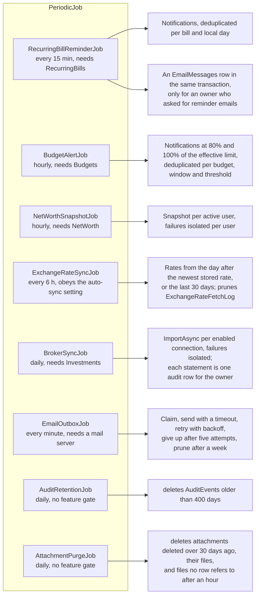
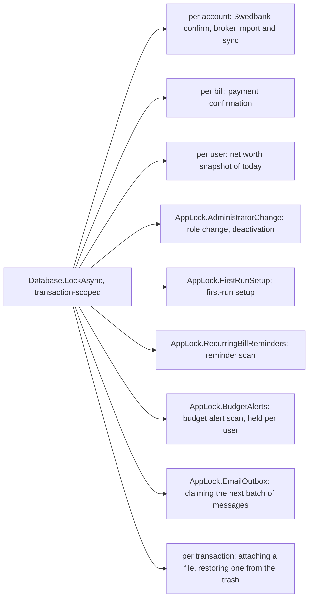

# Background jobs

Back to the [feature walkthrough](<../14. Feature walkthrough with diagrams.md>).

All eight derive from `PeriodicJob`: a `PeriodicTimer` loop, a fresh service scope per pass, an optional feature gate, one pass immediately at startup, failures logged as "{Job} failed.".

| Job | Interval | Feature | Why that interval |
| --- | --- | --- | --- |
| `RecurringBillReminderJob` | 15 minutes | `RecurringBills` | A reminder is dated to a day; a quarter of an hour makes the reminder appear promptly after a bill is created or edited |
| `BudgetAlertJob` | 1 hour | `Budgets` | Spending only moves when a transaction is entered or imported, and an alert is not urgent to the minute. Each pass recomputes the usage of every budget, which for a rollover budget reads up to twelve windows of attributions, so hourly keeps the cost small and matches `NetWorthSnapshotJob` |
| `NetWorthSnapshotJob` | 1 hour | `NetWorth` | One point per day; an hour is enough to have today's point before anyone looks |
| `ExchangeRateSyncJob` | 6 hours | none, obeys the auto-sync setting | The ECB publishes once per working day |
| `BrokerSyncJob` | 24 hours | `Investments` | The Flex Web Service is rate limited and the statement changes once a day |
| `AuditRetentionJob` | 24 hours | none | The retention period is 400 days (`AuditEvent.RetentionDays`), so a day's delay in pruning is irrelevant, and one `ExecuteDelete` over the `OccurredAt` index a day stays cheap however large the log is. It runs whatever the Households switch says, because rows written while it was on still have to age out. It deletes nothing but audit rows, which nothing references |
| `AttachmentPurgeJob` | 24 hours | none | The window it enforces is 30 days (`DeletionEntry.RetentionDays`), so a day's delay only keeps a file a day longer. It hard-deletes the row and then the file of every attachment deleted, or whose transaction was deleted, more than 30 days ago, and removes files, `.tmp` files and restore staging folders that no row refers to once they are an hour old, so an upload or a restore still in progress is never swept. It is the only job that removes something a person put into the ledger, see [Attachments](<31. Attachments.md>) |
| `EmailOutboxJob` | 1 minute (`App:Email:OutboxIntervalSeconds`) | none, returns at once while the mail server is off or incomplete | A password reset link is useless if it arrives in an hour. A minute is the shortest interval that still leaves a dead mail server cheap: a pass that finds nothing due is one indexed query |

`BudgetAlertJob` iterates active users in id order and opens a per-user `AppDbContext`, the way `BrokerSyncJob` does, because `BudgetUsageCalculator` and `ICategoryAttributionService` read through the ownership query filter. Each user is handled in its own try block, so one user whose budgets cannot be computed is logged with the user id and everybody else still gets their alerts.

Every job runs outside a request and therefore outside the active-household scope described in [Households and sharing](<16. Households and sharing.md>). The per-user `ICurrentUser` records these jobs pass to their context carry no active household, so a job always sees the user's whole union of households, whatever any browser happens to have selected.

## Advisory locks

`EmailOutboxJob` holds `AppLock.EmailOutbox` only while it claims a batch: the rows it takes have their attempt counted and their next attempt time pushed forward in the same transaction, which commits before any connection is opened. A pass that dies mid-send therefore loses one attempt, never a message, and a second pass cannot pick up what the first is still sending. Sending itself happens outside the lock and outside any transaction, one message per try block, so a bad recipient does not stop the batch and a slow mail server does not hold a database lock.

The bill reminder scan takes its lock once for the whole pass because it reads every user's bills in one query. The budget alert scan takes `AppLock.BudgetAlerts` inside each user's own transaction instead, since the work is already split per user; the read of what has already been raised and the insert of what has not are both inside that lock, which is what makes a second pass, a restart or a second instance unable to write the same alert twice.
