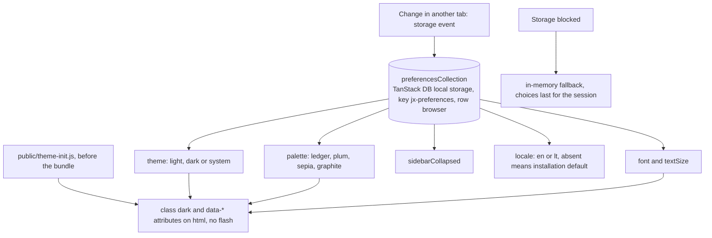
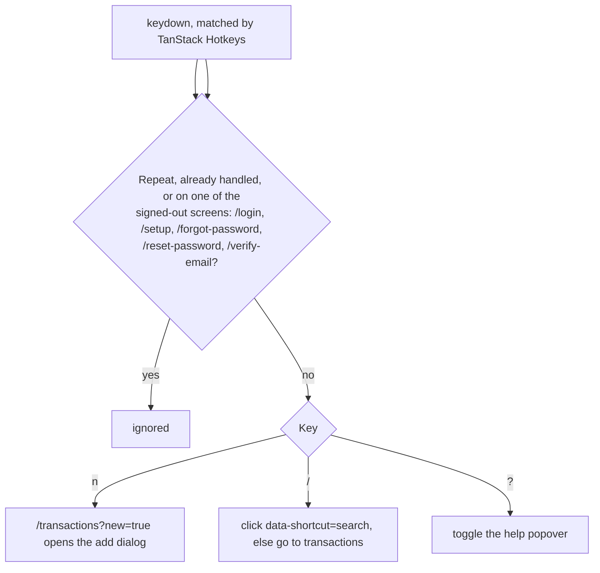
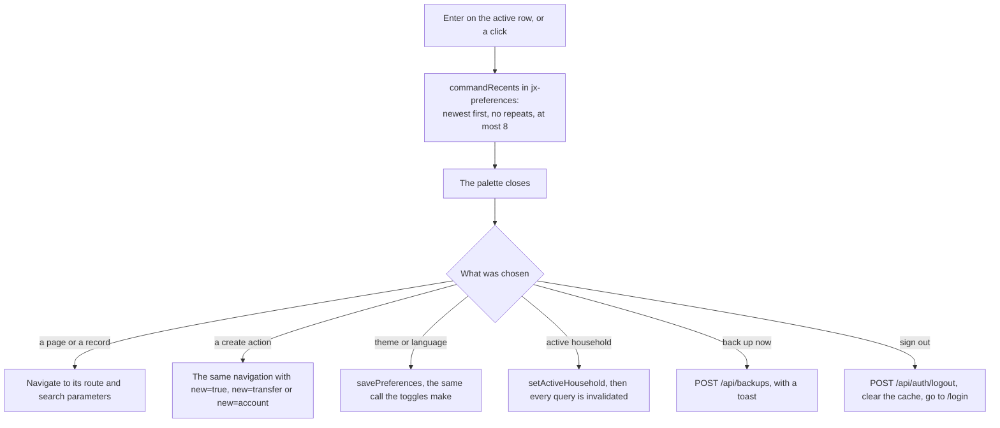

# Interface

Back to the [feature walkthrough](<../14. Feature walkthrough with diagrams.md>).

## Keyboard shortcuts

Every signed-out screen is now excluded, not only `/login` and `/setup`: the password reset and address confirmation pages were pressing keys that would have bounced the reader off the page they arrived at from an email, and the palette in particular must not leave itself open behind a sign-in it never saw.

Records are the accounts, the categories and the tags the caller can see; choosing one opens the ledger filtered to it, which is the ledger's own `accountId`, `categoryId` and `tagIds` parameters and not a new screen. There is no server-side search: the three lists are the complete, already-paged-free lists the ledger page loads anyway, they are filtered in the browser, and an installation would have to reach thousands of accounts before that stopped being instant. Transactions are deliberately not searchable from here — that is a paged, filtered query the ledger already answers far better than a fifty-row list could.

Actions are the ones that exist today and that the caller may run: a new transaction, a new transfer, a new account, a backup for an administrator, signing out, switching the theme, switching the language, and switching the active household. The three create actions travel through the URL — `/transactions?new=true`, `/accounts?new=transfer` and `/accounts?new=account` — so the back button undoes them and the palette needs no handle on a dialog it does not own; the accounts page gained that `new` parameter for this, the way the transactions page already had one. The household entries are listed only while the switch is on and the caller has a membership, and the scope the caller is already in is left out rather than listed as a choice that would do nothing.

Matching folds case and accents away — `NFD` with the combining marks removed — so `kavines` finds "Kavinės ir restoranai" and `KAVINĖS` finds it as well. A query is scored against the label first: an exact name, then a prefix, then the start of a word, then anything contained, then a subsequence, which is the fuzzy part that lets `rue` find "Recurring entries". A few entries carry keywords as well — a section carries its parent's name, an account carries its IBAN — and a keyword match is always ranked behind every label match rather than mixed in with them. Ties are broken by what was used recently, so with the box still empty the last eight choices stand at the top in the order they were made, and with something typed a recent entry only wins against an equally good match. There is no debounce and nothing is deferred: the filter is a single pass over a few hundred strings already in memory, with no request behind it, so a timer would only add latency to every keystroke.

Below the `md` breakpoint the sidebar becomes a compact header with a scrolling navigation strip, tables become lists (`TransactionsList`) and filters move into a dialog; both layouts share one data source and the switch is CSS only.
`activeHouseholdId` is the only preference the server reads: the API client puts it on every request as `X-Active-Household`, and `HouseholdSwitcher` invalidates every query after a change so the whole application reloads under the new scope. It sits under the brand in the sidebar and beside the brand in the phone header, shows the current scope, and renders nothing for a user with no household. See [Households and sharing](<16. Households and sharing.md>).
