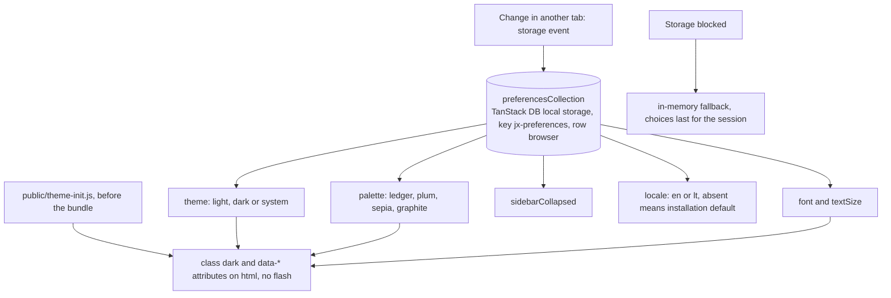
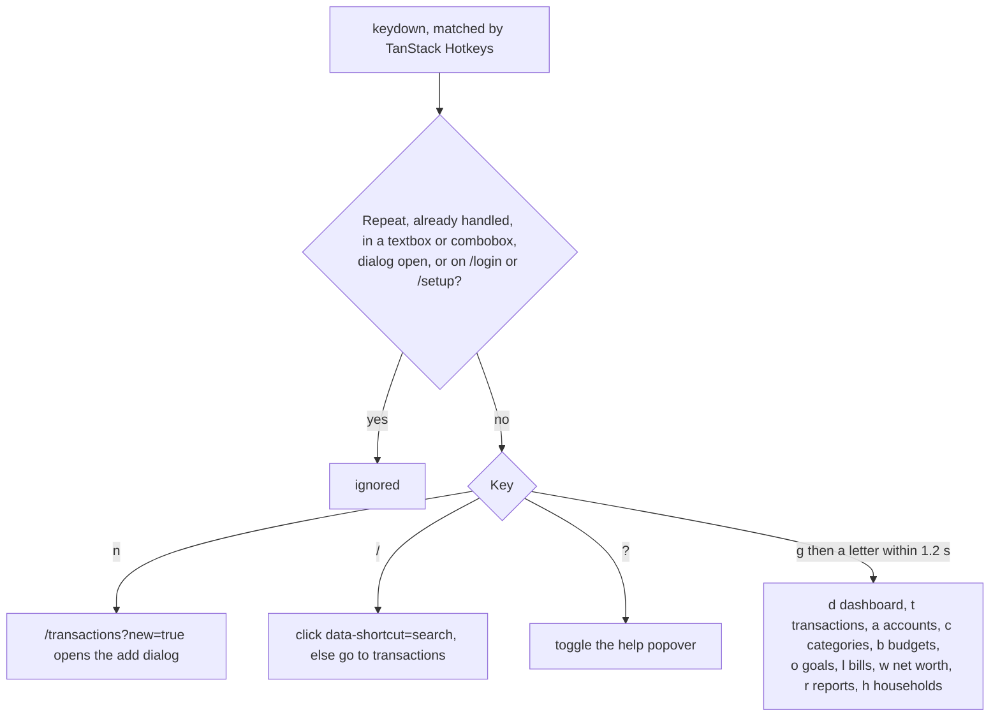

# Interface

Back to the [feature walkthrough](<../14. Feature walkthrough with diagrams.md>).

## Keyboard shortcuts

Matching folds case and accents away — `NFD` with the combining marks removed — so `kavines` finds "Kavinės ir restoranai" and `KAVINĖS` finds it as well. A query is scored against the label first: an exact name, then a prefix, then the start of a word, then anything contained, then a subsequence, which is the fuzzy part that lets `rue` find "Recurring entries". A few entries carry keywords as well — a section carries its parent's name, an account carries its IBAN — and a keyword match is always ranked behind every label match rather than mixed in with them. Ties are broken by what was used recently, so with the box still empty the last eight choices stand at the top in the order they were made, and with something typed a recent entry only wins against an equally good match. There is no debounce and nothing is deferred: the filter is a single pass over a few hundred strings already in memory, with no request behind it, so a timer would only add latency to every keystroke.

Below the `md` breakpoint the sidebar becomes a compact header with a scrolling navigation strip, tables become lists (`TransactionsList`) and filters move into a dialog; both layouts share one data source and the switch is CSS only.
