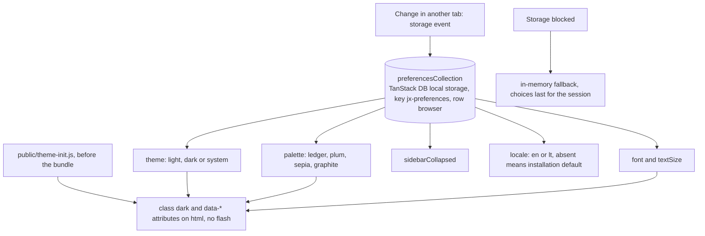
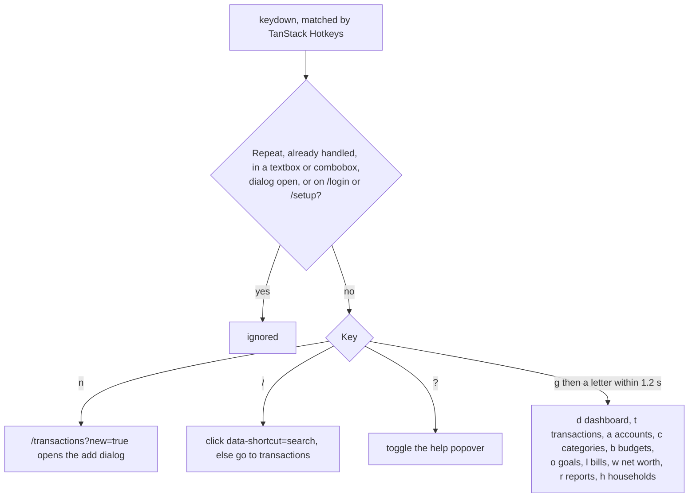

# Interface

Back to the [feature walkthrough](<../14. Feature walkthrough with diagrams.md>).

## Keyboard shortcuts

Below the `md` breakpoint the sidebar becomes a compact header with a scrolling navigation strip, tables become lists (`TransactionsList`) and filters move into a dialog; both layouts share one data source and the switch is CSS only.
