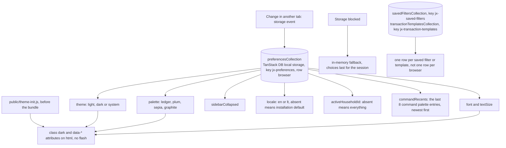
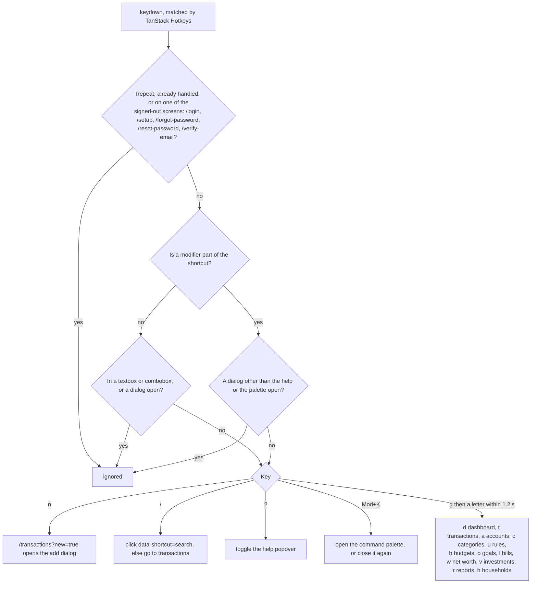
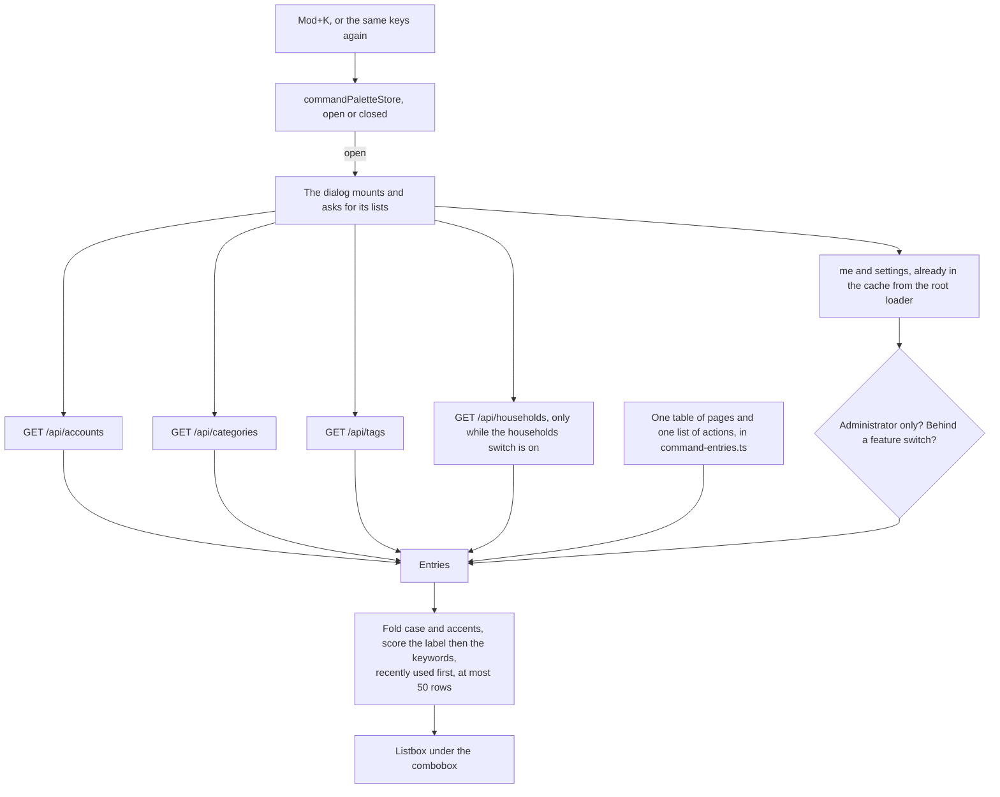
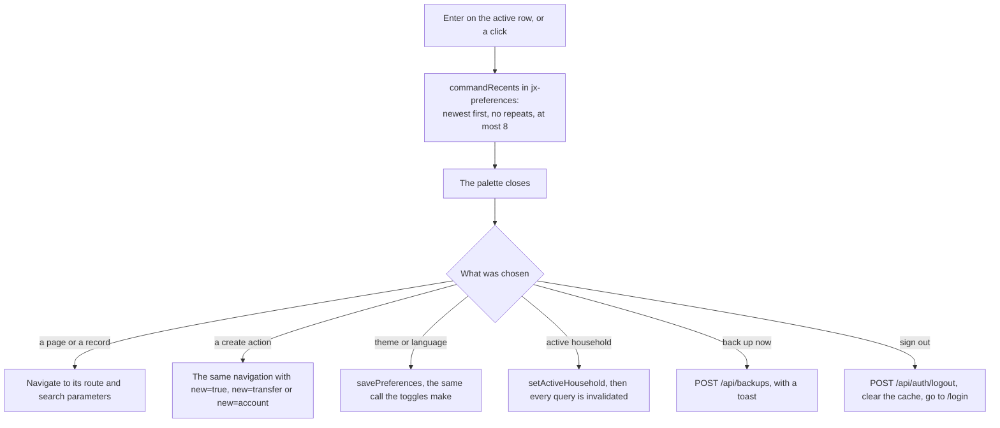

# Interface

Back to the [feature walkthrough](<../14. Feature walkthrough with diagrams.md>).

Two more collections sit beside the preferences row and follow the same rules: a zod schema per row, an explicit storage key, the same in-memory fallback, and the same cross-tab updates. They hold the saved ledger filters and the transaction templates described in [Transactions](<07. Transactions.md>). Unlike `jx-preferences` they are lists, so each row carries its own id and name; nothing in them ever reaches the server.

## Keyboard shortcuts

Saved filters, templates and Duplicate got no shortcut, and they are not in the help list. The scheme knows four actions — go to a route, focus the search box, toggle the help, open the palette — and every one of them is global. Duplicate needs a row the keyboard has no way to point at, because the ledger has no row cursor, and a saved filter or a template is a popover on one page rather than a destination with a URL. A shortcut for either would have to invent a fifth action kind and a page-local registry for two menus.

Every signed-out screen is now excluded, not only `/login` and `/setup`: the password reset and address confirmation pages were pressing keys that would have bounced the reader off the page they arrived at from an email, and the palette in particular must not leave itself open behind a sign-in it never saw.

`Mod+K` is the one shortcut with a modifier: `Ctrl+K` on Windows and Linux, `⌘K` on macOS, written once as `Mod+K` and resolved per platform by TanStack Hotkeys. It is also the only one that still fires while a field has focus, which is what a palette needs and what a bare letter cannot have: every bare key in this scheme is deliberately swallowed by an input. It still steps aside for an ordinary dialog, so the palette never opens on top of a half-filled form, and the palette's own dialog is excluded from that rule so the same keys close it. The help list prints it through `formatForDisplay`, so a Mac reads `⌘K` where Windows reads `Ctrl+K` while every bare key is printed as it is written.

## Command palette

One shortcut opens a search box over the whole application. It offers three kinds of entry: a page, a record and an action.

Pages come from one table in `frontend/src/features/command-palette/command-entries.ts` rather than from the route tree, because a route is a path while an entry is a name a person types and a place with a title: the table carries both, and it also carries the sections that have no route of their own — the trash, the signed-in browsers, the import, the appearance, the tax summary view of the investments page, and the feature, email and backup sections of the settings page. Every row names the feature switch or the administrator role it needs, checked against the same `settings.features` and `me.role` the sidebar and the route guards use, so nothing in the list can lead to a 404 or to the redirect a guard would answer with.

Records are the accounts, the categories and the tags the caller can see; choosing one opens the ledger filtered to it, which is the ledger's own `accountId`, `categoryId` and `tagIds` parameters and not a new screen. There is no server-side search: the three lists are the complete, already-paged-free lists the ledger page loads anyway, they are filtered in the browser, and an installation would have to reach thousands of accounts before that stopped being instant. Transactions are deliberately not searchable from here — that is a paged, filtered query the ledger already answers far better than a fifty-row list could.

Actions are the ones that exist today and that the caller may run: a new transaction, a new transfer, a new account, a backup for an administrator, signing out, switching the theme, switching the language, and switching the active household. The three create actions travel through the URL — `/transactions?new=true`, `/accounts?new=transfer` and `/accounts?new=account` — so the back button undoes them and the palette needs no handle on a dialog it does not own; the accounts page gained that `new` parameter for this, the way the transactions page already had one. The household entries are listed only while the switch is on and the caller has a membership, and the scope the caller is already in is left out rather than listed as a choice that would do nothing.

Matching folds case and accents away — `NFD` with the combining marks removed — so `kavines` finds "Kavinės ir restoranai" and `KAVINĖS` finds it as well. A query is scored against the label first: an exact name, then a prefix, then the start of a word, then anything contained, then a subsequence, which is the fuzzy part that lets `rue` find "Recurring entries". A few entries carry keywords as well — a section carries its parent's name, an account carries its IBAN — and a keyword match is always ranked behind every label match rather than mixed in with them. Ties are broken by what was used recently, so with the box still empty the last eight choices stand at the top in the order they were made, and with something typed a recent entry only wins against an equally good match. There is no debounce and nothing is deferred: the filter is a single pass over a few hundred strings already in memory, with no request behind it, so a timer would only add latency to every keystroke.

Nothing is loaded for the palette while a page is merely open. The dialog is mounted only while it is open, and mounting is what asks for the accounts, the categories, the tags and, when the households switch is on, the households. Every one of those is a list some page already loads, so on most screens the cache answers all four without a request; they are held for five minutes, so opening the palette a second time asks for nothing. `me` and the settings are already warmed by the root loader. A list that fails is quiet: it contributes no entries, and the pages and actions are there either way.

The dialog is a Base UI dialog with an `sr-only` title and description; the box inside it is a combobox with `aria-expanded`, `aria-controls` and `aria-activedescendant`, and focus never leaves it — the arrow keys, `Home` and `End` move the active descendant through the listbox, `Enter` runs it, `Escape` closes, and `Mod+K` closes it too. A query nothing answers removes the listbox rather than leaving an empty one: `aria-expanded` becomes false, `aria-controls` is dropped, and a sentence takes its place. A visually hidden `role="status"` announces how many rows are showing. The stories cover opening, filtering, choosing with the keyboard, the empty state, the role and feature gating and the ordering of recents, and each of them is scanned by axe.

Below the `md` breakpoint the sidebar becomes a compact header with a scrolling navigation strip, tables become lists (`TransactionsList`) and filters move into a dialog; both layouts share one data source and the switch is CSS only.

`activeHouseholdId` is the only preference the server reads: the API client puts it on every request as `X-Active-Household`, and `HouseholdSwitcher` invalidates every query after a change so the whole application reloads under the new scope. It sits under the brand in the sidebar and beside the brand in the phone header, shows the current scope, and renders nothing for a user with no household. See [Households and sharing](<16. Households and sharing.md>).
