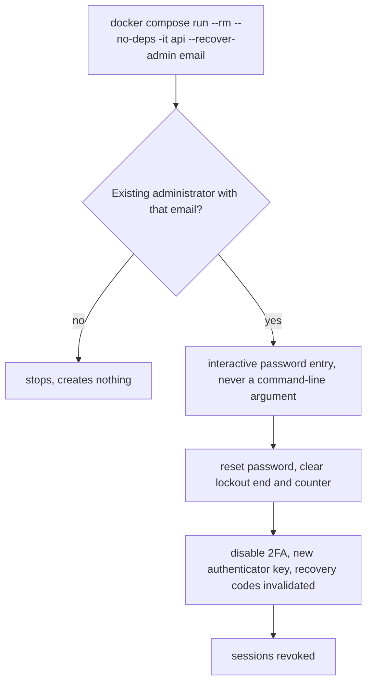

# Administrator recovery command

Back to the [feature walkthrough](<../14. Feature walkthrough with diagrams.md>).

```mermaid
flowchart TD
    Run["docker compose run --rm --no-deps -it api --recover-admin email"] --> Exists{"Existing administrator with that email?"}
    Exists -->|"no"| Stop["stops, creates nothing"]
    Exists -->|"yes"| Ask["interactive password entry, never a command-line argument"]
    Ask --> Reset["reset password, clear lockout end and counter"]
    Reset --> Tfa["disable 2FA, new authenticator key, recovery codes invalidated"]
    Tfa --> Sessions["sessions revoked"]
```
