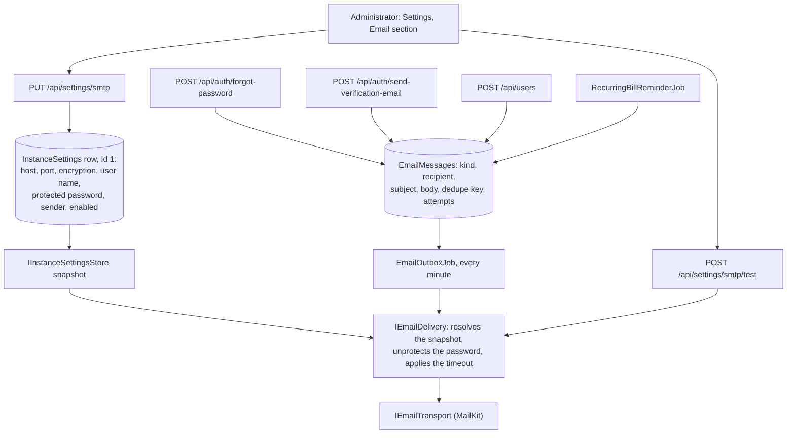
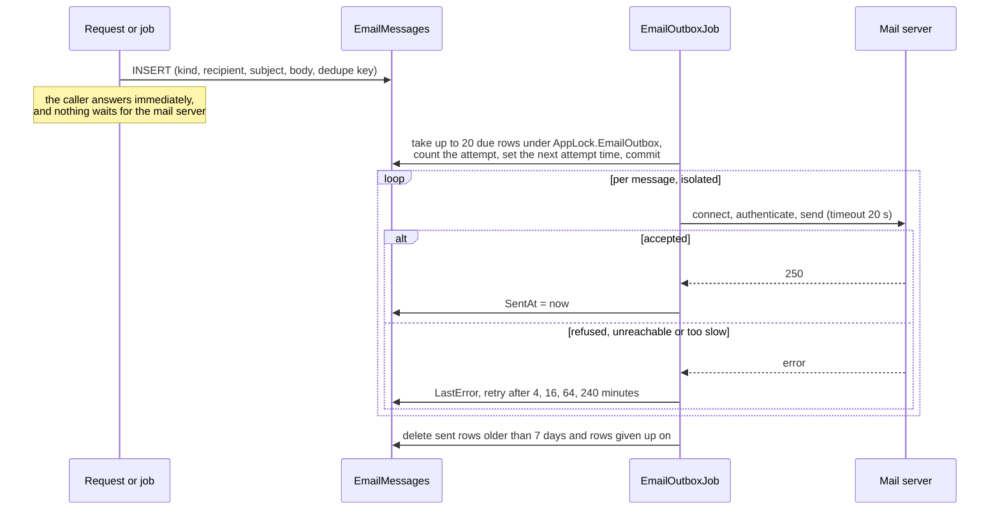
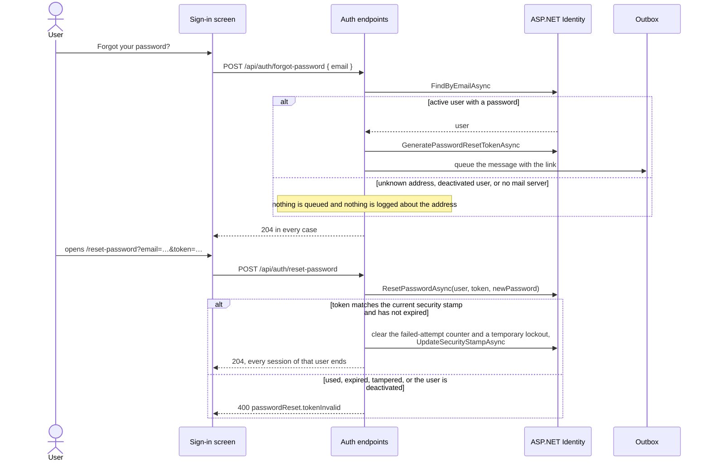
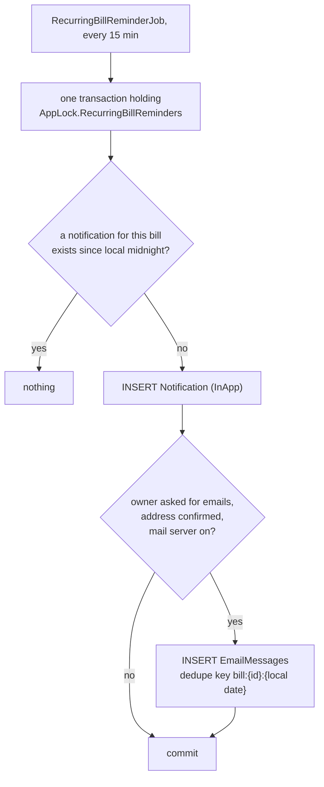

# Email

Back to the [feature walkthrough](<../14. Feature walkthrough with diagrams.md>).

Backend `Settings` (`settings/smtp`, `settings/smtp/test`) and `Auth` (`forgot-password`, `reset-password`, `verify-email`, `send-verification-email`), the shared pieces in `Common/Email`, the transport in `Infrastructure/Email` and the drain in `Infrastructure/BackgroundJobs/EmailOutboxJob`. Frontend: the `email` section of `/settings`, the routes `/forgot-password`, `/reset-password` and `/verify-email`, the banner in the application shell and the preference on `/profile`.

Email is not a feature switch. It is one installation setting with its own enabled flag, so turning it off stops every outgoing message and leaves every route in place; nothing is gated by `FeatureGateMiddleware`. An installation that never fills the mail server in behaves exactly like the release before this one.

## What replaced the unused abstraction

Before this change the only trace of email was `NotificationChannel.Email`, an enum value no producer ever wrote and no reader ever looked at. It stays in the enum because it is on rows in the database and in the API contract, but it is no longer the seam: a notification is always written as `InApp`, and an email is a separate row in `EmailMessages`. One notification and one email are two records of the same event, not one record on two channels, which is what lets the email fail, wait and retry without touching the bell.

## The parts

`IEmailTransport` is the seam the tests replace, exactly as `IExchangeRateProvider` and `IFlexClient` are replaced in `ApiFixture`. No test opens a socket: `FakeEmailTransport` records what would have been sent, and can be told to answer with an SMTP error or to throw.

## The mail server settings

`GET /api/settings/smtp` and `PUT /api/settings/smtp` are administrators only, unlike `GET /api/settings`, which any signed-in user reads: the mail server describes an outside system and its user name is a credential of its own.

The password is the secret, and it is handled the way `BrokerConnection` handles its Flex token. It is encrypted with `IDataProtectionProvider.CreateProtector("JxFinance.Smtp.Password")` before it reaches the column, the column holds only the ciphertext, and no response ever carries it: the answer has `hasPassword`, a boolean. An empty `password` in the request keeps the stored one, so an administrator can change the port or the sender without retyping the secret; clearing the user name clears the password with it, because an anonymous relay has nothing to authenticate.

The stored password is kept only for the server and the account it was typed for. A save that changes the host (compared without case or surrounding spaces, as DNS does) or the user name (compared exactly) and sends no new password answers 400 `email.passwordRequired` and changes nothing. Otherwise an administrator, or anyone who got hold of an administrator session, could point the installation at a server they control and receive the saved password on the next send. The port and the encryption mode may change without it: the credential still goes to the same host, and the encryption rules below make sure it never goes there in plain text. The test send has no settings of its own — it always uses what is stored — so there is no second path around this rule.

### Encryption

`encryption` is `startTls`, `sslOnConnect` or `none`, and `startTls` is the default: it is the first value of `SmtpEncryption`, so a request that leaves the field out, a new installation and the migration all land on it. The modes map to MailKit's `SecureSocketOptions` one to one, and none of them is opportunistic:

| Mode | MailKit option | Usual port | What happens |
| --- | --- | --- | --- |
| `startTls` | `StartTls` | 587 (submission) | Connects in plain text and upgrades before anything else; a server that does not offer STARTTLS is refused with `email.sendFailed` instead of silently continuing unencrypted |
| `sslOnConnect` | `SslOnConnect` | 465 (implicit TLS) | TLS from the first byte |
| `none` | `None` | 25, a local relay | No encryption at all, accepted only without a user name |

`StartTlsWhenAvailable` and `Auto` were not used on purpose. The first quietly falls back to plain text when a man in the middle strips the STARTTLS capability from the server's greeting, which is exactly the attack STARTTLS needs defending from. `Auto` picks by port, which is right for 465 and 587 but is `StartTlsWhenAvailable` on every other port. An explicit mode, chosen in the form with the port beside it, fails loudly instead. Pick `sslOnConnect` for port 465: `startTls` there waits for a plain-text greeting that never comes and ends in the send timeout.

Credentials never travel over an unencrypted connection, enforced twice. The validator refuses `none` together with a user name (`email.insecureConnection` on `encryption`), and `MailKitEmailTransport` checks `SmtpClient.IsSecure` after connecting and before `AuthenticateAsync`, disconnecting with `email.insecureConnection` when it is false. The second check is what protects a row saved before the rule existed: such an installation keeps its settings, and its sends fail with that code until an administrator picks an encrypted mode or clears the user name. No migration was needed, because the column stores the enum's name and the existing default was already `StartTls`.

`SmtpDelivery` — the unprotected settings handed to the transport — and `SmtpSettingsSnapshot` print `***` and `HasPassword` in place of the password, so formatting either into a log line does not leak it; see the note on records and secrets in [Architecture notes](<../7. Architecture notes.md>).

Backup and restore follow the same rule as the broker token, and for the same reason. `InstanceSettings` is an ordinary exported table, so the ciphertext travels inside the backup, which is safe as long as the backup file itself is treated as sensitive — it already holds every password hash. It is readable again only where the data protection keys are the same. A restore into an installation with a different key ring therefore leaves a password that cannot be decrypted; the test send answers `email.passwordUnreadable` and the administrator types it again. `EmailMessages` is not exported at all: it joins `UserSessions` as a transient table, because a queued message is a job in flight, not a fact about the household, and a backup taken in the middle of a send should not resend those messages a month later on another machine. A restore truncates the table like every other, so an outbox never survives one.

## Sending outside the request

The only message that is sent inside a request is the administrator's test message, because its whole purpose is to report what the mail server said. It is bounded by the same send timeout, it writes nothing, and it is throttled to 10 calls per five minutes per client. Everything else goes through the outbox.

Failures are contained three ways. A message is taken and its attempt counted in one short transaction that commits before any socket is opened, so a process that dies mid-send loses at most one attempt, never the row. Each message is then sent inside its own `try`, the way `BrokerSyncJob` isolates connections, so one bad recipient does not stop the batch. After five attempts the row is given up on, logged once with the kind and the id, and deleted a week later. The lock is `AppLock.EmailOutbox`, held only while rows are claimed, so a second pass or a restart cannot claim the same row twice.

## Password reset by link

The administrator reset described in [User management](<04. User management.md>) stays exactly as it was. This is a second way in, for the case where no administrator is at hand.

The token is ASP.NET Identity's own `DataProtectorTokenProvider` token, not something invented here, and nothing about it is stored. That is what makes the link single-use: the token embeds the user's security stamp, and a completed reset changes that stamp, so the same link is refused the second time — there is no "used" column to keep, sweep or get wrong. Its lifetime is one hour, set through `DataProtectionTokenProviderOptions.TokenLifespan` (`App:Email:PasswordResetMinutes`).

The choices about throttling and lockout, which the sign-in page already thinks about in [Sign-in, sessions and lockout](<02. Sign-in, sessions and lockout.md>):

- Asking for a link is throttled to 5 calls per five minutes per client and **never** counts toward the failed-attempt lockout. Counting it would hand anyone who knows an address a way to lock its owner out every fifteen minutes, which is the same reason a temporary lockout does not end open sessions.
- Consuming a link is throttled to 10 calls per five minutes per client and also does not count toward the lockout. The token is a 32-byte protected payload; guessing it is not the attack that a five-try counter defends against, and counting failures would give the same free lockout.
- A completed reset does the opposite: it clears the counter and any temporary lockout, because the person proved control of the mailbox. A deactivation is left in place, exactly as the administrator reset leaves it.
- Every rejection answers the same code with the same words. An unknown address, a deactivated user, an expired token and a tampered token are indistinguishable from outside.
- The 204 from `forgot-password` is unconditional, including when this installation has no mail server at all. The sign-in screen only offers the link when `GET /api/settings/public` says `emailEnabled`, so a user is not sent down a dead end, but the endpoint itself never varies.

## Email verification

A user created by an administrator starts with an unconfirmed address and, if the mail server is set up, one queued confirmation message. The link opens `/verify-email`, which shows the address and a button; the token is consumed on the click, not on load, so a mail scanner that follows links cannot confirm an address on the user's behalf. Opening a link again after the address is confirmed answers 204, so a second click is not an error. The confirmation token is a separate provider (`JxEmailConfirmation`) with its own one-day lifetime, so a slow mailbox does not force a password-reset lifetime long enough to be uncomfortable.

**What an unconfirmed address blocks: unsolicited mail to it, and nothing else.** A user with an unconfirmed address signs in, records transactions, is counted as an administrator and sees every screen. The only thing that changes is that `RecurringBillReminderJob` will not send reminder emails to it. Mail the person just asked for — the password-reset link and the confirmation message itself — is still sent, because refusing it would make an unconfirmed address a trap with no way out. The banner in the application shell says exactly this and offers "Send the link again"; it is shown only while the installation can send email, so an installation without a mail server never nags about an address it could not confirm anyway.

The first administrator, created by first-run setup, is confirmed on the spot. There is no mail server at that moment and the person typed their own address into the screen that created the installation.

## Bill reminder emails

The email is written in the same transaction as the notification, under the same lock, guarded by the same question — has this bill already been reminded today. So the two cannot disagree: either both rows appear or neither does, and a second pass on the same day writes neither. A unique index on `DedupeKey` is the second belt: even if two processes ever got past the lock, the insert of the duplicate fails, the outbox catches that one exception and the pass continues.

The preference is `AspNetUsers.BillReminderEmails`, off by default, changed on the profile together with the display name. Nothing about the reminder job depends on the mail server being reachable: the job only writes rows.

The message is picked from the entry's shape, so an income entry reads "due to arrive" and a transfer "due to be transferred", the same distinction the bell makes.

## Language

Every message is plain text — no HTML part, no images, no tracking — in English or Lithuanian, and the texts live in `Common/Email/EmailTexts.cs` rather than in a resource file.

The recipient's language is the installation's `DefaultLanguage`. That is honest about what the server knows: there is no per-user language in the data model. The language toggle in the interface is a per-browser preference kept in `jx-preferences` and never sent to the server, so at the moment a background job composes a reminder there is nothing else to read. When a per-user language setting arrives, it is a one-line change in the three places that call `EmailTexts`.

The backend has no translation mechanism of its own and none was added. Server text that a user reads is otherwise a code — `ErrorCodes` — that the client turns into a sentence through `t("serverErrors.…")`, and that mechanism cannot reach an email, which leaves the application entirely. A resource-file infrastructure for four messages would be more machinery than message, so the two languages sit side by side in one file, which also makes it obvious when one of them is edited and the other is not.

## Configuration outside the database

| Key | Default | What it does |
| --- | --- | --- |
| `App:SiteUrl` | empty | The address the links point at. When empty the current request's scheme and host are used, which is right behind the production reverse proxy and wrong in development, where the API and Vite sit on different ports. `docker-compose.production.yml` sets it from `SITE_ADDRESS` |
| `App:Email:SendTimeoutSeconds` | 20 | Bounds a single connect-authenticate-send, both in the outbox and in the test message |
| `App:Email:OutboxIntervalSeconds` | 60 | How often the drain runs, at least 5 |
| `App:Email:OutboxBatchSize` | 20 | Messages claimed per pass |
| `App:Email:PasswordResetMinutes` | 60 | Reset token lifetime |
| `App:Email:KeepSentDays` | 7 | How long sent and given-up rows stay before the job deletes them. The prune runs before the job looks at the mail server, so rows written while SMTP was configured still age out after it is switched off |

## Error codes

| Code | When |
| --- | --- |
| `email.notConfigured` | The mail server is off or incomplete; answered by the test send and by a resend request |
| `email.passwordUnreadable` | The stored password cannot be decrypted with this installation's data protection keys |
| `email.passwordRequired` | The host or the user name changed and no new password was sent, so the stored one would have gone to another server or account |
| `email.insecureConnection` | A user name with encryption `none` on save, or a connection that is not encrypted at the moment the transport would authenticate |
| `email.sendFailed` | The mail server refused the message; the reason is its own text |
| `email.alreadyVerified` | A resend was asked for an address that is already confirmed |
| `email.tokenInvalid` | A confirmation link is expired, tampered with, or for an unknown address |
| `passwordReset.tokenInvalid` | A reset link is used, expired, tampered with, or for an address that cannot receive one |
