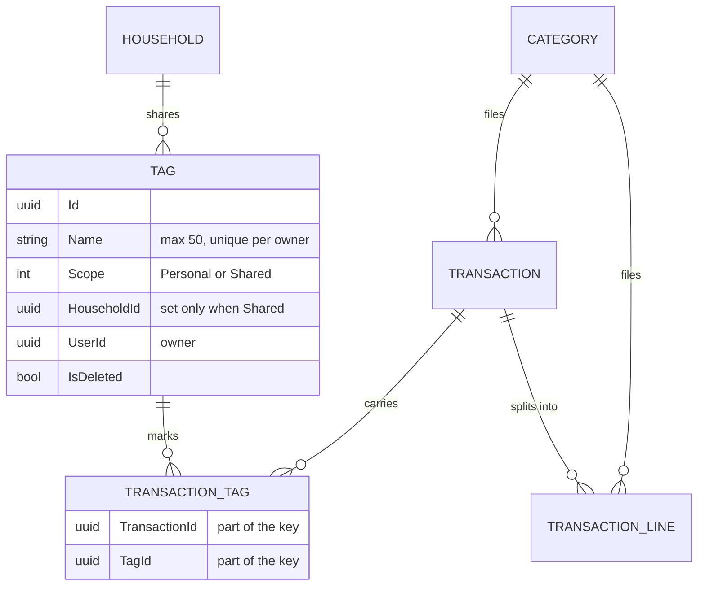
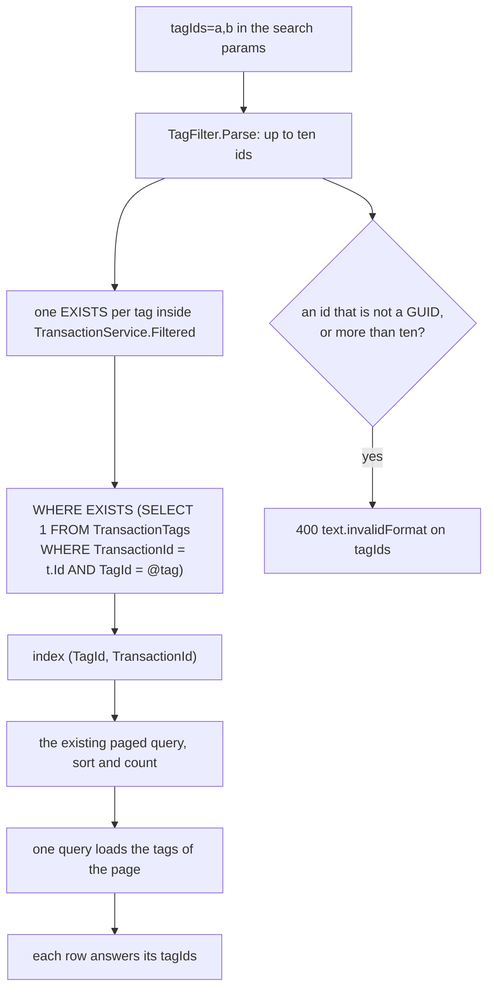
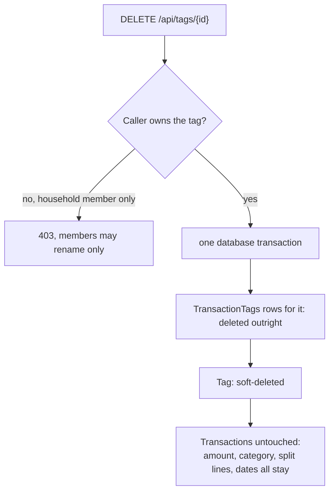

# Tags

Back to the [feature walkthrough](<../14. Feature walkthrough with diagrams.md>).

Backend `Tags`, page `/tags`, and the tag parts of `Transactions` and `Reports`. A tag says what a payment was *for* when the category says what kind of spending it was: a holiday, a renovation, something a colleague will pay back. A transaction carries as many tags as it needs, at most ten, and the same tag can sit on income and on an expense because a tag has no flow type.

Tags are not behind a feature switch. They are an attribute of a transaction, exactly like its category, and a switch would have to hide a column that rows already carry: the ledger, the reports and the two exports would each need a second shape for the switched-off case, and a household that turned the switch off would see its tagged spending silently lose a dimension it had already sorted. Categories, the closest thing in the product, have no switch either.

## The model

`Tag` is an `OwnableEntity` that implements `IShareable`, so it inherits the rules `Category` already has without a line of new code: the owner column and its restricting foreign key come from `ConfigureOwnership`, and the visibility rule comes from `AppDbContext.ShareableFilter` — your own tags plus the shared tags of your households, narrowed to one household while the active-household header names one. A tag has no icon and no flow type; those exist on a category because a category answers a different question.

`TransactionTag` is the join row and nothing more: the two ids are its primary key, and it is a plain class rather than an `EntityBase`, so it has no timestamps, no soft deletion and no query filter of its own, exactly like `TransactionLine`. It needs none: it is only ever reached through a `Transaction` or a `Tag`, and both of those are filtered.

## Unique names

A name is unique per owner, ignoring case. `TagService` checks it with a case-insensitive `ILIKE` over the owner's rows and answers 409 `conflict.duplicate` with the name in the message. A filtered unique index on `(UserId, Name)` where `IsDeleted = false` backs that up against two requests racing; it is case-sensitive, so it only catches the exact duplicate, and the service is what makes "Holiday" and "holiday" the same name. The filter is what lets a deleted name be used again.

Two people may own a tag of the same name, including inside one household. The owner is part of the rule because the rule protects one person's list from having two entries they cannot tell apart, not the household from having two similar words.

## Tagging a transaction

`tagIds` is part of the create and update bodies, beside `lines`. An update replaces the whole set, the way it replaces split lines, so an empty list clears the tags. Every id is checked against what the caller can see and an unknown one answers 400 `reference.notFound`; nothing is written when it does.

Split lines do not carry tags. A split exists to divide one payment between categories, while a tag describes the payment itself: the trip the shopping was for does not become two trips because the receipt held groceries and a lightbulb. Keeping tags on the transaction also keeps the arithmetic honest — a tag total is a plain sum of `ReportingAmount` over whole transactions, with no proration and no way for a tag on the parent and a tag on a line to count the same money twice.

`POST /api/transactions/bulk-tags` does the same for a selection of up to 200 rows, replacing the set on each. Unlike `bulk-category` it accepts split rows, for the same reason: a tag belongs to the payment, so a split row has one place to put it. It is all or nothing — an invisible transaction answers 404, an invisible tag answers 400, and nothing is written either way.

## Filtering the ledger

Several tags mean **all of them**, not any of them. Tags stack as narrowing facets — "holiday" *and* "reimbursable" is the question a household actually asks — and an OR is already available by filtering one tag at a time, while an AND cannot be expressed any other way. Adding a tag to the filter therefore always makes the list shorter, which is what every other filter on the page does.

The filter travels as one comma-separated query parameter rather than a repeated key, because the generated client serialises an array parameter by joining it with commas anyway; declaring a string is the honest description of what goes over the wire, and it keeps the CSV and PDF export links, which are plain browser navigations built by `buildExportUrl`, identical to the list request. A malformed or over-long value is refused by `TransactionFilterValidator`, which both the list request and the summary request share, rather than being silently ignored.

Each chosen tag becomes one `EXISTS` subquery inside the one `Filtered` method the list, the summary, the CSV and the PDF all use, so the four cannot disagree. The subquery is an index seek on `(TagId, TransactionId)`, which the migration adds beside the join table's own `(TransactionId, TagId)` primary key; at most ten of them can be asked for, so the plan stays bounded. Reading the tags back is not a query per row either: the paged list loads the join rows of the page in one query keyed by transaction id, and the PDF export does the same for its capped result.

The CSV export is the one place that loads more than a page. It streams its rows as before, but it first loads the tag map of the filtered set in one query, because a tag column needs names the row itself does not carry and `string_agg` is not something EF can be asked for. A join row is two uuids, so the map is far smaller than the ledger it describes, and the rows themselves are still streamed.

## Reports

`GET /api/reports/summary` gained `expenseByTag` beside `expenseByCategory` and `incomeByCategory`. It holds one entry per tag the period touches, sorted by amount, and a final entry with `tagId` null for the expenses that carry no tag at all.

A transaction can carry several tags and then counts once under each of them, so the tag entries can add up to more than `totalExpense`. Only the untagged entry is disjoint from the rest. That is a property of the question, not a defect: "how much of this month was the holiday" and "how much was reimbursable" are both true of the same receipt. The page says so in a line under the list, and the API summary says so too.

The list is expense only. Tags in practice mark spending themes, the untagged group the brief asks for is about spending, and an income breakdown by tag would double the page for a question `incomeByCategory` already answers well. Investment cash flows carry no tag and are left out of this list, which is why it can be smaller than `totalExpense` as well as larger.

Visibility needs no code here. The breakdown joins `TransactionTags` onto `db.Transactions`, which is already filtered by account visibility and by the active household, and the names come from `db.Tags`, which is filtered the same way as categories.

## Exports

The CSV gains a `Tags` column between `Category` and `Type`, holding the names joined with `"; "` — a semicolon rather than a comma so the cell needs no quoting in the common case. The PDF gains a `Tags` column in the same position, printed in the muted grey the header uses; the table's relative widths were re-divided to make room, and the date, type and amount columns kept their fixed sizes.

## Deleting a tag

This is the rule [Categories](<06. Categories.md>) already has, applied to the join table: deleting the thing that classifies transactions must never delete the transactions. A category becomes unset on its rows; a tag comes off its rows. The join rows go for good rather than being soft-deleted, because they hold no history of their own — the pair of ids is the whole record, and keeping a deleted pair would only make the unique-name rule and the filter queries carry a condition for nothing.

A household member who did not create a shared tag may rename it, like a shared category, but only the owner may delete it or change its sharing.

## The screen

`/tags` follows `/categories`: one list, a dialog to add, an inline edit form per row, a shared badge for a tag that belongs to a household, and the confirm dialog every delete in the product uses. It has one list rather than two because there is no flow type to split it by. A line above the list explains what a tag is for, since the word alone does not say it.

On `/transactions` the tag picker is a checkbox list, in the form, in the `Tags` column's filter popover, in the phone filter dialog and in the selection toolbar. It shows a search box once there are eight or more tags. The ledger renders the first three tags of a row as chips and the rest as a count; the phone list does the same under the description.
