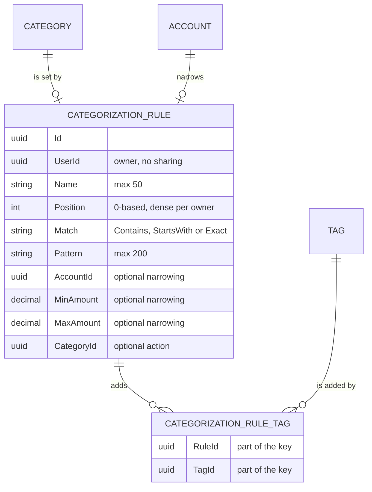
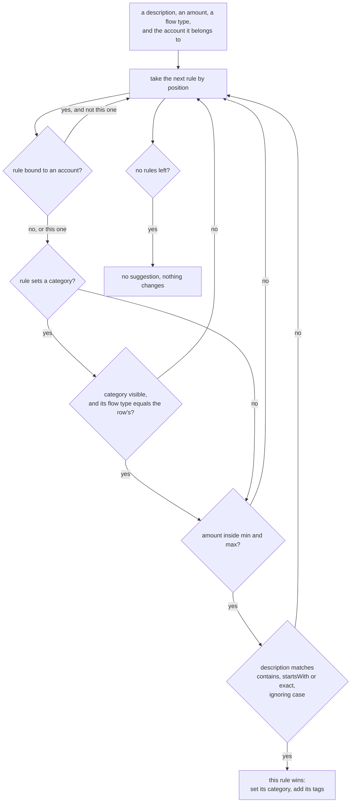
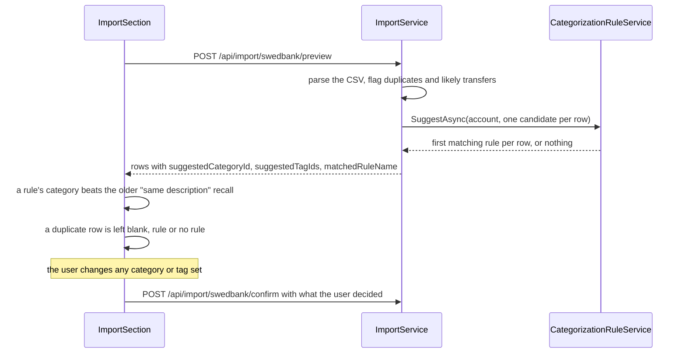
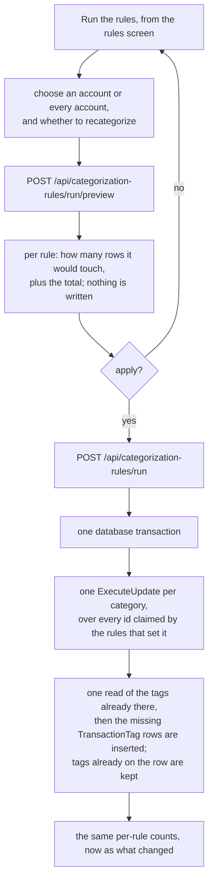

# Categorization rules

Back to the [feature walkthrough](<../14. Feature walkthrough with diagrams.md>).

Backend `CategorizationRules`, page `/categorization-rules`, and the rule parts of `Imports`. A rule reads the description of a transaction and fills in a category, a set of tags, or both. It is the answer to typing "Maistas" next to every MAXIMA line for the fourth month running: describe the line once, and the import preview fills it in before you confirm, or a run fills in the lines that are already in the ledger without one.

A rule never acts on its own. It suggests in the [Swedbank import preview](<10. Swedbank CSV import.md>) and it writes to the ledger only when somebody asks for a run and then presses apply.

Rules are behind the `CategorizationRules` feature switch. Unlike [Tags](<27. Tags.md>), which are an attribute a transaction carries, a rule is a screen and a route of its own, and turning it off takes nothing away from the rows it already filled: their category and their tags are ordinary values on ordinary transactions. The import preview keeps working with the switch off; it simply stops suggesting.

## The model

`CategorizationRule` is an `OwnableEntity` and deliberately **not** an `IShareable`. A rule is a personal habit, not a household fact: two people who share an account will want different names on the same shop, and a rule that silently rewrote somebody else's rows would be the worst kind of surprise. The ordinary owner filter in `AppDbContext` is the whole visibility story — nobody but the owner lists, edits, reorders, deletes or runs a rule.

What a rule *reaches* is a different question from who owns it. A run evaluates through `db.Transactions`, which is filtered by account visibility, so a rule of user A does match a transaction on an account shared with B, because A can see that account and could have set the category by hand. B never sees A's rules and B's own run uses only B's. This is the same rule the whole product follows: you may change what you can see.

`CategorizationRuleTag` is the join row and nothing more, exactly like `TransactionTag`: two ids as the primary key, a plain class with no timestamps and no soft deletion, cascading from the rule and restricted on the tag.

## The condition

A rule has one condition on the description and two optional narrowings.

| Part | What it means |
| --- | --- |
| `match` + `pattern` | `contains`, `startsWith` or `exact`, compared without regard to case |
| `accountId` | only transactions of that account; left out, every account the owner can see |
| `minAmount` / `maxAmount` | inclusive bounds on the transaction's own amount, in its own currency |
| `categoryId` | the category to set — and, because a category has a flow type, a narrowing as well: an expense category never matches income |

The pattern is text, not a pattern language. Per cent and underscore are ordinary characters: `LikePattern` escapes them and the backslash before the value reaches PostgreSQL, so a rule for `5% metams` matches that and nothing else. That is the same escaping the ledger's text filter already uses, which is why the two behave alike.

The amount range is compared against the transaction's own `Amount`, not its `ReportingAmount`. The number a person types into the form is the number they saw on the statement, and the import preview has no reporting amount to compare with before the row is confirmed; using the row's own amount keeps the preview and the run answering the same question.

## Order, and first match wins

Rules are evaluated from `Position` 0 upwards, and **the first rule that matches decides the row**. No later rule sees it, for the category or for the tags.

The alternative — every matching rule contributes — was rejected. Two rules that set different categories would still need an order to settle the conflict, so "all match" only removes the order from the part where it is visible; and the import preview could no longer name the one rule that filled a row, which is the label that makes a suggestion reviewable. One rule per row also makes the counts in the run preview add up: they are disjoint, so they sum to the total.

Nothing else in the product was ordered before this, so the order is a plain integer `Position`, kept dense per owner:

- a new rule is appended at `Position = count`;
- a move swaps a rule with its neighbour and then renumbers the whole list 0, 1, 2 before saving, so a swap can never leave a gap or a tie;
- a delete renumbers what is left in the same way, inside the delete's own database transaction and in the same `SaveChanges` that soft-deletes the rule: the ordered list is read once and the rule is taken out of it. The join rows are still removed with an explicit `ExecuteDelete`, because the rule is soft-deleted and the database's `ON DELETE CASCADE` therefore never fires. The deleted row keeps its own `Position`, and the tags it set are recorded beside its trash entry, so Undo or Restore puts it back at that position — clamped to the end if the list has shrunk — renumbers the others and links its tags again. A restore that would make a 101st rule is refused with `collection.invalidSize`. See [Trash and undo](<29. Trash and undo.md#deletes-that-rewrite-other-rows>).

`POST /api/categorization-rules/{id}/move` takes `up` or `down` and answers the **whole list** in its new order, so the client never has to guess what the positions became and never needs a second request. Moving the first rule up or the last rule down changes nothing and still answers the list.

## Evaluating a rule

Both places this runs now answer the question the same way, in memory, with `RuleMatcher`.

Over an **import preview** there was never a choice: the rows come from a CSV file that the preview call is parsing and will not write, so there is nothing to run SQL against.

Over the **ledger** `CategorizationRuleService.MatchLedgerAsync` used to build one `IQueryable<Transaction>` per rule, with the account, amount, flow-type and `EF.Functions.ILike` conditions on it, and first-match-wins was carried between rules by a growing list of claimed ids that became an ever longer `NOT (id = ANY(...))` on the next rule's query. A hundred rules meant a hundred round trips and a parameter list that grew with every row already claimed. It now reads the rows a run could possibly touch once — id, account, flow type, amount and description of every unsplit transaction with a description, narrowed by the chosen account and, unless the run recategorizes, by `CategoryId IS NULL` — and walks the rules over that list in memory. Claiming is a `HashSet` instead of a query parameter.

One query per rule was never cheaper than one scan: every rule's query read the same table anyway. What changes for the reader is the definition of "contains, ignoring case": it is `RuleMatcher.Matches` everywhere, so the preview, the run and the **Try it** box cannot drift, and `ILIKE` no longer decides anything. Descriptions are stored trimmed (`OptionalText.Normalize`), so `startsWith` and `exact` land on the same rows the `ILIKE` did. `RuleMatcher` still holds `LikePatternFor` for the ledger's own text filter.

## In the import preview

`ImportPreviewRow` gained `suggestedCategoryId`, `suggestedTagIds` and `matchedRuleName`. The preview loads the caller's rules once, narrows them to the ones that apply to the previewed account, and asks each parsed row for its first match.

Three rules of behaviour matter here.

A rule **never overwrites a choice**. The suggestion arrives before the user has chosen anything: `toPreviewRows` fills the row's initial category and tags from it, and every later change — the per-row category select, the per-row tag picker, the "set category for selected" bulk action — replaces the suggestion and clears the "Filled by a rule" mark. The confirm request sends what the client holds, so a value the user touched is the value that is written.

A rule beats the **recall** that was already there. The import preview has long guessed a category from the most recent transaction with the same description; a rule is an explicit statement about the same thing, so where both have an answer the rule wins. Where a rule only adds tags, the recall still picks the category.

A **duplicate** row gets no suggestion at all. A duplicate cannot be imported, so filling it in would only add noise to a row the user is being told to ignore.

The confirm body gained `tagIds` per row, and `ImportService` writes the join rows beside the transaction in the same database transaction. Tags on an imported row would otherwise have had no way in at all, which would have made "a rule sets a tag" a promise the import could not keep.

## Running over the ledger

The preview and the run take the same body and answer the same shape, and the preview's numbers are the run's numbers: both call one `MatchLedgerAsync`, so nothing can drift between the count somebody read and the change they approved. The apply step is separate and explicit; the preview writes nothing. Because first-match-wins makes the matches disjoint, the writes can be grouped: the rows every rule that sets the same category claimed go into one `ExecuteUpdate`, and every tag every rule adds goes into one read of what is already there and one insert. The run's cost no longer follows the number of rules.

The timestamp those updates write comes from `IClock`, like every other time the product records, so a test that freezes the clock sees the frozen time rather than the wall clock.

Two safety rules are the point of the feature:

- **Only uncategorized rows.** By default the query carries `CategoryId IS NULL`, so a category anybody chose, by hand or in an earlier import, is never replaced.
- **Recategorize is a separate, clearly labelled option.** `recategorize: true` drops that condition, so matching rows that already carry a category have it replaced. The screen states what it does in a line under the checkbox, the request has to carry it, and the response echoes it back so a client cannot show the result of one run under the label of the other.

Two things are never touched. **Split transactions** are excluded outright: their categories live on their lines, and a category on the parent of a split has no meaning the rest of the product would respect. **Tags already on a row** are kept: the run adds the winning rule's tags and removes nothing, so a tag somebody put on a transaction by hand survives a run that had nothing to say about it.

A rule whose category has since been deleted matches nothing until it is edited. The category is invisible through the ownership filter, so its flow type cannot be resolved, and the rule is reported with a count of zero rather than quietly applying half of itself.

## Trying a rule out

`POST /api/categorization-rules/test` takes a condition that has not been saved and a sample description, and answers three booleans: whether the whole condition matches, whether the description half matches, and whether the amount half does. Splitting the answer is what lets the form say "the description matches, but the amount is outside the range", which is the mistake people actually make.

The call reads nothing and writes nothing — it is `RuleMatcher` behind an endpoint. It lives on the server rather than in the client so that "contains, ignoring case" has one definition: the form cannot drift from the import preview, which uses the same function, or from the run, whose `ILIKE` is built next to it.

## The screen

`/categorization-rules` follows `/tags`: a list, a dialog to add, a dialog to edit, and the confirm dialog every delete in the product uses. Each row shows its position, its name, its condition in words, and its action as chips, with **Move up** and **Move down** buttons on the right. There is no drag and drop: a list of a handful of rules is reordered a step at a time, the buttons work with a keyboard and a screen reader without any extra code, and each press is one request whose answer is the new order.

The form is one dialog with four groups — the name, the condition, the narrowing, and the action — and a **Try it** box at the bottom that runs the sample against the condition currently in the form. **Run over existing transactions** opens the second dialog: account, the recategorize checkbox, **Preview**, then an **Apply to N transactions** button that only becomes usable once a preview has found something.

The rules page is in the sidebar under the ledger group and answers the `g u` shortcut, both gated on the feature switch like every other switchable page.
