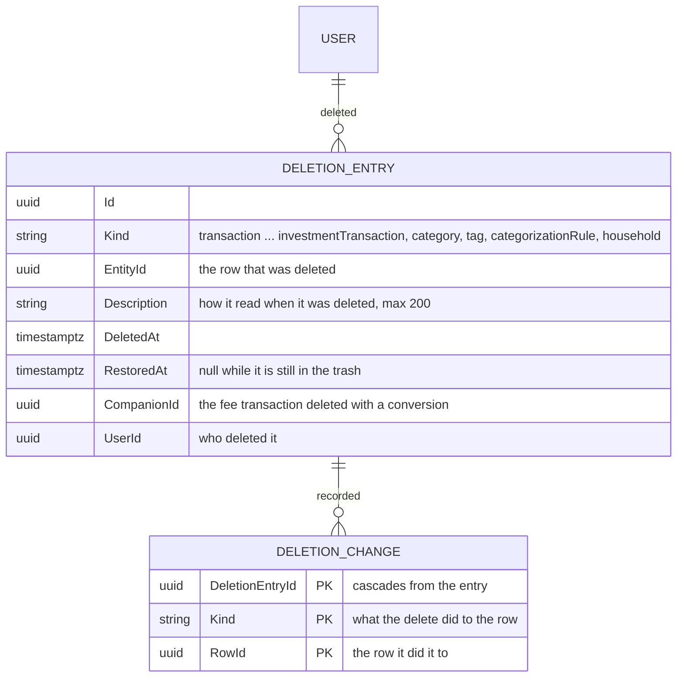
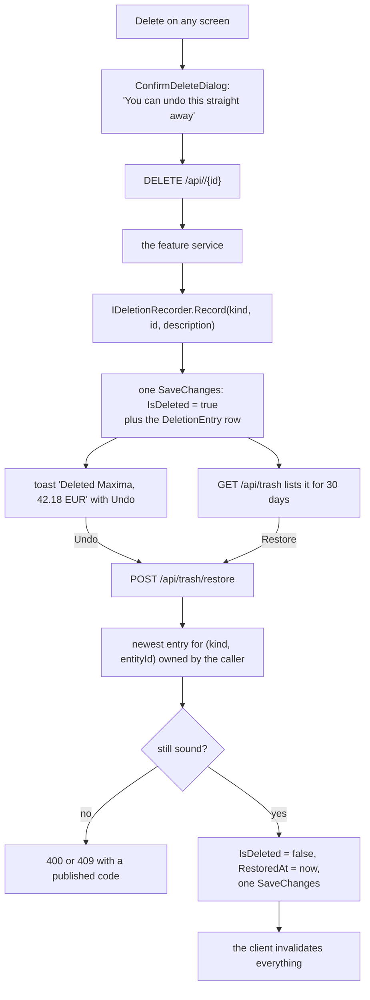
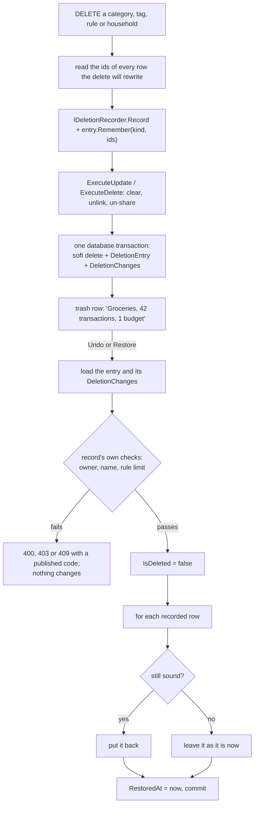

# Trash and undo

Back to the [feature walkthrough](<../14. Feature walkthrough with diagrams.md>).

Backend `Trash`, the Trash section of `/profile`, and the undo toast that every delete screen now shows. Almost every owned record in this product was already soft-deleted: the row stayed, `IsDeleted` went true, and the query filters stopped answering it. Nothing could bring one back, so the rows were dead weight and "Delete" was as final as a hard delete while costing as much as a kept row. This feature turns that stored row into something the owner can reach: a toast with Undo in the seconds after the delete, and a list of the last 30 days of deletions with a Restore button per row.

The trash records what *you* deleted, so that you can put it back, and only you see it. Who changed what in a shared household is the other half of the question, and since 2026-09-21 the [audit log](<30. Audit log.md>) answers it for every member: a delete of a shared record writes a trash entry for the person who pressed Delete *and* an activity row for the household, in the same save, and a restore from the trash writes a `restored` row. The two are kept apart on purpose — the trash is per person, 30 days and actionable, the log is per household, 400 days and read-only.

## What a delete does today, and what that means for restoring

The first question is not how to restore but which deletes are reversible at all. A delete that only flips `IsDeleted` is reversible. A delete that also rewrites or removes other rows is reversible only if what it rewrote is recorded somewhere. Four of them — category, tag, categorization rule and household — now record it, in `DeletionChanges`, in the same save as the delete (see [Deletes that rewrite other rows](#deletes-that-rewrite-other-rows)).

| Record | What deleting does | Restorable | Why |
| --- | --- | --- | --- |
| Transaction | soft delete; its split lines and its `TransactionTags` rows are left in place | yes | the row and everything hanging off it is still there |
| Transfer | soft delete; its `TransferImport` receipts are deliberately kept | yes | the receipts already outlive the transfer, so the pair is consistent again |
| Currency conversion | soft delete, together with its fee transaction | yes | the fee is restored with it, and the entry records which transaction that was |
| Budget | soft delete | yes | no other row changes |
| Goal | soft delete | yes | no other row changes |
| Asset, debt | soft delete | yes | no other row changes |
| Recurring entry | soft delete | yes | the occurrences it already posted are ordinary rows and were never touched |
| Category | soft delete, **and** `CategoryId` is set to null on every transaction, split line and recurring entry, and every budget on it is soft-deleted | yes | the ids of the transactions, lines and recurring entries it cleared and of the budgets it retired are recorded; a restore puts the category back only on rows that are still uncategorised |
| Tag | soft delete, **and** its `TransactionTags` rows are deleted outright | yes | the transaction ids of the links are recorded; a restore links the tag again to every one of them that is still stored |
| Categorization rule | soft delete, **and** its `CategorizationRuleTags` rows are deleted outright and every remaining rule is renumbered | yes | the tag ids are recorded; the soft-deleted rule keeps its own `Position`, so a restore reinserts it there, clamped to the end of the list, and renumbers the others |
| Household | soft delete, **and** every account, category and tag shared into it becomes personal; the memberships are kept | yes, by an owner | the ids of every row that was shared into it are recorded; a restore re-shares the rows that are still personal and still owned by a member |
| Account | soft delete, under the name "archive" | yes, from the accounts page rather than the trash | archiving is its own named operation and is undone where it was done: a collapsed "Archived accounts" section under the accounts table with a Restore button per row, owner only (see [Accounts](<05. Accounts.md>)). It stays out of the trash because it brings back an unbounded set of hidden rows that a one-line trash entry cannot honestly describe, and because an archived account has no 30-day window |
| Investment entry | soft delete, refused when later sales depend on a buy or split | yes | the row is all there is; a restore replays the holding with the entry back in its place, first in first out, and is refused when any sale would then sell more than was held (see [Investments](<20. Investments.md>)) |
| Security price, broker connection, backup | hard delete, or a file | no | nothing is kept to restore |
| Notification, session, outbox message | never deleted by a user, or deleted on purpose | n/a | there is nothing a person asked to undo |

Two deletes changed to make the first row of that table true. `TransactionService.DeleteAsync` no longer removes the split lines, and `ConversionService.DeleteAsync` no longer removes the lines of a split fee. Editing a split still replaces its lines, which is where that rule belongs: an edit has a new set of lines to put in their place, a delete does not. The cost is a handful of orphaned line rows per deleted split transaction, which is the same cost the soft-deleted transaction itself already had, and nothing reads them — `ICategoryAttributionService` selects lines only for transactions its own filtered query returned.

## The model

`DeletionEntry` is an `OwnableEntity`, so the owner column, its restricting foreign key and the ownership query filter all come for free, and the trash list is one indexed query over one table instead of a union over ten. It carries `Description` rather than deriving it on read for the same reason a notification carries its payload: the row it describes may be invisible, or its account archived, by the time somebody reads the list, and "Maxima, 42.18 EUR" is what the person deleted whatever happened afterwards. The index on (UserId, DeletedAt) serves the list; the one on (Kind, EntityId) serves the restore lookup.

Services write the entry through `IDeletionRecorder`, which only adds the row to the context — the delete's own `SaveChangesAsync` commits both, so a delete cannot leave a trash entry without the delete, or the other way round. The entry is written explicitly by each `DeleteAsync` rather than by the `AppDbContext` interceptor that performs the soft delete, because a cascade would then get its own row: deleting a conversion would list the conversion *and* its fee as two separate things to undo.

`DeletionChange` is one row per row the delete rewrote: the entry it belongs to, a `Kind` naming what was done, and the `RowId` it was done to. The previous value is never stored, because in every case it is implied by the entry — the category a transaction lost is the deleted category, the household an account left is the deleted household — so the pair (kind, row id) is the whole record. The key is (DeletionEntryId, Kind, RowId), which also serves the only read, "all changes of this entry", and the foreign key cascades from the entry. It is a plain class like `TransactionTag`, with no timestamps, no soft deletion and no query filter; it is only ever reached through its entry, and the entry is owner-filtered.

| `DeletionChange.Kind` | Written by | `RowId` is |
| --- | --- | --- |
| `TransactionCategory` | category delete | a transaction whose `CategoryId` was cleared, deleted ones included |
| `LineCategory` | category delete | a split line whose `CategoryId` was cleared |
| `RecurringBillCategory` | category delete | a recurring entry whose `CategoryId` was cleared |
| `Budget` | category delete | a budget that was live and was soft-deleted with the category |
| `TransactionTag` | tag delete | a transaction the tag was on |
| `RuleTag` | rule delete | a tag the rule set |
| `AccountShare`, `CategoryShare`, `TagShare` | household delete | an account, category or tag that was shared into the household, archived and deleted ones included |

Why a child table and not a JSON column on `DeletionEntry` is in the [decision log](<../9. Open questions & decisions.md>).

## Delete, undo and restore

The operation is `POST /api/trash/restore` with a body of `kind` and `entityId`, not `POST /api/trash/{id}/restore`. The toast fires right after a delete and knows the kind and the id it just deleted; it does not know the id of a trash row it never read, and giving it one would have meant changing every delete endpoint from 204 to a body. One operation now serves both the toast and the Restore button on the screen.

Every restore now runs inside one database transaction, because the four kinds below write with set-based updates beside the tracked changes, and the entry's `RestoredAt` has to commit with them or not at all.

Restoring is idempotent by construction. An entry whose `RestoredAt` is set answers 204 without touching anything, and so does a record that is already not deleted. Clicking Undo twice, or Undo in the toast and then Restore in the trash, is a no-op the second time rather than a conflict.

## Deletes that rewrite other rows

The delete reads the ids first and then rewrites exactly the rows it read, inside the transaction it already had, so the recorded list is what the delete changed. The description counts what will come back as the person sees it — transactions that are not themselves deleted, live recurring entries, the live budgets it retired, the tags of a rule, the live accounts, categories and tags of a household — in English and without zero parts: `Groceries, 42 transactions, 1 budget`, `Holiday, 7 transactions`, `Maxima, 2 tags`, `Family, 2 accounts, 5 categories, 1 tag`.

A restore is split in two. The checks on the record itself refuse the whole restore with a code and change nothing. The recorded rows are then put back one kind at a time, and a row that is no longer sound is skipped rather than refused: the person asked for the category back, and a single transaction that has since been filed elsewhere is not a reason to keep it deleted. What is skipped is exactly what the table says, and each line of it has an integration test in `RecordedChangesTrashTests`.

| Kind | Refused when | Put back | Skipped, and stays as it is now |
| --- | --- | --- | --- |
| Category | — (the entry is the owner's; another user gets 404) | the category; `CategoryId` on each recorded transaction, split line and recurring entry; each recorded budget | a transaction that has a category again, has become a split, or whose type no longer matches the category's; a split line that has a category again or was replaced by an edit; a recurring entry that has a category again or whose shape no longer matches; a budget whose owner already has another live budget on that category and period; a budget of a housemate who is no longer a member of the household the category is shared into |
| Tag | another live tag of the owner has the same name, ignoring case (409 `restore.nameTaken`) | the tag; a link to each recorded transaction | a transaction that is no longer stored at all; a link that exists already |
| Categorization rule | the owner already has 100 live rules (400 `collection.invalidSize`) | the rule at its old `Position`, clamped to the end of the list, with the others renumbered 0, 1, 2; each recorded tag | a tag row that is no longer stored |
| Household | the restorer is no longer an owner of it (403 `access.forbidden`) | the household; each recorded account, category and tag that is still personal and owned by a member, archived and deleted ones included | a row that has been shared into another household since, and a row whose owner is no longer a member |

Some choices in that table need their reason:

- **A transaction that is itself deleted gets its category back.** The category delete cleared it too, so its own restore would otherwise bring it back uncategorised; putting the id back keeps the two restores independent of the order they are done in.
- **Only rows that are still null get the category back.** A transaction given another category since keeps it. A category is not restored onto a transaction whose type has changed, because an income transaction under an expense category is a state the forms refuse.
- **A budget whose slot is taken stays deleted and the category comes back.** Only a budget the category delete retired is considered; one deleted on its own earlier keeps its own trash row, which restores once the category is back, exactly as before. The slot check is the one a create runs, per budget owner. While the category is deleted no budget can be created on it, so the conflict can only come from outside the API, and skipping is the answer that keeps the category restorable.
- **A tag link goes back to a soft-deleted transaction.** Deleting a transaction never touched its tags, so a restored transaction brings its tags with it; the link restored here is the same state.
- **A rule gets its tags back even when a tag is soft-deleted.** Deleting a tag never removed rule links, so that is the state the rule would be in if it had never been deleted.
- **The rule limit refuses** rather than restoring a 101st rule, because the limit is the create's rule and the restore is a create in effect.
- **A household re-shares an archived account and a deleted category or tag.** The delete un-shared them too, and archiving and deleting are independent of sharing: restoring the account later from the accounts page then puts it back in the household, as if it had been archived while shared. A row that moved into another household since is the owner's later choice and wins. There are no name conflicts to handle here: household and category names are not unique, and a tag's name is unique per owner, which sharing does not change.
- **Only an owner restores a household.** The entry belongs to whoever deleted it, so another member already gets 404; the owner check is there because the restorer's role is what the delete checked, and it is answered with 403 like the delete.

### What a household delete leaves behind

- **Memberships** are kept as they were. A deleted household cannot be edited, so nobody can be added, removed or promoted while it is in the trash, and the restore finds exactly the members it had. There are no invitations: members are added by an owner directly.
- **The active-household selection** stays in the browser of every member. `ActiveHouseholdMiddleware` now ignores a header that names a deleted household, exactly as it ignores one the caller is not a member of, so the stale value means "Everything" and cannot hide the caller's other households; the switcher shows "Everything" because the household is no longer listed. After a restore the stored value matches again and the scope comes back with the household.
- **Removing a member** runs the same `MakePersonalAsync` as a household delete. It now reaches deleted and archived categories and tags as well as accounts, instead of only the ones the request could see, so a category in the trash can no longer stay shared into a household its owner has left.

## When restoring is refused

A restore never brings back a broken row. Each refusal has a code, a sentence in both locales, and an integration test.

| Code | Status | When |
| --- | --- | --- |
| `resource.notFound` | 404 | nothing the caller deleted matches that kind and id, or the feature it belongs to is switched off |
| `restore.expired` | 400 | the deletion is older than the 30-day window |
| `restore.referenceMissing` | 400 | the account it belongs to is archived or no longer visible, both accounts of a transfer are not visible, the category it points at was deleted, or the security of an investment entry is no longer stored |
| `restore.companionDeleted` | 400 | a conversion's fee transaction was deleted on its own before the conversion was, so restoring the conversion would leave it pointing at a deleted transaction |
| `restore.detailsLost` | 400 | a split transaction whose lines are no longer stored — rows deleted by a version before this feature |
| `restore.slotTaken` | 409 | another budget already holds the category and period this one needs |
| `restore.nameTaken` | 409 | another live tag of yours now has the name of the tag being restored |
| `collection.invalidSize` | 400 | restoring a categorization rule would give you more than 100 rules |
| `access.forbidden` | 403 | you are no longer an owner of the household being restored |
| `restore.securityChanged` | 400 | the security of a restored buy or sell has another currency now, so the entry's cash amount would no longer be in the security's currency |
| `holding.oversold` | 400 | a restored sale would itself sell more than is held on its date, because a purchase it drew on was deleted or moved later |
| `holding.dependentSales` | 400 | a restored sale or reverse split would take back shares a later sale now needs |

The order matters and the messages say so. A transaction whose account was archived asks you to restore the account first, from the accounts page; a conversion whose fee went separately asks you to restore that transaction first, and then the conversion restores. That is the "restore in a sensible order" answer rather than a cascade that resurrects rows nobody asked for.

The budget conflict is the one refusal that is not about something missing. `BudgetService` enforces one budget per category and period in code rather than with a unique index, so the slot can genuinely have been taken while the old budget sat in the trash; the restore re-runs exactly the check a create runs and answers the same 409 family.

The two holding codes are the ones the create, edit and delete paths of an investment entry already answer, with the same sentences in both locales; a restore runs the same replay through the shared `IHoldingLedger`, so there is one oversold rule and not a second one for the trash. Which of the two is answered depends on which sale the replay finds uncovered first: the restored sale itself, or a later one. The replay and what it deliberately does not refuse are drawn on the [Investments page](<20. Investments.md#deleting-and-restoring-an-entry>).

A goal funded from an account that has since been archived is deliberately **not** refused. That state is already a supported one — the goals list answers `progressAmount` null for it and the owner can edit the goal back to manual — so refusing the restore would leave them with no way to reach it at all.

## Visibility, ownership and the active household

Restoring has to load a deleted row, which means `IgnoreQueryFilters()`, which drops ownership along with `IsDeleted`. `TrashService` therefore re-applies the rule by hand, and applies the same rule the delete applied:

- A transaction, a conversion or an investment entry needs its account to be visible, asked with a second, unfiltered-only-once query: `db.Accounts.AnyAsync(a => a.Id == accountId)`. The accounts filter is the shareable one, so it carries membership *and* the `X-Active-Household` narrowing. Restoring a transaction of another household while a household is active answers `restore.referenceMissing`, exactly as deleting it would have answered 404.
- A transfer needs both accounts, which is the rule its delete already had.
- A budget, goal, asset, debt or recurring entry is personal, so the owner is compared directly.
- A referenced category is checked for existence rather than for visibility (`IgnoreQueryFilters()` plus `!IsDeleted`), because a transaction on a shared account may carry a category of a household the restorer is not in. The question is "is the row still there", not "may you see it".

The trash list itself is owner-filtered, so it shows what *you* deleted. On a shared account two members each see their own deletions and neither can restore the other's; the entry belongs to the person who pressed Delete, which is the person the undo is for. A member who left the household afterwards keeps their entries and is refused on restore, because the account is no longer visible to them.

`/api/trash` is deliberately absent from `FeatureGateMiddleware`, for the reason notifications are: it belongs to no single feature and gating a cross-cutting prefix on one of them is meaningless. Instead `TrashService` maps each kind to the feature it belongs to — conversions to `MultiCurrency`, budgets to `Budgets`, goals to `Goals`, assets and debts to `NetWorth`, recurring entries to `RecurringBills`, investment entries to `Investments`, categorization rules to `CategorizationRules`, households to `Households`, transactions, transfers, categories and tags to nothing — leaves the switched-off kinds out of the list, and answers a restore of one with 404 `feature.disabled`. An administrator who switches a feature off hides its trash rows with it, and switching it back on brings them back.

## The retention window, and why nothing purges

The window is 30 days, held as `DeletionEntry.RetentionDays`. It is a **read filter, not a sweep**: the list asks for `DeletedAt >= now - 30 days`, and a restore of an older entry answers `restore.expired`. Nothing deletes `DeletionEntry` rows and nothing hard-deletes the records they point at.

There is no purge job, on purpose. The [audit log](<30. Audit log.md>) does prune its rows after 400 days, but those rows are its own and nothing references them. A trash purge would be the first background job to hard-delete a person's records, and it would have to hard-delete rows that the soft-delete design has never hard-deleted — with foreign keys from transfers, conversions, budgets and goals pointing at them, an order to delete them in, a rule for what a restore of a backup taken before the purge means, and a very bad failure mode if it ever got one of those wrong. The thing it would save is a row of about 120 bytes per delete. The rows the trash describes were already being kept forever before this feature existed; keeping a small entry beside them changes nothing about the size of the database and makes the deletions legible instead of invisible.

`DeletionEntries` and `DeletionChanges` are ordinary tables, so `BackupService`, which reads the table list out of the EF relational model, carries them without a line of code. A restored backup restores the trash as it was, recorded changes included: `BackupEndpointTests` deletes a category, takes a backup, restores it and then undoes the category delete from the restored trash.

## The screen

The trash is a section of `/profile`, not a page of its own and not a section of `/settings`. Settings is administrators only and the trash is every user's own data. The profile already owns the things that belong to the person rather than to a feature — their details, their two-factor setup, the browsers they are signed in on — and already has the section navigation and a list section of exactly this shape. A top-level page would have needed a navigation entry for a screen that is empty most of the time, and the notifications bell set the precedent that a cross-cutting list does not need one.

Each row shows the kind as a tag, the description the entry stored, the moment it was deleted in the browser's locale, and a Restore button named after the row (`Restore: Maxima, 42.18 EUR`), the same labelling every other row action in the product uses. The list is paged ten at a time through the shared `usePagedList`, `usePageClamp` and `Pagination`. A row that cannot be restored is still listed and explains itself when you press the button — the same choice a saved filter that names a deleted tag makes, and for the same reason: hiding it would lose information the owner can still read.

## The toast

The undo lives in `useConfirmedDelete`, the hook every list in the product already uses for its delete, so no screen implements it. The hook takes an optional `TrashKind`; with one it passes an `onSuccess` into the mutation that raises `toast.success("Deleted …", { action: { label: "Undo" } })` from `useUndoToast`, and it swaps the confirm dialog's "This can't be undone." for "You can undo this straight away, or from the trash in your profile for the next 30 days." Without one, both the toast and the sentence stay exactly as they were, which is what keeps the dialog honest on the screens where deleting really is final — users, sessions, backups, security prices and broker connections. Archiving an account passes its own title and sentence instead, pointing at the archived section of the accounts page.

Thirteen screens pass a kind: transactions, transfers, currency conversions, budgets, goals, assets, debts, recurring entries, the activity list of the investments page, categories, tags, categorization rules and the household card. The categories, tags and rules pages lost their own "deleted" toasts, whose sentences explained what the delete had cleared; the undo toast replaces them and the trash row's description now says what will come back. An investment entry reads in the trash as the API describes it — `Sell 3 MSFT, 2026-07-15`, `Split MSFT, ratio 2, 2026-04-01`, `Dividend MSFT, 9.96 USD, 2026-09-12`, `Interest, 2.14 EUR, 2026-08-05` — with the entry type in English, like the kind names the API publishes, because the description is stored when the row is deleted and is not translated afterwards. The kind tag in front of it is translated. The transactions page lost its own "Transaction deleted" toast, because the undo toast replaces it; the others never had one.

Undo calls the same mutation the trash screen calls, so a refusal surfaces through the ordinary error toast with the translated sentence for its code. `POST /api/trash/restore` is listed in `src/api/invalidation.ts` with `refresh: "everything"` — a restore can bring back any of thirteen kinds and there is no honest smaller set — while each of the thirteen delete mutations gained the trash query root beside the roots it already refreshed.

## What it touches from the rest of the product

- **Tags on transactions.** A restored transaction comes back with its tags, because deleting a transaction never touched `TransactionTags`. Deleting a *tag* still removes those rows, and now records which transactions they were, so restoring the tag puts them back.
- **Categorization rules.** A rule writes once and owns nothing afterwards, so a restored transaction keeps the category and tags a rule filled in, and a restored rule changes no transaction until it is run again.
- **Recurring entries of three shapes.** Restoring an entry restores the schedule, not its history: the transactions and transfers past confirmations wrote are separate rows that were never deleted. Its `NextDueDate` is whatever it was when it was deleted, which may now be in the past — the reminder job treats that exactly as it treats an unconfirmed entry.
- **Budget rollover windows.** A restored expense is counted again in every window it falls in, including windows a rollover walks back over, because the carry is recomputed on every read and was never stored.
- **The active household.** The header narrows the accounts query, and the accounts query is what decides whether an account-scoped record may come back, so a restore is narrowed exactly as a delete was.

A restored transaction has to reappear in balances, budgets and reports, and `RestoredTransactionLedgerTests` asserts the three together: the account balance, the budget's `spent` and the report's `totalExpense` are read before the delete, after the delete and after the restore, and the first and third readings have to be equal.
