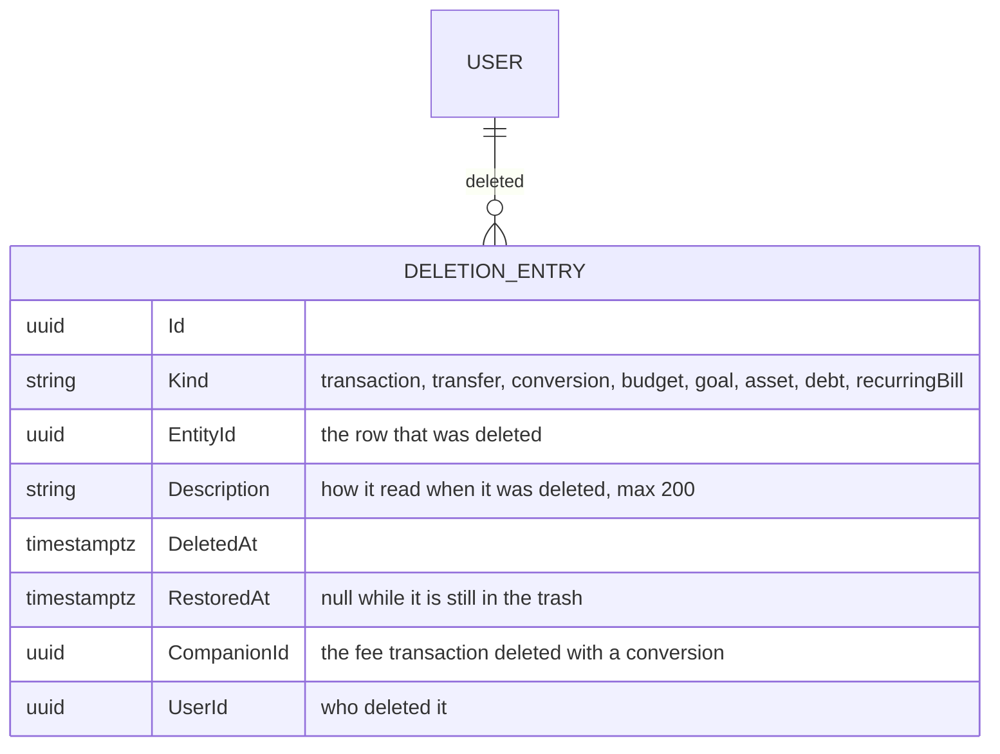
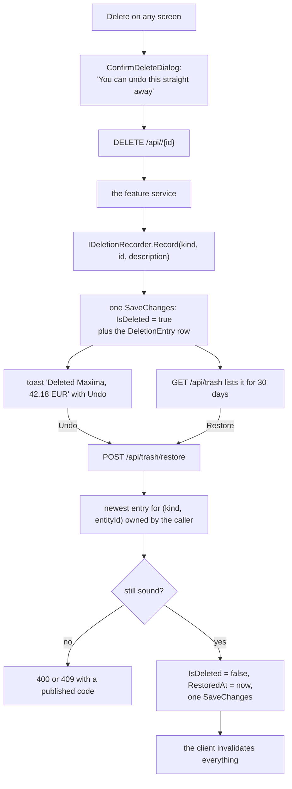

# Trash and undo

Back to the [feature walkthrough](<../14. Feature walkthrough with diagrams.md>).

Backend `Trash`, the Trash section of `/profile`, and the undo toast that every delete screen now shows. Almost every owned record in this product was already soft-deleted: the row stayed, `IsDeleted` went true, and the query filters stopped answering it. Nothing could bring one back, so the rows were dead weight and "Delete" was as final as a hard delete while costing as much as a kept row. This feature turns that stored row into something the owner can reach: a toast with Undo in the seconds after the delete, and a list of the last 30 days of deletions with a Restore button per row.

It is not an audit log. It records what *you* deleted, so that you can put it back; who changed what in a shared household is a different question and stays in the backlog.

## What a delete does today, and what that means for restoring

The first question is not how to restore but which deletes are reversible at all. A delete that only flips `IsDeleted` is reversible. A delete that also rewrites or removes other rows is not, unless what it rewrote is recorded somewhere, and none of them recorded anything.

| Record | What deleting does | Restorable | Why |
| --- | --- | --- | --- |
| Transaction | soft delete; its split lines and its `TransactionTags` rows are left in place | yes | the row and everything hanging off it is still there |
| Transfer | soft delete; its `TransferImport` receipts are deliberately kept | yes | the receipts already outlive the transfer, so the pair is consistent again |
| Currency conversion | soft delete, together with its fee transaction | yes | the fee is restored with it, and the entry records which transaction that was |
| Budget | soft delete | yes | no other row changes |
| Goal | soft delete | yes | no other row changes |
| Asset, debt | soft delete | yes | no other row changes |
| Recurring entry | soft delete | yes | the occurrences it already posted are ordinary rows and were never touched |
| Category | soft delete, **and** `CategoryId` is set to null on every transaction, split line and recurring entry, and every budget on it is soft-deleted | no | the ids it cleared are gone; restoring the name would give back a category attached to nothing and would not undo the delete |
| Tag | soft delete, **and** its `TransactionTags` rows are deleted outright | no | the links are the whole record; a restored tag would come back bare |
| Categorization rule | soft delete, **and** its `CategorizationRuleTags` rows are deleted outright and every remaining rule is renumbered | no | the tags it set are gone and its old `Position` now belongs to another rule |
| Household | soft delete, **and** every account, category and tag shared into it becomes personal | no | the sharing is destroyed, not hidden; restoring gives an empty household |
| Account | soft delete, under the name "archive" | no, by decision | archiving is already the reversible, named operation; un-archiving belongs on the accounts screen and would bring back an unbounded set of hidden rows that a one-line trash entry cannot honestly describe |
| Investment entry | soft delete, refused when later sales depend on it | no, for now | a restored sale has to be replayed against the holding as it stands now, which is a second oversold check the delete path does not have |
| Security price, broker connection, backup | hard delete, or a file | no | nothing is kept to restore |
| Notification, session, outbox message | never deleted by a user, or deleted on purpose | n/a | there is nothing a person asked to undo |

Two deletes changed to make the first row of that table true. `TransactionService.DeleteAsync` no longer removes the split lines, and `ConversionService.DeleteAsync` no longer removes the lines of a split fee. Editing a split still replaces its lines, which is where that rule belongs: an edit has a new set of lines to put in their place, a delete does not. The cost is a handful of orphaned line rows per deleted split transaction, which is the same cost the soft-deleted transaction itself already had, and nothing reads them — `ICategoryAttributionService` selects lines only for transactions its own filtered query returned.

## The model

`DeletionEntry` is an `OwnableEntity`, so the owner column, its restricting foreign key and the ownership query filter all come for free, and the trash list is one indexed query over one table instead of a union over ten. It carries `Description` rather than deriving it on read for the same reason a notification carries its payload: the row it describes may be invisible, or its account archived, by the time somebody reads the list, and "Maxima, 42.18 EUR" is what the person deleted whatever happened afterwards. The index on (UserId, DeletedAt) serves the list; the one on (Kind, EntityId) serves the restore lookup.

Services write the entry through `IDeletionRecorder`, which only adds the row to the context — the delete's own `SaveChangesAsync` commits both, so a delete cannot leave a trash entry without the delete, or the other way round. The entry is written explicitly by each `DeleteAsync` rather than by the `AppDbContext` interceptor that performs the soft delete, because a cascade would then get its own row: deleting a conversion would list the conversion *and* its fee as two separate things to undo.

## Delete, undo and restore

The operation is `POST /api/trash/restore` with a body of `kind` and `entityId`, not `POST /api/trash/{id}/restore`. The toast fires right after a delete and knows the kind and the id it just deleted; it does not know the id of a trash row it never read, and giving it one would have meant changing every delete endpoint from 204 to a body. One operation now serves both the toast and the Restore button on the screen.

Restoring is idempotent by construction. An entry whose `RestoredAt` is set answers 204 without touching anything, and so does a record that is already not deleted. Clicking Undo twice, or Undo in the toast and then Restore in the trash, is a no-op the second time rather than a conflict.

## When restoring is refused

A restore never brings back a broken row. Each refusal has a code, a sentence in both locales, and an integration test.

| Code | Status | When |
| --- | --- | --- |
| `resource.notFound` | 404 | nothing the caller deleted matches that kind and id, or the feature it belongs to is switched off |
| `restore.expired` | 400 | the deletion is older than the 30-day window |
| `restore.referenceMissing` | 400 | the account it belongs to is archived or no longer visible, both accounts of a transfer are not visible, or the category it points at was deleted |
| `restore.companionDeleted` | 400 | a conversion's fee transaction was deleted on its own before the conversion was, so restoring the conversion would leave it pointing at a deleted transaction |
| `restore.detailsLost` | 400 | a split transaction whose lines are no longer stored — rows deleted by a version before this feature |
| `restore.slotTaken` | 409 | another budget already holds the category and period this one needs |

The order matters and the messages say so. A transaction whose account was archived asks you to restore the account first; a conversion whose fee went separately asks you to restore that transaction first, and then the conversion restores. That is the "restore in a sensible order" answer rather than a cascade that resurrects rows nobody asked for.

The budget conflict is the one refusal that is not about something missing. `BudgetService` enforces one budget per category and period in code rather than with a unique index, so the slot can genuinely have been taken while the old budget sat in the trash; the restore re-runs exactly the check a create runs and answers the same 409 family.

A goal funded from an account that has since been archived is deliberately **not** refused. That state is already a supported one — the goals list answers `progressAmount` null for it and the owner can edit the goal back to manual — so refusing the restore would leave them with no way to reach it at all.

## Visibility, ownership and the active household

Restoring has to load a deleted row, which means `IgnoreQueryFilters()`, which drops ownership along with `IsDeleted`. `TrashService` therefore re-applies the rule by hand, and applies the same rule the delete applied:

- A transaction or a conversion needs its account to be visible, asked with a second, unfiltered-only-once query: `db.Accounts.AnyAsync(a => a.Id == accountId)`. The accounts filter is the shareable one, so it carries membership *and* the `X-Active-Household` narrowing. Restoring a transaction of another household while a household is active answers `restore.referenceMissing`, exactly as deleting it would have answered 404.
- A transfer needs both accounts, which is the rule its delete already had.
- A budget, goal, asset, debt or recurring entry is personal, so the owner is compared directly.
- A referenced category is checked for existence rather than for visibility (`IgnoreQueryFilters()` plus `!IsDeleted`), because a transaction on a shared account may carry a category of a household the restorer is not in. The question is "is the row still there", not "may you see it".

The trash list itself is owner-filtered, so it shows what *you* deleted. On a shared account two members each see their own deletions and neither can restore the other's; the entry belongs to the person who pressed Delete, which is the person the undo is for. A member who left the household afterwards keeps their entries and is refused on restore, because the account is no longer visible to them.

`/api/trash` is deliberately absent from `FeatureGateMiddleware`, for the reason notifications are: it belongs to no single feature and gating a cross-cutting prefix on one of them is meaningless. Instead `TrashService` maps each kind to the feature it belongs to — conversions to `MultiCurrency`, budgets to `Budgets`, goals to `Goals`, assets and debts to `NetWorth`, recurring entries to `RecurringBills`, transactions and transfers to nothing — leaves the switched-off kinds out of the list, and answers a restore of one with 404 `feature.disabled`. An administrator who switches a feature off hides its trash rows with it, and switching it back on brings them back.

## The retention window, and why nothing purges

The window is 30 days, held as `DeletionEntry.RetentionDays`. It is a **read filter, not a sweep**: the list asks for `DeletedAt >= now - 30 days`, and a restore of an older entry answers `restore.expired`. Nothing deletes `DeletionEntry` rows and nothing hard-deletes the records they point at.

There is no purge job, on purpose. A purge would be the first destructive background job in the installation, and it would have to hard-delete rows that the soft-delete design has never hard-deleted — with foreign keys from transfers, conversions, budgets and goals pointing at them, an order to delete them in, a rule for what a restore of a backup taken before the purge means, and a very bad failure mode if it ever got one of those wrong. The thing it would save is a row of about 120 bytes per delete. The rows the trash describes were already being kept forever before this feature existed; keeping a small entry beside them changes nothing about the size of the database and makes the deletions legible instead of invisible.

`DeletionEntries` is an ordinary table, so `BackupService`, which reads the table list out of the EF relational model, carries it without a line of code. A restored backup restores the trash as it was.

## The screen

The trash is a section of `/profile`, not a page of its own and not a section of `/settings`. Settings is administrators only and the trash is every user's own data. The profile already owns the things that belong to the person rather than to a feature — their details, their two-factor setup, the browsers they are signed in on — and already has the section navigation and a list section of exactly this shape. A top-level page would have needed a navigation entry for a screen that is empty most of the time, and the notifications bell set the precedent that a cross-cutting list does not need one.

Each row shows the kind as a tag, the description the entry stored, the moment it was deleted in the browser's locale, and a Restore button named after the row (`Restore: Maxima, 42.18 EUR`), the same labelling every other row action in the product uses. The list is paged ten at a time through the shared `usePagedList`, `usePageClamp` and `Pagination`. A row that cannot be restored is still listed and explains itself when you press the button — the same choice a saved filter that names a deleted tag makes, and for the same reason: hiding it would lose information the owner can still read.

## The toast

The undo lives in `useConfirmedDelete`, the hook every list in the product already uses for its delete, so no screen implements it. The hook takes an optional `TrashKind`; with one it passes an `onSuccess` into the mutation that raises `toast.success("Deleted …", { action: { label: "Undo" } })` from `useUndoToast`, and it swaps the confirm dialog's "This can't be undone." for "You can undo this straight away, or from the trash in your profile for the next 30 days." Without one, both the toast and the sentence stay exactly as they were, which is what keeps the dialog honest on the screens where deleting really is final — categories, tags, rules, households and archiving an account.

Eight screens pass a kind: transactions, transfers, currency conversions, budgets, goals, assets, debts and recurring entries. The transactions page lost its own "Transaction deleted" toast, because the undo toast replaces it; the others never had one.

Undo calls the same mutation the trash screen calls, so a refusal surfaces through the ordinary error toast with the translated sentence for its code. `POST /api/trash/restore` is listed in `src/api/invalidation.ts` with `refresh: "everything"` — a restore can bring back any of eight kinds and there is no honest smaller set — while each of the eight delete mutations gained the trash query root beside the roots it already refreshed.

## What it touches from the rest of the product

- **Tags on transactions.** A restored transaction comes back with its tags, because deleting a transaction never touched `TransactionTags`. Deleting a *tag* still removes those rows and is not restorable; that is the one place where the two features disagree, and it is stated in the table above.
- **Categorization rules.** A rule writes once and owns nothing afterwards, so a restored transaction keeps the category and tags a rule filled in. Rules themselves are not restorable because their delete renumbers their siblings.
- **Recurring entries of three shapes.** Restoring an entry restores the schedule, not its history: the transactions and transfers past confirmations wrote are separate rows that were never deleted. Its `NextDueDate` is whatever it was when it was deleted, which may now be in the past — the reminder job treats that exactly as it treats an unconfirmed entry.
- **Budget rollover windows.** A restored expense is counted again in every window it falls in, including windows a rollover walks back over, because the carry is recomputed on every read and was never stored.
- **The active household.** The header narrows the accounts query, and the accounts query is what decides whether an account-scoped record may come back, so a restore is narrowed exactly as a delete was.

A restored transaction has to reappear in balances, budgets and reports, and `RestoredTransactionLedgerTests` asserts the three together: the account balance, the budget's `spent` and the report's `totalExpense` are read before the delete, after the delete and after the restore, and the first and third readings have to be equal.
