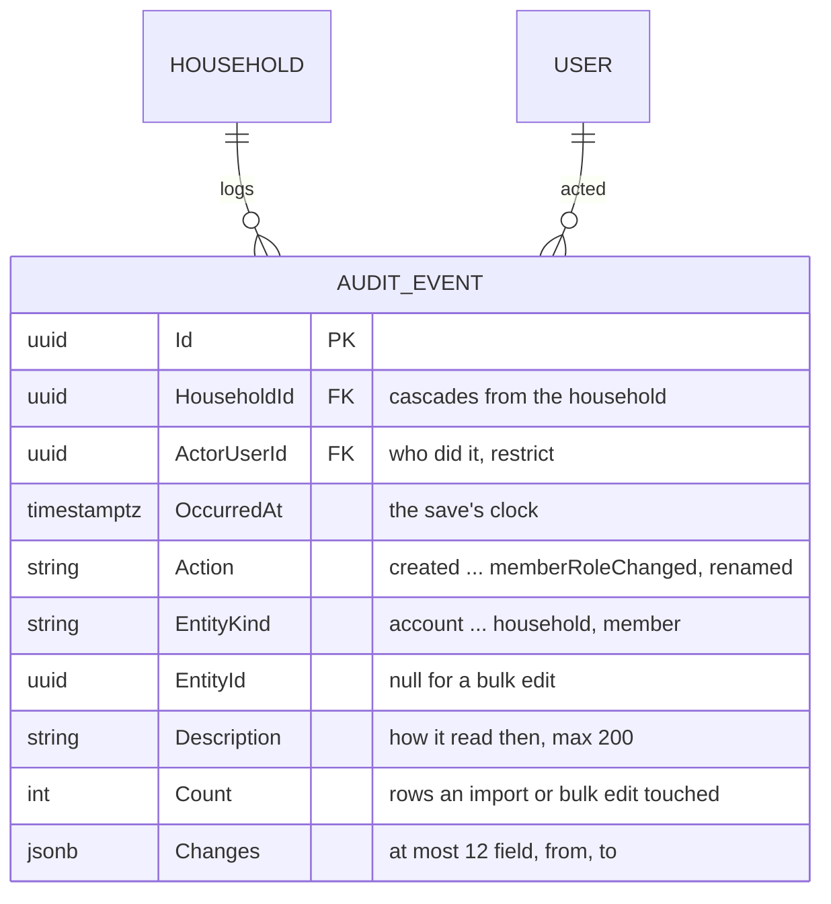
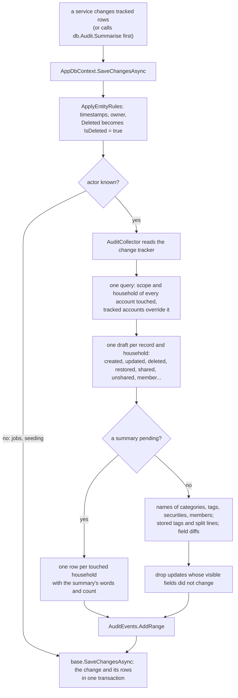
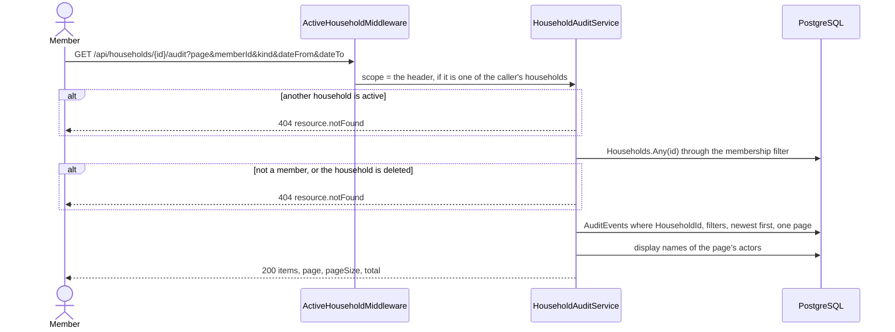

# Audit log

Back to the [feature walkthrough](<../14. Feature walkthrough with diagrams.md>).

Backend `Households/GetHouseholdAudit`, the collector in `Infrastructure/Data/Auditing` and `AuditRetentionJob`; frontend `households/household-activity`, opened with "Show activity" on each household card of `/households`. A household shares accounts, categories and tags between people, and until now nothing said who did what to them: a transaction on the joint account could change amount overnight and the only trace was the new amount. The trash already recorded every delete a person made, so that they could undo it. This feature records the other half — who created, changed, deleted or restored a shared record, who shared or unshared one, and who added, removed or re-roled a member or renamed the household — as one row per event, readable by every member of that household.

## What is logged, and what is not

Only what is shared into a household. The rule is the one the query filters already use to decide what a member may see: a record is logged in a household when a member of that household could see it.

| Record | Logged in | Actions |
| --- | --- | --- |
| Account | the household it is shared into | created, updated, archived (`deleted`), restored, `shared`, `unshared` |
| Category, tag | the household it is shared into | created, updated, deleted, restored, `shared`, `unshared` |
| Transaction, currency conversion, investment entry | the household of its account | created, updated, deleted, restored |
| Transfer | the household of each of its two accounts, once per household | created, updated, deleted, restored |
| File attached to a transaction | the household of the transaction's account | created (read as "attached"), deleted, restored; see [Attachments](<31. Attachments.md>) |
| Household | itself | created, `renamed`, deleted, restored |
| Membership | its household | `memberAdded`, `memberRemoved`, `memberRoleChanged` |
| A Swedbank CSV import, an Interactive Brokers statement | the household of the account imported into, and of any other account a transfer row touched | one `imported` row with the number of entries |
| A bulk category or bulk tag edit, a categorization-rule run | the household of every account whose transactions it touched | one `updated` row with no entity id and the number of transactions |

Nothing personal is ever written. A transaction on an account that is not shared, a personal category or tag, and every record that cannot be shared at all — budgets, goals, assets, debts, recurring entries, categorization rules, net-worth snapshots, notifications, security prices, broker connections, users, sessions, settings and backups — produce no row. Recurring entries are personal even when the transactions they post land on a shared account; the posted transaction is logged as created, the schedule is not.

Three kinds of change are deliberately left to the one event that caused them, because they are side effects written with a set-based update that the change tracker never sees:

- **A category delete** clears the category on every transaction, split line and recurring entry and retires its budgets. The log shows "deleted the category", not one "category Food → none" per transaction. The same holds for a tag delete, whose join rows go outright.
- **A household delete and a member removal** make the member's shared accounts, categories and tags personal. The log shows "deleted the household" or "removed Jonas", not one `unshared` per account.
- **A change of the reporting currency** by an administrator recomputes every stored reporting amount. It is an installation setting, not something a member did to a household.

## The model

`AuditEvent` is a plain class, not an `OwnableEntity` and not an `EntityBase`. It has no owner, because the whole point is that other members read it; no soft delete, because nothing deletes it except the retention job; and no query filter, because the one read path checks membership itself before it asks for a household's rows. The index on (HouseholdId, OccurredAt) serves that read, newest first; the one on OccurredAt serves the prune.

`Description` is stored for the reason `DeletionEntry` stores one: the record may be renamed, archived or gone by the time somebody reads the log, and "Maxima, 42.18 EUR" is what the member saw when they did it. It is written in English with the same helpers the trash uses (`TrashLabel`), for example `Maxima, 42.18 EUR`, `150.00 EUR → 162.30 USD, 2026-09-12`, `Sell 3 MSFT, 2026-07-15`, `Swedbank CSV into Joint, 42 entries, 3 duplicates skipped`. The actor's name is not stored: it is looked up on read, so a renamed user reads by their current name, and a user who no longer exists would read as "A former user" (users are never hard-deleted today, and the foreign key restricts it).

`Changes` is a `jsonb` column holding a list of `{field, from, to}` for an update, a rename and a role change, and an empty list for everything else. Why a JSON column here when `DeletionChanges` is a child table is in the [decision log](<../9. Open questions & decisions.md>): these values are only ever read back with their event, never joined or queried by field, and each list is bounded.

## The write path

The log is written from the `SaveChangesAsync` override of `AppDbContext`, from the change tracker, and not by an `IDeletionRecorder`-style call in each service. There are two dozen write paths that touch shared records — create, edit, delete and restore of seven kinds, sharing, four membership operations, renaming, restoring from the trash, restoring an account, the import, the broker statement, recurring confirmations — and an explicit call would have had to compute the before and after of every field in each of them; one missed call would have been a silent hole in a log whose value is that it has none. The tracker already holds the original and the current value of every property, so the collector reads them once, for all of them. It runs after `ApplyEntityRules`, so a delete is already the `IsDeleted` false → true edit it becomes, and before the base save, so the rows it adds are inserted in the same `SaveChanges` and therefore in the same database transaction as the change, or in the explicit transaction the service already opened. A change cannot be committed without its row, or the other way round.

The trash chose the explicit recorder for a reason that still holds there — a cascade would get its own trash row — and the collector handles the one cascade that matters the same way: a transaction that is the fee of a currency conversion tracked in the same save is folded into the conversion, so creating, deleting or restoring a conversion is one row, not two. Transaction tags and split lines, which are separate rows, are folded into their transaction as the `tags` and `split` fields of its `updated` row.

The actor is `ICurrentUser.Id`. Outside a request it is `Guid.Empty`, and then nothing is written: the reminder, alert and snapshot jobs, `just seed` and the recovery command change nothing a member did. A backup restore runs inside an administrator's request but writes with raw SQL outside the change tracker, so it writes nothing either. `BrokerSyncJob` is the exception by construction, because it already runs each sync under its own `ICurrentUser` for the connection's owner, so a nightly broker sync is logged as that owner's import.

### Updates and their fields

An update lists only the fields a member can see, in this order, and only when the shown value differs:

| Kind | Fields |
| --- | --- |
| Transaction | `date`, `amount`, `type`, `description`, `category`, `account`, then `tags` and `split` |
| Transfer | `date`, `amount`, `receivedAmount`, `fromAccount`, `toAccount`, `description` |
| Currency conversion | `date`, `fromAmount`, `toAmount`, `description`, `account` |
| Investment entry | `date`, `type`, `security`, `quantity`, `price`, `fee`, `cashAmount`, `description`, `account` |
| Account | `name`, `description`, `type`, `startingBalance` |
| Category | `name`, `type`, `icon` |
| Tag | `name` |
| Household (`renamed`) | `name` |
| Membership (`memberRoleChanged`) | `role` |

Values are stored as display text as they read at the time: money as `42.18 EUR`, dates as ISO, quantities without trailing zeros, enums as the camel-case name the API publishes (`expense`, `owner`), references by name (the category, account and security symbol), tags as a sorted comma list and split lines as `Food 10.00; Travel 5.00`. An empty value is `null` and the screen says "none". Nothing else is stored: the IBAN, notes, import references, external broker ids, reporting amounts, owners, timestamps and every secret field of the installation are outside the list, and the entity kinds that hold secrets — users, sessions, broker connections, SMTP settings — are not audited at all. A list holds at most `AuditEvent.MaxChanges` (12) entries, each value is cut to `AuditEvent.ValueMaxLength` (120) characters with an ellipsis, and the description to 200, so one row is bounded at a few kilobytes whatever is edited.

An edit that changes nothing a member can see — saving a form unchanged, a change of the reporting amount alone — writes no row.

### Imports and bulk edits

A Swedbank CSV confirm of 800 rows would otherwise write 800 `created` rows and bury everything else in the log for weeks. Before its single save, a bulk operation calls `db.Audit.Summarise(action, kind, description, count, entityId, accounts)`. For the next save the collector still works out which households the tracked changes touch, adds the households of the accounts passed in, and writes one row per household with those words and that count instead of the per-record rows. The summary is taken by that save and does not leak into a later one.

| Operation | Row |
| --- | --- |
| `POST /api/import/swedbank/confirm` | `imported`, kind `transaction`, the account's id, `Swedbank CSV into Joint, 42 entries, 3 duplicates skipped` |
| Interactive Brokers upload, fetch and nightly sync | `imported`, kind `investmentTransaction`, the account's id, `Interactive Brokers statement into Broker, 12 trades, 3 cash entries` |
| `POST /api/transactions/bulk-category` | `updated`, no entity id, `Category set to Groceries, 12 transactions` |
| `POST /api/transactions/bulk-tags` | `updated`, no entity id, `Tags set to Holiday, Travel, 12 transactions` |
| `POST /api/categorization-rules/run` | `updated`, no entity id, `Categorization rules run, 30 transactions` |

An import that adds nothing writes nothing. A rule run updates categories with a set-based update the tracker never sees, which is why it passes the accounts of the matched transactions explicitly. The count is the operation's total, so a bulk edit across two households reads the same count in both.

## The read path

`GET /api/households/{id}/audit` is under `/api/households`, so the Households feature switch gates it. The household is looked up through the existing household query filter, so a non-member, an unknown id and a deleted household all answer the same 404, and the endpoint cannot be used to discover that a household exists. While a household is active in `X-Active-Household`, every other household's log answers 404 as well, the way any record of another household does; the list of households itself stays unnarrowed, and the card of another household simply does not offer its activity. `memberId` filters by actor, `kind` by entity kind, `dateFrom` and `dateTo` by whole days in the installation's time zone (from the start of the first to the end of the last), and a start after the end answers 400 `range.invalid`. Pages are ordered by `OccurredAt` descending; rows of one save share a timestamp and are ordered by kind and id.

The log answers what is stored. A row names a record that may since have been deleted, archived or unshared, and it is still listed, with the words it had: the log is history, not a view of the present.

## Retention

`AuditRetentionJob` runs daily and deletes rows older than `AuditEvent.RetentionDays`, 400 days, with one `ExecuteDelete` over the `OccurredAt` index. Four hundred days keeps a full year plus the month it takes to notice something about last year; beyond that, a household's log is mostly noise and a small but unbounded cost. Unlike the trash, which keeps its rows forever and filters by date on read, this is a real prune: a trash entry is about 120 bytes per delete a person makes, while the log gains a row per edit by every member, so it is the table that grows. The job deletes only audit rows; nothing it removes is referenced by anything, so there is no order to get wrong. It carries no feature gate, because rows written while the Households switch was on still age out while it is off. See [Background jobs](<23. Background jobs.md>).

## Backup and restore

`AuditEvents` is an ordinary table, so `BackupService`, which reads its table list from the EF relational model, carries it without code, including the `jsonb` column, which travels as text and is cast back on insert. A restore puts the log back exactly as it was when the backup was taken: the rows written after the backup describe changes the restore just undid, so keeping them would describe a history the data no longer has. The restore itself is not logged — it is an installation-wide administrator action, not something a member did in a household, and it runs outside the change tracker. `BackupEndpointTests` takes a backup of a household with a shared account, records a transaction on it, restores, and finds the two rows from before the backup and not the transaction.

## The screen

Each household card gets a "Show activity" button beside "Add" that expands the activity under the members, with `aria-expanded` on the button. It is hidden on the card of a household that is not the active one, since the server would answer 404 for it. The section states what is kept and for how long, then offers three filters — member (everyone, or one of the current members), kind and a date range — and a list paged ten at a time through `usePagedList`, `usePageClamp` and `Pagination`. Changing a filter starts again at page one.

Each row is the kind as a tag, one sentence and, for an edit, the changes: "Šarūnas changed Maxima, 42.18 EUR" over "amount 40.00 EUR → 42.18 EUR, category Food → Groceries", then the moment in the browser's locale. The sentence is chosen from the action and the kind — archiving an account reads "archived", a household reads "created the household", a bulk edit reads "edited in bulk: Category set to Groceries, 12 transactions" — and field names are translated, with an unknown field shown under its own name so a row written by a later version still reads. The sentence and the field names are in both locales; the stored description and values are not translated, for the reason the trash gives.

The list is read with the default React Query freshness, so opening the section, refocusing the window or any household mutation (whose invalidation already refreshes everything under `/api/households`) fetches it again. Transaction mutations do not refresh it, because they do not know which household a row lands in; the section catches up the next time it is opened.

## Tests

`AuditLogTests` covers every action on a shared account, category, tag and household: a transaction created, edited (with the exact `amount` and `category` changes), deleted and restored; an account shared and unshared, archived and restored; a member added, promoted and removed; the household renamed, deleted and restored from the trash; a transfer between two households appearing in both logs and a transaction in only its own; nothing at all for a personal account, category, tag and transaction; member-only access and 404 under another active household; the member, kind and date filters and paging; a Swedbank import and a bulk recategorisation as one row each with their counts; an Interactive Brokers statement as one row; and the retention job removing a 401-day-old row while keeping a 399-day-old one. The frontend has stories for the list, both locales, empty, loading, failure, paging and the filters, a card story that opens it, and DOM tests of the sentence and change rendering.
