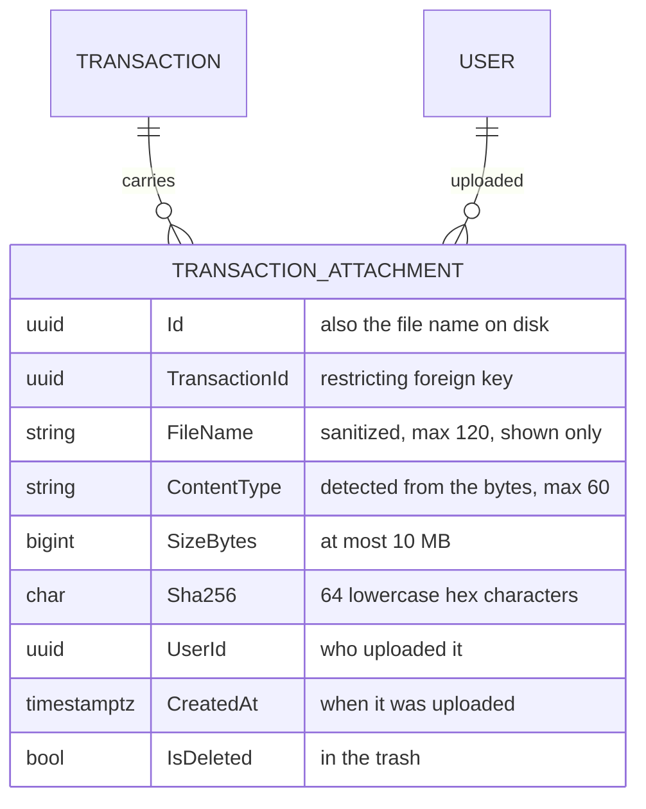
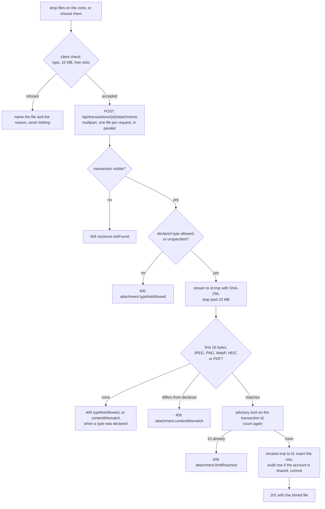
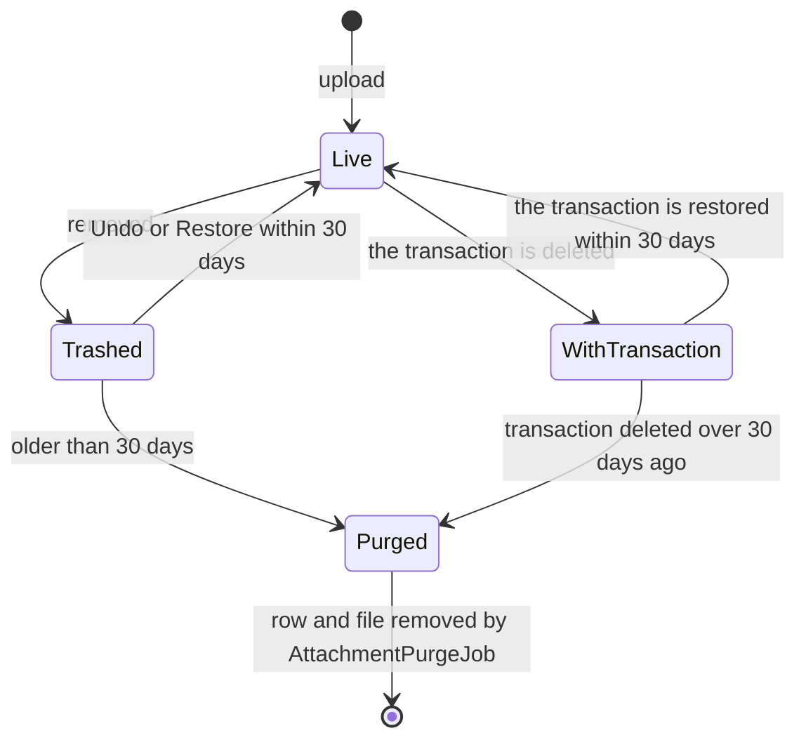
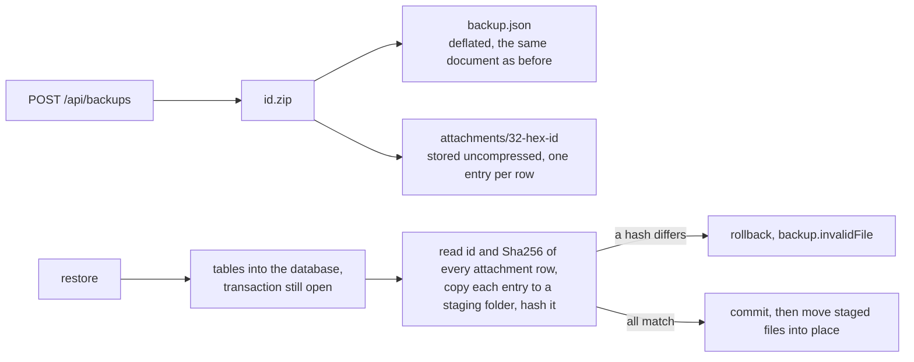

# Attachments

Back to the [feature walkthrough](<../14. Feature walkthrough with diagrams.md>).

Backend `Attachments` (`AttachmentService`, four endpoints), `Common/Attachments/AttachmentContent`, `Infrastructure/Attachments/AttachmentStore` and `AttachmentPurgeJob`; frontend `transactions/transaction-attachments`, shown under the form of the transaction edit dialog, and a paperclip with a count in the ledger. A receipt, an invoice or a warranty card belongs with the payment it explains. Until now the only place for it was the description field, so the paper went into a drawer and the photo into a phone gallery, and neither came back when the payment was questioned. A transaction now carries up to ten files, which are kept on a volume next to the database, go into every backup, and follow the transaction's visibility, trash and audit rules exactly as its own fields do.

## The model

`TransactionAttachment` is an `OwnableEntity`, so the uploader column (`UserId`), its restricting foreign key to the user and the timestamps come from the base class, and `CreatedAt` is the upload time the API answers as `uploadedAt`. It is deliberately not owner-filtered: `AppDbContext` gives it its own query filter, `!IsDeleted && Transactions.Any(t => t.Id == a.TransactionId)`, and the transactions filter inside it is the account filter, which carries household membership and the `X-Active-Household` narrowing. So whoever can see the transaction sees its files, a household member sees a file another member uploaded, and a file of a deleted transaction or of an archived account is invisible with it. The index on (TransactionId, CreatedAt) serves the only read, a transaction's files oldest first; the count on the ledger page is one grouped query over the same index.

The bytes are not in the database. A row describes a file, and the file lives in the attachment directory under the row's id. Why a directory and not a `bytea` column is in the [decision log](<../9. Open questions & decisions.md>).

## Storage

`App:AttachmentDirectory` names the directory: `/attachments` on the `attachments` named volume in `docker-compose.yml` (the production overlay inherits the mount, the end-to-end stack mounts its own `e2e_attachments`), `.local/attachments` in development through `scripts/dev-env.ps1`, and `attachments` under the content root when nothing is configured, which git and `.dockerignore` both exclude. The API image creates `/attachments` owned by the non-root `app` user, the same way it creates `/keys` and `/backups`, and `just verify-production` checks that only the `api` service mounts the volume.

A file is written as `<32 hex digits>` — the attachment id — and nothing else. The name the browser sent is never part of a path: it is sanitized for display and stored in the row, so `..\..\etc/passwd.pdf`, a name with control characters or a name of 400 characters cannot reach the file system at all. `AttachmentStore` writes an upload to `<random>.tmp` while hashing it, renames it to the id once the row is about to be saved, and deletes it again when the save fails; a `.tmp` file, a file whose id no row knows, and a `.restore-*` staging folder left by a crash are swept by the purge job once they are more than an hour old, so a file another request is still writing is never touched.

## Uploading

The type is decided by the file's first bytes, not by what the browser declared: `FF D8 FF` is JPEG, the eight-byte PNG signature is PNG, `RIFF….WEBP` is WebP, an ISO box `ftyp` with a HEIF brand (`heic`, `heix`, `mif1` and the rest) is HEIC, and `%PDF-` is PDF. The declared type only has to agree. `application/octet-stream` or no type at all counts as "not declared", which is what browsers send for HEIC photos, so those are judged by their bytes alone. Everything else — SVG, HTML, GIF, office documents, archives — is refused, because the only thing a receipt needs to be is a picture or a PDF, and every extra type is another way to smuggle script into a download. The stored name gets an extension that matches the detected type: `invoice.pdf` that turns out to be a PNG is kept as `invoice.pdf.png`, and a name that loses everything to sanitizing becomes `attachment.png`.

The limits are named constants on `TransactionAttachment`: `MaxFileBytes` (10 MB) and `MaxPerTransaction` (10). The endpoint sets `MaxRequestBodySize` to 10 MB plus 256 KB for the multipart envelope, so Kestrel refuses anything larger with 413 before the service is reached; a file between the two is refused by the service with `attachment.tooLarge` while it is being streamed, so a lying `Content-Length` does not help. Caddy sets no body limit on the `/api` route in either Caddyfile, so the application's limit is the only one. The count is checked once before the file is read, to fail early, and again under a transaction-scoped advisory lock keyed on the transaction id, so two uploads racing for the tenth slot cannot both get it.

| Code | Status | When |
| --- | --- | --- |
| `required` | 400 | the request has no `file` field |
| `attachment.empty` | 400 | the file has no bytes |
| `attachment.tooLarge` | 400 | the file is larger than 10 MB (a request body over 10.25 MB is refused by Kestrel with 413 first) |
| `attachment.typeNotAllowed` | 400 | the declared type, or the content when nothing was declared, is not JPEG, PNG, WebP, HEIC or PDF |
| `attachment.contentMismatch` | 400 | an allowed type was declared and the bytes are another type, or none |
| `attachment.limitReached` | 409 | the transaction already has 10 files; also answered by a restore from the trash that would make it 11 |
| `resource.notFound` | 404 | the transaction or the attachment is not visible to the caller, or the file is no longer on disk |

## Downloading and thumbnails

`GET /api/attachments/{id}/content` streams the file with the detected content type and always as `Content-Disposition: attachment`, with `X-Content-Type-Options: nosniff` and `Content-Security-Policy: default-src 'none'; sandbox`. A browser that navigates to the address saves the file instead of rendering it, and even if it rendered it, the sandbox leaves it no script and no origin. Caddy adds the same `nosniff` and a `default-src 'none'` policy to every `/api` response in production. The ETag is the SHA-256, and a matching `If-None-Match` answers 304 after the same visibility check, so a thumbnail that is shown again costs a round trip and no bytes; `Cache-Control: private, no-cache` keeps a shared cache from holding it and makes the browser ask every time, which is what makes losing access take effect at once.

Thumbnails are the same address in an `` element. An image element ignores `Content-Disposition` and the page's own policy allows `img-src 'self'`, so no separate inline route and no blob URLs are needed, and a PDF or a HEIC photo, which a browser cannot draw as an image, gets an icon instead. The `` request carries the session cookie but not the active-household header, which only means the server checks it against everything the user may see, never more.

## Removing, the trash and the purge

Removing a file is a soft delete written with `IDeletionRecorder` as kind `attachment`, described as `receipt.pdf, Maxima, 42.18 EUR`, and the file stays on disk. The toast offers Undo and the trash lists it for 30 days, like every other delete. A restore is refused with `restore.referenceMissing` while the transaction itself is deleted or invisible (restore the transaction first), with `attachment.limitReached` when ten other files were added in the meantime, and with `restore.detailsLost` when the file is no longer on disk.

Deleting a transaction does not touch its files. They are hidden because their transaction is, and restoring the transaction brings them back with it, with no entry of their own in the trash. The same is true of archiving an account.

`AttachmentPurgeJob` runs daily and is the first job that hard-deletes something a person put into the ledger. It hard-deletes the rows, and then the files, of attachments removed more than 30 days ago (`DeletionEntry.RetentionDays`) and of attachments whose transaction was deleted more than 30 days ago, and it removes files that no row refers to once they are an hour old. The trash page explains why records are otherwise never purged; the argument does not carry over, because the thing kept here is not a row of a hundred bytes but up to ten megabytes of somebody's photograph, nothing references an attachment row, and the restore window it closes has already expired. A trash entry whose attachment was purged answers `restore.expired`, which is what it would have answered anyway. See [Trash and undo](<29. Trash and undo.md>) and [Background jobs](<23. Background jobs.md>).

## Audit

On a shared account, adding, removing and restoring a file writes an activity row in the household of the account, with the entity kind `attachment`, the attachment id and the description `receipt.png, Rimi, 9.99 EUR`; the page reads it as "Šarūnas attached …", "removed the file …" and "restored the file …". Personal accounts write nothing. The row comes from the same change-tracker collector as every other row, which looks up the transaction behind each tracked attachment to find the account and its household. See [Audit log](<30. Audit log.md>).

## Backups

A backup is now a zip archive: `backup.json`, the unchanged JSON document with every table, and one entry `attachments/<id>` per attachment row whose file exists, soft-deleted ones included, because a restored trash must be able to bring them back. The document is deflated; the files are stored without compression, because JPEG, WebP, HEIC and most PDFs are compressed already and deflating them again costs time for nothing. A file missing from the directory when the backup is taken is logged and left out.

Restore reads the document into the open restore transaction exactly as before, then reads the id and SHA-256 of every restored attachment row inside that transaction and copies the matching archive entry into a `.restore-*` folder, hashing it as it goes. A hash that does not match the row rolls the whole restore back with `backup.invalidFile`; the checksum is taken from the restored rows, not from the archive, so a tampered file cannot vouch for itself. After the commit the staged files are moved over the attachment directory. An attachment row without an entry is restored all the same and logged; its download answers 404 until the file is put back. Files that belonged to rows the restore removed stay until the purge job's orphan sweep an hour later. The response and the log count the files written back.

The old formats still work. `BackupStore` names an archive `<id>.zip` and a legacy backup `<id>.json.gz`, finds either, and tells them apart by the first bytes; upload accepts a zip archive, gzip-compressed JSON or plain JSON. A backup taken before this migration is still listed and downloadable, and, as before, its migration differs from the running application, so a restore answers `backup.schemaMismatch` and the way back is the application version that wrote it. The archive entries are checked on upload: anything other than `backup.json` and `attachments/<32 hex>` entries no larger than an attachment can be is refused as `backup.invalidFile`, so a crafted path such as `../outside.txt` is never read, let alone written.

Size: a backup grows by the size of the attachment directory, since the files are copied as they are. A thousand phone photos of receipts at 2–3 MB each add 2–3 GB. The decompressed-size guard, `App:BackupMaxDecompressedBytes` (1 GiB), applies to `backup.json` only; each file is bounded by the 10 MB attachment limit instead. Uploading a downloaded backup is therefore capped at 2 GB rather than 100 MB, with the multipart form limit raised to match; a larger archive has to be copied into the backup directory together with an info file by hand. Downloading streams the stored file. See [Backup and restore](<22. Backup and restore.md>).

## The screen

The edit dialog of a transaction shows "Receipts and files" under its form. Files save as soon as they are chosen or dropped, independently of the form's Save button; the create dialog has no such section, because there is nothing to attach them to until the transaction exists. Each row shows a thumbnail for JPEG, PNG and WebP and an icon for PDF and HEIC, the name, the size, who uploaded it and when, a download link and a remove button, all named after the file. Below the list is one drop zone that is also the file picker: the file input covers the zone, so dropping files on it and clicking it are the same native control, keyboard focus shows on the zone, and no drag handlers sit on a non-interactive element. The zone is disabled while uploads run and once ten files are attached.

Before anything is sent, the client refuses what the server would refuse anyway — a type outside the list, a file over 10 MB, more files than there are free slots — and names each file with its reason. Accepted files are uploaded in parallel, one request each, with "Uploading 2 files…" as a status line; a server refusal shows its translated sentence under the zone and the other files still go through. Removing a file shows the undo toast. The ledger table and the phone list show a paperclip and the count next to the description of any transaction that has files, with "2 files attached" as its accessible name.

The CSV and PDF exports do not gain an attachment column. A count says nothing a reader of the export can act on, and adding a column would change a CSV layout that spreadsheets are already built on.

## Tests

`AttachmentEndpointTests` covers the round trip byte for byte with its headers, the 304 on a matching ETag, the name losing its path and getting the right extension while the file is stored under its id, refusal of text, HTML and GIF with `attachment.typeNotAllowed`, of a script declared as PNG and a PNG declared as PDF with `attachment.contentMismatch`, of an empty, a missing and an 11 MB file, the eleventh file, the trash round trip with the file still on disk, a deleted transaction hiding and restoring its files, a file that cannot come back while its transaction is deleted, a stranger's 404 on every operation, household members sharing the files of a shared account and losing them under another active household, the three audit rows on a shared account and none on a personal one, and the purge job removing an expired file, a file of a long-deleted transaction and an old orphan while keeping a fresh orphan and the files still in their window. `BackupEndpointTests` restores an archive and downloads the restored file byte for byte, checks the archive layout, rolls back a restore whose file was replaced, and refuses an archive with an unexpected entry. The frontend has stories for the list, documents and photos, both locales, empty, full, loading, failure, an upload with a removal and its undo, an upload in progress and refused files, a play on the edit dialog and on the ledger's paperclip, and DOM and unit tests of the list, the client checks and the drop zone.
