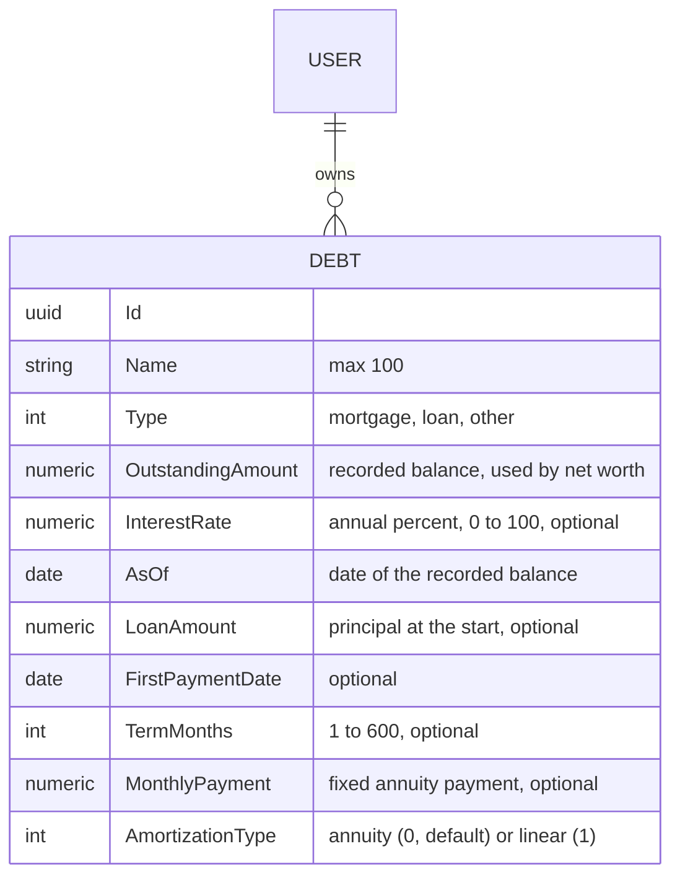
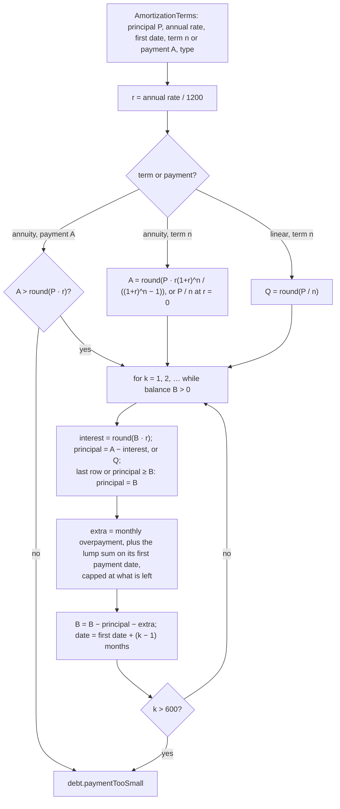
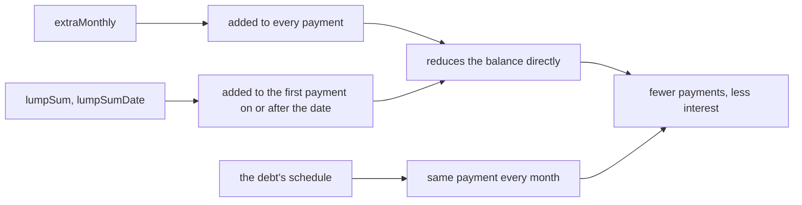
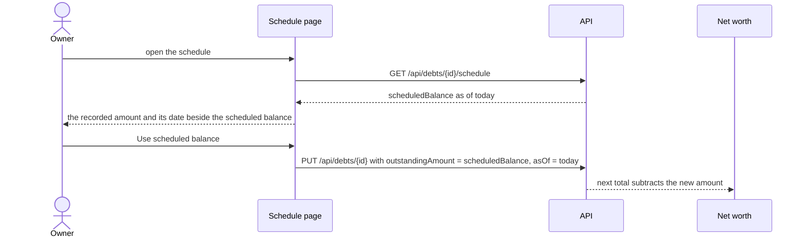
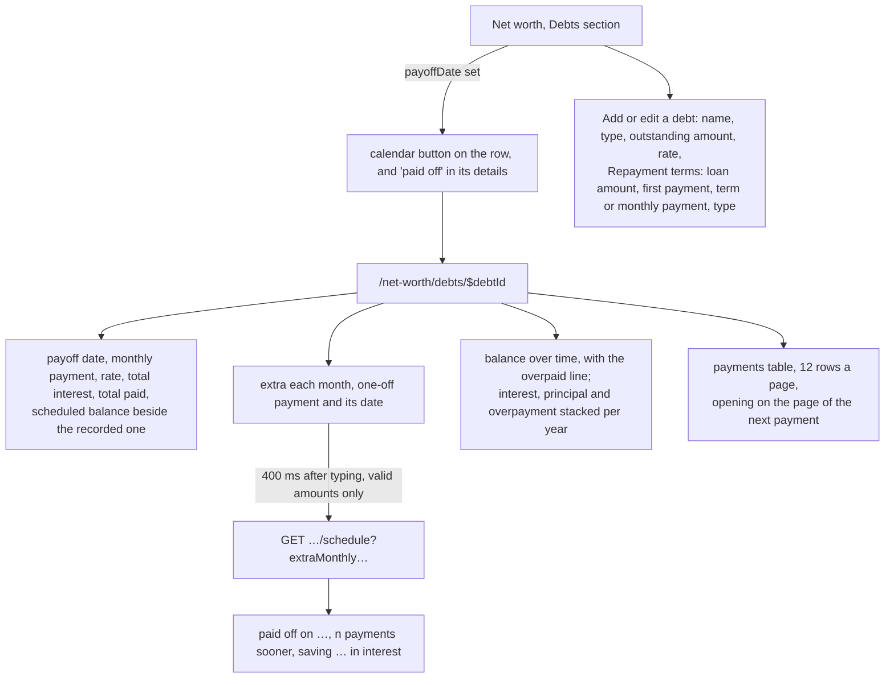

# Debt amortization

Back to the [feature walkthrough](<../14. Feature walkthrough with diagrams.md>).

Backend `NetWorth` (`GetDebtSchedule`, and the repayment fields of `CreateDebt` and `UpdateDebt`) and `Common/Amortization` (`AmortizationCalculator`, `AmortizationTerms`, `ExtraPayments`, `AmortizationSchedule`); frontend `net-worth/debts-section/debt-form`, the schedule link on each debt row, and the page `/net-worth/debts/$debtId` (`net-worth/debt-schedule-page` with `debt-schedule-summary`, `debt-extra-payments`, `debt-balance-chart`, `debt-payment-split-chart` and `debt-schedule-table`). A debt used to be a number and a rate: what is owed today and at what interest. That answers "how much am I worth", but not "when is this paid off", "how much of this month's payment is interest" or "what does another 100 a month buy me". Those answers follow from the loan contract, so a debt can now carry its repayment terms, and a debt with complete terms gets a computed repayment schedule.

## The model

The five repayment columns were added to `Debts` by the `AddDebtAmortization` migration. Four are nullable and `AmortizationType` defaults to annuity, so every debt stored before stays valid and simply has no schedule. The terms describe the loan from its first payment, as the contract states it, and not from today's balance: the principal borrowed, the date of the first monthly payment, and either the number of monthly payments or the fixed monthly payment. Why the contract and not the current balance is in the [decision log](<../9. Open questions & decisions.md>).

A debt has a schedule when it has a loan amount, an interest rate (zero counts), a first payment date and a term, or, for an annuity only, a monthly payment. `AmortizationTerms.From(debt)` answers the terms or nothing, and the debt list answers `payoffDate`, the date of the last scheduled payment, only for a debt that has them; the page and the list read that field to decide whether to offer the schedule.

| Rule | Code | Field |
| --- | --- | --- |
| Loan amount is a positive decimal string with at most two decimals | `money.positive` | `loanAmount` |
| Term is a whole number from 1 to 600 | `range.invalid` | `termMonths` |
| Monthly payment is a positive decimal string with at most two decimals | `money.positive` | `monthlyPayment` |
| A term and a monthly payment are not both given | `value.mustBeEmpty` | `monthlyPayment` |
| A linear schedule has no monthly payment | `value.mustBeEmpty` | `monthlyPayment` |
| A monthly payment repays the loan within 600 payments | `debt.paymentTooSmall` | `monthlyPayment` |
| The amortization type is known | `enum.invalid` | `amortizationType` |

The last rule runs the calculator inside the validator, so a debt that cannot be scheduled is never stored and the schedule endpoint never meets one.

## The calculator

`AmortizationCalculator` is a pure static class in `Common/Amortization` with no database, clock or culture in it, and every number is a `decimal`. It is unit tested in `AmortizationCalculatorTests` against known values and rounding edge cases.

The formulas, with P the principal, r the monthly rate, n the number of payments and B the balance before a payment:

- monthly rate: r = annual rate in percent / 1200, so 5% a year is 0.0041666… a month;
- annuity (level) payment: A = P · r · (1 + r)^n / ((1 + r)^n − 1), and A = P / n when r = 0;
- linear principal part: Q = P / n, and the payment of month k is Q + B·r, falling every month;
- interest of month k: I = B · r, and the principal of an annuity month is A − I.

Each amount is rounded to cents half away from zero (`Money.Round`), the same rounding the rest of the ledger uses: the level payment once, the interest of every row, the linear principal part once. Rounding the payment leaves a remainder, and the last payment absorbs it: its principal is whatever balance is left, so the principal column always sums to exactly P and the last balance is exactly 0.00. The power (1 + r)^n is computed by repeated squaring in `decimal`; the level payment is multiplied as P · (r·g / (g − 1)) so that the largest principal a debt can hold at 100% over 600 months does not overflow.

Worked values that the tests pin:

| Loan | Result |
| --- | --- |
| 100 000 at 5% over 360 months | 536.82 a month; the first payment is 416.67 interest and 120.15 principal, leaving 99 879.85; 359 payments of 536.82 and a last one of 538.14, because 536.82 is rounded down from 536.8216 |
| 100 000 at 5% with a fixed payment of 536.82 | 361 payments, the last of 1.33, for the same reason seen from the other side |
| 100 000 at 5% with a fixed payment of 536.83 | 360 payments |
| 100 000 at 6% with a fixed payment of 500.00 | refused: 500.00 is exactly the first month's interest |
| 1 000 at 0% over 3 months | 333.33, 333.33, 333.34 |
| 1 200 at 12% linear over 12 months | 100 principal every month, payments from 112.00 down to 101.00, 78.00 interest in total |
| 100 000 at 5% over 360 months with 100 extra a month | 256 payments instead of 360 |

A term derives the payment and a payment derives the term: the schedule of a debt with a monthly payment is as long as it takes, and one that would take more than 600 payments (50 years), which includes any payment not above the first month's interest, is refused with `debt.paymentTooSmall`. A linear schedule needs a term, because its payment changes every month.

Dates: payment k falls on the first payment date plus k − 1 months with `DateOnly.AddMonths`, counted from the first date each time, so a loan paid on the 31st is paid on 28 February and again on 31 March. The monthly rate is one twelfth of the annual rate whatever the length of the month, which is how most annuity loans are quoted; a bank that counts actual days will differ by cents a month.

## Overpayments

An overpayment keeps the regular payment and shortens the term, which is what "what if I pay more" usually means and what most lenders do by default; recomputing a lower payment for the same term is the other choice and is not offered. `extraMonthly` is added to every payment and `lumpSum` once, to the first scheduled payment on or after `lumpSumDate` (a date before the first payment means the first one, a date after the payoff changes nothing). Either is capped at the balance left after the regular principal, so the last overpayment is only as large as it needs to be. For a linear loan the principal part stays the same and the overpayment comes off the end.

## The API

`GET /api/debts/{id}/schedule?extraMonthly&lumpSum&lumpSumDate` answers:

| Field | What it is |
| --- | --- |
| `debtId`, `asOf` | the debt and today in the installation time zone |
| `loanAmount`, `interestRate`, `amortizationType` | the terms the schedule was built from |
| `regularPayment` | the level payment of an annuity, or the first (largest) payment of a linear loan |
| `scheduledBalance`, `paymentsMade` | the balance after the last payment dated on or before today, and how many that is; the loan amount before the first payment |
| `plan` | `payoffDate`, `payments`, `totalPaid`, `totalInterest`, `totalExtra` and `rows`, each row `number`, `date`, `payment` (interest plus principal), `interest`, `principal`, `extra` and `balance` after it |
| `withExtra` | the same plan with the overpayments, or null when none was asked for |
| `interestSaved`, `paymentsSaved` | the differences between the two plans, or null |

The schedule is computed on every request from the stored terms and never stored. 600 rows at most, twice with an overpayment, is a few tens of kilobytes, and a stored copy would have to be rewritten whenever the terms change. The overpayment amounts are query strings in the same dot-decimal form as every money value, parsed with the invariant culture, rather than numbers bound by the framework.

| Code | Status | When |
| --- | --- | --- |
| `resource.notFound` | 404 | the debt does not exist, is deleted, or belongs to someone else |
| `debt.scheduleIncomplete` | 400 | the debt lacks a loan amount, a rate, a first payment date, or a term and a payment |
| `debt.paymentTooSmall` | 400 | the stored payment does not repay the debt within 600 payments; the validator prevents storing such a debt, so this guards restored or hand-edited data |
| `money.nonNegative` | 400 | `extraMonthly` or `lumpSum` is not a non-negative decimal string with at most two decimals |
| `required` | 400 | `lumpSum` is positive and `lumpSumDate` is missing |

Debts are personal, so visibility is the owner filter every debt query already has: a household partner, or anyone else, gets 404 for the schedule exactly as for the update, and the active household changes nothing.

## The schedule and net worth

The outstanding amount stays what the owner recorded, and net worth keeps subtracting that and only that. The schedule is what the contract says the balance should be, and the two differ for honest reasons: an overpayment the schedule does not know, a rate that changed, a payment holiday, a bank that counts days. Overwriting the recorded figure silently would also rewrite a net worth that the history has already snapshotted. So the summary shows both numbers side by side, and when they differ offers "Use scheduled balance", which is an ordinary update of the debt with the scheduled balance and today's date; the update invalidates the debts and net worth queries as any other debt update does. The choice is in the [decision log](<../9. Open questions & decisions.md>).

## The screens

The form groups the repayment terms under their own heading below the fields a debt always had, with a hint that they are optional, and checks on the client what the server checks: a term from 1 to 600, positive amounts, and not a term and a payment together. A server refusal such as `debt.paymentTooSmall` lands under the monthly payment through the form's usual field mapping.

The page reads the debt from the debts list and the schedule from its own query. A debt that is gone shows a sentence instead; a debt without complete terms says which terms are missing. Typing an overpayment waits 400 ms (TanStack Pacer through `useDebouncedDraft`), then asks again, and the old schedule stays on screen, marked stale, until the new one arrives. When an overpayment applies, the table, the yearly chart and the savings sentence show the faster plan and the table gains an Overpayment column, while the balance chart draws both lines. Up to 600 rows are paged twelve at a time, one year a page; the first page shown is the one holding the next payment, and paid rows are dimmed. Every amount and date goes through the formatters in `use-formatters.ts`, so both languages and the reporting currency apply.

## Trash, backups and the demo data

A deleted debt keeps its terms on the row, so restoring it from the trash brings the schedule back with it. A backup copies every column of every table by name, so the new columns are carried without any change to the backup code; `Restore_brings_back_the_repayment_terms_of_a_debt` takes a backup, clears the terms, restores and reads them back. `--seed-demo` gives the demo car loan a loan amount of 6 000.00 over 48 months, with its first payment 23 months before the first of the current month.

## Not covered

- Payments other than monthly; the terms would need a frequency and the term a number of payments.
- A rate that changes over the life of the loan; the schedule uses the one rate the debt has now.
- Linking the schedule to real payments from an account or a recurring entry; the recorded outstanding amount is the only link, set by hand or by "Use scheduled balance".
- An overpayment that lowers the payment and keeps the term.
