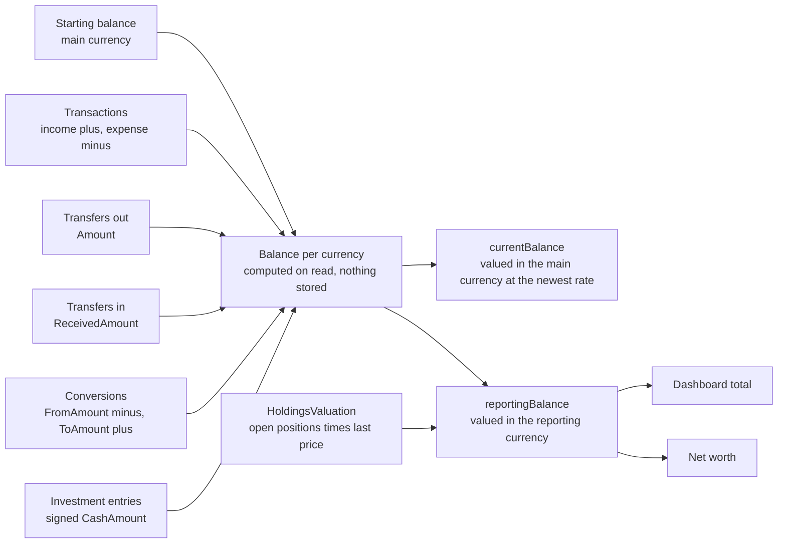
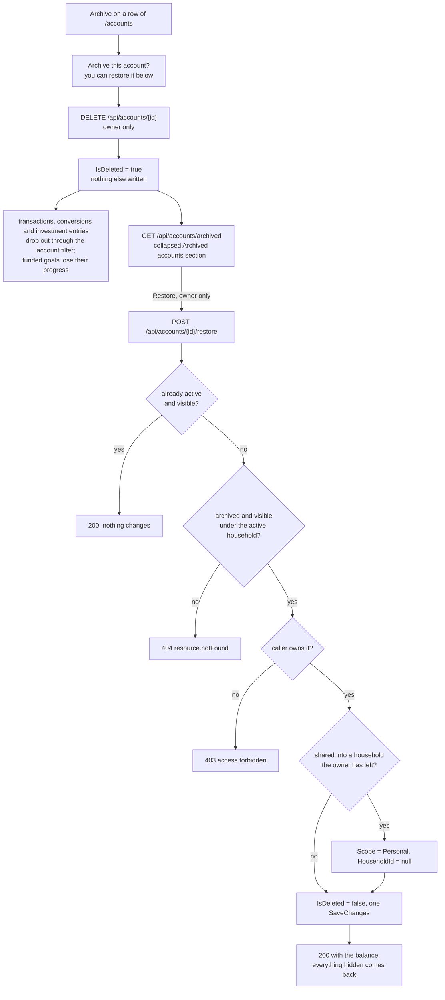

# Accounts

Back to the [feature walkthrough](README.md).

Backend `Accounts`, page `/accounts`. Personal or shared scope, archive instead of delete, only the owner archives, restores or changes sharing.

Every account response carries `version`, and since 2026-10-03 `PUT /api/accounts/{id}` requires the one the form read: when another member saved the account in the meantime the update answers 409 `conflict.stale`, the edit dialog shows the message over the typed values, and saving again uses the refreshed version. See [Concurrent edits](../architecture/api-contract.md#concurrent-edits).

`AccountMovements.SumAsync` is the five boxes feeding `Sum`. Each source projects the account, the currency and the signed amount, the six projections are `Concat`ed, and one `GROUP BY` sums them, so the whole list of accounts costs one `UNION ALL` round trip instead of six grouped queries. Every source keeps its own query filter, because the filter sits inside each branch of the union. `AccountMovementsTests` captures the statement and fails if it splits up again.

`GET /api/accounts` takes an optional `asOf` date (`YYYY-MM-DD`; a value that is not a date answers 400 `request.malformed` on the `asOf` field). With it, every balance in the response (`currentBalance`, `balances`, `reportingBalance`, `holdingsValue`) is as of that date: `AccountMovements.SumAsync` counts only rows dated on or before it, currencies are valued at the newest rate on or before it, and `HoldingsValuation` replays only entries up to it and prices each position at the newest recorded price on or before it. The same accounts are returned, and a starting balance counts whatever the date, because accounts have no opening date. The dashboard total for a past month and the dashboard's balance-by-account card on a past month use this same path, so they agree with each other. Without `asOf` nothing changes: rows dated after today still count, as they always have.

## The accounts table

`AccountsTable` is the page's one list of balances; there is no separate "Balance by account" panel under it. From the `lg` breakpoint a "Share of total" column shows each account's reporting balance as a navy `Meter` and a percent of the positive total. That total is the sum of the positive reporting balances of every active account, taken from the unfiltered list, so filtering the table does not change an account's share. A zero or negative balance leaves the cell blank. When more than one account is listed, a "Total" footer row sums the reporting balances of the listed accounts, filters applied, in the reporting currency on a double rule, in expense red when negative. The dashboard's `accounts` card keeps its own `AccountBalances` share bars, described in [Dashboard](dashboard.md).

While `RecurringBills` is on, the [cash-flow forecast](cash-flow-forecast.md) section sits under the table, before the archived accounts: the balance of each account over the next 30 to 90 days from its recurring entries, with a warning for each account that goes below zero. It reads `GET /api/accounts/forecast`, which starts from the balance as of today and places rows dated after today on their own dates, unlike `currentBalance`. `AccountMovements.SumByDateAsync` serves it: the same union as `SumAsync`, grouped by date as well.

While the `Import` switch is on, each row's actions include "Import bank statement", which opens the [statement import](bank-statement-import.md) dialog with that account already chosen.

Every row's actions include "Reconcile", after "Import bank statement" and before "Convert currency", which opens the [Reconcile dialog](reconciliation.md#the-dialog) for that account: the statement date and the balance printed on the statement, the ledger balance on that date with the difference as it is typed, the rows since the previous reconciliation, and the earlier reconciliations with today's difference. The dialog's account is the `reconcile` search parameter (`/accounts?reconcile=<account id>`), which is how the month-close checklist links to it; closing the dialog drops the parameter. With the row's other actions it always makes three or more, so the row shows the single action menu. `AccountMovements.LedgerBalanceOnAsync` and `ListAsync` serve it, the same five sources as `SumAsync`.

## Credit cards

Since 2026-10-01 an account can be of type `creditCard` (`AccountType.CreditCard`, "Credit card", with a card icon), beside checking, savings, cash, investment and other. Nothing else is stored for it: no credit limit and no statement or due date. Its balance works like every other account's and is normally negative, the money owed: the starting balance is what is owed when the account is added, entered as a negative amount, which the form's hint says once the type is chosen; a purchase is an expense and a payment or a refund brings it back towards zero.

The accounts table and the phone list show a card whose balance is below zero as "Owed €450.20", the amount without its sign and without the expense colour, because owing is a card's normal state; a card paid beyond zero shows its balance like any account. Net worth, the dashboard total and the Total row count the negative balance as before, so the debt lowers them, and the share column leaves the card out as it leaves out every balance at or below zero. Paying the card from a current account is an ordinary [transfer](transfers.md), matched on both imports like any other. The [cash-flow forecast](cash-flow-forecast.md#placing-the-entries) never warns that a card goes below zero, the [statement import](bank-statement-import.md#generic-csv) proposes the "Card statement" amount style for a new mapping when the chosen account is a card, and the member's [journal download](data-export-per-user.md#double-entry-journal) opens it under `Liabilities:CreditCards`. `Type` is stored as an integer, so the new value needed no migration. See the [decisions](../decisions/swedbank-csv-import.md).

## Archiving and restoring

The Archive button on a row soft-deletes the account: `IsDeleted` goes true and nothing else is written. That one flag hides a good deal, because transactions, currency conversions and investment entries are filtered through the account they belong to: they drop out of lists, balances and reports. A transfer stays visible while its other account is. A goal funded from the account keeps its row and answers `progressAmount` null. The broker sync skips the account. Recurring entries belong to their owner rather than to the account, so they stay listed and keep pointing at it. None of those rows is touched, no foreign key is cleared, and nothing forbids a second account of the same name, so there is no uniqueness to re-check.

That makes the restore the exact inverse. `POST /api/accounts/{id}/restore` sets the flag back, and everything the archive hid is visible again with the balance it had. Accounts have no trash entry and no 30-day window: the archived list is the record, and it lasts as long as the account does.

### Who sees an archived account

The list applies the rule the account list applies, written out by hand, because reading a soft-deleted row needs `IgnoreQueryFilters()` and that drops ownership with it. A row is listed when the caller owns it, or when it is shared into a household that still exists and that both the caller and the owner still belong to. The `X-Active-Household` narrowing then keeps personal rows and the rows of the active household only. A household member therefore sees the shared accounts its owner archived, with a note in place of the button: archiving and changing sharing are the owner's, and so is restoring. `canRestore` in the response says which case a row is, so the screen does not compare user ids.

The restore looks the account up through the same rule. That is why a stranger's account answers 404 and a household member's answers 403: the member can see the row and is told why they cannot act on it, and the stranger learns nothing. An account of a household other than the active one answers 404, exactly as `GET /api/accounts/{id}` does.

### The one thing that can change while an account is archived

Its sharing. Removing a member from a household makes the accounts that member shared into it personal, and deleting a household does the same for every account shared into it. That update used to run through the filtered `Accounts` set, so it skipped archived accounts — and, when the household owner had another household active, the active accounts the narrowing hid as well. It now runs over every account row of that household, and leaves `UpdatedAt`, which the archived list reports as `archivedAt`, alone on archived rows. An archived account therefore comes back personal after its household went away, which is what would have happened to it while active, and the remaining members no longer see an archived account of someone who left.

Rows archived before that change can still say they are shared into a household their owner has left. The list hides them from the remaining members, and the restore makes them personal instead of refusing. Refusing would leave the owner with an account that can never come back; restoring the sharing as it was would show it to people it is no longer shared with.

### Idempotent, and nothing refused beyond access

Restoring an account that is already active answers 200 with the account, so a double click or a second browser tab is harmless. Beyond 404 and 403 nothing is refused, on purpose. A currency that was switched off since does not block an account that already exists in it; editing such an account does not refuse either. Every record the archive hid is still consistent with the account, because nothing it points at was changed and the account itself cannot be edited while archived. The trash needs refusals because its deletes race with other deletes and edits; an archived account has nothing that could have drifted from it.

### On the screen

The archived accounts sit in a collapsed `details` section directly under the accounts table, the pattern the investments page uses for closed positions, and the section is absent while there are none. Each row shows the type icon, the name, a shared-with tag when it is shared, the type, the starting balance, the IBAN and the date it was archived. An archived row shows no current balance, because its transactions are filtered out with it and a sum over nothing would read as zero. The confirm dialog on Archive now says the account can be restored from this section instead of "This can't be undone". Restoring shows "Account restored" and refreshes every query, because a restored account can bring rows back on any screen.
