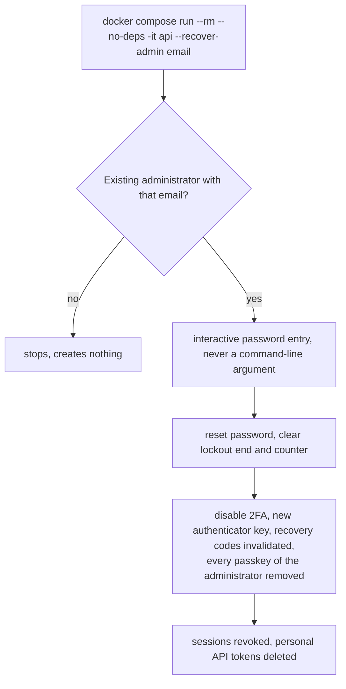

# Administrator recovery command

Back to the [feature walkthrough](README.md). See also [architecture: Containers and the recovery command](../architecture/deployment.md).

The console text says that the password, two-factor authentication and passkeys are reset and that sessions and API tokens are revoked. The steps after the password prompt live in `RecoveryCommand.RecoverAsync`, which the integration tests call directly because the command itself refuses to run without an interactive terminal. See [Passkeys](passkeys.md#resets-and-recovery).
