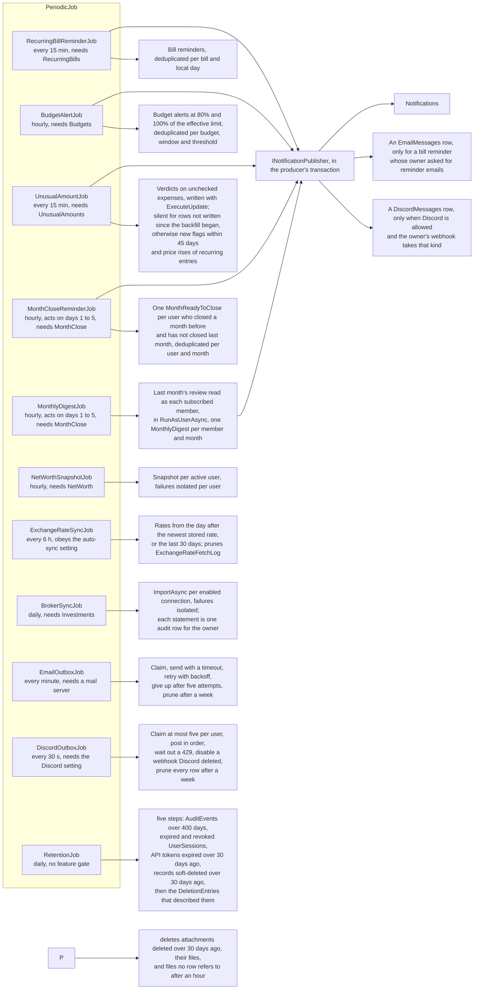
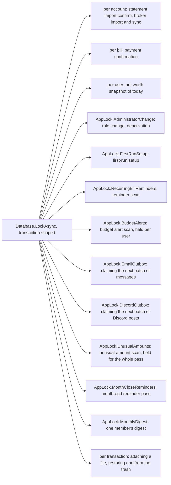

# Background jobs

Back to the [feature walkthrough](README.md). See also [architecture: Background work and notifications](../architecture/background-jobs.md).

All twelve derive from `PeriodicJob`: a `PeriodicTimer` loop, a fresh service scope per pass, an optional feature gate, one pass immediately at startup, failures logged as "{Job} failed.".

| Job | Interval | Feature | Why that interval |
| --- | --- | --- | --- |
| `RecurringBillReminderJob` | 15 minutes | `RecurringBills` | A reminder is dated to a day; a quarter of an hour makes the reminder appear promptly after a bill is created or edited |
| `BudgetAlertJob` | 1 hour | `Budgets` | Spending only moves when a transaction is entered or imported, and an alert is not urgent to the minute. Each pass recomputes the usage of every budget, which for a rollover budget reads up to twelve windows of attributions, so hourly keeps the cost small and matches `NetWorthSnapshotJob` |
| `UnusualAmountJob` | 15 minutes | `UnusualAmounts`; the price-rise half also needs `RecurringBills` | An unusual charge is worth hearing about soon after it is imported, and a pass that finds no unchecked row is one query over a partial index. It takes at most 40 pages of 500 rows, so a backfill of a large ledger is spread over several passes |
| `MonthCloseReminderJob` | 1 hour, acting only on days 1 to 5 of a month | `MonthClose` | The reminder belongs to the first days of a month in the installation time zone. `PeriodicJob` counts its interval from the process start, so a daily interval would land at an arbitrary hour and a restart would move it; hourly passes find the new month within an hour of it starting, a pass on day 6 or later returns before touching the database, and the deduplication per user and month makes the extra passes harmless |
| `MonthlyDigestJob` | 1 hour, acting only on days 1 to 5 of a month | `MonthClose`; only members who ticked the digest for email or Discord | The same reasoning as the reminder: the first pass of a month sends the digest within an hour of the month starting, a server that was off on the 1st catches up until the 5th, and the deduplication per member and month makes later passes harmless. Each member's review is a handful of report queries, run once a month |
| `NetWorthSnapshotJob` | 1 hour | `NetWorth` | One point per day; an hour is enough to have today's point before anyone looks |
| `ExchangeRateSyncJob` | 6 hours | none, obeys the auto-sync setting | The ECB publishes once per working day |
| `BrokerSyncJob` | 24 hours | `Investments` | The Flex Web Service is rate limited and the statement changes once a day |
| `RetentionJob` | 24 hours | none | Every window it enforces is measured in days — 400 for the audit log, 30 for the trash — so a day's delay is irrelevant. It runs whatever any feature switch says, because rows written while a feature was on still have to age out |
| `EmailOutboxJob` | 1 minute (`App:Email:OutboxIntervalSeconds`) | none, sends nothing while the mail server is off or incomplete | A password reset link is useless if it arrives in an hour. A minute is the shortest interval that still leaves a dead mail server cheap: a pass that finds nothing due is one indexed query. It prunes before it looks at the mail server, so rows sent while SMTP was configured still age out after it is switched off |
| `DiscordOutboxJob` | 30 seconds | none, sends nothing while `DiscordEnabled` is off | A notification in a chat channel is expected to arrive about when it happened, and an idle pass is one indexed query. Discord rate-limits each webhook, so a pass takes at most five rows per user and the short interval drains a backlog without bursting. It deletes every row older than 7 days before it looks at the setting, sent or not, so posts queued before the switch went off are dropped rather than sent late |

`BudgetAlertJob` iterates active users in id order and opens a per-user `AppDbContext`, the way `BrokerSyncJob` does, because `BudgetUsageCalculator` and `ICategoryAttributionService` read through the ownership query filter. Each user is handled in its own try block, so one user whose budgets cannot be computed is logged with the user id and everybody else still gets their alerts.

Every job runs outside a request and therefore outside the active-household scope described in [Households and sharing](households-and-sharing.md). The per-user `ICurrentUser` records these jobs pass to their context carry no active household, so a job always sees the user's whole union of households, whatever any browser happens to have selected.

## Retention

`RetentionJob` is the one job that deletes rows because they are old. Its steps live in `Infrastructure/BackgroundJobs/Retention.cs` as plain static methods over `AppDbContext`, so they can be read and unit-tested one at a time, and the job itself only sequences them and logs a count per step. All of them take the instant from `IClock`, never from `DateTimeOffset.UtcNow`, so a test can freeze time.

| Step | What it deletes | Window |
| --- | --- | --- |
| Audit log | `AuditEvents` by `OccurredAt`, in one `ExecuteDelete` over the `OccurredAt` index | `AuditEvent.RetentionDays`, 400 days |
| Read notifications | `Notifications` that are read and older than the window, for every user; unread ones stay. The reminder and month jobs only deduplicate within their own short windows; the unusual-amount job could flag a row again only if that row is re-checked more than 180 days after it was flagged and read | `Notification.ReadRetentionDays`, 180 days |
| Sessions | `UserSessions` that have expired, and ones whose `SecurityStamp` no longer matches their user's, which is what "revoked" means for a session | none; the row is already dead |
| API tokens | `PersonalApiTokens` by `ExpiresAt`, in one `ExecuteDelete`; an expired token stays listed, marked Expired, until then | `PersonalApiToken.KeptAfterExpiry`, 30 days after expiry |
| Deleted records | the rows of the thirteen trash kinds listed in `Retention.PurgedKinds`, whose `IsDeleted` is true and whose `UpdatedAt` is before the window | `DeletionEntry.RetentionDays`, 30 days |
| Trash entries | `DeletionEntries` by `DeletedAt`, and their `DeletionChanges` through the cascading foreign key | the same 30 days |
| Attachments and receipt readings | Formerly `AttachmentPurgeJob`, now steps of this job after the record purge. It hard-deletes the row and then the file of every attachment deleted, or whose transaction was deleted, more than 30 days ago, and removes files, `.tmp` files and restore staging folders that no row refers to once they are an hour old, so an upload or a restore still in progress is never swept. Its last step deletes receipt readings older than 24 hours that failed or whose file hash no attachment row carries any more, see [Receipt reading](receipt-reading.md#retention). It is the only job that removes something a person put into the ledger, see [Attachments](attachments.md) | `DeletionEntry.RetentionDays`, 30 days; readings after `ReceiptReading.UnattachedLifetime` |

The session step existed nowhere before: `SessionService.SignInAsync` clears a user's dead sessions, but only that user's and only when they sign in again, so the rows of somebody who stopped signing in stayed forever.

Both trash steps take their cutoff from `DeletionEntry.WindowStart`, the same helper `TrashService` uses to decide what it lists and what it refuses with `restore.expired`. That is the whole reason the job can never delete something the trash still offers to restore, and `RetentionTests` asserts the two agree, including at the exact instant of the boundary.

Every step pages: it reads at most `Retention.BatchSize` (500) ids, deletes that batch with `ExecuteDeleteAsync` and stops when a batch comes back short, so one pass never holds a lock over an unbounded number of rows. Every read adds `IgnoreQueryFilters`, because the job runs without a current user and the ownership filters would otherwise answer nothing.

The order of the record purge is the foreign keys' order, not an arbitrary one. Conversions go first, because a conversion keeps pointing at its fee transaction with a restricting foreign key even after both are deleted; a transaction is then only taken when no surviving conversion still points at it, which is what keeps a live conversion's separately deleted fee. Transfers take their `TransferImports` with them, since a receipt restricts its transfer. A transaction takes its attachment rows and their files first, exactly the way the attachment step does, then the row, and `TransactionLines` and `TransactionTags` follow through their cascading foreign keys. The rest — budgets, goals, assets, debts, recurring entries, investment entries, categorization rules and CSV import mappings — have nothing pointing at them and go in any order. Split expenses and settle-up payments go last: a split takes its `SharedExpenseShares` through their cascading foreign key, a purged transaction has already taken the split on it the same way, and a purged transfer only clears a payment's `TransferId`, which is `SetNull`.

Four kinds are deliberately not purged, listed as `Retention.KeptKinds` so that a new trash kind has to be put in one list or the other and a test fails until it is. Attachments belong to the attachment step, which owns the files on disk. Categories, tags and households are referenced by restricting foreign keys from rows the purge does not touch — a category by transactions, lines, budgets, recurring entries and rules, a tag by transaction and rule links, a household by accounts, categories, tags and memberships — so hard-deleting one would either fail or need a second pass of rewrites, and the row it would free is a hundred bytes.

## Advisory locks

`EmailOutboxJob` holds `AppLock.EmailOutbox` only while it claims a batch: the rows it takes have their attempt counted and their next attempt time pushed forward in the same transaction, which commits before any connection is opened. A pass that dies mid-send therefore loses one attempt, never a message, and a second pass cannot pick up what the first is still sending. Sending itself happens outside the lock and outside any transaction, one message per try block, so a bad recipient does not stop the batch and a slow mail server does not hold a database lock.

`DiscordOutboxJob` works the same way under `AppLock.DiscordOutbox` (`738192440`): up to 50 due rows by `CreatedAt`, at most five per user picked in SQL so one user's backlog cannot hold the others back, the attempt counted and the next attempt set `min(4^attempts, 240)` minutes ahead, committed before any socket opens. It then posts each user's rows in order and saves after each user, even when the host is stopping, so a post that went out is never sent again because a later save failed. A 429 hands the attempt back to that row and to the rest of the user's batch and moves them to Discord's `retry_after`; a webhook Discord no longer knows gives up every pending row of that user and marks the webhook. See [Discord notifications](discord-notifications.md).

`RecurringBillReminderJob` and `BudgetAlertJob` no longer add notifications or emails themselves. Each preloads the owners it is about to notify and calls `INotificationPublisher.Publish`, which adds the in-app row and the Discord post to the job's own context; the bill job enqueues its reminder email itself on the same context, so the lock and the transaction described below cover all three. The budget job resolves its publisher from the user scope it works in, so the publisher writes on the job's own context.

`UnusualAmountJob` takes `AppLock.UnusualAmounts` (`738192441`) once, in one transaction for the whole pass, like the reminder scan. Inside it the job pages the unchecked expenses, writes each verdict with `ExecuteUpdate`, reads which rows and price rises were already notified and publishes the rest, so a second instance or a restart waits for the first pass and then finds nothing left to check. It evaluates each account owner's rows through `IUnusualAmountService` resolved from a user scope for that owner (`PeriodicJob.UserScope`), because the category history is what that owner can see, but writes and publishes on the job's own context, inside the lock. The backfill stores verdicts without notifying anybody: a pass where no transaction was ever checked is silent, and later passes notify only rows written after the earliest check. See [Unusual amounts](unusual-amounts.md).

`MonthCloseReminderJob` takes `AppLock.MonthCloseReminders` (`738192442`) in one transaction for a pass on days 1 to 5. Inside it one query finds the active users who have a close of any month, have none of the previous month under any scope, and have no `MonthReadyToClose` notification whose `Message` is that month (`yyyy-MM`), deleted ones included; the job preloads them, publishes one notification each and commits. A second instance waits for the lock and then finds every user already reminded. See [Month-end close](month-end-close.md).

`MonthlyDigestJob` takes `AppLock.MonthlyDigest` (`738192443`) inside each member's own transaction, the way the budget scan holds its lock per user, because each member's work runs in its own `RunAsUserAsync` scope. Inside the lock it checks again that the member has no `MonthlyDigest` notification for the month, reads the review, publishes and commits, so a second instance waits and then skips the member. See [Monthly digest](monthly-digest.md).

The bill reminder scan takes its lock once for the whole pass because it reads every user's bills in one query. The budget alert scan takes `AppLock.BudgetAlerts` inside each user's own transaction instead, since the work is already split per user; the read of what has already been raised and the insert of what has not are both inside that lock, which is what makes a second pass, a restart or a second instance unable to write the same alert twice.
