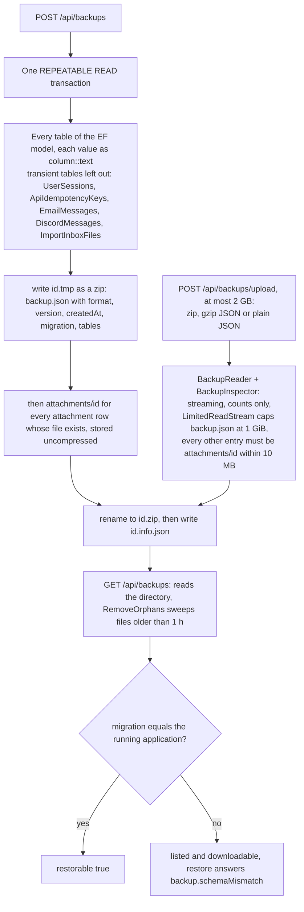
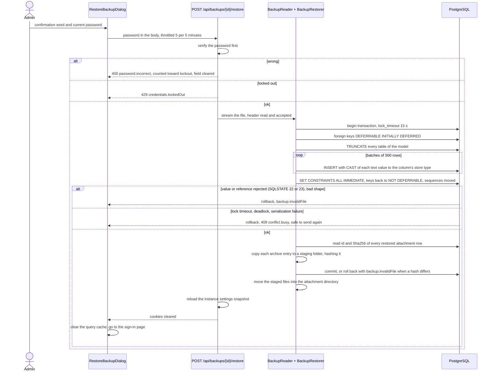

# Backup and restore

Back to the [feature walkthrough](README.md). See also [decisions](../decisions/backup-and-restore.md), [architecture: Backup and restore](../architecture/backup-and-restore.md).

Backend `Backups` (`BackupService`, `BackupArchive`, `BackupStore`, `BackupReader`, `BackupInspector`, `BackupRestorer`, `BackupDatabase`), Backups section of `/settings`. Administrators only; nothing is scheduled or copied offsite. A member takes their own records without an administrator through the [data export per user](data-export-per-user.md), which writes the same table format under another `format` value.

Since [attachments](attachments.md) a backup is a zip archive: `backup.json`, the same JSON document as before, deflated, and one uncompressed entry `attachments/<id>` per attached file. A restore writes the files back after checking each one's SHA-256 against its restored row. Backups taken before are gzip-compressed JSON and are still listed, downloaded and uploaded as they are. The archive is about as large as the attachment directory plus the compressed data, so an upload may now be 2 GB, and the decompressed-size guard applies to `backup.json` alone.

Five tables are transient and never exported: `UserSessions`, `ApiIdempotencyKeys` (since 2026-10-01), `EmailMessages`, `DiscordMessages` and `ImportInboxFiles` (since 2026-10-01), the `transient` list in `BackupDatabase.ReadShapes`. A session belongs to one browser on one installation, a retry key of a [personal API token](personal-api-tokens.md#retries-and-idempotency-key) matters for a day at most, and a queued email or Discord post is work in flight rather than a fact about the household: a backup taken mid-send must not resend a month-old reminder when it is restored somewhere else. A restore still truncates them like every other table, so no outbox survives one. Secrets that describe outside systems do travel, encrypted with the key ring of the installation that wrote them — the broker's Flex token, the SMTP password in `InstanceSettings` and each member's Discord webhook URL in `DiscordWebhooks`. Under another key ring they cannot be decrypted, and each asks to be typed again: `broker.tokenRequired`, `email.passwordUnreadable` and `discord.webhookUnreadable`. The receipt readings, the remembered item categories and the monthly read counts are ordinary tables and travel too, as do the household settle-up tables `SharedExpenses`, `SharedExpenseShares` and `Settlements` since 2026-09-29, and so do `PersonalApiTokens`: a [personal API token](personal-api-tokens.md) is a durable credential its member chose to create, so it keeps working after a restore, and the file holds only its prefix and the hash of its secret.

[Passkeys](passkeys.md) travel the same way: `AspNetUserPasskeys` is an ordinary table beside the password hashes and two-factor secrets, and a restored passkey works only under the same relying party id, that is the same `SITE_ADDRESS`. `BackupEndpointTests` removes a passkey after the backup and signs in with it after the restore.

`AssetValuations` needs no code of its own either: like every table of the model it is included automatically, and the depreciation terms are ordinary columns of `Assets`. `BackupEndpointTests` checks that a restore brings back an asset's valuations and depreciation.

`MonthCloses` is an ordinary table and travels with no code of its own: its `Snapshot` is a `jsonb` value, and `column::text` carries it exactly. A restored installation keeps every close with its note, snapshot and `ClosedAt`, and because the transactions keep their `UpdatedAt`, drift reads the same after a restore as before it. `BackupEndpointTests` restores a backup and checks that a close and an account's [reconciliation](reconciliation.md) survive beside the Discord webhook while the queued Discord posts are dropped; `AccountReconciliations` is another ordinary table. See [Month-end close](month-end-close.md).

## Taking and uploading

## Restore

