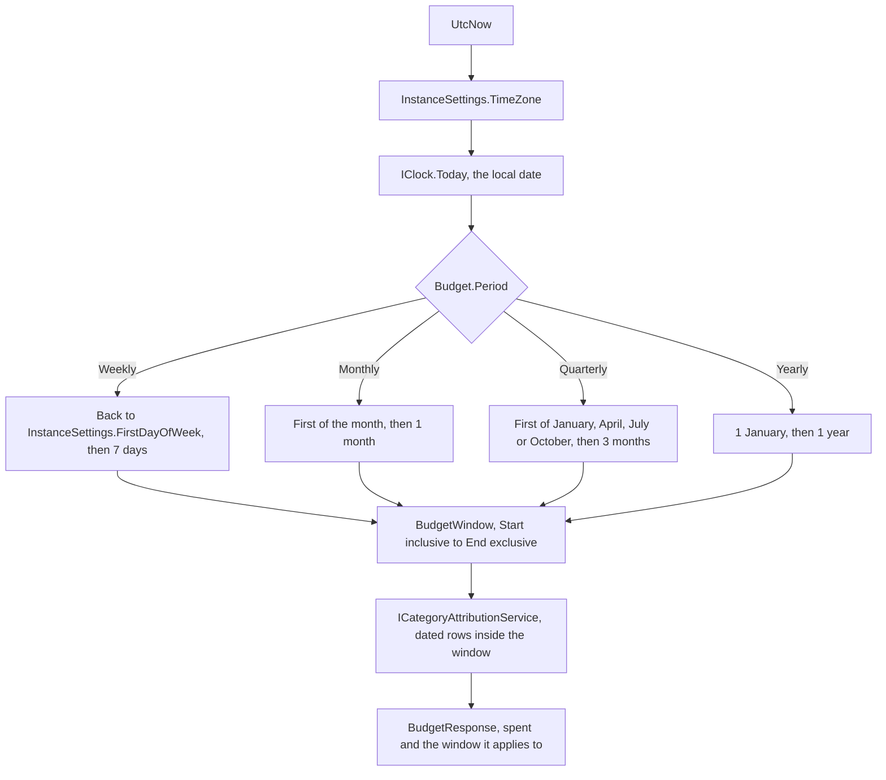
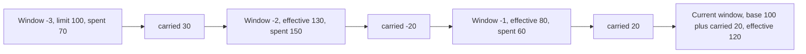
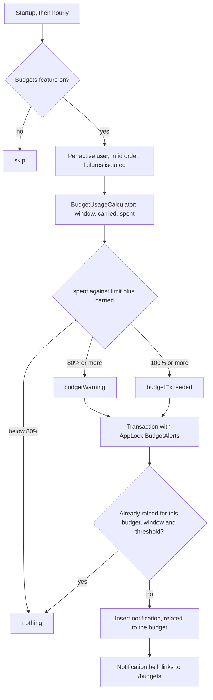

# Budgets

Back to the [feature walkthrough](README.md). See also [decisions](../decisions/budgets.md).

Backend `Budgets`, page `/budgets`. A limit per expense category, or since 2026-09-30 per tag, in the reporting currency, personal only. A budget carries a period — weekly, monthly, quarterly or yearly — and is always read against the one window of that period that holds today.

Each row (`budget-row`) leads with what is left, such as "€84.00 left", or with "€24.00 over" in the expense colour, and puts "€316.00 spent of €400.00" beneath it, followed by the rollover line when rollover is on. The figure is `BudgetRemaining`, the same component and text the dashboard budget snapshot shows beside its meter, and `budgetFigures` is the one place that decides a budget is over. The dashboard snapshot still leads with spending. Editing a budget opens "Edit budget" with the category name under the title, in `BudgetForm`, the form that also adds one.

A budget can be shared with a household like a category; a shared budget counts only the transactions on the household's shared accounts. See [Households and sharing](households-and-sharing.md#shared-budgets-goals-and-recurring-entries).

Every budget response carries `version`, and since 2026-10-03 `PUT /api/budgets/{id}` requires the one the form read: when another member saved the budget in the meantime, or a reporting-currency change converted its limit, the update answers 409 `conflict.stale`, the edit dialog shows the message over the typed values, and saving again uses the refreshed version. See [Concurrent edits](../architecture/api-contract.md#concurrent-edits).

## The window

A budget has no start or end date of its own. The window is derived from the period and from today in the installation time zone, so a budget created in March and a budget created yesterday answer the same question in September. `IClock.Today` converts the current instant into the installation time zone, and `BudgetWindow.For` turns that date into a half-open range: `Start` is inclusive, `End` is exclusive, and the response publishes the inclusive last day as `windowEnd`, like every other period in the API.

Only the weekly window depends on `InstanceSettings.FirstDayOfWeek`: with Monday it runs Monday to Sunday, with Sunday it runs Sunday to Saturday. The other three follow the calendar. Changing the time zone or the first day of the week moves every window at once, which is why an update to the settings refreshes every query in the client.

## One budget per category and period

The uniqueness rule is one budget per category and period. Two budgets of the same period on the same category would always cover exactly the same window, so they are rejected with `conflict.duplicate` and 409. Different periods on one category are allowed and useful: a weekly limit on groceries to pace the week, and a yearly limit on the same category to cap the year. Their windows overlap by design, and each counts the same spending inside its own window.

The check runs in `BudgetService` against the budgets the caller can see, not as a unique index, because duplicates were reachable before this rule existed and a unique index would fail the migration on an installation that already has one.

## Budgets on a tag

Since 2026-09-30 a budget follows either a category or a tag, never both: `Budget.CategoryId` became nullable, `Budget.TagId` was added, and the check constraint `CK_Budgets_CategoryOrTag` holds exactly one of them. The create and update bodies take `categoryId` or `tagId`; neither or both answers `required` on `categoryId`, a tag must be visible to the caller like one of a transaction, and the rule of one budget per target and period applies to tags as it does to categories. The response carries `categoryId`, `tagId` and `name`, the category's or the tag's, in place of the former `categoryName`.

A tag says what money was for, such as "Vacation 2026", so a tag budget counts every expense that carries the tag, in full and whatever its category, dated in the window: `BudgetUsageCalculator` joins `TransactionTags` to the visible expenses of the span and sums their `ReportingAmount`, one query for all tag budgets. A split expense counts once with its whole amount, because a tag sits on the transaction and never on a split line, and a refund carrying the tag lowers the spend as it lowers a category's. Rollover, alerts at 80% and 100%, the dashboard card and the monthly budgets of the month-end review work unchanged; the alert's title is the tag's name. Limits from history and the suggested budgets stay category-only, so the form shows "Every expense with this tag counts in full…" instead of the history hint and does not prefill a tag budget.

The budget form starts with "Limit on" Category or Tag, a segmented choice shown only when the member has tags, and then the matching picker. A tag budget's row links to the ledger filtered by the tag, `type=expense` and the window. Deleting a tag retires its budgets and records them beside the tag's trash entry, the way a category's delete does, and restoring the tag brings back each budget whose slot is still free; restoring a budget from the trash is refused while its tag is deleted.

## Spending in the window

Since 2026-09-30 a budget on a category that has [sub-categories](categories.md#groups) also counts theirs: the calculator maps each attribution to its category and to that category's parent.

Spend comes from `ICategoryAttributionService`, the single projection that budgets, the dashboard breakdown and the reports share: an unsplit expense contributes its own category and reporting amount, a split expense contributes each line's category and its share. Each attribution now carries the transaction's date, so one query over the whole span the budgets need can be bucketed per window instead of asking the database once per window. Investment income, taxes and fees are never attributed to a category and therefore never reach a budget.

A transaction [spread over months](transactions.md#spreading-over-months) counts one slice in each window its slices fall in, for category and tag budgets alike, personal or shared with a household, and in limits from history, so yearly insurance adds a twelfth to each monthly window and a rollover budget carries what each slice left; a budget's link to the ledger lists the spread row under every window it counts in.

A [refund](transactions.md#refunds) counts in the window it is dated in and lowers `spent` there, so a rollover budget carries the difference to the next window. A refund never raises an alert, and an alert already raised stays. Limits from history read the same attributions, so each window's spending is net of refunds too.

Since 2026-10-02, with [My share](household-settle-up.md#my-share) chosen in Settings › Personal › Appearance, the budgets page and the dashboard ask `GET /api/budgets?share=mine`, which counts a split expense in a personal budget, category or tag, at the member's own part, and a household split another member paid at the member's share. A household budget keeps the household's figure, the same for every member, and alerts and limits from history always count in full.

## Rollover

Rollover is a switch on the budget. When it is off, the effective limit is the base limit and nothing older than the current window is read. When it is on, the remainder of the previous window is added to the current limit, and an overspend is subtracted. The remainder of that previous window includes what it carried in turn, so the carry is a walk backwards over whole windows.

The walk is bounded twice: it never goes back more than twelve windows, and it never goes back past the window in which the budget was created. A budget created inside the current window therefore carries nothing, and a budget older than twelve windows starts its walk exactly twelve windows back with a carry of zero. Nothing is stored per window; the carry is recomputed on every read from the same attribution rows as the spend.

The response separates the three numbers so the client can explain the total rather than show a limit the user never typed:

| Field | Meaning |
| --- | --- |
| `limitAmount` | The base limit as it was typed |
| `carriedAmount` | What the walk brought forward; negative after an overspend |
| `effectiveLimit` | `limitAmount` plus `carriedAmount`, the number the progress bar fills |
| `spent` | Attributed expense inside `windowStart` to `windowEnd` |
| `remaining` | `effectiveLimit` minus `spent`, negative when the window is overspent |

## Usage as of a date

"Today" is a parameter, not something the calculator reads. `IBudgetUsageCalculator.CalculateAsync(budgets, asOf, ct)` walks the windows from the one that holds `asOf`; the budgets endpoints and `BudgetAlertJob` pass `IClock.Today`, so nothing about the page or the alerts changed. `GET /api/budgets` takes an optional `asOf` date (`YYYY-MM-DD`; a value that is not a date answers 400 `request.malformed` on the `asOf` field): every budget of every period is then shown in the window that holds that date, with its spend and carry walked from there, against today's limits for the same reason as below. The [dashboard](dashboard.md#month) passes the shown month's last day on a past month. A weekly, quarterly or yearly window can reach past that day, and spend inside the window counts even when it is dated later, because the window is the unit a budget measures. [Month-end close](month-end-close.md) passes another date as well: `IBudgetService.GetMonthlyAsync(asOf)` answers the monthly budgets only, measured in the window that holds the closed month's last day, with the carry walked back from there. The spend and the carry are what the page would have shown on that day, given the rows as they are now; the limits are today's, because a budget keeps no history of its limit, rollover switch or period, and the month-end page says so. Weekly, quarterly and yearly budgets are left out there, because their windows straddle the month and cannot be split honestly. `MonthCloseTests` checks a rollover budget measured as of the end of a past March.

## Alerts at 80% and 100%

`BudgetAlertJob` turns the same numbers into in-app notifications. Every hour it walks the active users, calls `BudgetUsageCalculator` for that user's budgets and compares the spend against the effective limit — the base limit plus the carry, not the typed limit — so a budget that carried a remainder forward alerts later than its base limit would suggest, and one that carried an overspend alerts sooner.

One row per budget, per window, per threshold. Spending that drops back under a threshold inside the same window and rises again does not alert a second time, because the threshold was already crossed in that window; the next window starts fresh. When a carry has wiped the effective limit out — zero or negative — any spending at all counts as the limit reached. The rest of the rule, and why the rows survive the feature being switched off, is in [Notifications](notifications.md).

## Limits from history

`GET /api/budgets/suggestions?period=` answers, for every visible expense category that had spending lately, what it cost in each of the last six complete windows of that period. `BudgetSuggestionService` builds the windows with `BudgetWindow.For(IClock.Today, period, FirstDayOfWeek).Shift(-6)` to `Shift(-1)`, so the window that holds today is never one of them: it is partial and would pull the figure down. It then reads the caller's earliest visible transaction with one `MinAsync` and drops every window whose last day is before it, because a window from before the ledger started is a zero that means "not recorded yet", not "spent nothing". One `ICategoryAttributionService` call covers the remaining span and is bucketed per window and category in memory, the same way `BudgetUsageCalculator` does it, so a split line counts with its share and the figures are the ones the budget would have shown in those windows. Visibility is the ordinary one: spending on an account shared into the active household counts, another member's personal account does not. Categories with no spending in the span are left out.

The rule lives in `Budgets/Shared/BudgetHistory.cs`, with the median and the spread from `Common/Statistics.cs`, which [unusual amounts](unusual-amounts.md) share:

| Constant | Value | Meaning |
| --- | --- | --- |
| `Windows` | 6 | How many complete windows back are measured |
| `MinimumWindows` | 3 | Fewer remaining windows give no median and no suggested limit |
| `SteadyMinimumMedian` | 20 | A steady category costs at least 20 reporting units in the median window |
| `SteadyMaxSpreadRatio` | 0.25 | Its spread, the median absolute deviation times 1.4826, is at most a quarter of the median |

The median is taken over the windows, empty ones included, so one holiday month cannot move it. The suggested limit is the median rounded up to a whole unit of the reporting currency (312.01 gives 313, 312.00 stays 312), and null when the median is zero. A category is steady when all six windows had spending, the median reaches the floor and the spread stays under the ratio; a ledger younger than six windows has no steady categories yet. `hasBudget` says whether the caller already has a budget of that period on the category.

In the add form, choosing a category and a period fills the limit with the suggested limit. The monthly answer is warmed by the `/budgets` loader and read with the suspense hook, so the first category's limit is in the form's default values; changing the category or the period reads that period's answer and refills the field until somebody types in it, so a typed limit always wins. The refill is a listener on the limit field that watches the category and the period and reads the field's own dirty flag; the refill itself does not mark the field dirty. The hint under the field says "Median of the last 6 months: €311.20" and lists the amounts oldest first, or "Not enough history yet". The edit form shows the same hint for the budget's category and period and never changes a stored limit.

The page ends with "Steady spending without a budget": the monthly categories that are steady and have no monthly budget, largest median first and at most five, each with "about €83.00 a month" and a button "Create €83.00 monthly budget". The button posts the suggested limit to `POST /api/budgets` as a monthly budget without rollover; the budget mutations refresh `/api/budgets/suggestions` because it sits under `/api/budgets`, so the new budget appears above and the row leaves the section. The category name links to the ledger filtered to the category and the six windows. The section is its own `QueryBoundary` and renders nothing when there is no candidate. There is no dismissal: a category leaves the list when it gets a monthly budget or stops being steady.

## On screen

The budgets page opens with a summary (`SummaryStats`) that never adds a weekly window to a yearly one and never nets one budget's overspend against another's remainder. `budgetOverview` in `lib/budgets.ts` computes it in the browser from `GET /api/budgets`, which needs no change because every budget it answers is already in the window that holds today:

- When any budget is over, the lead figure is the overspend of those budgets alone, in the expense colour, labelled "1 of 5 budgets over", with their names under it.
- Each period that has a budget gets "Left this week", "Left this month", "Left this quarter" or "Left this year": the sum of what is left in that period's budgets that are not over, with "€234.11 spent of €210.00" for all of them under it.
- When nothing is over, "Left this month" leads, or the first period in the order weekly, monthly, quarterly, yearly when there is no monthly budget.

The dashboard card uses the same `budgetOverview`: when a budget is over, one expense-coloured line above the rows says "1 of 5 budgets is over, by €54.11", and each row names its period after the budget's name, so a weekly and a yearly limit side by side read as what they are.

Below the summary the page lists every budget with its period and window, the meter against the effective limit, and, when rollover is on, the base plus carried breakdown underneath. The category name links to the transactions list filtered to that category and that window, not to the calendar month. The dashboard snapshot reads the effective limit for the same reason. The form has the period select and the rollover switch next to the category and the limit, and the limit carries the history hint described in [limits from history](#limits-from-history).
