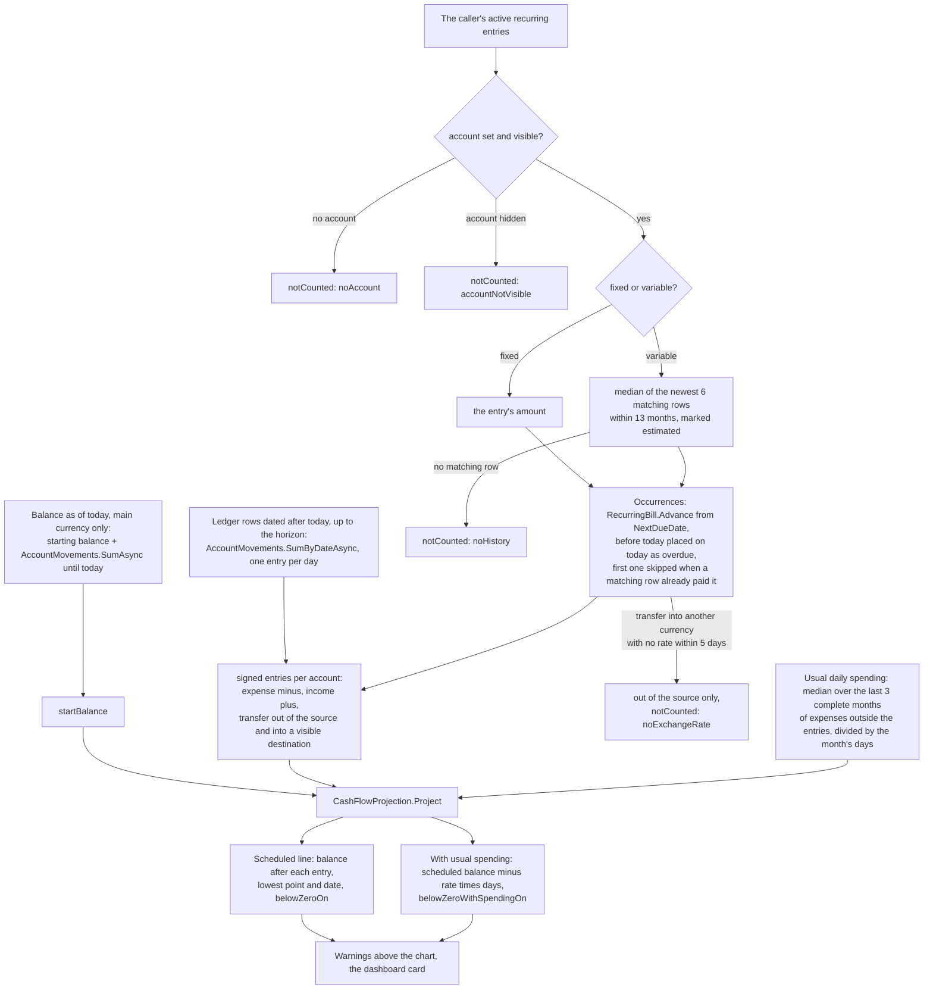

# Cash-flow forecast

Back to the [feature walkthrough](README.md). See also [decisions](../decisions/cash-flow-forecast.md), [Recurring entries](recurring-bills.md) and [Accounts](accounts.md).

Backend `Accounts` (`GetCashFlowForecast`, `Services/CashFlowForecastService.cs`, the pure `Shared/CashFlowProjection.cs`), frontend `accounts/cash-flow-forecast` and `dashboard/cash-flow-card`. One read-only route, `GET /api/accounts/forecast?days=`, behind the `RecurringBills` switch through `RequiresFeature` metadata on the endpoint, although the rest of `/api/accounts` is ungated. Nothing is stored: the forecast is computed on every read.

The forecast answers one question: will one of my accounts go below zero before the money I expect arrives? It projects every visible account from today's balance to the end of a 30, 60 or 90 day horizon, one step per scheduled occurrence of the caller's recurring entries, and draws a second, dashed line that also takes the account's usual everyday spending off day by day.

## Where it shows

- **Accounts page.** A "Next 90 days" section sits under the accounts table, before the archived accounts, while `RecurringBills` is on. The route loader warms `GET /api/accounts/forecast?days=90`.
- **Recurring entries page.** The same section replaces the six-month bar chart of fixed expenses that the page had until 2026-09-29, with one extra line: "Scheduled in the next 90 days: €1,240.00 out, €3,100.00 in". Out is the recurring expenses and in the recurring income of every listed account, per currency; transfers move money between the caller's own accounts and are left out of both. The section shows once there is at least one entry, as the chart did.
- **Dashboard.** The `cashFlow` card, "Cash flow", lists each account the forecast lists: its name, today's balance, "Lowest -€361.19 on Oct 1" and, in the expense colour, "Below zero on Oct 1" or "May go below zero around Oct 1". It always asks for 90 days. Like upcoming bills it looks forward, so on an earlier month it says "The cash-flow forecast is shown on the current month." and asks for nothing. It links to the accounts page.

- **Notifications.** Since 2026-09-30 `LowBalanceJob` reads the next 30 days every six hours and raises a `lowBalance` notification for each account that the forecast takes below zero, once per account and date, in the bell and, when the member ticked it, by email or Discord. See [Notifications](notifications.md#low-balance-alerts).

## The section

The title is "Next 30 days", "Next 60 days" or "Next 90 days", with a period select beside it. The period is component state, not a search parameter: changing it keeps the shown forecast, dimmed, until the new one arrives (`useDeferredValue` and `StaleRegion`). A muted line says the forecast is built from today's balance, the rows already dated ahead and the caller's recurring entries.

Then, in order:

1. **Warnings.** One sentence per account at risk, in expense red: "Everyday goes below zero on Nov 14, after Rent (−€120.00)." names the first entry of that day that left the balance below zero, "rows already in the ledger" when that entry is a ledger day, and "Everyday is below zero today." when the balance already starts below zero. "With usual spending, Everyday may go below zero around Nov 2." follows only when that date comes before the scheduled one, since the dashed line can never cross later than the solid one. With no account at risk a muted line says "No account goes below zero in the next 90 days."
2. **Account select**, when more than one account is listed. It starts on the first account, and the server lists the accounts at risk first.
3. **The chart.** `TimeSeriesLineChart` with `curve="stepAfter"`, the account's currency on the axis and an ink zero line (`zeroLine`, added for this chart). "Scheduled" is the 2px navy line; "With usual spending" is the dashed navy comparison line, drawn only when the account has usual spending, and only then is there a legend. `forecast-series.ts` turns the entries into one point per day from `from` to `to`: the balance after the last entry on or before that day, and that balance minus the daily rate times the days since today. The chart is loaded lazily through `lazyChart` from the folder's `index.ts`, like every other Recharts chart.
4. **Other currencies.** An account that holds currencies besides its main one gets a muted note that only its main-currency balance is projected.
5. **Entries table.** Date, entry, amount and balance after. An estimated amount is prefixed with "≈" (read as "Estimated"), an overdue occurrence carries an "Overdue" tag, a ledger day reads "Already in the ledger", income is green and a balance below zero is red.
6. **Not counted (n).** A closed disclosure naming each entry that could not be placed and why: "No account", "Variable amount with no history yet" or "Its account is not shown".

When nothing falls in the horizon the section says "Nothing is scheduled in the next 90 days." and still lists what was not counted.

## How it is computed

### Starting point

The balance as of today in the account's main currency: the starting balance plus `AccountMovements.SumAsync` with `until` today. It is not the accounts page's `currentBalance`, which counts rows dated after today. Rows dated after today up to the horizon come from `AccountMovements.SumByDateAsync`, which groups the same six-source union by account, currency and date, and each day becomes one ledger entry. That matters for an occurrence confirmed early: confirming posts a row dated on the due date and advances `NextDueDate`, so the row appears once on its own date and the schedule moves on to the next occurrence.

Only the main currency is projected. A bill leaves the EUR side of an account, and dollars held on it do not stop that side going negative; the camt.053 closing-balance check follows the same rule. `otherCurrencies` is true when the account holds another currency today.

### Placing the entries

Only the caller's own active entries count: recurring entries are personal and cannot be shared yet, so a shared account is projected with the caller's entries only, even when a household partner has entries of their own on it.

- **Fixed** amounts are the entry's amount, in the account's currency, as confirmation would post it.
- **Variable** amounts are the median of the newest six matching rows within 13 months, rounded to cents and marked estimated. A row matches when it is on the entry's account, in the account's currency, of the same flow (a transaction of the same type, or a transfer to the same destination), and its normalized description equals the entry's key: the normalized match key when there is one, or the normalized name. The name always matches as well, so an occurrence confirmed from an entry that also has a match key still counts. Income and expense rows come through `PriceRiseMatcher.LoadChargesAsync`, which now takes the flow type; transfers from the caller's accounts in the last 13 months come in one query over `db.Transfers`, normalized the same way.
- **Occurrences** walk `RecurringBill.Advance` from `NextDueDate` to the end of the horizon, the end included, at most 64 per entry. An occurrence before today is placed on today and marked overdue: until it is confirmed or matched the payment is still expected. Every overdue occurrence is placed, not only the first.
- **Paid but not confirmed.** The first occurrence is skipped when a matching row is dated from 5 days before `NextDueDate` (2 for a weekly entry) up to today. Imported payments are often never confirmed, and the forecast must not charge them twice; the month-close checklist chases the confirmation.
- **Transfers** leave the source account. They arrive in the destination when the caller can see it, converted at the newest exchange rate when the two currencies differ, and the converted side is then marked estimated.

Entries of one day are applied income first, and a day counts as below zero when it ends below zero.

### Usual spending

Per account, the median over the last three complete calendar months of that month's expenses in the account's currency, divided by the days in that month, rounded to cents. Rows whose stored `PayeeKey` equals the key or name of one of the caller's active expense entries on that account are left out, because the schedule already counts them; the grouping runs in SQL by account, currency, month and `PayeeKey`. An account whose first transaction is later than the first day of those three months has no usual spending and no dashed line. The median ignores one large purchase, and a separate line keeps the scheduled one exact.

A [refund](transactions.md#refunds) on the account lowers its month's expenses, so usual spending is net of refunds. The rows matched to a recurring entry, which place a variable entry's estimate, are read by `PriceRiseMatcher.LoadChargesAsync` and never include a refund.

### The response

`CashFlowForecastResponse` carries `from` (today), `to` (today plus `days`), `accounts` and `notCounted`. Each `AccountForecastResponse` has `accountId`, `accountName`, `currency`, `startBalance`, `usualDailySpending` (null without enough history), `lowestBalance` and `lowestOn` (the scheduled line, today's balance included), `belowZeroOn`, `belowZeroWithSpendingOn`, `otherCurrencies` and `entries`, each with `date`, `source` (`recurring` or `ledger`), `billId`, `name`, `shape`, the signed `amount`, `estimated`, `overdue` and `balanceAfter`. Only accounts with at least one entry in the horizon are listed, those with either date first, then by name. `notCounted` lists `billId`, `name` and `reason` (`noAccount`, `noHistory` or `accountNotVisible`), by name. `days` outside 30 to 90 answers 400 `range.invalid`; with `RecurringBills` off the route answers 404 `feature.disabled`.

### The numbers

Every constant lives in `CashFlowProjection`.

| Constant | Value | Why |
| --- | --- | --- |
| `MaxOccurrences` | 64 | The cap the old bar chart used; a weekly entry fills 13 in 90 days, so only a long-overdue weekly entry reaches it. |
| `EstimateSampleSize` | 6 | Half a year of a monthly entry: recent enough to follow a tariff change, long enough that one odd month does not move the median. |
| `EstimateLookBackMonths` | 13 | The window the price-rise check already reads, so a yearly entry finds last year's payment. |
| `PaidToleranceDays` | 5 | A bank books a payment a few days early or late around a weekend; five days covers that without reaching the previous month's occurrence. |
| `WeeklyPaidToleranceDays` | 2 | A week is too short for five days: last week's confirmed occurrence would count as this week's payment. |
| `UsualSpendingMonths` | 3 | Three complete months smooth one unusual month and still follow a change in habits. |

## Cache and invalidation

The query key starts with `/api/accounts/forecast`, which is under `/api/accounts`, so every ledger, transfer, conversion and investment mutation that refreshes the accounts already refreshes the forecast, as does confirming an entry. Creating, editing and deleting a recurring entry now refresh the accounts too, so that editing an entry moves the forecast; `invalidation.test.ts` covers both.

## Tests

- `CashFlowProjectionTests`: a monthly entry anchored on the 31st through February, weekly entries, an overdue occurrence on today, the paid-but-not-confirmed skip at the edge of 5 and of 2 days and not for a row dated after today, the last day of the horizon included, the 64-occurrence cap, the median of the newest six, usual spending, the exact day the balance first ends below zero, the dashed line crossing first, and a balance already below zero.
- `AccountMovementsTests`: `SumByDateAsync` stays one `UNION ALL` round trip grouped by date.
- `CashFlowForecastTests` (integration, real PostgreSQL): fixed expense, income and transfer on both sides with the at-risk account first; a cross-currency transfer estimated at the newest rate; a variable entry estimated from confirmed occurrences and one from imported rows through its match key; `notCounted` for no account and no history, inactive entries ignored; an occurrence confirmed early counted once; a multi-currency account; usual spending leaving out the rows of an entry, and none without three months of history; a partner's entries on a shared account staying theirs; `X-Active-Household` narrowing the accounts; `days` 29 and 91; the switch off.
- `DashboardLayoutTests` and `dashboard-layout.test.ts`: the card is appended to a layout saved before it existed, shown, and left out while `RecurringBills` is off.
- `forecast-series.test.ts`: the daily points, the warnings and the scheduled totals.
- Stories: the section at risk, at risk only with usual spending, none at risk, an estimated variable entry, not-counted entries, the other-currency note, no entries, choosing an account, changing the period, loading and a server error; the card at risk, with usual spending, calm, on a past month, empty, loading and failing; the recurring page's totals line.
