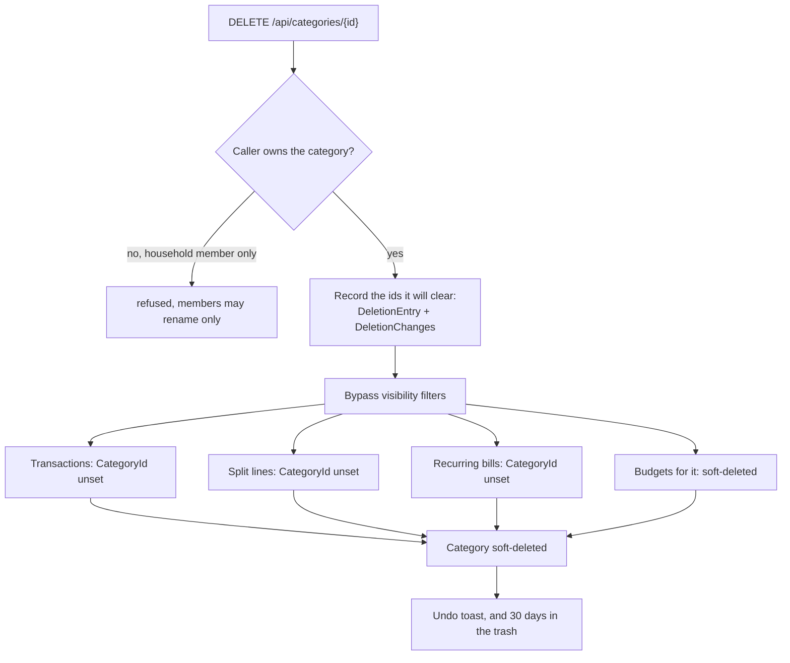

# Categories

Back to the [feature walkthrough](README.md). See also [architecture: Sharing and households](../architecture/sharing.md).

Backend `Categories`, page `/categories`. Income or expense type, personal or shared. New users get starter categories from `StarterCategories.SeedAsync`.

The icon picker names every icon in the interface language (`categories.icons.*`), both in its tooltip and in its accessible name. A line above the tiles shows the chosen icon and its name, or "No icon selected". A "No icon" tile clears the choice, and clicking the chosen icon again keeps it. The stored value is still the Lucide name, such as `shopping-bag`.

Deleting a category is undoable since 2026-09-21. The delete reads the ids of every transaction, split line and recurring entry it is about to uncategorise and of every live budget it retires, and records them beside the trash entry in the same database transaction; the trash row reads `Groceries, 42 transactions, 1 budget`. Restoring gives the category back to the rows that are still uncategorised and still match its type, and brings back each retired budget whose category and period are still free for its owner. A transaction filed under another category since keeps it. The whole rule set is in [Trash and undo](trash-and-undo.md#deletes-that-rewrite-other-rows).

[Tags](tags.md) are the other way to classify a transaction, added on 2026-09-20. A tag is owned, shared and deleted under the same rules as a category — the same `IShareable` query filter, the same "only the owner may delete or change the sharing, a household member may rename", and the same promise that deleting the classifier never deletes the transactions. The two differ in what they answer: a category says what kind of spending it was and a transaction has at most one, while a tag says what the payment was for and a transaction can carry several. A tag has no flow type and no icon, and it sits on the transaction rather than on a split line.
