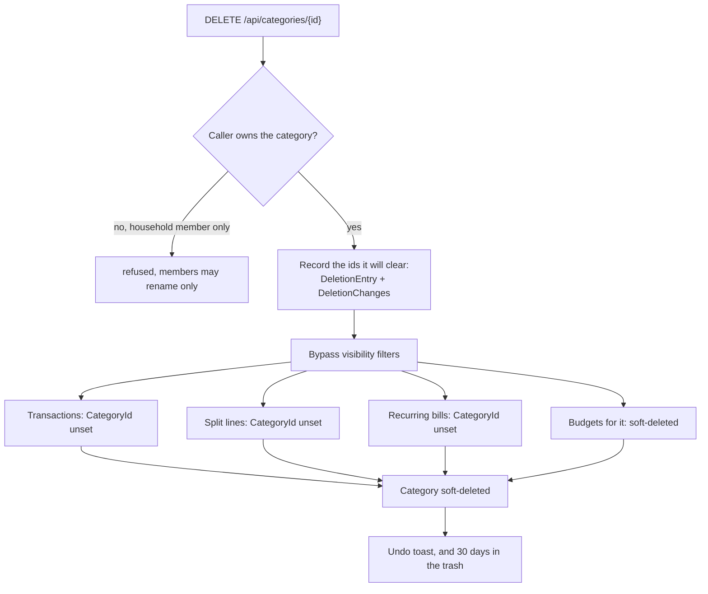

# Categories

Back to the [feature walkthrough](README.md). See also [decisions](../decisions/categories.md), [architecture: Sharing and households](../architecture/sharing.md).

Backend `Categories`, page `/categories`. Income or expense type, personal or shared. New users get starter categories from `StarterCategories.SeedAsync`.

## Groups

Since 2026-09-30 a category can sit in a group: `Category.ParentId` names another category, the create and update bodies take `parentId`, and every category response answers it. The parent must be visible to the caller (404 otherwise), of the same flow type (`category.wrongType`) and top-level, and a category that already has sub-categories cannot join a group, so nesting stays one level deep (`category.nestingInvalid`). An update replaces the parent like every other field. The foreign key restricts deletion, but categories are soft-deleted, so it never fires.

What a group changes:

| Place | Behaviour |
| --- | --- |
| Ledger | `categoryId` of a parent also keeps the rows and split lines filed under its sub-categories, so the list, totals and both exports answer "all Transport" |
| Budgets | A budget on a parent counts its own spending plus every sub-category's; a sub-category can still carry its own budget |
| Reports and dashboard | Breakdown items carry `parentId`, `parentName` and `parentIcon`; `rollUpToGroups` in `components/category-breakdown` merges each sub-category into its parent's row, whose link opens the ledger filtered by the parent; the reports' money flow chart draws the same rows |
| Categories page | Sub-categories are listed under their parent, their icon indented |

The category form has "Group under" with "No group (top level)" and the top-level categories of the same type, hidden while the category has sub-categories of its own. Deleting a parent makes its sub-categories top-level and records them beside the trash entry, and restoring it groups again each one that is still top-level, of the same type and without sub-categories of its own. Month-end movers, the monthly digest and the category comparison stay per category.

The icon picker names every icon in the interface language (`categories.icons.*`), both in its tooltip and in its accessible name. A line above the tiles shows the chosen icon and its name, or "No icon selected". A "No icon" tile clears the choice, and clicking the chosen icon again keeps it. The tiles are one radio group (Base UI `RadioGroup`) named by the "Icon" label above it through `aria-labelledby`, so the whole picker is one tab stop: Tab lands on the chosen tile and the arrow keys move and choose. The stored value is still the Lucide name, such as `shopping-bag`.

Deleting a category is undoable since 2026-09-21. The delete reads the ids of every transaction, split line and recurring entry it is about to uncategorise and of every live budget it retires, and records them beside the trash entry in the same database transaction; the trash row reads `Groceries, 42 transactions, 1 budget`. Restoring gives the category back to the rows that are still uncategorised and still match its type, and brings back each retired budget whose category and period are still free for its owner. A transaction filed under another category since keeps it. The whole rule set is in [Trash and undo](trash-and-undo.md#deletes-that-rewrite-other-rows).

[Tags](tags.md) are the other way to classify a transaction, added on 2026-09-20. A tag is owned, shared and deleted under the same rules as a category — the same `IShareable` query filter, the same "only the owner may delete or change the sharing, a household member may rename", and the same promise that deleting the classifier never deletes the transactions. The two differ in what they answer: a category says what kind of spending it was and a transaction has at most one, while a tag says what the payment was for and a transaction can carry several. A tag has no flow type and no icon, and it sits on the transaction rather than on a split line.

## Remembered receipt items

Since 2026-10-01, while the `ReceiptReading` switch is on, the page ends with "Remembered receipt items": the categories [receipt reading](receipt-reading.md#remembered-items-on-the-categories-page) remembers per item name for the signed-in person, with the category, when each was last used, a search box and "Forget" per row. It reads and writes the person's own dictionary only, never a category.
