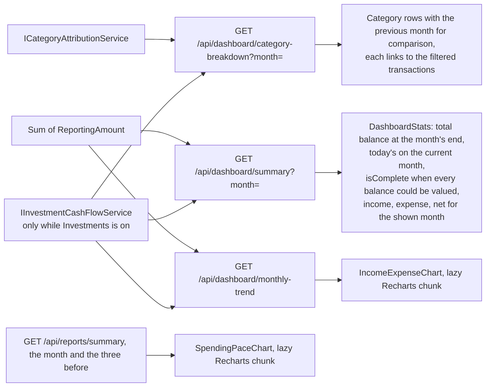
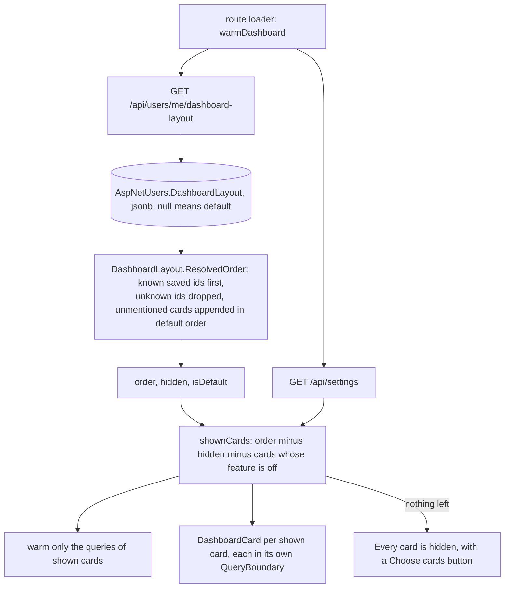
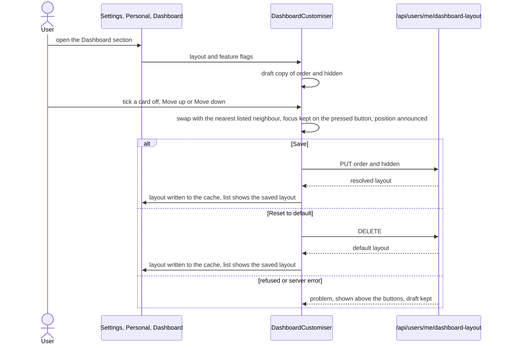

# Dashboard

Back to the [feature walkthrough](README.md). See also [decisions](../decisions/dashboard.md).

Backend `Dashboard`, page `/`. Three data endpoints, each card in its own `QueryBoundary` so a slow one does not blank the rest, and a per-user layout that chooses and orders the cards, described [below](#choosing-and-ordering-the-cards).

## Month

The page has no "Dashboard" title: its `h1` is the shown month and year in the serif lead-figure size (`text-stat-lg`), and to its right a navigation group holds "This month", "Previous month" and "Next month". The group sits at the end of the row and "This month" keeps its place while invisible (`invisible`, so it is neither focusable nor announced) on the current month, and fades and slides in over 200 ms when the user leaves it, so the controls never move when the month name changes length. "Next month" is disabled on the current month; there is no lower bound. Each press moves the heading at once, but the URL, and with it the data, follows only 300 ms after the last press (`useDebouncedDraft`, TanStack Pacer), so clicking through several months fetches only the one the user stops on. The month is the `month` search parameter (`/?month=2026-02`), validated against `YYYY-MM` and dropped when it is the current month, so `/` always means today and a month can be bookmarked or shared. Changing it keeps the cards on screen, dimmed by `StaleRegion` through `useDeferredParams`, until the new month's data arrives, instead of dropping every card to its skeleton.

The three `/api/dashboard` reads take `month` as `YYYY-MM` with a year from 2000 to 2999 and default to the current month when it is left out. Anything else answers 400 `month.invalid` (the same `MonthKey` rule as month-end close) rather than quietly showing the current month.

Every card shows the chosen month. `summary` asks `GET /api/dashboard/summary?month=` for that month's income, expenses and net; its total balance is the balance at the end of that month, counting only rows dated on or before its last day and valuing currencies and holdings at that day's exchange rates and security prices, and away from the current month its label says "Balance at month end". On the current month, which has not ended, it is today's balance, the same figure as the accounts page. Accounts have no opening date, so a starting balance counts in every month, as it does for the statement import's closing balance, and a holding with no price on or before the month's end is left out with `isComplete` false. `monthlyTrend` asks for the six months ending with the shown one (`monthly-trend?months=6&month=`). `spendingByCategory` asks `category-breakdown?month=` and its rows link to transactions of that month. `spendingPace` compares the shown month with the average of the three months before it, the legend naming them ("Average Jun–Aug") beside a dotted muted line, so it never reads as the dashed projection in a monochrome palette; the current month's line stops at today and an earlier month's runs to its last day.

On a month before the current one, the other cards look at that month's last day (`pastMonthEnd`); on the current month they ask exactly what the pages they link to ask, so they share those queries. Budgets in their window and balance by account pass it as `asOf` to `GET /api/budgets` and `GET /api/accounts`: each budget in the window holding that day, with today's limits, and each account's balance on that day. Net worth draws its history only up to that day (`until` on `NetWorthHistoryChart`, filtered in the browser, since the history is one query for every date). Recent transactions lists the latest six dated in the month (`dateFrom` and `dateTo`), and says "No transactions in this month." when there are none. Upcoming bills looks forward by nature: on the current month it lists the five soonest active entries and ends with a "Calendar" link to the [calendar view](recurring-bills.md#calendar) of the recurring entries page for the current month, and on an earlier month it says "Upcoming bills are shown on the current month." and asks for nothing; the card keeps its place so the grid does not move.
Cash flow does the same with "The cash-flow forecast is shown on the current month."; on the current month it lists each account of the 90-day [cash-flow forecast](cash-flow-forecast.md) with today's balance, the lowest balance and its date, and a below-zero warning in the expense colour; a balance below zero carries the minus sign "−" (U+2212) of `formatSigned`, never a hyphen.
Goals does the same with "Goals are shown on the current month.", because a manual goal keeps no history of its amount and a funded goal's progress is today's balance; on the current month it lists every goal from `GET /api/goals` (the goals page's query), described [below](#goals). Away from the current month the [month-end close](#month-end-close) line for the shown month takes the prompt's place above the cards. The route loader warms the shown month's queries the same way it warms the current month's.

The summary card puts the balance on top and, under it, a ring beside the income, expenses and net rows. The ring is one arc on a neutral track: the share of the month's income kept, in the positive chart colour, with the percent and "kept" in its centre; a month that spent more than came in fills the ring in the expense colour and shows the percent spent. It is one arc and not a red and green pair because that pair fails the colour-vision check, and its accessible name is the sentence "73% of the month's income kept" or "Spent more than came in". On the current month, which has not ended, the caption is "kept so far" and the name "73% of the month's income kept so far", because salary usually arrives early and most bills come later. With no income there is no ring. The ring block takes the height the card gets from its row and centres itself, so the card has no empty band.

Income vs. expenses draws the current month's bars at 40% opacity with a full-colour 1px outline, so they keep 3:1 contrast against the panel, because that month has not ended and full-height bars beside it would read as a drop; its tooltip title says "Sep, so far". The flag is `partial` on each `IncomeExpenseChart` point, drawn through the bar `shape` prop, and a point without it looks as before, so the report trend is unchanged.

Spending by category compares each category with the previous month. `category-breakdown` always answers `comparisonAmount` for every item and `comparisonStart` and `comparisonEnd` for the compared days, built with the report's `ComparisonWindow` in "same period last month" mode: an earlier month is compared with the whole month before it, and the current month, which has not ended, with the same days of the month before (the 1st to the 28th against the 1st to the 28th), so a partial month is never set against a full one. A category spent in either month is listed; the order weighs the larger of the two amounts, as in the report. Each row shows "was €120" and a change badge, and one line above the rows says "Compared with Aug 1 – Aug 28".

Spending pace compares the shown month's cumulative spending by day with the average of the three months before it, one `GET /api/reports/summary` per month (four in all, since the report's daily buckets stop at 62 days), each counted to the shown month's length. A month with no spending at all is left out of the average, so a ledger started two months ago averages those two; with none, only the shown month is drawn. An average smooths the day a large bill such as rent falls on, which made a single previous month misleading.

On the current month a dashed "Projected" line in the month's colour continues from today's total to the month's last day (`pace-projection.ts`). Two parts make it up. Upcoming bills: every active expense recurring bill with an amount whose next due date falls after today and in this month, a weekly one repeated every seven days to the month end, added on its day; a bill due today or overdue is left out, since today's total may already hold it. Everyday spending: what the average still adds between today and the month end, minus those bills, since the average already contains the bills of earlier months, spread along the average's own curve. When the bills exceed what the average still adds, the everyday part is zero rather than negative. With no average and no bills there is no projection, and on the last day there is nothing left to project. The bills come from `GET /api/recurring-bills` (the Upcoming bills card's query) only while `RecurringBills` is on, through a non-suspense query, so the chart does not wait for them and the projection updates once they arrive.

Net worth, above its chart, gives the change over the shown month: the latest snapshot on or before the month's end (today on the current month) minus the last snapshot before the month began, labelled "so far this month" on the current month and "over the month" otherwise. When there is no snapshot before the month, or none in it, the line is left out rather than showing a change from nothing. It reads the same history query as the chart.

Balance by account sorts accounts by the size of their balance whatever its sign, so a large credit card or overdraft stays in view instead of being cut first. It shows at most six rows: with more accounts, the five largest and a last row "3 other accounts" holding the sum of the rest, so the rows always add up to every account.

Budgets in their window lists every budget whose window holds the day, the most used first (spent over the effective limit), with no cut-off: the card grows with the list rather than hiding the budgets past the fifth. Each row names its period after the budget's name, and when any budget is over, one expense-coloured line above the rows says how many and by how much ("1 of 5 budgets is over, by €54.11"), summed from the overspent budgets alone, as on the [budgets page](budgets.md#on-screen). On the current month the meters draw a thin tick on each meter at the share of the budget's window that has passed including today (`windowStart` to `windowEnd`, so a weekly budget's tick is on its own week), and the meter's accessible name adds it: "Groceries, 60% of the period passed". A bar past its tick is spending ahead of the calendar. On an earlier month every window shown has ended, so there is no tick.

The month figures, the monthly trend and the spending breakdown count investment dividends and interest as income and withholding tax and standalone fees as expense, exactly as the [report](reports.md) does, so the dashboard month and the report for that month agree. In the breakdown they are one row, "Investment taxes and fees", without a link. With the `Investments` feature off nothing is added.

A transaction [spread over months](transactions.md#spreading-over-months) counts one monthly slice in the summary, the trend, the category breakdown and the spending pace, and the ledger's recent rows show it once, on the day it was paid.

The month's expenses, the trend and the category breakdown are net of [refund](transactions.md#refunds)s, which are expenses with a negative amount; a category whose refunds exceed its spending in the month shows its negative net last with an empty bar (or inside Other, past the first five), and the ledger's recent rows show a refund as "+" money back with a Refund tag.

Since 2026-10-02 the month header carries the [My share](household-settle-up.md#my-share) toggle while `Households` is on. Pressed, the summary's income, expenses and net, the monthly trend, the category breakdown, the spending pace and the budgets card ask with `share=mine` and count a split expense at the member's own share; the total balance, the accounts, net worth and the other cards are unchanged.

## Goals

`GoalsSnapshot` lists every goal the reader can see, the ones still to reach first, ordered by target date with open-ended goals after the dated ones, and reached goals last. Each row has the goal's name, its progress amount, a meter in the positive colour against the target, and beside it "€800.00 left", "Reached", or "Progress unavailable" with an empty meter and a dash when a funded goal's account is archived or no longer shared. The meter's accessible name is "Emergency fund, 83% of €15,000.00". A goal whose progress is unavailable has no meter for assistive technology, since there is nothing to measure. With no goals it says "No goals yet." with an "Add goal" link, and the card links to the goals page. Editing and deleting stay on the goals page.

## Month-end close

Since 2026-10-02 a month is closed on its own page, the [Month tab of Reports](month-end-close.md#screens) at `/reports/month`, and the dashboard only points there. While `MonthClose` is on, one of two pieces sits above the cards, inside the same `StaleRegion` so it dims with them while the month changes:

- **On the current month**, `MonthClosePrompt` (`features/month-close/month-close-prompt`) shows a panel when the latest ended month is open or changed after closing: the month's status, its open checklist items with their action links, its net and the share of income kept, "Review month", a link to the Month page on that month, and, for an open month, "Close August 2026". "Not now" hides it for that month in this browser. It renders nothing while it loads or when the load fails.
- **On any other month**, `MonthCloseLine` (`features/month-close/month-close-line`) shows one ruled line: the status icon, the headline ("August 2026 has ended", "… is closed", "… changed after closing"), the status line ("N lines still open.", "Closed on …") and "Review month", a link to the Month page on that month. It renders nothing when its load fails, and `DashboardPending` shows its skeleton while the URL names a month.

`warmDashboard` warms the review either one needs: the latest ended month's on the current month, the shown month's otherwise. Neither is one of the cards below: they have no id, no place in the layout and no entry in the customiser. The checklist, the close, the ruled-off figures and the drift live on the Month page, because the dashboard is the daily glance and the close is a monthly session of its own. See [Month-end close](month-end-close.md#screens).

## Choosing and ordering the cards

Each user decides which of the eleven cards the dashboard shows and in what order. The layout belongs to the person, not to a household or a browser: it is stored on the user row, so it follows them to every browser and device, and two members of one household each keep their own. Backend `Dashboard` (`GetDashboardLayout`, `SaveDashboardLayout`, `ResetDashboardLayout`, `DashboardLayoutService`) and `Domain/Dashboard`; frontend `dashboard-layout.ts`, `dashboard-card`, `dashboard-customiser` and the page.

| Card id | Card | Feature switch |
| --- | --- | --- |
| `summary` | Total balance and the month figures | always on |
| `monthlyTrend` | Income vs. expenses | always on |
| `spendingByCategory` | Spending by category | always on |
| `spendingPace` | Spending pace | `Reports` |
| `budgets` | Budgets in their window | `Budgets` |
| `netWorth` | Net worth | `NetWorth` |
| `accounts` | Balance by account | always on |
| `recentTransactions` | Recent transactions | always on |
| `upcomingBills` | Upcoming bills | `RecurringBills` |
| `cashFlow` | Cash flow, added 2026-09-29 and appended to saved layouts, shown | `RecurringBills` |
| `goals` | Goals, added 2026-10-01 and appended to saved layouts, shown | `Goals` |

The table order is the default. The ids are the published `DashboardCard` enum.

### Storage and reading

`AspNetUsers` gained a nullable `jsonb` column `DashboardLayout` holding `{ "order": [...], "hidden": [...] }` as card id strings. Null means the user never saved one, and `GET` answers the default order, nothing hidden and `isDefault: true`. The ids are stored as strings, not as the enum's numbers, so a layout written by a newer version with a card this version does not know, or by an older one with a card that has since gone, still reads: unknown ids are dropped, a repeated id counts once, and every known card the saved order does not mention is appended after the saved ones in its default position relative to the others. A card added in a later release therefore appears at the end of an existing custom layout and is shown, so the user notices it and can move it; it is never slipped between cards the user placed on purpose. A saved layout is stored already resolved, so it always lists every card this version knows.

Feature switches are not applied on the server. A card whose switch is off keeps its place in the stored order and its hidden flag, and comes back exactly there when an administrator switches the feature on again. The client leaves it out of the grid, out of the customiser and out of the warmed queries.

### Saving and validation

`PUT /api/users/me/dashboard-layout` takes `order` and `hidden`, two lists of card ids, and answers the resolved layout. `DELETE` on the same route forgets the saved layout and answers the default one; it is safe to repeat. Both act on the signed-in user only; there is no way to read or change another user's layout.

| Rule | Code | Field |
| --- | --- | --- |
| Both lists are present | `required` | `order`, `hidden` |
| Every id is one of the published card ids, matched exactly | `dashboard.cardUnknown` | `order[n]`, `hidden[n]` |
| An id appears at most once in a list | `dashboard.cardDuplicate` | `order`, `hidden` |

`order` may leave cards out, which are then appended as on read. A hidden card need not be listed in `order`. The request takes strings rather than the enum so that an unknown id is answered with a field-level code instead of a whole-body `request.malformed`.

### Performance

A hidden card never mounts, so its suspense queries never run, and the route loader asks for the layout and the settings in parallel and warms only the queries of the cards that will be shown, so hiding a card removes its requests entirely. Two cards share a query: `accounts` and `recentTransactions` both read `/api/accounts`, which is fetched once while either is shown. The layout query is warmed with an infinite stale time like the rest of the page; saving and resetting write their answer straight into the cache instead of invalidating it, because the response is the new layout and nothing else reads it.

### Choosing the cards

The customiser is the Dashboard section of the Personal settings (`/profile?section=dashboard`, `DashboardLayoutSection`); the dashboard itself has no customise mode and no Customise button. When every card is hidden the dashboard shows one line and a "Choose cards" link to that section. In settings the customiser has no Cancel: leaving the section drops the draft, and a save or reset copies the answered layout into it. Each card is a row with a checkbox named by the card's title and two icon buttons, "Move up" and "Move down", named with the card too; there is no drag and drop, so reordering works the same with a keyboard, a pointer or a screen reader. Moving swaps a card with the nearest neighbour that is listed, stepping over cards whose feature is off so their stored position is left alone. After a move the focus stays on the pressed button, or moves to the opposite one when the card reached the end of the list, and a polite status region says the card's new position. On a phone the rows keep one line per card, the buttons grow to the 44-pixel touch size and the action row wraps; the grid itself is one column below the `lg` breakpoint, as before.

The grid places cards in the chosen order with their usual widths. One exception fills the most common gap: when Spending pace is not shown (hidden, or `Reports` switched off), Spending by category takes the wide span, so with the default order it and Budgets still fill a row. It does not pack them densely, because a visual order that differs from the reading and focus order is worse than a gap at the end of a row.

"Reset to default" deletes the saved layout at once rather than resetting the draft, so the user goes back to having no layout and later cards take their default positions. Nothing about the layout is in the trash or the household audit log: it is a personal preference, not a record. It is part of every backup, because the backup copies every column of `AspNetUsers`.
