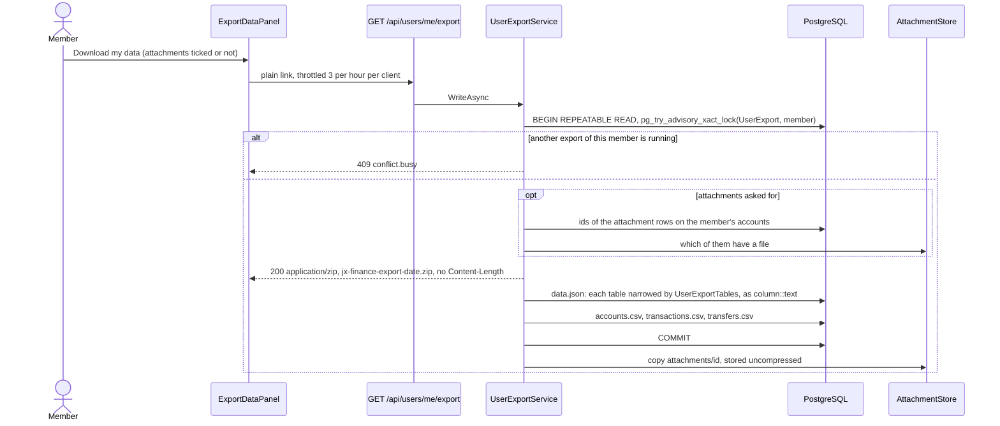

# Data export per user

Back to the [feature walkthrough](README.md). See also [decisions](../decisions/exports.md), [Exports](exports.md), [Backup and restore](backup-and-restore.md) and [architecture: Backup and restore](../architecture/backup-and-restore.md#the-member-export).

Backend `Users/ExportMyData` (`GET /api/users/me/export`), `Users/ImportMyData` (`POST /api/users/me/import`), `Users/Services` (`UserExportService`, `UserExportTables`, `UserImportService`, `MemberImport`), the shared table writer `BackupDatabase.WriteTableAsync`, `Transactions/Shared/TransactionCsvWriter` and `Common/DeferredWriteStream`. Frontend `profile/export-data-panel` in the Import and export section of Settings › Personal (`/profile?section=import`). Always on; no feature switch.

A member takes their own records out of the installation without an administrator: one zip file, streamed straight to the browser, with nothing left on the server. The administrator's [backup](backup-and-restore.md) stays the way to take everything, other members, password hashes and all.

## Taking it

Settings › Personal › Import and export shows, below the bank statement import when that is switched on, an "Export your data" panel: two sentences on what is and is not included, a "Download my data" link and an "Include attached files" checkbox, off by default. The section is always listed now, even with the `Import` switch off, because the export lives there too; its nav label and its command palette entry read "Import and export". The link is a plain `<a href>` to `GET /api/users/me/export`, with `?attachments=true` while the box is ticked, so the browser streams the archive to disk the way it downloads the transaction CSV and no blob is held in the tab.



It can be taken three times an hour from one client (`Throttle(3, 3600)`, 429 beyond), and one at a time per member: the try-lock answers a second concurrent request 409 `conflict.busy` before any byte is written. The rows come from one `REPEATABLE READ` transaction, so the file is one snapshot; the transaction is committed before the attachment files are copied. There is no row cap and no size cap: rows are streamed, so memory holds one buffer and one row, and the attachments are the member's own, bounded by the attachment rules. Nothing is written to the household activity log and no notification is sent; the request is logged like every other download.

## What the file holds

| Kind of row | Tables |
| --- | --- |
| Every row the member owns (`"UserId"` is the member) | `Accounts` (personal, shared and archived), `Assets`, `Budgets`, `BrokerConnections` without the token, `CategorizationRules`, `CsvImportMappings`, `DebtPayments`, `Debts`, `DeletionEntries`, `Goals`, `MonthCloses`, `NetWorthSnapshots`, `Notifications`, `ReceiptItemCategories`, `ReceiptReadings`, `RecurringBills`, `SubscriptionDismissals`, `SuggestedRuleDismissals`, the `SharedExpenses` the member paid for and the `Settlements` the member recorded (since 2026-09-29), and the member's own `Categories` and `Tags` |
| Everything on the member's own accounts, whoever entered it | `Transactions`, `AccountReconciliations`, `CurrencyConversions`, `InvestmentTransactions`, `TransferImports` |
| Rows that belong to an exported row | `TransactionLines`, `TransactionTags` and `TransactionAttachments` of the exported transactions; `AssetValuations`, `CategorizationRuleTags`, `DeletionChanges` and `SharedExpenseShares` of their parents |
| Every transfer with one side on the member's accounts | `Transfers` |
| Rows the member does not own but that their rows point at | a housemate's category used on a transaction or split line of theirs, a housemate's tag on one of their transactions, and the `Securities` of their investment entries |
| The member's own user row, eight columns only | `AspNetUsers`: `Id`, `Email`, `UserName`, `DisplayName`, `EmailConfirmed`, `EmailNotificationTypes`, `DashboardLayout` and `Language` |

| Never included | Tables or columns |
| --- | --- |
| Secrets and credentials | the password hash, security and concurrency stamps and every other `AspNetUsers` column; `AspNetUserTokens` (authenticator key, recovery codes); `AspNetUserPasskeys`; `PersonalApiTokens`; `BrokerConnections.ProtectedToken`; `DiscordWebhooks` (the webhook URL) |
| Sign-in and roles | `UserSessions`, `AspNetUserLogins`, `AspNetUserClaims`, `AspNetUserRoles`, `AspNetRoles`, `AspNetRoleClaims` |
| What belongs to the household | `Households`, `HouseholdMemberships`, `AuditEvents`; a split another member paid for, or a payment another member recorded, even when the member is a party to it |
| Work in flight | `EmailMessages`, `DiscordMessages` |
| The installation | `InstanceSettings` (with the SMTP password), `ExchangeRates`, `SecurityPrices` |
| Other members' data | their accounts and everything on them, including rows the member entered there; their budgets, goals and every other row they own that no row of the member points at |

"Mine" is what the member owns, not what the member can see: the history of a partner's shared account is the household's, and leaves only through the administrator's backup. An account's history is never split between two files, so what a partner entered on the member's shared account comes with it. The export ignores the household switcher: an account shared into a household other than the active one is still the member's own, so `X-Active-Household` changes nothing (`UserExportTests` compares both).

## The file

```text
jx-finance-export-2026-09-29.zip
├── data.json          every table above, in the backup's table format
├── accounts.csv       Name,Type,Currency,StartingBalance,Scope,Archived
├── transactions.csv   Date,Description,Account,Category,Tags,Type,Amount,Currency
├── transfers.csv      Date,Description,FromAccount,ToAccount,Amount,Currency,ReceivedAmount,ReceivedCurrency
└── attachments/<id>   only with attachments=true, stored uncompressed
```

`data.json` is the [backup's document](../architecture/backup-and-restore.md): `format` `jx-finance-user-export`, `version` 1, `createdAt`, `migration`, then `userId` and `missingAttachments`, then `tables`, each with `name`, `columns` and `rows` of text values. A table carries only the member's rows and only its allowed columns, and soft-deleted rows are included with their `IsDeleted` column. `BackupReader` reads it, so a later importer is a visitor rather than a new parser.

The three CSVs are for a spreadsheet and hold what the ledger would show: live rows on live accounts, with account, category and tag names instead of ids. `transactions.csv` is written by the same `TransactionCsvWriter` as the [transaction CSV export](exports.md#columns), and every text cell goes through the leading-quote guard of `Common/CsvCell`. `accounts.csv` lists archived accounts too, with `Archived` `true`. A transfer to another member's account names that account in `ToAccount`, since the member already sees it on the transfer.

With attached files asked for, each file of an exported `TransactionAttachments` row is `attachments/<id>` (the id without dashes, as in a backup), and its file name and SHA-256 are in the row. A row whose file is missing on disk is left out and counted in `missingAttachments`.

## Bringing it back

The zip moves a member to another installation, or back into a fresh member of this one. Below the download, "Import a download" takes the zip and posts it to `POST /api/users/me/import`; the answer counts the rows and files imported and the records left out, and every cached query is refreshed.

The import works only into an empty member: one who owns no accounts and no tags outside the trash, or it answers 400 `import.targetNotEmpty`. The starter categories a new member gets are moved to the trash when nothing uses them, and the member's net-worth snapshots are deleted, so the file's history replaces them. The header must say `jx-finance-user-export` version 1 and the `migration` of the running application, or it answers `import.invalidFile` or `backup.schemaMismatch`.

| From the file | What happens |
| --- | --- |
| Accounts, transactions, lines, tags on them, transfers, conversions, reconciliations, bank import history | inserted with their ids |
| Categories, tags, rules, CSV mappings, payee names, budgets, goals, recurring entries, assets, debts, receipts, dismissals, net-worth snapshots | inserted with their ids |
| Securities | inserted; one that already exists here is reused, and a security that collides on symbol and currency is replaced by the one already here |
| Every column that points at a user | the importing member, so a partner's entries on a shared account become the member's |
| Household id and scope | cleared and personal: households are not in the file |
| A reference to a row the file does not hold | an optional one is cleared; a required one drops the record, repeated until nothing points outside, and counted in `removed` |
| Attached files | written back when their SHA-256 matches the row, which otherwise fails the import; a row whose file is not in the zip is dropped |
| Preferences, notifications, month closes, the trash, the broker connection, shared expenses and settlements | not imported |

It runs as one database transaction with the foreign keys deferred, as a restore does: either everything is imported or nothing changes. Records that already exist here, such as the same file imported twice or a download of a member who is still on this installation, collide on their ids and answer 409 `import.alreadyPresent`. The request takes up to 2 GB and is throttled to five an hour per client.

## How it differs from a backup

| | Member export | Administrator backup |
| --- | --- | --- |
| Who | any signed-in member, for themselves only | an administrator, for the installation |
| What | the member's rows, secrets left out | every table, secrets included (some encrypted) |
| Where | streamed to the browser, nothing stored | written to the backup directory, downloaded later |
| Format | `jx-finance-user-export` 1, plus three CSVs | `jx-finance-backup` 1 |
| Bringing back | into an empty member, records become theirs | replaces everything |

## Classification and its guard

`UserExportTables.Rules` names every table of the EF model with one rule: `Owned` (`"UserId" = $1`), `OnOwnedAccounts(column)`, `EitherSideOwned` for transfers, `ChildOf(parent, column)`, `Referenced` (owned or pointed at from exported rows), `UserRow` (a column allow-list) or `Excluded(reason)`. A rule can hide columns (`Hidden`). Conditions are built only from quoted identifiers and the one `$1` parameter, the member's id. `UserExportTablesTests` fails when a table of the model has no rule, when an exported column is named like a secret (password, stamp, token, secret, webhook, credential, protected, authenticator, recovery, public key or hash), and when an included table's condition does not depend on the member. A new entity therefore cannot ship until it is classified; a plan that adds tables classifies them here.

## Personal API tokens

The route is in `UsersGroup`, which is not token-readable: a [personal API token](personal-api-tokens.md) gets 403 `token.notAllowed`. `PersonalApiTokenTests` names the route among the refused ones and `TokenReadableTests` keeps the readable list closed. An administrator exports only their own data too; another member's data leaves only through the backup.

## Tests

`UserExportTests` (integration, real PostgreSQL) checks that an owner's export holds their personal, shared and archived accounts, a transaction their partner entered on their shared account, a transfer to the partner's account and the partner's shared category used on their transaction, and not the partner's account, the row the owner entered there, the partner's budget or goal, households or the activity log; that the export is the same with and without `X-Active-Household`; that files come only when asked, match the SHA-256 of their rows and that a missing one is counted; that no known secret value (password, hash, stamps, session token hashes, authenticator key, API token hash, broker token, the Discord webhook URL in plain and protected form) appears anywhere in the zip; and that a held lock answers 409 and the fourth request in an hour 429. `data.json` is read back with `BackupReader` in every test.

`UserImportTests` (integration) downloads a member's data with a file, gives every id a new value and imports it into an empty member, then checks the account, the tagged transaction and the file, and that a second import answers `import.targetNotEmpty`; that the unchanged download answers 409 `import.alreadyPresent` and imports nothing; and that a file that is not a zip answers `import.invalidFile`. `UserExportTablesTests` fails when an exported table is neither imported nor named as left out.
