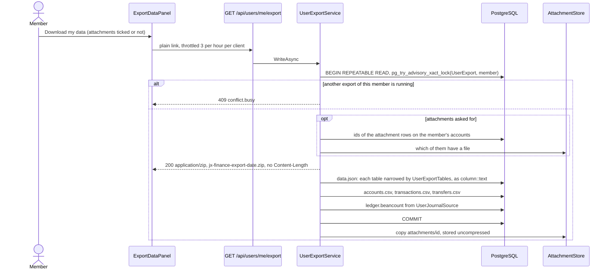

# Data export per user

Back to the [feature walkthrough](README.md). See also [decisions](../decisions/exports.md), [Exports](exports.md), [Backup and restore](backup-and-restore.md) and [architecture: Backup and restore](../architecture/backup-and-restore.md#the-member-export).

Backend `Users/ExportMyData` (`GET /api/users/me/export`), `Users/ImportMyData` (`POST /api/users/me/import`), `Users/Services` (`UserExportService`, `UserExportTables`, `UserImportService`, `MemberImport`, `UserJournalSource`), `Common/Journal` for the [double-entry journal](#double-entry-journal), the shared table writer `BackupDatabase.WriteTableAsync`, `Transactions/Shared/TransactionCsvWriter` and `Common/DeferredWriteStream`. Frontend `profile/export-data-panel` in the Import and export section of Settings › Personal (`/profile?section=import`). Always on; no feature switch.

A member takes their own records out of the installation without an administrator: one zip file, streamed straight to the browser, with nothing left on the server. The administrator's [backup](backup-and-restore.md) stays the way to take everything, other members, password hashes and all.

## Taking it

Settings › Personal › Import and export shows, below the bank statement import when that is switched on, an "Export your data" panel: two sentences on what is and is not included, a "Download my data" link and an "Include attached files" checkbox, off by default, and under them the sentence "Includes a double-entry journal (Beancount) you can open in Fava." The section is always listed now, even with the `Import` switch off, because the export lives there too; its nav label and its command palette entry read "Import and export". The link is a plain `<a href>` to `GET /api/users/me/export`, with `?attachments=true` while the box is ticked, so the browser streams the archive to disk the way it downloads the transaction CSV and no blob is held in the tab.



It can be taken three times an hour from one client (`Throttle(3, 3600)`, 429 beyond), and one at a time per member: the try-lock answers a second concurrent request 409 `conflict.busy` before any byte is written. The rows come from one `REPEATABLE READ` transaction, so the file is one snapshot; the transaction is committed before the attachment files are copied. There is no row cap and no size cap: rows are streamed, so memory holds one buffer and one row, and the attachments are the member's own, bounded by the attachment rules. Nothing is written to the household activity log and no notification is sent; the request is logged like every other download.

## What the file holds

| Kind of row | Tables |
| --- | --- |
| Every row the member owns (`"UserId"` is the member) | `Accounts` (personal, shared and archived), since 2026-10-01 `AllocationTargets`, `Assets`, `Budgets`, `BrokerConnections` without the token, `CategorizationRules`, `CsvImportMappings`, `Debts`, `DeletionEntries`, `Goals`, `MonthCloses`, `NetWorthSnapshots`, `Notifications`, `ReceiptItemCategories`, `ReceiptReadings`, `RecurringBills`, `SubscriptionDismissals`, `SuggestedRuleDismissals`, since 2026-10-01 `TransactionGroups`, the `SharedExpenses` the member paid for and the `Settlements` the member recorded (since 2026-09-29), since 2026-10-01 `Contacts`, `ContactSplits` and `ContactPayments`, and the member's own `Categories` and `Tags` |
| Everything on the member's own accounts, whoever entered it | `Transactions`, `AccountReconciliations`, `CurrencyConversions`, `InvestmentTransactions`, `TransferImports` |
| Rows that belong to an exported row | `TransactionLines`, `TransactionTags`, `TransactionAttachments` and, since 2026-10-01, `DuplicateDismissals` (the pairs kept as both) of the exported transactions; `AssetValuations`, `CategorizationRuleTags`, since 2026-10-01 `DebtBalanceEntries`, `DebtPayments`, `DeletionChanges`, `SharedExpenseShares` and, since 2026-10-01, `ContactSplitShares` of their parents; since 2026-09-30 the payment links of a member's debt travel with it whoever linked them |
| Every transfer with one side on the member's accounts | `Transfers` |
| Rows the member does not own but that their rows point at | a housemate's category used on a transaction or split line of theirs, a housemate's tag on one of their transactions, and the `Securities` of their investment entries, also the security a corporate action moved a holding to, without `PriceSyncError`, `PriceSyncedAt` and `PriceQuoteCurrency`, the state of the installation's last price fetch |
| The member's own user row, twelve columns only | `AspNetUsers`: `Id`, `Email`, `UserName`, `DisplayName`, `EmailConfirmed`, `EmailNotificationTypes`, `DiscordNotificationTypes`, `MonthlyDigestEverything`, `MonthlyDigestHouseholdIds`, `DashboardLayout`, `Language` and `CountOpenBalancesInNetWorth` |

| Never included | Tables or columns |
| --- | --- |
| Secrets and credentials | the password hash, security and concurrency stamps and every other `AspNetUsers` column; `AspNetUserTokens` (authenticator key, recovery codes); `AspNetUserPasskeys`; `PersonalApiTokens` and their retry keys, `ApiIdempotencyKeys`; `BrokerConnections.ProtectedToken` |
| Sign-in and roles | `UserSessions`, `AspNetUserLogins`, `AspNetUserClaims`, `AspNetUserRoles`, `AspNetRoles`, `AspNetRoleClaims` |
| What belongs to the household | `Households`, `HouseholdMemberships`, `AuditEvents`; a split another member paid for, or a payment another member recorded, even when the member is a party to it |
| Work in flight | `EmailMessages`, `DiscordMessages`, `ImportInboxFiles` (statements waiting in the [import inbox](bank-statement-import.md#import-inbox), copies of files its folder keeps) |
| The installation | `InstanceSettings` (with the SMTP password and the Discord webhook URL), `ExchangeRates`, `ManualExchangeRates`, `SecurityPrices` |
| Other members' data | their accounts and everything on them, including rows the member entered there; their budgets, goals and every other row they own that no row of the member points at |

"Mine" is what the member owns, not what the member can see: the history of a partner's shared account is the household's, and leaves only through the administrator's backup. An account's history is never split between two files, so what a partner entered on the member's shared account comes with it. The export ignores the household switcher: an account shared into a household other than the active one is still the member's own, so `X-Active-Household` changes nothing (`UserExportTests` compares both).

## The file

```text
jx-finance-export-2026-09-29.zip
├── data.json          every table above, in the backup's table format
├── accounts.csv       Name,Type,Currency,StartingBalance,Scope,Archived
├── transactions.csv   Date,Description,Account,Category,Tags,Type,Amount,Currency
├── transfers.csv      Date,Description,FromAccount,ToAccount,Amount,Currency,ReceivedAmount,ReceivedCurrency
├── ledger.beancount   the double-entry journal of the member's accounts, assets and debts
└── attachments/<id>   only with attachments=true, stored uncompressed
```

`data.json` is the [backup's document](../architecture/backup-and-restore.md): `format` `jx-finance-user-export`, `version` 1, `createdAt`, `migration`, then `userId` and `missingAttachments`, then `tables`, each with `name`, `columns` and `rows` of text values. A table carries only the member's rows and only its allowed columns, and soft-deleted rows are included with their `IsDeleted` column. `BackupReader` reads it, so a later importer is a visitor rather than a new parser.

The three CSVs are for a spreadsheet and hold what the ledger would show: live rows on live accounts, with account, category and tag names instead of ids. `transactions.csv` is written by the same `TransactionCsvWriter` as the [transaction CSV export](exports.md#columns), whose `Place` column it fills whatever the `Locations` switch says, since `data.json` holds the column anyway, and whose `Group` column names the member's own [group](transaction-groups.md) of the row, and every text cell goes through the leading-quote guard of `Common/CsvCell`. `accounts.csv` lists archived accounts too, with `Archived` `true`. A transfer to another member's account names that account in `ToAccount`, since the member already sees it on the transfer.

With attached files asked for, each file of an exported `TransactionAttachments` row is `attachments/<id>` (the id without dashes, as in a backup), and its file name and SHA-256 are in the row. A row whose file is missing on disk is left out and counted in `missingAttachments`.

## Double-entry journal

`ledger.beancount` writes the member's books out as a plain-text double-entry journal in the [Beancount](https://beancount.github.io/docs/) v3 syntax. `bean-check ledger.beancount` checks it, and `fava ledger.beancount` opens it in the browser as a balance sheet of the member's accounts, assets and debts and an income statement of their categories, nested under their parent categories. The database stays single-sided (see [Data model](../data-model.md) and the [decision](../decisions/exports.md)); the journal writes out the other side of every movement, so every transaction's postings sum to zero and a standard tool can prove it.

It holds the rows the CSVs hold: live rows on the member's live accounts, read in the export's `REPEATABLE READ` snapshot and ignoring the query filters, so the household switcher changes nothing. It adds the currency conversions and investment entries on those accounts, and the member's assets, debts and debt payments, whatever the `NetWorth` and `Investments` switches say. Every transaction is posted in full on its own date: [spreading a payment over months](transactions.md#spreading-over-months) changes only reports and budgets, so the journal, like the account balance, never sees the monthly slices.

Backend `Common/Journal` (`BeancountWriter`, `BeancountNames`, `BeancountCommodity` and the plain records in `JournalBook`), `Users/Services/UserJournalSource` behind `Users/Interfaces/IUserJournalSource`, and `Position.Lots`, the replay's open lots. The source loads the rows and computes the expected balances from them. The writer is pure code over the whole lists, because lot replay, debt tracking and name collisions need the full set, and a member's rows fit in memory like the CSVs.

The file starts with four options: `title` ("Jx Finance – " and the member's name), `operating_currency` (the reporting currency), `booking_method` `FIFO`, and `inferred_tolerance_default` `*:0.005`. The last one matters for stock splits: a split posts only security units, so Beancount has no cash amount to infer a tolerance from, and the reduced and re-added lots differ by the rounding of costs computed to 28 digits, far less than half a cent.

| Record | Postings |
| --- | --- |
| Account | `open` dated the earlier of its creation date and its first row, as `Assets:Bank:` (checking), `Assets:Savings:`, `Assets:Cash:`, `Assets:Other:`, `Assets:Investments:` or, for a [credit card](accounts.md#credit-cards), `Liabilities:CreditCards:` and the name; the starting balance is posted against `Equity:Opening-Balances` on that date |
| Income, expense and equity accounts | `open` on the journal's earliest date |
| Expense | Account −amount; `Expenses:<Parent>:<Category>` +amount, one posting per split line; with no category, `Expenses:Uncategorized` |
| Refund | The same with the negative amount, so the category posting is negative |
| Income | Account +amount; `Income:<Parent>:<Category>` −amount, or `Income:Uncategorized` |
| Transfer | From account −sent; to account +received, with `@@ sent` when the currencies differ; a side outside the export goes to `Equity:Outside-Accounts:<Name>` |
| Currency conversion | Both sides on the one account, the received side `@@` the amount given; its fee is the ordinary expense it already is |
| Buy | The lot at its total cost `{{−CashAmount CUR}}` and the cash leg the signed `CashAmount`, so a broker's taxes and costs are part of the cost, as in `Portfolio` |
| Sell | `−quantity SYMBOL {} @ price`, the signed `CashAmount` as cash, and `Income:Investments:Gains` left for Beancount to interpolate |
| Dividend, interest, withholding tax, fee | The signed `CashAmount` against `Income:Investments:Dividends`, `Income:Investments:Interest`, `Expenses:Investments:Taxes` or `Expenses:Investments:Fees`, so a broker reversal posts with its own sign |
| Stock split | Every open lot of the replay is reduced with `{}` and added back at the new quantity with the same total cost and its acquisition date, `{{cost CUR, date}}`, in one transaction; `jx-split-ratio:` holds the ratio |
| Symbol change, merger, spin-off | Following the split: in one transaction every lot of both securities before the entry is reduced with `{}` and the lots the replay holds after it are added back with their total cost and acquisition date, `{{cost CUR, date}}`, so the old commodity's lots reappear under the new one, or a spin-off's parent lots come back with less cost beside the new commodity's lots; a merger's cash received is the signed `CashAmount`, and when the cost released differs from it `Income:Investments:Gains` is left for Beancount to interpolate, as for a sale |
| Asset | `Assets:Owned:<Type>:<Name>`, opened at its first valuation against `Equity:Opening-Balances`; each later valuation, and the depreciation up to today, against `Equity:Revaluation` |
| Debt | `Liabilities:Debts:<Name>`, opened at its earliest [recorded balance](net-worth.md#debt-balance-history) against `Equity:Opening-Balances`; each later recorded balance, "Recorded balance" with its note, posts the change against `Equity:Revaluation` (since 2026-10-01; before, the journal started from the current record) |
| Tracked debt payment | The principal `DebtBalance.Track` works out goes to the liability and the rest to the category; a payment in another currency posts the principal `@@` its share of the payment, at the rate the app converted with |

Investment entries are posted in `Portfolio.InOrder` order (splits and corporate actions, then the other entries, then sells, then creation time on the same day), so Beancount's FIFO takes the same lots as the app's replay. The app allows an oversold position (`Position.FirstOversoldSale`), which Beancount's FIFO refuses. An account whose replay reports one opens with booking `"NONE"` and `jx-oversold-sale:` naming the first such sale, and there a sale, a split or a corporate action reduces with the explicit total cost of the lots the replay took, `{{cost CUR}}`. An oversold sale posts only the quantity the replay found in lots, and `jx-sold-quantity:` holds the quantity sold, because the app counts the rest at zero cost and holds none of it. The holding and the realised gain then equal the app's.

Account names are ASCII: letters are transliterated (ą→a, č→c, ė→e, ū→u, …), any other character becomes `-`, the first letter is capitalised, and a name that is taken gets `-2`, `-3` and so on. The original name is kept as `name:` metadata on `open`, and a category sits under its parent category. Commodities are the upper-cased security symbol; a symbol that is not a valid Beancount commodity, equals a currency code or is shared by two securities becomes `X` plus the upper-case start of the security's id. Every transaction carries `jx-id:` with the record's id, its narration is the description, its payee is the member's [payee name](payee-names.md) when one is set, else the [statement's payee](bank-statement-import.md#the-statements-payee) of an imported row, and its `Note` is `note:` metadata. Strings escape `\` and `"` and turn line breaks into spaces.

The journal holds two kinds of `price`: the rate implied by `ReportingAmount / Amount` on each foreign-currency transaction's date, and, for each security the member holds, its `LastPrice` on `LastPriceDate`, the figure the app values the holding with. That one price per held security is the only market data that leaves with the export; the exchange-rate and security-price tables stay out, as the table rules say.

The journal ends with `balance` assertions dated the day after the export, which Beancount checks against every row before that day:

- for each account and currency, the starting balance plus the rows up to today, the figure the accounts page shows for today;
- for each holding, the quantity the replay holds today;
- for each asset, `AssetValue.On` today;
- for each debt whose `AsOf` has come, the recorded amount less the principal of the tracked payments up to today.

A row dated after today is posted after the assertions. If Beancount accepts the assertions, the journal and the app agree to the cent. Where they differ, they do so on purpose:

- **Net worth.** The balance sheet covers the member's own accounts only. The app's net worth also counts accounts a household shares with them, so the two totals can differ. A transfer to or from an account outside the export (a partner's, an archived one, the transfer of a settle-up payment) is posted against `Equity:Outside-Accounts:<Name>`: the money left or joined the member's books without being spent or earned. Settle-up receivables are not modelled, because net worth does not count them either.
- **Debt payments.** In double-entry, repaying principal is not spending, so only the interest reaches the category. The app's reports keep counting a tracked payment in full, because the money did leave the account; each such transaction carries `jx-category-amount:` with that figure. Payments on or before the debt's `AsOf` count wholly as spending, as in the app. The app tracks only unsplit expenses on a debt, so a split payment linked to one also counts wholly as spending, and a payment the app cannot convert for want of a rate lowers neither. A payment made from an account outside the export, such as a partner's, is not in the journal, so it lowers the app's figure but not the journal's. The journal's debts are the ones the member owns, shared or not, with every link on them whoever made it: a partner's link to a payment from the member's own account posts its principal to the liability, while a partner's shared debt stays out even when the member paid it from their own account, and that payment counts wholly as spending.

**Import my data** ignores the file: the member import reads only `data.json` and the attachments. The format `version` stays 1, because `data.json` did not change.

In the tests, `JournalChecker` (`Tests/Support/Journal`) parses the subset of Beancount the writer emits: options, `open` with a booking method, transactions with metadata and postings, `{}`, `{…}` and `{{…}}` costs with dates, `@` and `@@` prices, `balance` and `price`. It applies Beancount's rules to it: valid account and commodity names, accounts opened before use, at most one posting without an amount, FIFO and `NONE` booking, the inferred tolerances, and balance assertions at the start of their day within the tolerance of their last digit. It fails on an unbalanced transaction or an assertion that differs. `bean-check` itself is a manual step in the [verification notes](../verification.md#double-entry-journal).

## Bringing it back

The zip moves a member to another installation, or back into a fresh member of this one. Below the download, "Import a download" takes the zip and posts it to `POST /api/users/me/import`; the answer counts the rows and files imported and the records left out, and every cached query is refreshed.

The import works only into an empty member: one who owns no accounts and no tags outside the trash, or it answers 400 `import.targetNotEmpty`. The starter categories a new member gets are moved to the trash when nothing uses them, and the member's net-worth snapshots are deleted, so the file's history replaces them. The header must say `jx-finance-user-export` version 1, or it answers `import.invalidFile`. A file that does not start with the zip signature answers the same before anything is read, because the zip reader fails on a stream shorter than its end record with an error that is not about the file.
A download carries every column its tables had when it was taken, such as the spreading of each transaction and recurring entry, the place and coordinates, and the `GroupId` of each transaction with the member's `TransactionGroups`, because the tables are copied column by column.

A [group](transaction-groups.md) comes back with its members; a row on the member's account that a housemate entered and grouped carries a group the file does not hold, and the repair step clears its `GroupId`. A partner's payment link on the member's shared debt is imported when its transaction is on one of the member's own accounts; one whose transaction sits on the partner's account is dropped by the repair step, because that transaction is not in the file.

| From the file | What happens |
| --- | --- |
| Accounts, transactions, lines, tags on them, transfers, conversions, reconciliations, bank import history | inserted with their ids |
| Categories, tags, rules, CSV mappings, payee names, transaction groups, budgets, goals, recurring entries, assets, debts, receipts, dismissals, net-worth snapshots, allocation targets, people outside the household with their splits and payments | inserted with their ids |
| Securities | inserted without a price source: `PriceSource` becomes `None` and `PriceSymbol` empty, because a mapping is an administrator's choice for one installation and spends its key; one that already exists here is reused with its own mapping, and a security that collides on symbol and currency is replaced by the one already here, in investment entries (in `SecurityId` and `RelatedSecurityId`) and in allocation targets by security alike |
| Every column that points at a user | the importing member, so a partner's entries on a shared account become the member's |
| Household id and scope | cleared and personal: households are not in the file |
| A reference to a row the file does not hold | an optional one is cleared; a required one drops the record, repeated until nothing points outside, and counted in `removed` |
| Attached files | written back when their SHA-256 matches the row, which otherwise fails the import; a row whose file is not in the zip is dropped |
| Preferences, notifications, month closes, the trash, the broker connection, shared expenses and settlements | not imported |

It runs as one database transaction with the foreign keys deferred, as a restore does: either everything is imported or nothing changes. Records that already exist here, such as the same file imported twice or a download of a member who is still on this installation, collide on their ids and answer 409 `import.alreadyPresent`. The request takes up to 2 GB and is throttled to five an hour per client.

### A download from an older version

The `migration` in the header may be the running application's or any earlier one it lists, so a download taken on an older version imports into a newer installation. One this application does not have answers `import.newerVersion` when its id sorts after the current migration (ids start with their timestamp), because the download comes from a newer version and the installation needs upgrading first, and `import.unknownVersion` otherwise.
On 2026-10-03, before the first release, the migration history was squashed into one `InitialCreate` migration. A download taken before that names a migration this application no longer has, so it answers `import.unknownVersion` and cannot be imported; take a new download.
From `InitialCreate` on, the old shapes map onto the current schema column by column, with the generated migrations as the reference:

| What changed since the download | What the import does |
| --- | --- |
| A column added to an imported table | left out of the insert, so it takes the database default its migration leaves, or null for a nullable one |
| A column the application derives when it writes a row, as it derives `PayeeKey` and `SpreadFrom` | not derived for imported rows, so a migration that adds one also has to fill it for them |
| A table added since | absent from the file, so the member starts with none of its rows |
| A column renamed or dropped | a column the file holds that its table no longer has answers `import.invalidFile`, so a migration that renames or drops a column of an imported table adds its mapping to `MemberImport` |

## How it differs from a backup

| | Member export | Administrator backup |
| --- | --- | --- |
| Who | any signed-in member, for themselves only | an administrator, for the installation |
| What | the member's rows, secrets left out | every table, secrets included (some encrypted) |
| Where | streamed to the browser, nothing stored | written to the backup directory, downloaded later |
| Format | `jx-finance-user-export` 1, plus three CSVs and a Beancount journal | `jx-finance-backup` 1 |
| Bringing back | into an empty member, records become theirs | replaces everything |
| Taken on an older version | imported, mapped column by column | refused; restored with the version that wrote it, then upgraded |
| Taken before the squash of 2026-10-03 | refused, `import.unknownVersion` | refused, `backup.schemaMismatch` |

## Classification and its guard

`UserExportTables.Rules` names every table of the EF model with one rule: `Owned` (`"UserId" = $1`), `OnOwnedAccounts(column)`, `EitherSideOwned` for transfers, `ChildOf(parent, column)`, `Referenced` (owned or pointed at from exported rows), `UserRow` (a column allow-list) or `Excluded(reason)`. A rule can hide columns (`Hidden`). Conditions are built only from quoted identifiers and the one `$1` parameter, the member's id. `UserExportTablesTests` fails when a table of the model has no rule, when an exported column is named like a secret (password, stamp, token, secret, webhook, credential, protected, authenticator, recovery, public key or hash), and when an included table's condition does not depend on the member. A new entity therefore cannot ship until it is classified; a plan that adds tables classifies them here.

## Personal API tokens

The route is in `UsersGroup`, which is not token-readable: a [personal API token](personal-api-tokens.md) gets 403 `token.notAllowed`. `PersonalApiTokenTests` names the route among the refused ones and `TokenReadableTests` keeps the readable list closed. An administrator exports only their own data too; another member's data leaves only through the backup.

## Tests

`UserExportTests` (integration, real PostgreSQL) checks that an owner's export holds their personal, shared and archived accounts, a transaction their partner entered on their shared account, a transfer to the partner's account and the partner's shared category used on their transaction, and not the partner's account, the row the owner entered there, the partner's budget or goal, households or the activity log; that the export is the same with and without `X-Active-Household`; that files come only when asked, match the SHA-256 of their rows and that a missing one is counted; that no known secret value (password, hash, stamps, session token hashes, authenticator key, API token hash, broker token) appears anywhere in the zip; and that a held lock answers 409 and the fourth request in an hour 429. `data.json` is read back with `BackupReader` in every test.

`UserImportTests` (integration) downloads a member's data with a file, gives every id a new value and imports it into an empty member, then checks the account, the tagged transaction and the file, and that a second import answers `import.targetNotEmpty`; that a spread transaction keeps its months and end through a download and an import; that the unchanged download answers 409 `import.alreadyPresent` and imports nothing; and that a file that is not a zip answers `import.invalidFile`. `UserExportTablesTests` fails when an exported table is neither imported nor named as left out.

`UserJournalTests` (integration) exports the `just seed` demo ledger and checks that `JournalChecker` accepts it and that every account assertion equals the balance the accounts page shows for today. It also checks that a partner's account appears only as `Equity:Outside-Accounts:…`, that the journal holds investment entries, assets and debts with `Investments` and `NetWorth` switched off, that a split line's category sits under its parent, and that these each balance: a refund, a split, a cross-currency transfer, a conversion with a fee, a broker-imported buy whose `CashAmount` includes taxes, a sell across two lots, a split followed by a sell, an oversold account, a tracked debt payment in another currency and a split debt payment. `UserExportTests` compares the journal with and without `X-Active-Household`, and `UserImportTests` imports a zip that contains it. The unit tests `BeancountWriterTests` (one case per row of the mapping, escaping, payees and notes), `BeancountNamesTests`, `BeancountCommodityTests` and `JournalCheckerTests` (what the checker refuses) need no database.
