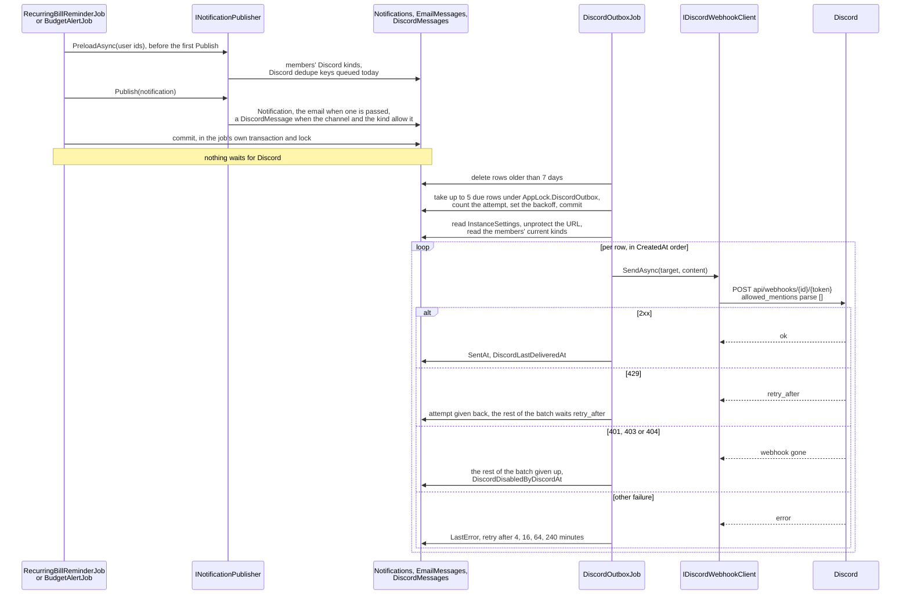

# Discord notifications

Back to the [feature walkthrough](README.md). See also [decisions](../decisions/discord-notifications.md), [architecture: Background work and notifications](../architecture/background-jobs.md).

Backend `Settings` (`settings/discord` and `settings/discord/test` through `DiscordSettingsService`) and `Users` (`users/me/discord-notifications`), the fan-out in `Common/Notifications` (`INotificationPublisher`, `NotificationTexts`), the URL rules and texts in `Common/Discord`, the transport in `Infrastructure/Discord/DiscordWebhookClient` and the drain in `Infrastructure/BackgroundJobs/DiscordOutboxJob`. Frontend: the Discord tab of the `notificationProviders` section of `/settings` (`features/settings/discord-section`, inside `features/settings/notification-providers-section`) and the `notifications` section of `/profile` (`features/profile/notifications-section`).

An administrator pastes one Discord webhook URL for the whole installation into Settings › Installation › Notification providers › Discord and switches Discord on. Each member then ticks, in Settings › Personal › Notifications, which of their notification kinds should also go to that channel, and from then on every in-app notification of those kinds is posted there with the member's display name in front. The channel is shared: everyone who can read it sees every member's ticked notifications. The administrator decides whether the installation may talk to Discord at all, because it is outbound traffic and the product promises that nothing leaves the server unless an administrator switched it on.

Discord is not a feature switch. Like the mail server it is one installation setting with its own enabled flag, `InstanceSettings.DiscordEnabled`, off by default; turning it off stops every post and leaves every route, the saved webhook and every member's ticked kinds in place. Nothing is gated by `FeatureGateMiddleware`.

## One channel, chosen kinds

A message is queued only when three things agree at the moment the notification is written: the installation switch is on, a webhook URL is saved, and the member ticked that notification kind. `InstanceSettingsSnapshot.DiscordEnabled` is true only when the switch is on and `DiscordProtectedUrl` is not empty, so the publisher, the jobs and `PublicSettingsResponse.discordEnabled` all read one flag. `NotificationPublisher.PreloadAsync` applies the rule when it loads the members, and it also leaves out members who were deactivated.

| Row | What it holds |
| --- | --- |
| `InstanceSettings.DiscordEnabled` | The installation switch, default false |
| `InstanceSettings.DiscordProtectedUrl` | The webhook URL as Data Protection ciphertext (max 1000), empty when none is saved; a concurrency token |
| `InstanceSettings.DiscordLastDeliveredAt?`, `DiscordLastError?` (max 500), `DiscordDisabledByDiscordAt?` | The delivery status, written by `RecordDiscordSend(now, error, gone)`: a success sets the delivery time and clears the Discord mark, an error is stored as the last error, and a gone webhook sets the mark |
| `AspNetUsers.DiscordNotificationTypes` | The member's kinds, a `jsonb` list of `NotificationType` as camel-case strings, default `'[]'`, like `EmailNotificationTypes` |
| `DiscordMessage` | The outbox: `Id`, `UserId`, `NotificationType` (stored as its name, max 40), `Content` (max 2000, Discord's limit), `DedupeKey?` (max 200, unique, filtered to non-null), `CreatedAt`, `NextAttemptAt`, `SentAt?`, `Attempts`, `LastError?`. Indexes on (`SentAt`, `NextAttemptAt`) and on `UserId`. A plain row like `EmailMessage`: no owner base class, no soft deletion, no query filter |

The outbox row stores the member's id, never the URL. The job reads the webhook when it sends, so a URL the administrator replaces applies to messages still queued, switching Discord off or unticking a kind stops them, and the secret lives in one place.

## The publisher

Every producer writes its notifications through `INotificationPublisher` (`Common/Notifications`, scoped `NotificationPublisher`), which is the one place a new delivery channel is added. See [Notifications](notifications.md).

- `PreloadAsync(userIds)` runs before the first `Publish`: once per pass for every owner in `RecurringBillReminderJob`, once per user in `BudgetAlertJob`, which already works user by user, and once per pass in `UnusualAmountJob` for every owner it is about to notify. It reads the active members in one query that carries the display name, the language, the emailed kinds and, while the snapshot's `DiscordEnabled` is true, `DiscordNotificationTypes`, and it loads the Discord dedupe keys already queued today, so a pass over many users makes a fixed number of queries, not one per notification. It also loads today's queued email keys for those who are active and have a confirmed address; see [Email](email.md).
- `Publish(notification)` adds the `Notification`, a `DiscordMessage` with the member's `UserId` when the member ticked that kind (the preload finds no kinds while Discord is off), and an email through `IEmailOutbox` when the member ticked that kind for email. No producer enqueues mail itself.
- Publishing for a user who was not preloaded throws `InvalidOperationException`, so a producer cannot forget the batch load and silently send nothing.
- `BudgetAlertJob` works in a user scope and resolves the publisher from it, so the publisher and its email outbox use the job's context.

Everything the publisher writes lands in the caller's context and is committed by the caller's transaction, under the caller's lock. The in-app row, the email and the Discord message therefore appear together or not at all, and a second pass that the producer's own deduplication stops writes none of them.

The dedupe key is `{userId:N}:{type}:{relatedId or notification id:N}:{local date yyyy-MM-dd}`, the date taken from `IClock.Today`. The user id is in it so that two users can never collide on a related row they share. The key is a second belt behind the producer's own check, the same way `EmailMessages` has one. The email outbox uses the same key format; the two are separate tables, so they cannot collide.

`MonthlyDigestJob` sends the digest to Discord for members whose `DiscordNotificationTypes` contains `monthlyDigest` while Discord is enabled; see [Monthly digest](monthly-digest.md).

## Message text

A notification's `Message` is the sentence `NotificationTexts.Sentence` writes in the owner's language when `INotificationPublisher.Publish` stores it, and the Discord text is built from the same `NotificationTexts` at enqueue time and stored in the row. It mirrors the bell's `describe()` in English and Lithuanian:

| Kind | English | Lithuanian |
| --- | --- | --- |
| `billDue` | "Payment due", "Expected" or "Transfer due", then the date `yyyy-MM-dd`, by shape | "Mokėjimo data", "Numatoma gauti" or "Pervedimo data", then the date |
| `budgetWarning` | "{Period} limit: {percent}% used" | "{Period} limitas: panaudota {percent}%" |
| `budgetExceeded` | "{Period} limit reached" | "{Period} limitas pasiektas" |
| `unusualAmount` | "{amount} {CUR}: {factor}× the usual {typical} {CUR}" | "{amount} {CUR}: {factor}× daugiau nei įprasta ({typical} {CUR})" |
| `unusualAmounts` | "{count} expenses are well above their usual amount" | "Neįprastai didelių išlaidų: {count}" |
| `recurringPriceRise` | "Charged {amount} {CUR}, expected {expected} {CUR}" | "Nuskaičiuota {amount} {CUR}, tikėtasi {expected} {CUR}" |
| `lowBalance` | "Forecast to go below zero on {yyyy-MM-dd}, lowest {amount} {CUR}" | "Pagal prognozę {yyyy-MM-dd} likutis taps neigiamas, mažiausias {amount} {CUR}" |
| `warrantyExpiring` | "Warranty ends {yyyy-MM-dd}" | "Garantija baigiasi {yyyy-MM-dd}" |
| `monthReadyToClose` | "{Month yyyy} has ended and is ready to close" | "{yyyy} m. {mėnuo} baigėsi: peržiūrėkite ir uždarykite mėnesį" |
| `monthlyDigest` | "{Month yyyy}: income {income} {CUR}, expenses {expense} {CUR}, net {net} {CUR}, {kept}% kept", then one line each for the biggest changes, what is still to do and whether the month is closed | "{yyyy} m. {mėnuo}: pajamos …, išlaidos …, grynai …, sutaupyta {kept}%", then the same lines in Lithuanian |

`unusualAmount`, `unusualAmounts` and `recurringPriceRise` arrived with [Unusual amounts](unusual-amounts.md), and `monthReadyToClose` with [Month-end close](month-end-close.md), whose title is the same month name through `NotificationTexts.MonthTitle`; `{CUR}` is the payload's `currency` as an uppercase code, left out when the payload has none. When the payload lacks the values the sentence falls back to `Message`.

`NotificationTexts.Discord(language, notification, member, siteUrl)` writes the first line as `{escaped member name} · **{escaped title}**`, so readers of the shared channel can tell whose alert it is. The escaped sentence follows on the second line, for `monthlyDigest` the escaped lines of `NotificationTexts.DigestDetails` after it (see [Monthly digest](monthly-digest.md#what-it-says)), and, when `App:SiteUrl` is set, `<{App:SiteUrl}{path}>` last, where the path is `/recurring-bills`, `/budgets`, `/transactions?unusual=true`, `/accounts` or `/?month=yyyy-MM` (`PageLink`, which adds the month from the payload to `PagePath`). The angle brackets stop Discord from unfurling a preview of a private address. The whole message is clipped to 2000 characters with an ellipsis. The member name is the `DisplayName` the publisher's preload reads. The language is the member's `AspNetUsers.Language`, read by the same preload, or the installation's `DefaultLanguage` while it is null, as described under Language in [Email](email.md#language); the bold title of `monthReadyToClose` and `monthlyDigest` is rendered from the payload's month in that language by `NotificationTexts.Title`. The test message of `POST /api/settings/discord/test` is `NotificationTexts.DiscordTest`, in the administrator's language. A unit test fails for a `NotificationType` that has no text in either language, so a new kind cannot reach Discord as an empty line.

The poster's name is the installation name through `DiscordText.Username`, which falls back to "Jx Finance" when the name is empty or contains "discord" or "clyde", both of which Discord refuses, and clips it to 80 characters.

## The webhook URL

A webhook URL is a bearer credential: anyone who has it can post to the channel. It is handled the way the SMTP password and the Flex token are.

- **Only Discord.** The server posts to an address an administrator typed, so it must never become a way to reach internal hosts. `DiscordWebhookUrl.TryParse` accepts only `https` on the default port, a DNS host that is exactly `discord.com`, `discordapp.com`, `ptb.discord.com` or `canary.discord.com`, no user info, none of `?`, `#`, `\`, `@` or a space, and the path `/api/webhooks/{1–20 digits}/{1–100 of A-Z a-z 0-9 _ -}`, in at most 500 characters. Anything else answers `discord.invalidWebhook`. It yields a `DiscordTarget(Id, Token)`, and the client builds its request from those two parts against a fixed base address; the typed string is never sent anywhere.
- **Encrypted at rest.** `DiscordWebhookSecret` protects the URL with Data Protection purpose `JxFinance.Discord.Webhook` into `InstanceSettings.DiscordProtectedUrl`. No response carries it: `GET` answers `hasWebhook`, and the settings field is a password input whose placeholder says a URL is saved.
- **Unreadable after a move.** A stored value that the key ring cannot decrypt answers `discord.webhookUnreadable` on a test send and `unreadable: true` on `GET`, and the Discord tab shows it as an alert and asks for the URL again, the way the SMTP form handles `email.passwordUnreadable`. A decrypted value that no longer passes the validator answers `discord.invalidWebhook`.
- **No token in logs.** `DiscordTarget.ToString` hides the token, `UpdateDiscordSettingsRequest` prints `WebhookUrl = ***`, the typed client has its HTTP logging removed, and the trace of the outgoing call carries `https://{host}/api/webhooks/***`. See [Notification fan-out and Discord](../architecture/background-jobs.md#notification-fan-out-and-discord).

## The client

`DiscordWebhookClient` implements `IDiscordWebhookClient.SendAsync(DiscordTarget, DiscordPost, ct)` as a typed `HttpClient`: base address fixed at `https://discord.com/`, a 10-second timeout, a 64 KB response buffer, user agent `JxFinance/1.0` and `.RemoveAllLoggers()`. It posts `{ content, username, allowed_mentions: { parse: [] } }` to `api/webhooks/{id}/{token}`. The empty `parse` list means no `@everyone`, role or user mention in a category, bill, payee or member name can ever ping anyone, and `DiscordText.Escape` puts a backslash before the backslash, `*`, `_`, `~`, the backtick, `|`, `>`, `[`, `]`, `(`, `)`, `#` and `-`, and turns line breaks and tabs into spaces, so a name cannot reformat the message either.

It answers a `DiscordSendResult(DomainError? Error, TimeSpan? RetryAfter)`:

| Discord answers | Result |
| --- | --- |
| 2xx | success |
| 429 | `discord.rateLimited`, with `retry_after` from the JSON body (clamped to 1–3600 seconds) or the `Retry-After` header, 30 seconds when neither is there |
| 401, 403 or 404 | `discord.webhookGone` |
| any other 4xx | `discord.rejected`, with Discord's own `message` clipped to 300 characters |
| 5xx, a timeout or a network error | `discord.sendFailed` |

## The outbox job

`DiscordOutboxJob` is a `PeriodicJob` that runs every 30 seconds and belongs to no feature switch. Everything goes to one webhook, and Discord allows about 5 requests per 2 seconds per webhook and 30 per minute per channel, so a pass sends at most `BatchSize` = 5 messages. Each pass:

1. Deletes every row older than 7 days: sent, given up, or never sent. Rows queued before an administrator switched Discord off are therefore pruned rather than posted late when it is switched back on.
2. Returns when the snapshot says Discord is off.
3. In one transaction holding `AppLock.DiscordOutbox`, takes up to 5 due rows (not sent, fewer than 5 attempts, `NextAttemptAt` in the past) by `CreatedAt`, counts an attempt on each and sets the next attempt `min(4^attempts, 240)` minutes ahead, and commits. Only then is a socket opened, so a process that dies mid-send loses one attempt, never a row.
4. Loads the `InstanceSettings` row and the members' current `DiscordNotificationTypes`, sends the rows in `CreatedAt` order, and saves the outcomes at the end, even while the host stops. `DiscordProtectedUrl` is a concurrency token: when an administrator replaced the URL during the send, the save detaches the conflicting entries and retries, so the outcome for the old URL is dropped instead of marking the new one.

| What the job finds | What it does |
| --- | --- |
| The switch off, no URL saved, or a webhook disabled by Discord | Every row of the batch is given up |
| A URL that cannot be decrypted or no longer validates | Every row of the batch is given up and `DiscordLastError` set |
| A kind the member unticked since it was queued | The row is given up |
| Success | `SentAt` on the row; `RecordDiscordSend` sets `DiscordLastDeliveredAt` and clears the last error and the Discord mark |
| `discord.rateLimited` | That row and the rest of the batch get their attempt back and wait until now plus `retry_after` |
| `discord.webhookGone` | That row and the rest of the batch are given up with the reason, and later passes give up every row because the webhook is disabled; `RecordDiscordSend` sets `DiscordDisabledByDiscordAt` and the last error, which the Discord tab shows as "disabled by Discord" |
| Any other failure, or an exception from the client | The backoff stands and `LastError` is recorded on the row and on `InstanceSettings`; after the fifth attempt the row is given up and logged once |

A webhook disabled by Discord stays disabled until an administrator saves a new URL or a test send succeeds.

## Endpoints

| Route | Who | What it does |
| --- | --- | --- |
| `GET /api/settings/discord` | Admin | `{ enabled, hasWebhook, lastDeliveredAt, lastError, disabledByDiscord, unreadable }`, never the URL |
| `PUT /api/settings/discord` | Admin | `{ enabled, webhookUrl? }`, throttled to 20 calls per five minutes, answers the same response as `GET`. An empty URL keeps the stored one. A new URL clears `DiscordDisabledByDiscordAt` and `DiscordLastError`. Switching on with no URL saved and none given answers `discord.invalidWebhook`, and so does an invalid URL. The settings store is refreshed after the commit, so `discordEnabled` in `GET /api/settings/public` follows at once. Switching off leaves the webhook and every member's kinds in place and stops the job from claiming |
| `POST /api/settings/discord/test` | Admin | Throttled to 10 calls per five minutes. 404 without a saved webhook. Works while the switch is off, so the channel can be checked first. Sends synchronously in the administrator's language and answers 204 or Discord's own error; the outcome is recorded with `RecordDiscordSend`, so a success clears a Discord mark and `discord.webhookGone` sets one |
| `PUT /api/users/me/discord-notifications` | any signed-in user | `{ types }`, throttled to 20 calls per five minutes, answers `UserProfileResponse`, which carries `discordNotificationTypes`. A kind listed twice answers `collection.invalidSize`, and an empty list is allowed. The default is nothing ticked |

The test send is the only post made inside a request, because its whole purpose is to report what Discord said; everything else goes through the outbox.

## Screens

For administrators, Settings › Installation has a "Notification providers" section (`/settings?section=notificationProviders`) whose Discord tab holds `DiscordSection`: a description, then one form with

- an alert when the webhook was disabled by Discord and another when the stored URL is unreadable;
- the checkbox "Send notifications to Discord";
- the webhook URL as a password input, whose placeholder says when a URL is saved; leaving it empty keeps the stored one;
- the delivery line ("Last message delivered …" or "Nothing has been delivered yet") and the last error;
- "Send a test message", disabled without a saved webhook, and Save.

A client-side check requires a URL when Discord is switched on with none saved, and the URL must match the same host and path rules as the server. A failure stays on screen in `FormError`. There is no "remove" action: an administrator replaces the URL or switches Discord off. The section and its tabs are described under [Installation settings](installation-settings.md).

For every user the Discord choices live in Settings › Personal › Notifications (`/profile?section=notifications`), one form with one Save shared with the email choices. The Notifications panel is a table of notification kinds, labelled from the bell's `notifications.kinds.*`, against "In app" (always, a muted check, except a dash for the [monthly digest](monthly-digest.md), which is only sent by email or Discord) and one column per channel that is set up on the installation. The Discord column appears only while `discordEnabled` from the public settings is true, that is while the switch is on and a webhook is saved, and holds a checkbox per kind. The table is `NotificationChannelsFields`, a field group over the `email` and `discord` lists in `notification-channels-fields.tsx` that takes the `channels` to show; its rows come from `notificationKinds`, which the section's skeleton counts too. What the table shows when no channel is set up is described under [Choosing channels](notifications.md#choosing-channels). Save calls `PUT users/me/discord-notifications` only when the ticked Discord kinds changed. `useDiscordEnabled()` in `hooks/use-settings.ts` reads the public settings.

The command palette has one entry for the Notification providers section and one for Notifications, and the Discord mutations are listed in `src/api/invalidation.ts`: saving the Discord settings refreshes them and the public settings, a test send refreshes the Discord settings.

## Backup and restore

`DiscordProtectedUrl` travels inside `InstanceSettings` as ciphertext and is readable again only under the same key ring; elsewhere the Discord tab shows it as unreadable and asks for the URL again. `DiscordNotificationTypes` travels with `AspNetUsers`. `DiscordMessages` is transient like `EmailMessages` and `UserSessions`: a queued post is work in flight, and a restore should not post month-old alerts. See [Backup and restore](backup-and-restore.md).

## Error codes

All answer 400.

| Code | When |
| --- | --- |
| `discord.invalidWebhook` | The URL is not a Discord webhook URL on an allowed host, on save or when the stored value is read back, or Discord is switched on with no URL saved and none given |
| `discord.webhookUnreadable` | The stored URL cannot be decrypted with this installation's data protection keys |
| `discord.webhookGone` | Discord answered 401, 403 or 404 |
| `discord.rateLimited` | Discord answered 429 |
| `discord.rejected` | Discord refused the message with another 4xx; the reason is its own text |
| `discord.sendFailed` | Discord answered 5xx, did not answer within 10 seconds, or could not be reached |

## Tests

No test opens a socket: `FakeDiscordWebhookClient` replaces the client in `ApiFixture` and records posts or answers with a chosen error. `DiscordNotificationTests` covers the administrator-only routes, saving and testing the channel without ever returning its URL, switching on and testing without a webhook, members choosing their kinds, a bill reminder reaching the channel with the member name in front only while the switch is on and the kind is ticked, a job run twice queuing one message, an unticked kind given up, 429, another failure, and 404 giving up the queue until a new URL is saved. `DiscordWebhookUrlTests` and `NotificationTextsTests` (which checks the escaped name prefix) are the unit tests, `BackupEndpointTests` has a round trip that keeps the channel and the members' kinds and drops the queue, and `NotificationPublisherTests` is the architecture test that keeps `Notifications.Add` inside the publisher.
