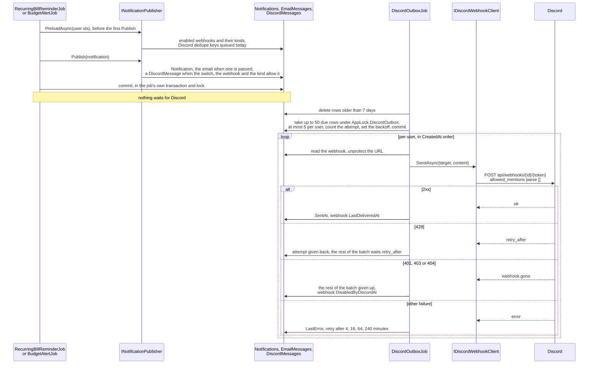

# Discord notifications

Back to the [feature walkthrough](README.md). See also [decisions](../decisions/discord-notifications.md), [architecture: Background work and notifications](../architecture/background-jobs.md).

Backend `Settings` (`settings/discord`) and `Users` (`users/me/discord`, `users/me/discord/test`), the fan-out in `Common/Notifications` (`INotificationPublisher`, `NotificationTexts`), the URL rules and texts in `Common/Discord`, the transport in `Infrastructure/Discord/DiscordWebhookClient` and the drain in `Infrastructure/BackgroundJobs/DiscordOutboxJob`. Frontend: the `discord` section of `/settings` (`features/settings/discord-section`) and the `notifications` section of `/profile` (`features/profile/notifications-section`).

A member pastes a Discord webhook URL into Settings › Personal › Notifications, ticks the notification kinds that should go there, and from then on every in-app notification of those kinds is also posted to that channel. The webhook is personal, like the choice of emailed kinds: nobody's alerts reach anyone else's channel. An administrator decides whether the installation may talk to Discord at all, because it is outbound traffic and the product promises that nothing leaves the server unless an administrator switched it on.

Discord is not a feature switch. Like the mail server it is one installation setting with its own enabled flag, `InstanceSettings.DiscordEnabled`, off by default; turning it off stops every post and leaves every route and every saved webhook in place. Nothing is gated by `FeatureGateMiddleware`.

## Two switches and one webhook

A message is queued only when three things agree at the moment the notification is written: the installation switch is on, the owner has a webhook that is enabled and has not been disabled by Discord, and the owner ticked that notification kind. `NotificationPublisher.PreloadAsync` applies that rule when it loads the owners' webhooks, and it also leaves out owners who were deactivated.

| Row | What it holds |
| --- | --- |
| `InstanceSettings.DiscordEnabled` | The installation switch, carried in `InstanceSettingsSnapshot` and in `PublicSettingsResponse.discordEnabled`, so the profile can say why its section is inactive |
| `DiscordWebhook` (`OwnableEntity`, id `DiscordWebhookId`) | `ProtectedUrl` (max 1000), `IsEnabled`, `Types` (a `jsonb` list of `NotificationType` as camel-case strings), `LastDeliveredAt?`, `LastError?` (max 500), `DisabledByDiscordAt?`. One per user: a unique index on `UserId` filtered to rows not deleted. Not registered in the audit collector |
| `DiscordMessage` | The outbox: `Id`, `UserId`, `NotificationType` (stored as its name, max 40), `Content` (max 2000, Discord's limit), `DedupeKey?` (max 200, unique, filtered to non-null), `CreatedAt`, `NextAttemptAt`, `SentAt?`, `Attempts`, `LastError?`. Indexes on (`SentAt`, `NextAttemptAt`) and on `UserId`. A plain row like `EmailMessage`: no owner base class, no soft deletion, no query filter |

The outbox row stores the user id, never the URL. The job looks the webhook up when it sends, so changing the URL applies to messages still queued, switching the webhook off or unticking a kind stops them, and the secret lives in one place.

## The publisher

Every producer writes its notifications through `INotificationPublisher` (`Common/Notifications`, scoped `NotificationPublisher`), which is the one place a new delivery channel is added. See [Notifications](notifications.md).

- `PreloadAsync(userIds)` runs before the first `Publish`: once per pass for every owner in `RecurringBillReminderJob`, once per user in `BudgetAlertJob`, which already works user by user, and once per pass in `UnusualAmountJob` for every owner it is about to notify. While the installation switch is on it loads the enabled, not disabled webhooks of those users, and it loads the Discord dedupe keys already queued today, so a pass over many users makes two queries, not one per notification. It also loads, for the same users, the emailed kinds of those who are active and have a confirmed address, and today's queued email keys; see [Email](email.md).
- `Publish(notification)` adds the `Notification`, a `DiscordMessage` when the owner's webhook takes that kind (the preload finds no webhook while the switch is off), and an email through `IEmailOutbox` when the owner ticked that kind for email. No producer enqueues mail itself.
- Publishing for a user who was not preloaded throws `InvalidOperationException`, so a producer cannot forget the batch load and silently send nothing.
- `BudgetAlertJob` works in a user scope and resolves the publisher from it, so the publisher and its email outbox use the job's context.

Everything the publisher writes lands in the caller's context and is committed by the caller's transaction, under the caller's lock. The in-app row, the email and the Discord message therefore appear together or not at all, and a second pass that the producer's own deduplication stops writes none of them.

The dedupe key is `{userId:N}:{type}:{relatedId or notification id:N}:{local date yyyy-MM-dd}`, the date taken from `IClock.Today`. The user id is in it so that two users can never collide on a related row they share. The key is a second belt behind the producer's own check, the same way `EmailMessages` has one. The email outbox uses the same key format; the two are separate tables, so they cannot collide.

## Message text

A notification's `Message` is the sentence `NotificationTexts.Sentence` writes in the owner's language when `INotificationPublisher.Publish` stores it, and the Discord text is built from the same `NotificationTexts` at enqueue time and stored in the row. It mirrors the bell's `describe()` in English and Lithuanian:

| Kind | English | Lithuanian |
| --- | --- | --- |
| `billDue` | "Payment due", "Expected" or "Transfer due", then the date `yyyy-MM-dd`, by shape | "Mokėjimo data", "Numatoma gauti" or "Pervedimo data", then the date |
| `budgetWarning` | "{Period} limit: {percent}% used" | "{Period} limitas: panaudota {percent}%" |
| `budgetExceeded` | "{Period} limit reached" | "{Period} limitas pasiektas" |
| `unusualAmount` | "{amount} {CUR}: {factor}× the usual {typical} {CUR}" | "{amount} {CUR}: {factor}× daugiau nei įprasta ({typical} {CUR})" |
| `unusualAmounts` | "{count} expenses are well above their usual amount" | "Neįprastai didelių išlaidų: {count}" |
| `recurringPriceRise` | "Charged {amount} {CUR}, expected {expected} {CUR}" | "Nuskaičiuota {amount} {CUR}, tikėtasi {expected} {CUR}" |
| `lowBalance` | "Forecast to go below zero on {yyyy-MM-dd}, lowest {amount} {CUR}" | "Pagal prognozę {yyyy-MM-dd} likutis taps neigiamas, mažiausias {amount} {CUR}" |
| `warrantyExpiring` | "Warranty ends {yyyy-MM-dd}" | "Garantija baigiasi {yyyy-MM-dd}" |
| `monthReadyToClose` | "{Month yyyy} has ended and is ready to close" | "{yyyy} m. {mėnuo} baigėsi: peržiūrėkite ir uždarykite mėnesį" |
| `monthlyDigest` | "{Month yyyy}: income {income} {CUR}, expenses {expense} {CUR}, net {net} {CUR}, {kept}% kept", then one line each for the biggest changes, what is still to do and whether the month is closed | "{yyyy} m. {mėnuo}: pajamos …, išlaidos …, grynai …, sutaupyta {kept}%", then the same lines in Lithuanian |

`unusualAmount`, `unusualAmounts` and `recurringPriceRise` arrived with [Unusual amounts](unusual-amounts.md), and `monthReadyToClose` with [Month-end close](month-end-close.md), whose title is the same month name through `NotificationTexts.MonthTitle`; `{CUR}` is the payload's `currency` as an uppercase code, left out when the payload has none. When the payload lacks the values the sentence falls back to `Message`. `NotificationTexts.Discord(language, notification, siteUrl)` puts the escaped title in bold on the first line, the escaped sentence on the second, for `monthlyDigest` the escaped lines of `NotificationTexts.DigestDetails` after it (see [Monthly digest](monthly-digest.md#what-it-says)), and, when `App:SiteUrl` is set, `<{App:SiteUrl}{path}>` on a third, where the path is `/recurring-bills`, `/budgets`, `/transactions?unusual=true`, `/accounts` or `/?month=yyyy-MM` (`PageLink`, which adds the month from the payload to `PagePath`). The angle brackets stop Discord from unfurling a preview of a private address. The whole message is clipped to 2000 characters with an ellipsis. The language is the owner's `AspNetUsers.Language`, read by the publisher's preload, or the installation's `DefaultLanguage` while it is null, as described under Language in [Email](email.md#language); the bold title of `monthReadyToClose` and `monthlyDigest` is rendered from the payload's month in that language by `NotificationTexts.Title`. The test message of `POST /api/users/me/discord/test` uses the same language. A unit test fails for a `NotificationType` that has no text in either language, so a new kind cannot reach Discord as an empty line.

The poster's name is the installation name through `DiscordText.Username`, which falls back to "Jx Finance" when the name is empty or contains "discord" or "clyde", both of which Discord refuses, and clips it to 80 characters.

## The webhook URL

A webhook URL is a bearer credential: anyone who has it can post to the channel. It is handled the way the SMTP password and the Flex token are.

- **Only Discord.** The server posts to an address a user typed, so it must never become a way to reach internal hosts. `DiscordWebhookUrl.TryParse` accepts only `https` on the default port, a DNS host that is exactly `discord.com`, `discordapp.com`, `ptb.discord.com` or `canary.discord.com`, no user info, none of `?`, `#`, `\`, `@` or a space, and the path `/api/webhooks/{1–20 digits}/{1–100 of A-Z a-z 0-9 _ -}`, in at most 500 characters. Anything else answers `discord.invalidWebhook`. It yields a `DiscordTarget(Id, Token)`, and the client builds its request from those two parts against a fixed base address; the user's string is never sent anywhere.
- **Encrypted at rest.** `DiscordWebhookSecret` protects the URL with Data Protection purpose `JxFinance.Discord.Webhook`. No response carries it: `GET` answers `hasWebhook`, and the profile field is a password input whose placeholder says a URL is saved.
- **Unreadable after a move.** A stored value that the key ring cannot decrypt answers `discord.webhookUnreadable`, the profile shows it as an alert and asks for the URL again, the way the SMTP form handles `email.passwordUnreadable`. A decrypted value that no longer passes the validator answers `discord.invalidWebhook`.
- **No token in logs.** `DiscordTarget.ToString` hides the token, `UpdateMyDiscordRequest` prints `WebhookUrl = ***`, the typed client has its HTTP logging removed, and the trace of the outgoing call carries `https://{host}/api/webhooks/***`. See [Notification fan-out and Discord](../architecture/background-jobs.md#notification-fan-out-and-discord).

## The client

`DiscordWebhookClient` implements `IDiscordWebhookClient.SendAsync(DiscordTarget, DiscordPost, ct)` as a typed `HttpClient`: base address fixed at `https://discord.com/`, a 10-second timeout, a 64 KB response buffer, user agent `JxFinance/1.0` and `.RemoveAllLoggers()`. It posts `{ content, username, allowed_mentions: { parse: [] } }` to `api/webhooks/{id}/{token}`. The empty `parse` list means no `@everyone`, role or user mention in a category, bill or payee name can ever ping anyone, and `DiscordText.Escape` puts a backslash before the backslash, `*`, `_`, `~`, the backtick, `|`, `>`, `[`, `]`, `(`, `)`, `#` and `-`, and turns line breaks and tabs into spaces, so a name cannot reformat the message either.

It answers a `DiscordSendResult(DomainError? Error, TimeSpan? RetryAfter)`:

| Discord answers | Result |
| --- | --- |
| 2xx | success |
| 429 | `discord.rateLimited`, with `retry_after` from the JSON body (clamped to 1–3600 seconds) or the `Retry-After` header, 30 seconds when neither is there |
| 401, 403 or 404 | `discord.webhookGone` |
| any other 4xx | `discord.rejected`, with Discord's own `message` clipped to 300 characters |
| 5xx, a timeout or a network error | `discord.sendFailed` |

## The outbox job

`DiscordOutboxJob` is a `PeriodicJob` that runs every 30 seconds and belongs to no feature switch. Each pass:

1. Deletes every row older than 7 days: sent, given up, or never sent. Rows queued before an administrator switched Discord off are therefore pruned rather than posted late when it is switched back on.
2. Returns when the installation switch is off.
3. In one transaction holding `AppLock.DiscordOutbox`, takes up to 50 due rows (not sent, fewer than 5 attempts, `NextAttemptAt` in the past) by `CreatedAt`, at most 5 per user, picked in SQL to stay under Discord's per-webhook limit without one user's backlog starving the others, counts an attempt on each and sets the next attempt `min(4^attempts, 240)` minutes ahead, and commits. Only then is a socket opened, so a process that dies mid-send loses one attempt, never a row.
4. Loads the webhooks of those users and sends each user's rows in `CreatedAt` order, saving after each user even while the host stops. `ProtectedUrl` is a concurrency token: when the owner replaced or removed the webhook during the send, the outcome for the old URL is dropped instead of marking the new one.

| What the job finds | What it does |
| --- | --- |
| No webhook, a webhook switched off, or one disabled by Discord | The row is given up |
| A URL that cannot be decrypted or no longer validates | The rows are given up and the webhook's `LastError` set |
| A kind the owner unticked since it was queued | The row is given up |
| Success | `SentAt` on the row; `LastDeliveredAt` set and `LastError` cleared on the webhook |
| `discord.rateLimited` | That row and the rest of the user's batch get their attempt back and wait until now plus `retry_after` |
| `discord.webhookGone` | That row and the rest of the batch are given up with the reason, and later passes give up the user's other rows because the webhook is disabled; the webhook gets `DisabledByDiscordAt` and `LastError`, which the profile shows as "disabled by Discord" |
| Any other failure, or an exception from the client | The backoff stands and `LastError` is recorded on the row and the webhook; after the fifth attempt the row is given up and logged once |

A webhook disabled by Discord stays disabled until the owner saves a new URL or a test send succeeds.

## Endpoints

| Route | Who | What it does |
| --- | --- | --- |
| `PUT /api/settings/discord` | Admin | `{ enabled }`, answers 204; the switch is read back as `discordEnabled` from `GET /api/settings/public`. The settings store is refreshed after the commit. Switching off leaves every webhook in place and stops the job from claiming |
| `GET /api/users/me/discord` | any signed-in user | `{ hasWebhook, isEnabled, types, lastDeliveredAt, lastError, disabledByDiscord, unreadable }`, never the URL. Without a webhook it answers every kind in `types`, as the starting point for the form |
| `PUT /api/users/me/discord` | any signed-in user | `{ webhookUrl?, isEnabled, types }`, throttled to 20 calls per five minutes. An empty URL keeps the stored one, and the first save must bring one. A new URL clears `DisabledByDiscordAt` and `LastError`. Kinds are de-duplicated and sorted, and an empty list is allowed |
| `DELETE /api/users/me/discord` | any signed-in user | Soft-deletes the webhook with its protected URL blanked and hard-deletes its unsent messages; 404 when there is none |
| `POST /api/users/me/discord/test` | any signed-in user | Throttled to 10 calls per five minutes. `discord.disabled` while the switch is off, 404 without a webhook. Sends synchronously and answers Discord's own error; a success records the delivery and clears a Discord mark, `discord.webhookGone` sets one |

The user routes are under the `Users` tag. The test send is the only post made inside a request, because its whole purpose is to report what Discord said; everything else goes through the outbox.

## Screens

For administrators, Settings has a Discord section under Installation, after Email, with one checkbox, "Allow Discord notifications", a hint about what it sends and where, and Save; a failure stays on screen in `FormError`. The route loader warms its query.

For every user the Discord choices live in Settings › Personal › Notifications (`/profile?section=notifications`), one form with one Save shared with the email choices. The Notifications panel is a table of notification kinds, labelled from the bell's `notifications.kinds.*`, against three channels: "In app" (always, a muted check, except a dash for the [monthly digest](monthly-digest.md), which is only sent by email or Discord), "Email" and "Discord", with a checkbox per kind and channel. The Discord column is disabled, with a note under the table saying why, when an administrator has not allowed Discord, when no webhook is connected, or while "Send notifications to this channel" is unticked. The table is `NotificationChannelsFields`, a field group over the `email` and `discord` lists in `notification-channels-fields.tsx`, and its rows come from `notificationKinds`, which the section's skeleton counts too. The `/profile` loader warms `GET users/me/discord` only when the Notifications section is requested.

Below it the "Discord channel" panel holds:

- the webhook URL as a password input, whose placeholder says when a URL is saved;
- "Send notifications to this channel";
- the delivery line ("Last message delivered …" or "Nothing has been delivered yet") and the last error;
- an alert when the webhook was disabled by Discord and another when the stored URL is unreadable;
- "Send a test message" and "Remove webhook" behind a confirmation, once a webhook exists.

Save calls `PUT users/me/discord` only when the URL, the channel checkbox or the ticked Discord kinds changed and a webhook exists or a URL was typed, so an email-only change never touches the webhook. While the installation switch is off the URL field, the channel checkbox, the Discord column and the test are disabled, and the note says why. `useDiscordEnabled()` in `hooks/use-settings.ts` reads the public settings. The command palette has entries for the installation Discord section and for Notifications, and the Discord mutations are listed in `src/api/invalidation.ts`.

## Backup and restore

`DiscordWebhooks` is an ordinary exported table, so the protected URL travels in a backup as ciphertext and is readable again only under the same key ring; elsewhere the profile shows it as unreadable until the owner pastes the URL again. `DiscordMessages` is transient like `EmailMessages` and `UserSessions`: a queued post is work in flight, and a restore should not post month-old alerts. See [Backup and restore](backup-and-restore.md).

## Error codes

All answer 400.

| Code | When |
| --- | --- |
| `discord.disabled` | A test send while the installation switch is off |
| `discord.invalidWebhook` | The URL is not a Discord webhook URL on an allowed host, on save or when the stored value is read back |
| `discord.webhookUnreadable` | The stored URL cannot be decrypted with this installation's data protection keys |
| `discord.webhookGone` | Discord answered 401, 403 or 404 |
| `discord.rateLimited` | Discord answered 429 |
| `discord.rejected` | Discord refused the message with another 4xx; the reason is its own text |
| `discord.sendFailed` | Discord answered 5xx, did not answer within 10 seconds, or could not be reached |

## Tests

No test opens a socket: `FakeDiscordWebhookClient` replaces the client in `ApiFixture` and records posts or answers with a chosen error. `DiscordNotificationTests` covers the gating by switch, webhook and kind for a bill reminder and a budget alert, a job run twice queuing one message, 429 and 404, a new URL applying to queued messages, delete dropping the queue, the test send refused while off and working while on, `GET` never carrying the URL, and validation of foreign URLs and of a first save without one. `DiscordWebhookUrlTests` and `NotificationTextsTests` are the unit tests, `BackupEndpointTests` has a round trip that keeps the webhook and drops the queue, and `NotificationPublisherTests` is the architecture test that keeps `Notifications.Add` inside the publisher.
