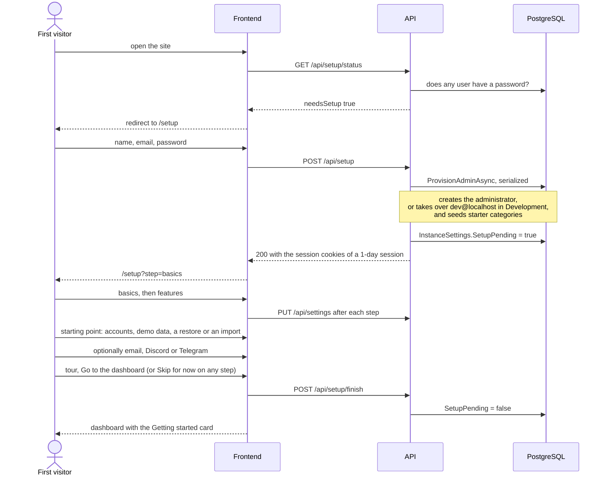

# First-run setup

Back to the [feature walkthrough](README.md). See also [decisions](../decisions/installation-settings.md).

Backend `Auth/Setup`, routes `GET /api/setup/status` and `POST /api/setup` (anonymous and serialized), and `POST /api/setup/finish`, `POST /api/setup/demo-data`, `DELETE /api/setup/demo-data` (`DemoDataService`) and `GET /api/setup/readiness` (Admin). Frontend `auth/setup-page` for the administrator form, `settings/setup-wizard` for the guided setup and `settings/demo-data-banner`, both on the route `/setup`, told apart by the `step` search parameter.

## The administrator

The first visitor types a display name, an email address and a password. `POST /api/setup` creates the administrator, gives it the starter categories, then marks the guided setup as pending in the settings and signs this browser in with a session that is not remembered, the same 1-day session as a sign-in without "Remember me". The browser goes straight to the guided setup instead of the sign-in page. Afterwards `GET /api/setup/status` answers false and `POST /api/setup` is refused with 409 for good.

## The guided setup

`InstanceSettings.SetupPending` is true from the administrator's creation until the guided setup is finished or skipped. `GET /api/settings` carries it as `setupPending`. While it is true, the root route sends every administrator who is signed in to `/setup?step=basics` from any page, and `/setup` without a step goes there too; members are never sent. When it is false, `/setup` sends a signed-in user to the dashboard and anyone else to sign-in. Its default is false, so an installation that existed before the guided setup, with or without a settings row, never shows it, and a restored backup carries the value of the installation it came from.

The guided setup is one card in the sign-in layout, without the sidebar. A step list names the six steps (Administrator, Basics, Features, Start, Notifications, Tour) with `aria-current="step"` on the current one, and the step's heading takes focus whenever the step changes. Its form holds the fields of both editing steps, so going Back keeps what was typed.

| Step | `step` | What it does |
| --- | --- | --- |
| Basics | `basics` | Installation name, reporting currency, default language, time zone and first day of the week, the fields of Settings › General, Currencies and Regional. The time zone starts at the browser's when the installation still has UTC, and the language at the one chosen with the language toggle. |
| Features | `features` | A `SegmentedControl` of three presets above the feature switches of Settings › Features, drawn as chips in one ruled row per group (`FeatureChips`); a chip shows its feature name only, and its example of what it enables appears as a tooltip. |
| Start | `start` | A choice of starting point, described [below](#starting-point). Nothing on this step is part of the form; Continue only moves on. |
| Notifications | `notifications` | The Email, Discord and Telegram tabs of Settings › Notification providers (`NotificationProviderTabs`), each saving on its own. Optional; Continue only moves on. |
| Tour | `tour` | A ruled list of four short entries on accounts, transactions, categories and rules, and plan and review, with the action shortcuts from the `?` list in a column beside it. "Go to the dashboard" finishes. |

Continue on Basics and Features saves with `PUT /api/settings`, sending the fields the guided setup does not show unchanged from the current settings, and moves to the next step; a failure stays on the step in a `FormError`. "Skip for now", on Basics and Features, finishes without saving the open step. Finishing calls `POST /api/setup/finish`, sets `setupPending` false in the cached settings and opens the dashboard, where the [Getting started](dashboard.md#getting-started) card takes over.

## Starting point

The Start step is a `SegmentedControl` of four choices, each with one sentence under it. Changing the choice is a React transition, so the sentence and the panel fade in through a keyed `ViewTransition` with the `reveal-in` class. Each reuses what the application already has rather than a copy:

| Choice | What it shows |
| --- | --- |
| Empty | The accounts added so far and Add account, which opens the accounts page's own `AccountForm` inline. |
| Demo data | Load demo data, `POST /api/setup/demo-data`; once `demoData` is set it says the demo data is loaded instead. |
| Restore | The upload form and the list of backups from Settings › Backups. A restore replaces everything, the administrator just created included, and signs the browser out, so the sentence under the choice says so before anything is uploaded. The restored settings carry the restored installation's `SetupPending`, normally false, so signing in with a restored account goes to the dashboard. |
| Import | The member data import of Settings › Personal › Import and export, which needs a ledger without accounts or tags. |

The Empty and Import panels embed modules of the `accounts` and `profile` features, two entries in the `no-cross-feature-import` allowlist, see [Frontend components](../architecture/frontend-components.md).

## Demo data

`POST /api/setup/demo-data` fills the administrator's ledger with the six months `just seed` writes (`DemoDataCommand.SeedAsync`, the same code, in the reporting currency) and sets `InstanceSettings.DemoData`. It answers 409 `setup.notPending` once the guided setup is finished and 409 `setup.ledgerNotEmpty` when the administrator already has an account.

While `demoData` is true, `DemoDataBanner` sits above every page for administrators, like the email verification banner: "You are exploring demo data", and Start for real. That asks for confirmation, saying that anything added since is deleted too, then calls `DELETE /api/setup/demo-data`. It empties every table of the model except the Identity tables, `UserSessions`, personal API tokens and their retry keys, the email, Discord and Telegram outboxes, `InstanceSettings`, `ExchangeRates` and `ManualExchangeRates`, gives the administrator the starter categories again, and clears `DemoData` and the default account. Users, sessions and settings stay, so nobody is signed out. Attachment files left without a row are removed by the retention job's orphan step. It answers 409 `setup.demoNotRemovable` unless `demoData` is true and the administrator is the only user, so it can never touch another member's data. Both calls refresh every cached query.

## What the server can run

Two switches depend on something outside the application. On the Features step, when it is missing, their chip gains a warning icon and a line under the groups names the feature and says what is missing: Receipt reading needs Tesseract on this server, and Places needs the tile file for the map. The checkbox is described by that line. The switch stays usable either way, since each feature works or waits without it. `GET /api/setup/readiness` (Admin) answers `receiptReaderInstalled`, whether Tesseract is available where the API runs, whatever the switch says, unlike `receiptReadingReady` in the settings, which is false while the switch is off. The tile file is served by Caddy, which the API cannot see, so the browser asks with the same `HEAD /maps/lithuania.pmtiles` as the reports page (`useMapTilesPresent`, moved to `lib/map-tiles.ts` so both features use it). The readiness is read with a plain `useQuery` hook (`plainQueryOperations`), so a slow or failed answer leaves the notes out instead of holding the step.

A preset switches every feature on or off except the three that start off for privacy or security, Places, Learned categories and Personal API tokens, which keep their value. The preset whose result matches the current switches is the checked segment; changing a switch by hand leaves no segment checked.

| Preset | Features on |
| --- | --- |
| Track spending | Statement import, Categorization rules, Payee names, Receipts and files, Unusual amounts, Reports |
| Run the household | Track spending plus Budgets, Goals, Recurring entries, Cash-flow forecast, Month-end close, Households, People |
| Everything | Run the household plus Net worth, Investments, Multiple currencies, Receipt reading |
