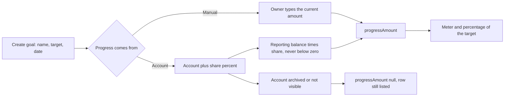

# Goals

Back to the [feature walkthrough](README.md). See also [decisions](../decisions/goals.md).

Backend `Goals`, page `/goals`. Name, target above zero, optional target date. A goal says where its progress comes from, and there are two answers.

A manual goal is the default and behaves as it always did: the owner types a current amount of zero or more, and above the target is allowed. Nothing else moves it.

A funded goal names one account the owner can see and a whole percentage of it, `fundingSharePercent`, from 1 to 100 with 100 as the default. Its progress is that share of the account's reporting balance, worked out while the request is answered and never written down. The stored current amount stays where it is and is not used. A negative balance reads as no progress rather than a negative amount, which keeps the existing rule that a goal's progress is zero or more.

The list answers both kinds in one field, `progressAmount`. For a manual goal it repeats `currentAmount`; for a funded goal it is the computed share; and it is null when the funding account has been archived or is no longer shared with the reader. A null does not fail the list: the row is still returned, and the page shows "Progress unavailable" with no meter instead of a number. `GoalForm` both adds and edits; editing opens "Edit goal" with the goal's name under the title.

Editing switches between the two modes. Switching to account funding leaves the stored `currentAmount` untouched and stops using it, so switching back brings the same amount into use again. Creating or editing with an account that does not exist, or that the signed-in user cannot see, is refused by the service with 400 `reference.notFound`, the same code and shape the recurring bills use for their account; the two cases are indistinguishable on purpose, because telling them apart would say whether somebody else's account exists. A funded goal without an account and a manual goal that names one are refused earlier by the validator, which names `fundingAccountId` as the field at fault.

Balances come from the same service the accounts endpoints use, so investments held on the account count exactly as they do on the accounts page. The list asks for every funding account's balance in one call, whatever the number of goals.

A row reads "€1,200.00 of €2,000.00", and under it "€800.00 left" beside the percentage until the goal is reached. A goal with a target date still ahead and something left to save adds "Estimated €200.00 a month to reach it" after the date. `monthlyToReach` in `features/goals/goal-pace.ts` divides what is left by the months to the date, rounded to whole months with a minimum of one, and rounds up to the cent. It is labelled as an estimate because it assumes even saving and ignores anything the funding account will do.

The dashboard has a Goals card on the current month that lists every goal with its meter, while the `Goals` feature is on; see [Dashboard](dashboard.md#goals).

A goal can be shared with a household; members see and update it, and a goal funded from an account needs an account shared with the same household. See [Households and sharing](households-and-sharing.md#shared-budgets-goals-and-recurring-entries).

## Moving progress without the whole goal

Since 2026-10-01 `PATCH /api/goals/{id}/progress` changes only the saved amount of a manual goal, so a script or Home Assistant can record money put aside without sending the name, target, date and funding back. The body holds exactly one of two fields:

| Body | Does |
| --- | --- |
| `{ "currentAmount": "1500.00" }` | sets the saved amount |
| `{ "delta": "50.00" }` | adds to it; a negative delta takes money out |

The rules are the full update's: the goal must be visible to the caller (404 `resource.notFound` otherwise), a household member may move a shared goal, the amount has at most two decimals and may pass the target. Sending neither field answers `required` on `currentAmount`, sending both `value.mustBeEmpty` on `delta`, a negative `currentAmount` `money.nonNegative`, a delta that would take the amount below zero `money.nonNegative` without a field, and a delta that would take it past the largest amount a money column holds (16 digits before the point) `money.invalid` without a field. A goal funded from an account answers 400 `goal.notManual`, because its progress follows the account; edit it to manual progress first. The answer is the goal as the list shows it.

Two calls on the same goal run one after the other: the service holds the goal's advisory lock inside a transaction while it reads the amount and adds the delta, so two automations firing together both count. A shared goal's change lands in the household activity log as an update of the goal, with the token's name when a token made it.

A read-and-write [personal API token](personal-api-tokens.md#writing-with-a-token) may call the route, and an `Idempotency-Key` makes a retried delta count once. The browser keeps using the full form; there is no separate "Update progress" action on the row.

`GoalProgressTests` (integration) cover a set, an added and a taken-out delta, a delta below zero, a delta past the largest storable amount, an amount above the target, a funded goal, another member's goal, neither or both fields, a partner's write token on a shared goal with the token named in the activity log, a read-only token refused, and a retried delta with the same key added once. `UpdateGoalProgressValidatorTests` pin the validator's codes.
