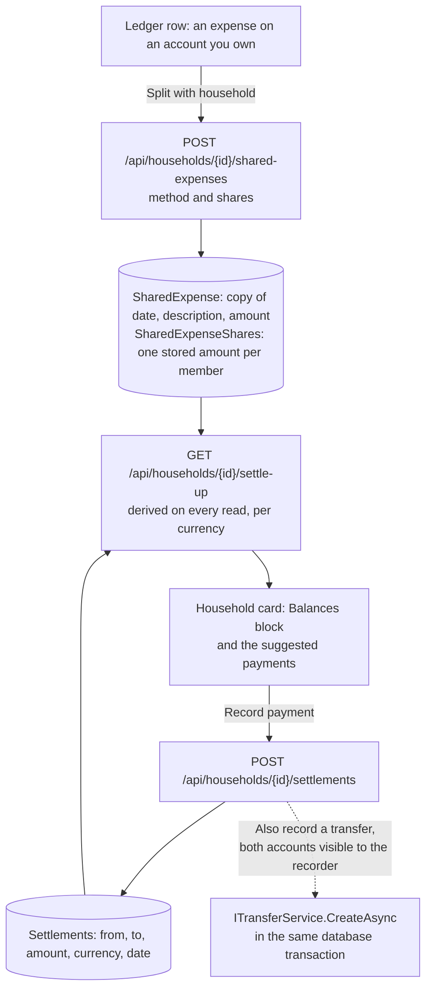
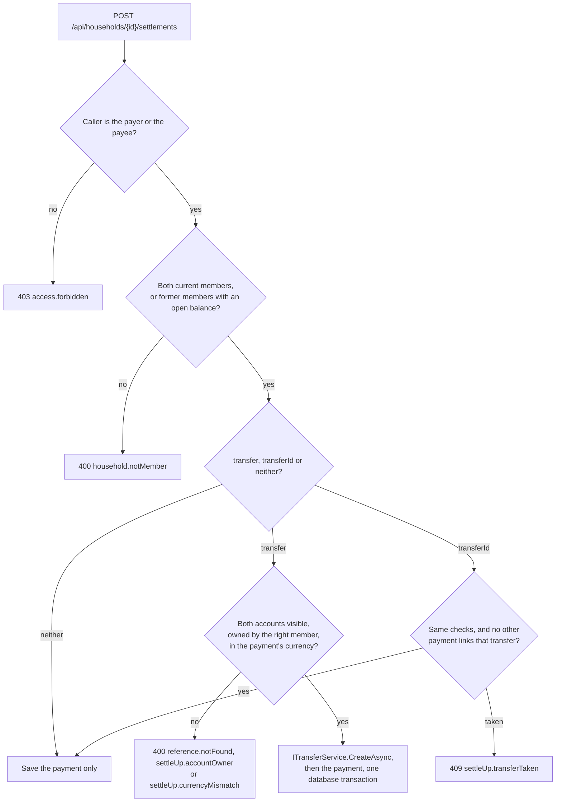

# Household settle-up

Back to the [feature walkthrough](README.md). See also [Households and sharing](households-and-sharing.md), [decisions](../decisions/households-and-sharing.md), [architecture: Sharing and households](../architecture/sharing.md), [Transfers](transfers.md) and [Audit log](audit-log.md).

Backend `Households` (`GetSettleUp`, `GetSharedExpenses`, `CreateSharedExpense`, `UpdateSharedExpense`, `DeleteSharedExpense`, `GetSettlements`, `CreateSettlement`, `DeleteSettlement`, `Services/SettleUpService.cs`), the pure rules `Common/SettleUp` (`ShareAllocator`, `SettleUpPlanner`, `SettleUpText`), the entities `SharedExpense`, `SharedExpenseShare` and `Settlement` with the marker `IHouseholdScoped` in `Domain/Households`, the ledger marker in `Transactions/Services/TransactionService.cs`, and the two kinds in `TrashRestorers`, `Retention` and `AuditCollector`. Frontend `households/split-expense-dialog`, `households/share-allocation.ts`, `households/settle-up`, `households/settlement-dialog`, `households/shared-expenses`, and `transactions/shared-expense` (the row action and the ledger mark). Gated by `Households`; there is no switch of its own.

Shipped on 2026-09-29. A member who paid for the household splits the expense with other members from its row in the ledger; the household card then shows who owes whom, per currency, and the fewest payments that would settle everyone, and "Record payment" writes down that one member paid another, with the ordinary transfer between their accounts when the person recording it can see an account of each.

## Splitting an expense

"Split with household" is offered on a row whose type is an expense with a positive amount, on an account the signed-in member owns, while `Households` is on and the member belongs to a household. It opens a dialog with the household (the active one by default), the method as a segmented control, and one row per member with a checkbox and, depending on the method, a weight or an amount. Under each member the dialog previews what they pay, computed by `share-allocation.ts`, which mirrors `ShareAllocator` and is tested with the same cases; the server stays the authority. On a row that is already split the same action reads "Edit split" and saves with the transaction's current amount, date and description.

The server refuses:

| Case | Answer |
| --- | --- |
| The transaction is not visible to the caller | 400 `reference.notFound` |
| It sits on an account the caller does not own, for example a housemate's payment on a shared account | 400 `settleUp.notPayer` |
| It is income, a refund (a negative expense) or not an expense at all | 400 `settleUp.notExpense` |
| It is split already, in this or another household, including by a request that won the race to the unique index | 409 `settleUp.alreadySplit` |
| A member is not in the household | 400 `household.notMember` |
| Nobody but the payer takes part | 400 `settleUp.noOtherMember` |
| Exact amounts that do not add up to the expense | 400 `settleUp.sharesMismatch` |

Transfers, conversions and investment entries are not transactions of the ledger's expense kind, so they never offer the action.

### The three methods

Each member's amount is computed once, when the split is saved, and stored in `SharedExpenseShares`. Stored amounts keep the history readable when someone joins or leaves later.

- **Equally**: everyone who takes part has weight 1.
- **By shares**: whole weights from 1 to 100, so 2 : 1 gives one member two thirds.
- **Exact amounts**: the amounts typed, which must add up to the expense exactly.

Equal and weighted splits divide the amount in cents by largest remainder: each member first gets the whole cents of their part, and the cents left over go one each to the members with the largest remainders, ties in the order the members were listed. The shares therefore always add up to the amount, and no member is more than a cent away from their exact part. `ShareAllocatorTests` and `share-allocation.test.ts` check both properties over two thousand random splits.

A worked example: 100.00 EUR split equally between three members is 10000 cents; each gets 3333 cents with a remainder of 1, and the one cent left over goes to the first listed. The shares are 33.34, 33.33 and 33.33. Split 10.00 EUR by 2 : 1, the parts are 666.67 and 333.33 cents; the floors 666 and 333 leave one cent, which goes to the larger remainder, so the shares are 6.67 and 3.33.

### When the transaction changes

A split keeps its copy of the date, description and amount; it does not follow the transaction, because a live amount would break exact shares the moment the payer corrects a typo. When the transaction's amount differs from the copy, the payer's ledger row says "The amount changed since it was split" and offers "Update split", which opens the dialog prefilled and saves with `refreshFromTransaction`, copying the current amount, date and description before the shares are computed again.

Deleting the transaction makes its split stop counting, derived on read: the balances skip it and the list shows it with "Not counted while the transaction is deleted". Restoring the transaction from the trash brings it back. Nothing hooks into the delete path, the same reasoning as debt payments, and a [deleted selection](transactions.md#deleting-a-selection-and-moving-it-to-another-account) behaves the same. Moving the transaction to another account from the ledger's selection keeps its split only when the payer owns the new account; otherwise the row stays where it is with `settleUp.notPayer`. The retention purge of a transaction takes its split with it, because the foreign key cascades.

## Who sees what

A split is a household row, not a transaction. Every current member of the household reads it: the payer, the date, the description, the amount, the method, every member's share and their own. The link to the transaction (`transactionId`) and `amountDiffers` are filled for the payer only, because the expense may sit on a personal account the others must not see; a `GET` of that transaction answers 404 for them as before. A personal payment is therefore visible to the others as a description, a date and an amount, and nothing else of the account behind it.

Visibility comes from the query filter of `IHouseholdScoped` (see [architecture](../architecture/sharing.md#household-scoped-records)): a row is visible while the caller is a current member of its household, the household is not deleted, and, while a household is active in the switcher, it is that household. A removed member stops seeing the rows; a deleted household hides them until it is restored.

| Action | Who |
| --- | --- |
| Read the balances, the splits and the payments | any current member |
| Create, change or delete a split | the member who paid, which is the owner of the account |
| Record or delete a payment | either of the two members it is between |

## Balances

Balances are derived on every read from three stored sets: the splits whose transaction is not deleted, their shares, and the payments. For each member and currency:

balance = what they paid for others in splits − what others paid for them + the payments they made − the payments they received

A positive balance is owed to the member, a negative one is owed by them, and the balances of a currency always add up to zero. The card writes them in words, never by colour alone: "You are owed €42.50", "Šarūnas owes €42.50". Currencies are never converted: a household that paid in euros and dollars sees two lines per member, and a payment settles the balance of its own currency.

`SettleUpPlanner` proposes the payments for each currency: it matches the member owed the most with the member who owes the most, pays the smaller of the two amounts, and repeats. Each step settles at least one member completely, so a household of n members needs at most n − 1 payments. The card lists them as "Šarūnas pays Rūta €42.50"; each has "Record payment" when the signed-in member is one of the two.

Only the deleted flag of a split's transaction is read to decide whether it counts, through `IgnoreQueryFilters(QueryFilters.OwnerOnly)`, so nothing else of a personal transaction reaches another member.

### Why reports do not change

The payer's expense counts in full wherever its account is visible, exactly as before; the transfer of a settlement counts nowhere, as every transfer does. The balances are a separate ledger of who owes whom and never enter reports, budgets, the dashboard, net worth or the month-end close. Reports are views of a scope, not of a person: a household-scoped report already sums every shared account, so subtracting shares there would count them twice. A member who is paid back on their own account can record that money as a [refund](transactions.md#refunds) of the split expense, which lowers their spending to their share without a second mechanism.

## Recording a payment

"Record payment" opens a dialog prefilled from the suggestion: paid by, paid to, amount, currency, today's date and an optional note of at most 200 characters. "Also record a transfer" offers an account of the payer and an account of the payee, each filtered to the accounts the recorder can see that belong to that member and are held in the payment's currency. When there is none, the dialog says so and only the payment can be recorded.

A payment and a transfer must be between two different members (400 `settleUp.samePerson`). Two requests linking the same transfer at once both pass the check, and the unique index on `TransferId` answers the loser 409 `settleUp.transferTaken` through `UniqueSave.SaveOrConflictAsync` rather than a 500. `transferId` links a transfer that already exists, for example one the camt.053 import proposed from the counterparty IBAN, under the same checks; the API offers it and the dialog does not. Without either, nothing is written to any account. Deleting a payment leaves its transfer alone, because a transfer is a fact of the ledger with its own delete; purging a transfer clears the payment's link.

## Former members

Removing a member is not refused while they have an open balance: removal is an owner's safety tool. The rows stay, the removed member stops seeing the household and everything in it, and the others still see that member's balance under their name, marked "Former member", and can record a payment with them. Once that balance is zero, a former member can no longer be a party to a new payment. A split can keep a former member who is already on it when the payer edits it, but cannot add one.

## The shared expenses list

"Show shared expenses" on the household card, beside "Show activity", opens two paged lists of ten: the splits, newest first, with the payer, the member's own share and a note when the split is not counted, and the payments, with "With a transfer" when one was recorded. The payer can delete a split and either party a payment, with the undo toast.

## Trash, audit and retention

Deleting a split or a payment is a soft delete with a trash entry (`TrashKind.SharedExpense`, `TrashKind.Settlement`) and the undo toast; the entry belongs to whoever deleted it. Restoring needs the restorer to be a current member of the household. A split whose transaction is deleted or purged answers `restore.referenceMissing`, and one whose transaction was split again since answers `settleUp.alreadySplit`; a payment whose transfer settles another payment now answers `settleUp.transferTaken`. The retention job purges both kinds 30 days after the delete, see [Background jobs](background-jobs.md).

Both kinds are in the household's [activity log](audit-log.md) with the household taken from the row: created, updated, deleted and restored, described as "Maxima, 90.00 EUR, 2 shares" and "Jonas paid Ona 30.00 EUR". A change to the members or their amounts is folded into its split as one `shares` field, the way split lines are folded into a transaction.

## Backups, export and API tokens

Backups carry `SharedExpenses`, `SharedExpenseShares` and `Settlements` with no code of their own, because `BackupDatabase.ReadShapes` reads the model. The [data export per user](data-export-per-user.md) holds the splits the member paid for with their shares, and the payments the member recorded. The three `GET` routes are pure read views of a household, so a [personal API token](personal-api-tokens.md) can read them like the rest of the Households group.
