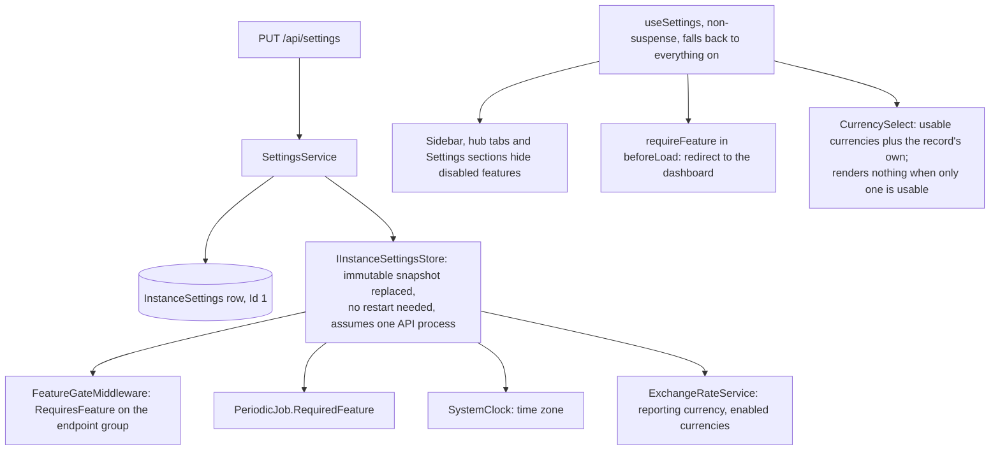

# Installation settings and feature switches

Back to the [feature walkthrough](README.md). See also [decisions](../decisions/installation-settings.md), [architecture: Installation settings](../architecture/installation-settings.md).

Backend `Settings`, page `/settings` with sections `general`, `features`, `currencies`, `regional`, `defaults`, `email`, `discord` and `backups`, shown under Installation on the one Settings page described [below](#one-settings-page). Administrators only; `GET /api/settings/public` is anonymous and carries only the name, the default language, whether this installation can send email and whether it allows Discord notifications.

Each switch is declared by the endpoint groups under these prefixes (`ApiGroup(tag, Feature.X)`); `FeatureGateTests` keeps the groups and the prefixes in step.

| Feature switch | Route prefixes gated | Also stops |
| --- | --- | --- |
| `Budgets` | `/api/budgets` | budget alert job, and the link on a budget alert in the bell |
| `Goals` | `/api/goals` | |
| `RecurringBills` | `/api/recurring-bills` | reminder job, and the link on a bill reminder in the bell |
| `NetWorth` | `/api/networth`, `/api/assets`, `/api/debts` | snapshot job |
| `Reports` | `/api/reports` | |
| `Import` | `/api/import` | |
| `Households` | `/api/households` (list answers empty) | |
| `MultiCurrency` | `/api/conversions` | foreign currency entry |
| `Investments` | `/api/investments` | broker sync job |
| `CategorizationRules` | `/api/categorization-rules` | the rule suggestions in the import preview; the suggested-rule toast after a save |
| `UnusualAmounts` | `/api/transactions/{id}/unusual` (dismiss and its undo), declared on the two endpoints | the unusual-amount job and its notifications, including price rises; the verdict fields of transaction responses, which read as empty; the `unusual` ledger filter, which is ignored; the flag in the import preview; `latestMatch` on recurring entries; the link on the two unusual kinds in the bell |
| `ReceiptReading` | `/api/receipts` | the Fill from receipt action in the transaction form, through `receiptReadingReady` |
| `ApiTokens` | `/api/auth/tokens` (its own group, `ApiTokensGroup`, inside the ungated Auth prefix) | every request made with a personal API token, which answers 404 `feature.disabled` from `PersonalApiTokenGateMiddleware`; the Personal API tokens section in Settings › Personal › Security |
| `MonthClose` | `/api/month-close` | the month-end reminder job; the close panel on the dashboard for an earlier month, its command palette action and the dashboard prompt; the closed-month hint in the transaction and conversion forms; the link on a month-end reminder in the bell |

`UnusualAmounts` is on by default and is the one switch that gates routes inside an ungated prefix: the ledger answers whatever it says, so the two routes carry the feature themselves rather than through their group, and `FeatureGateTests` takes the longest matching prefix. With it off the stored verdicts stay in their columns and come back when it is switched on; rows written meanwhile are checked on the first pass after that. See [Unusual amounts](unusual-amounts.md).

`MonthClose` is on by default too (`HasDefaultValue(true)`) and is listed with the review features in the Features section. With it off every close stays in its table and edits keep stamping `UpdatedAt`, so switching it back on shows each closed month with the drift that happened meanwhile. See [Month-end close](month-end-close.md).

`ReceiptReading` starts on like every other switch (`HasDefaultValue(true)` since the `ReadReceiptsWithTesseract` migration of 2026-09-29, which left an existing installation's value alone). It has no settings of its own: `GET /api/settings` answers `receiptReadingReady`, true when the switch is on and Tesseract is installed where the API runs, and the transaction form shows the action only then. See [Receipt reading](receipt-reading.md#when-the-action-is-offered).

`ApiTokens` is the one switch that starts off (`FeatureFlags.Default`, and `false` for an existing installation through the `AddPersonalApiTokens` migration): an administrator decides whether scripts may reach the installation at all. With it off the token rows are kept, and every token works again when it is switched back on. See [Personal API tokens](personal-api-tokens.md).

The mail server is an installation setting that is not part of this form and not a feature switch. It has its own admin-only pair, `GET` and `PUT /api/settings/smtp`, and its own `enabled` flag, because `GET /api/settings` is readable by every signed-in user and an SMTP user name is a credential; because one save of the main form would have to either resend the password or lose it; and because `forgot-password`, `reset-password` and `verify-email` must keep answering even when sending is switched off, so gating them in `FeatureGateMiddleware` would break links that were already mailed. See [Email](email.md).

Discord follows the same pattern for the same reason: a delivery channel is a setting, a feature switch hides screens. `InstanceSettings.DiscordEnabled` is written through its own admin-only `PUT /api/settings/discord` and carried in the snapshot and in `GET /api/settings/public` as `discordEnabled`. Turning it off stops `DiscordOutboxJob` from claiming and the publisher from queuing, and leaves every member's webhook and the profile's Discord section in place; the section says why it is inactive instead of disappearing, and rows queued before the switch went off are pruned after 7 days rather than posted late. See [Discord notifications](discord-notifications.md).

Turning a feature off deletes nothing; turning it on brings the data back. `/api/notifications` is deliberately not in the table: the notification channel belongs to no single feature, so it answers whatever is switched on, and notifications already raised stay listed and countable after their producer is switched off.

`/api/tags` is not in the table either, and neither is `/api/transactions/bulk-tags`. A tag is an attribute of a transaction, exactly like its category, not a screen with its own data: `GET /api/transactions` would still answer `tagIds` and take the `tagIds` filter, both exports would still have to decide about their tag column and the report about `expenseByTag`, so a switch would buy a hidden management page at the price of a second shape for every one of those. A household that turned it off would also keep rows carrying tags it could no longer read or clear. Categories, the closest thing in the product, have no switch for the same reasons. See [Tags](tags.md).

`CategorizationRules` is in the table for the mirror image of that reasoning. A rule is a screen and a route of its own, and what it produces is ordinary values on ordinary transactions: with the switch off the page leaves the navigation, the routes answer `feature.disabled`, the import preview stops suggesting and carries on importing, and every category and tag a rule ever set stays exactly where it is. Nothing anywhere else needs a second shape. See [Categorization rules](categorization-rules.md).

## The Ko-fi support link

`InstanceSettings.SupportLinkEnabled` (column default true, migration `SupportLinkSetting`) is part of `GET` and `PUT /api/settings` and is edited in the General section as "Show the Support on Ko-fi link". Off hides the button in every user's sidebar and replaces the personal show/hide checkbox under Appearance with a line saying an administrator turned it off. The button is a plain link to the developer's Ko-fi page; Ko-fi's widget script is not used, because the Content-Security-Policy allows same-origin scripts only and the browser makes no third-party request.

## One Settings page

Every user has one Settings entry at the bottom of the sidebar. It covers four routes that keep their own URLs, `/profile`, `/households`, `/users` and `/settings`, and each of them renders inside `SettingsLayout` (`features/settings/settings-nav`): a `SectionLayout` titled "Settings", with the user's email address as its description and a grouped `SectionNav` beside the content. The groups are built per user, and a group with nothing in it is left out:

| Group | Sections | Shown to |
| --- | --- | --- |
| Personal | `profileSections` on `/profile?section=`: account, security, sessions, notifications, appearance, trash, and import while the `Import` switch is on | everyone |
| Shared | Households (`/households`) | everyone, while the `Households` switch is on |
| Installation | `settingsSections` on `/settings?section=`: general, features, currencies, regional, defaults, email, discord, backups; then Users (`/users`) | administrators |

`SectionNav` takes groups of items whose `link` is typed router link options, so one nav can point at several routes. From the `lg` breakpoint it is a sticky column with a label over each group; below that it is one scrolling row without labels. The account section holds only the display name and the password; notification choices moved to the Notifications section, described in [Email](email.md#notification-emails) and [Discord notifications](discord-notifications.md#screens). Import data and Appearance are personal sections only: the installation sections used to repeat them, and a link to `/settings?section=import` or `appearance` now opens the General section. Users and Households put their title and a small outline create button ("Create user", "Create household") in a `SectionHeader` inside the layout, instead of a page header of their own.
