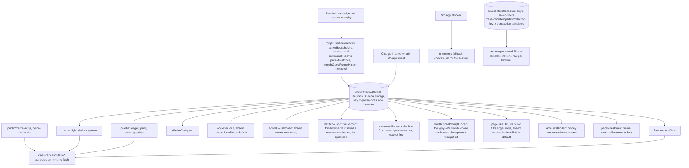
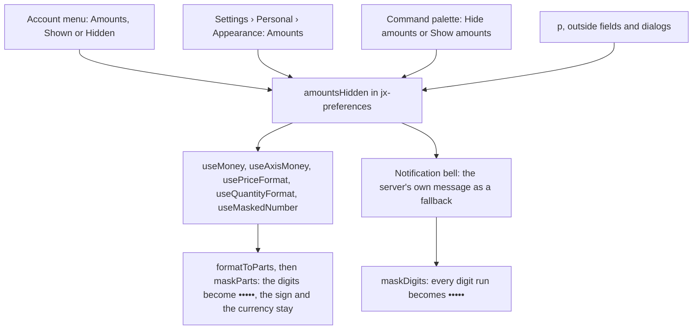
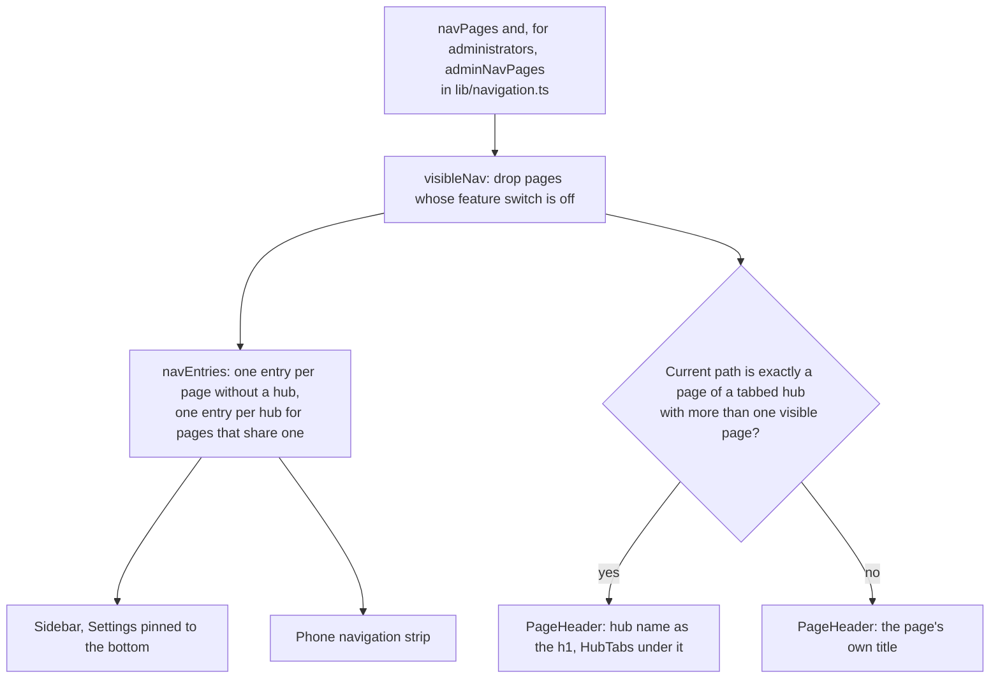
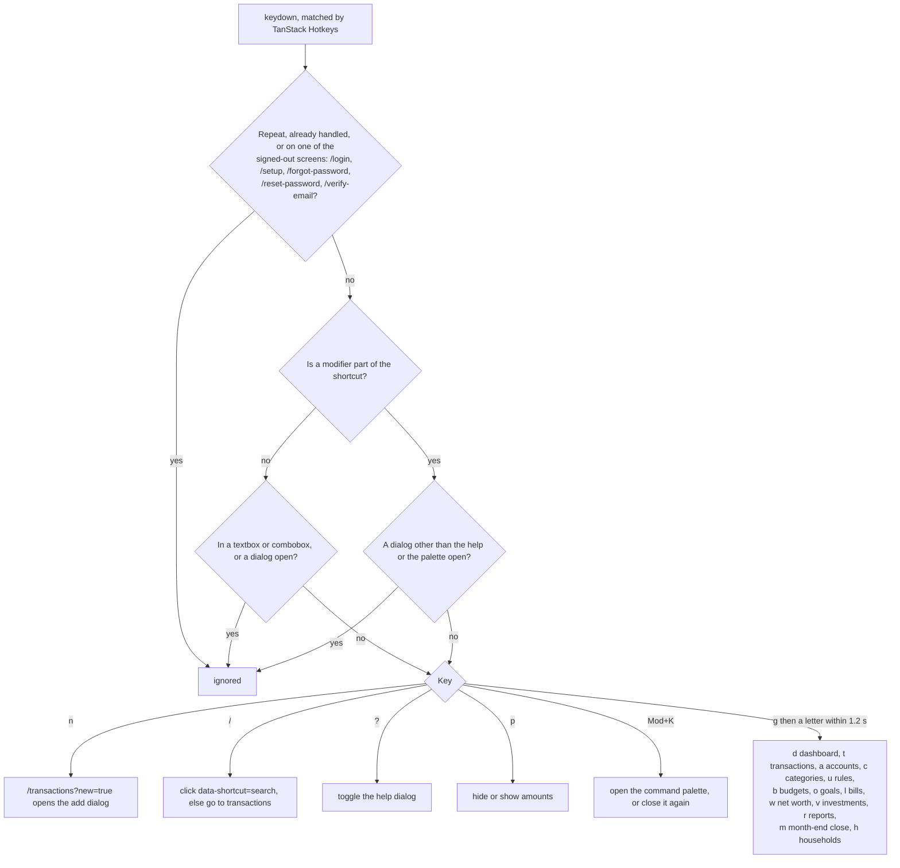
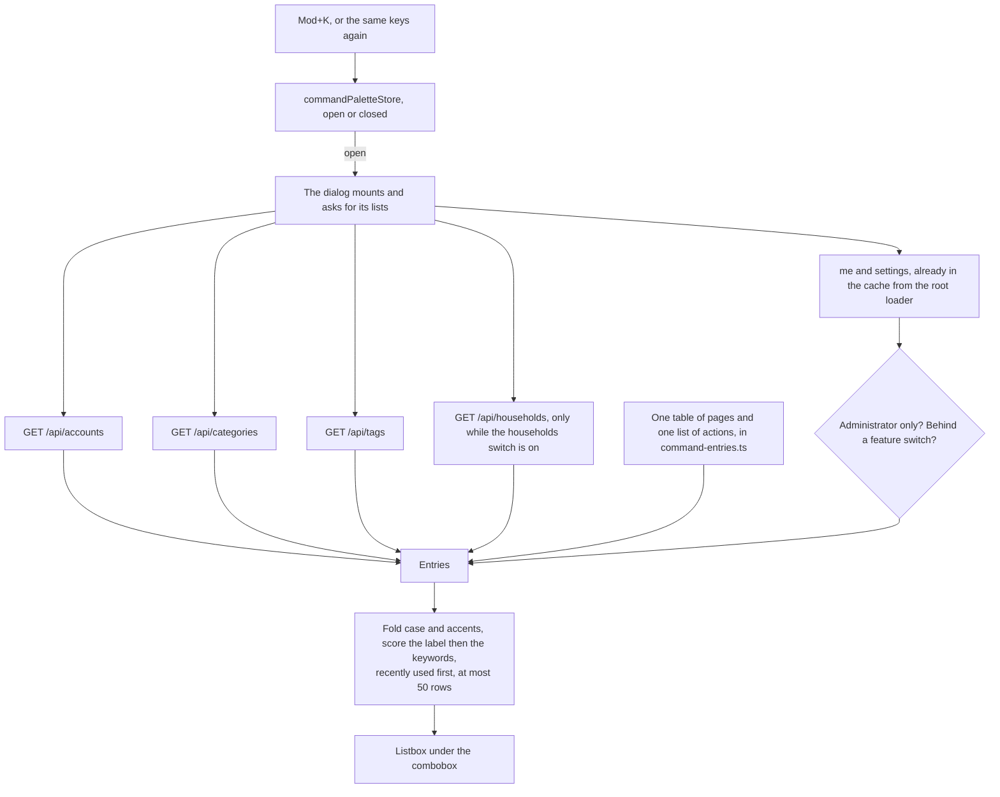
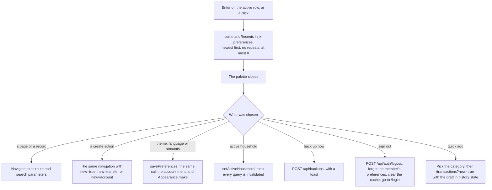
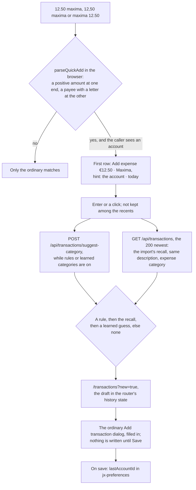

# Interface

Back to the [feature walkthrough](README.md). See also [decisions](../decisions/interface.md), [architecture: Visual system and motion](../architecture/visual-system.md), [architecture: Accessibility and keyboard shortcuts](../architecture/accessibility.md).

Since 2026-09-30 `pageSize` in this row sets how many rows a ledger page holds. Settings › Personal › Appearance ends with a "Ledger" section whose "Rows per page" offers "Installation default (20)", with the administrator's number, and 10, 20, 50 and 100; the default removes the key. The ledger page, its pending skeleton and the route loader's prefetch all read `pageSize ?? defaultPageSize`, so the warmed query is the one the page asks for, and any other stored value parses as absent. It is per browser, like the text size, because the right number depends on the screen.

The language is read from `locale` in this row, per browser, and falls back to the installation default. Since 2026-09-29 `setLocale` also saves a signed-in member's pick on the server with `PUT /api/users/me/language`, ignoring a failure, so that email and Discord messages reach them in the language they read; the root route's loader sends an earlier pick once when the profile has no language yet. The server copy is never read back into the interface. See [Monthly digest](monthly-digest.md#the-members-language).

Since 2026-10-01 the row splits into the device's choices and the signed-in member's. `endSession` in `src/lib/auth-gate.ts` is the one way a session ends in the browser: sign out from the account menu or the command palette, a backup restore, and the client's expired-session handler all call it. It calls `forgetUserPreferences` from `src/stores/preferences.ts` before it clears the query cache, which removes `activeHouseholdId`, `lastAccountId`, `commandRecents`, `paceMilestones` and `monthClosePromptHidden`. The next person to sign in on a shared computer starts from Everything, with no recents, milestones, quick add account or put-off close prompt of the last one. The theme, palette, font, text size, sidebar, language, rows per page and hidden amounts belong to the device and stay. Nothing is written when the browser has no stored row yet.

Two more collections sit beside the preferences row and follow the same rules: a zod schema per row, an explicit storage key, the same in-memory fallback, and the same cross-tab updates. They hold the saved ledger filters and the transaction templates described in [Transactions](transactions.md). Unlike `jx-preferences` they are lists, so each row carries its own id and name; nothing in them ever reaches the server.

## Hide amounts

Since 2026-09-30 a member can hide every money amount on screen, for a café, a shared screen or a screen share. The switch has four places: the Amounts row of the account menu, which names its current value like the language and theme rows and stays open when pressed; the Amounts choice under Appearance in Settings (`/profile?section=appearance`); the command palette entry, which reads Hide amounts or Show amounts; and the `p` key. `p` is a bare key like `n` and `/`, so it is ignored while a field has focus or a dialog is open. The choice is `amountsHidden` in `jx-preferences`, kept per browser like the theme, so a laptop can keep it on while the desktop at home does not. The collection reads local storage when its module loads, so a reload renders hidden from the first paint.

While it is on, an amount keeps its currency sign and its plus or minus sign and loses its digits: `€•••••` or `−€•••••` in English and `−••••• €` in Lithuanian. A compact chart axis loses its magnitude too, so `€1.2K` becomes `€•••••`. Investment prices and quantities are hidden as well, because together they give away a holding. The amounts inside translated sentences are hidden with them, because every one of them is formatted by the same hooks: the bell's texts, the unusual-amount badge, the refund mark, the "was" line of a comparison and the amount range chip of the ledger filters. When the bell falls back to the server's own message, because a notification carries no structured payload, every digit in it is masked, a date included.

What stays visible:

- percentages, exchange rates and the ratio of an investment split, because a ratio does not say how much money there is;
- budget and goal meters and the shapes of charts, for the same reason;
- form inputs, which keep their real values: opening an edit dialog is a deliberate look at one row, and a masked input cannot be edited;
- raw text that the application does not format: bank descriptions, notes, the sample rows of the CSV column mapping and of the broker trade import, and the unread lines of a receipt review;
- everything that leaves the screen on purpose: exports, emails, Discord messages and the monthly digest.

The mode never turns itself on; only the member switches it.

## Navigation

Every page in the main navigation is a row of `navPages` in `lib/navigation.ts`, with `/users` and `/settings` in `adminNavPages`. A row may name a `hub`, and `navHubs` gives each hub its label, icon and whether it shows tabs:

| Hub | Pages, in tab order | Tabs |
| --- | --- | --- |
| Categories | `/categories`, `/tags`, `/categorization-rules` (tab "Rules") | yes |
| Plan | `/budgets`, `/goals`, `/recurring-bills` | yes |
| Wealth | `/net-worth`, `/investments` | yes |
| Settings | `/profile`, `/households`, `/users` (administrators), `/settings` (administrators, labelled "Installation") | no |

`navEntries` in `lib/navigation.ts` folds the visible pages into one entry per hub, in the order of the table. The entry links to the hub's first visible page and is marked current when the path is inside any of its pages (`isPathIn`, so `/net-worth/debts/…` keeps Wealth current). A tabbed hub with a single visible page, such as Wealth with investments switched off, shows that page's own name and icon instead of the hub's. For a user the sidebar reads Dashboard, Transactions, Accounts, Categories, Plan, Wealth and Reports, with Settings at the bottom (`mt-auto`); the phone header and navigation strip, `MobileNav` in `components/app-sidebar/mobile-nav.tsx`, are built from the same entries. `useVisibleNav` in `src/hooks` gives both the pages the user may see, and `isPageEnabled` in `lib/navigation.ts` is the one feature-switch check that the sidebar and the hub tabs share. The user tile in the sidebar foot opens `AccountMenu` (`components/account-menu`): the profile, the language, the theme and whether amounts are hidden with their current values, keyboard shortcuts and sign-out. The phone header shows the same menu behind the initials.

`useHubTabs` in `components/hub-tabs` looks up the current path. When it is exactly a page of a tabbed hub and the hub has more than one visible page, `PageHeader` shows the hub's name in the `h1` instead of the page title, draws `HubTabs` (links with the page icons, `aria-current="page"` on the current one, `preload="render"` so the sibling tabs' code and queries load as soon as the strip appears) under the title row, styled with the `tabsListClass` and `tabsTabClass` that `TabsList` uses, in one row that scrolls sideways rather than wrapping, and drops the page's description line. Sub-routes such as `/net-worth/debts/$debtId` are not pages of a hub and keep their own title. Settings is not tabbed: its pages share `SettingsLayout` and a grouped section nav, described in [Installation settings](installation-settings.md#one-settings-page).

Routes, URLs and shortcuts did not change with the hubs: `/budgets` is still `/budgets`, and `g b` still opens it. The shortcuts and the command palette read the page tables, not the entries, so the palette still lists every page, including `/profile`, whether or not the page has its own sidebar entry.

## Keyboard shortcuts

The go-to letters come from `navPages` in `lib/navigation.ts`, the table the sidebar is drawn from, so a page behind a switched-off feature has neither a navigation entry nor a working letter. A letter opens its page, not its hub: `g o` opens Goals directly on the Goals tab of Plan. `/profile`, `/users` and `/settings` have no letter.

Saved filters, templates and Duplicate got no shortcut, and they are not in the help list. The scheme knows five actions — go to a route, focus the search box, toggle the help, open the palette, hide or show amounts — and every one of them is global. Duplicate needs a row the keyboard has no way to point at, because the ledger has no row cursor, and a saved filter or a template is a popover on one page rather than a destination with a URL. A shortcut for either would have to invent another action kind and a page-local registry for two menus.

Every signed-out screen is now excluded, not only `/login` and `/setup`: the password reset and address confirmation pages were pressing keys that would have bounced the reader off the page they arrived at from an email, and the palette in particular must not leave itself open behind a sign-in it never saw.

`Mod+K` is the one shortcut with a modifier: `Ctrl+K` on Windows and Linux, `⌘K` on macOS, written once as `Mod+K` and resolved per platform by TanStack Hotkeys. It is also the only one that still fires while a field has focus, which is what a palette needs and what a bare letter cannot have: every bare key in this scheme is deliberately swallowed by an input. It still steps aside for an ordinary dialog, so the palette never opens on top of a half-filled form, and the palette's own dialog is excluded from that rule so the same keys close it. The help list prints it through `formatForDisplay`, so a Mac reads `⌘K` where Windows reads `Ctrl+K` while every bare key is printed as it is written.

## Command palette

One shortcut opens a search box over the whole application. It offers three kinds of entry: a page, a record and an action.

Pages come from one table in `frontend/src/features/command-palette/command-entries.ts` rather than from the route tree, because a route is a path while an entry is a name a person types and a place with a title: the table carries both, and it also carries the sections that have no route of their own — the trash, the signed-in browsers, two-factor sign-in, notifications, the import and the appearance on `/profile`, the tax summary view of the investments page, and the feature, email, Discord and backup sections of the installation settings. Every row names the feature switch or the administrator role it needs, checked against the same `settings.features` and `me.role` the sidebar and the route guards use, so nothing in the list can lead to a 404 or to the redirect a guard would answer with. Every entry that navigates carries a `LinkOptions` built with TanStack Router's `linkOptions`, so a section's search parameters, a record's ledger filter and a create action's `new` are checked against the route's search schema when the code compiles, and the palette passes it to `useNavigate()` as it is.

Records are the accounts, the categories and the tags the caller can see; choosing one opens the ledger filtered to it, which is the ledger's own `accountId`, `categoryId` and `tagIds` parameters and not a new screen. There is no server-side search: the three lists are the complete, already-paged-free lists the ledger page loads anyway, they are filtered in the browser, and an installation would have to reach thousands of accounts before that stopped being instant. Transactions are deliberately not searchable from here — that is a paged, filtered query the ledger already answers far better than a fifty-row list could.

Actions are the ones that exist today and that the caller may run: a new transaction, a new transfer, a new account, "Close last month" while the `MonthClose` switch is on, a backup for an administrator, signing out, switching the theme, switching the language, hiding or showing amounts, and switching the active household. "Close last month" opens the dashboard on the latest ended month (`/?month=yyyy-MM`), where the [Month-end close](month-end-close.md) panel sits above the cards. The three create actions travel through the URL — `/transactions?new=true`, `/accounts?new=transfer` and `/accounts?new=account` — so the back button undoes them and the palette needs no handle on a dialog it does not own; the accounts page gained that `new` parameter for this, the way the transactions page already had one. Typing an amount and a payee adds one more, [quick add](#command-palette), described below. The household entries are listed only while the switch is on and the caller has a membership, and the scope the caller is already in is left out rather than listed as a choice that would do nothing.

Matching folds case and accents away — `NFD` with the combining marks removed — so `kavines` finds "Kavinės ir restoranai" and `KAVINĖS` finds it as well. A query is scored against the label first: an exact name, then a prefix, then the start of a word, then anything contained, then a subsequence, which is the fuzzy part that lets `rue` find "Recurring entries". A few entries carry keywords as well — a section carries its parent's name, an account carries its IBAN — and a keyword match is always ranked behind every label match rather than mixed in with them. Ties are broken by what was used recently, so with the box still empty the last eight choices stand at the top in the order they were made, and with something typed a recent entry only wins against an equally good match. There is no debounce and nothing is deferred: the filter is a single pass over a few hundred strings already in memory, with no request behind it, so a timer would only add latency to every keystroke.

Nothing is loaded for the palette while a page is merely open. The dialog is mounted only while it is open, and mounting is what asks for the accounts, the categories, the tags and, when the households switch is on, the households. Every one of those is a list some page already loads, so on most screens the cache answers all four without a request; they are held for five minutes, so opening the palette a second time asks for nothing. `me` and the settings are already warmed by the root loader. A list that fails is quiet: it contributes no entries, and the pages and actions are there either way.

**Quick add.** Typing an amount and a payee, such as `12.50 maxima`, `12,50 maxima` or `maxima 12.50`, puts one more row at the top of the list: "Add expense €12.50 · Maxima", with the account and "today" as its hint.

`frontend/src/features/command-palette/quick-add.ts` reads the text in the browser, so typing sends nothing. The amount is the first or the last word or words: a dot or a comma before one or two decimals, and a space, a dot or a comma between groups of three digits, the same separator throughout and different from the decimal one, so `1 234,50`, `1.234,50` and `1,234.50` all read as 1234.50 and `1,234` as 1234. A sign or a zero is not an amount, and the payee needs at least one letter, so `-3 maxima` and `12.50 13` offer nothing. The payee keeps what was typed, Lithuanian letters included, with its first letter in capitals, and becomes the description. The row stands outside the fuzzy ranking, because what was typed is not a name to match, and it is not remembered among the recents, because it is a different row every time.

The row is offered only when the caller can add a transaction at all, which in the browser means they can see an account; the ledger disables Add transaction for the same reason. The account is the one this browser last saved a new transaction on (`lastAccountId` in `jx-preferences`, written by the create dialog), then the installation's default account, then the first account. The amount in the label goes through `useMoney` in that account's currency, so while amounts are hidden it reads "Add expense €••••• · Maxima".

Choosing it opens the ordinary Add transaction dialog filled in, an expense dated today on that account with the amount and the description, through the same `/transactions?new=true` as New transaction. Nothing is written until the member presses Save, so the form's validation, the closed-month hint, Save and add another and the suggested-rule toast apply as they do to any new transaction. The draft travels in the router's history state as `transactionDraft`, not in the URL, so the description never reaches the address bar, and Back and Forward close and reopen the dialog with the same draft. Before navigating the palette picks the category, in this order: the caller's first matching categorization rule, then the recall the import uses (the newest of the 200 newest transactions with the same description and an expense category), then a learned guess while `LearnedCategories` is on, otherwise none. The rule and the guess come from one call to `POST /api/transactions/suggest-category`, made only while `CategorizationRules` or `LearnedCategories` is on; the recall reads `GET /api/transactions` with the import's parameters and keeps the answer for five minutes. Both are silent, and a failure only leaves the category empty.

The dialog is a Base UI dialog with an `sr-only` title and description; the box inside it is a combobox with `aria-expanded`, `aria-controls` and `aria-activedescendant`, and focus never leaves it — the arrow keys, `Home` and `End` move the active descendant through the listbox, `Enter` runs it, `Escape` closes, and `Mod+K` closes it too. The options still carry `tabIndex={-1}` and an Enter or Space handler although they never take focus, because the `jsx-a11y` rules `interactive-supports-focus` and `click-events-have-key-events` require both on a clickable option. A query nothing answers removes the listbox rather than leaving an empty one: `aria-expanded` becomes false, `aria-controls` is dropped, and a sentence takes its place. A visually hidden `role="status"` announces how many rows are showing. The stories cover opening, filtering, choosing with the keyboard, the empty state, the role and feature gating, the ordering of recents and quick add with amounts shown, with amounts hidden and without an account, and each of them is scanned by axe. `quick-add.test.ts` covers the parser, the account and the category order, and `command-palette.test.tsx` follows `9,99 eurovaistinė` into the filled-in dialog with the recalled category.

Below the `md` breakpoint the sidebar becomes a compact header with a scrolling navigation strip of the same hub entries, tables become lists (`TransactionsList`) and filters move into a dialog; both layouts share one data source and the switch is CSS only.

`activeHouseholdId` is the only preference the server reads: the API client puts it on every request as `X-Active-Household`, and `HouseholdSwitcher` invalidates every query after a change so the whole application reloads under the new scope. It sits under the brand in the sidebar and beside the brand in the phone header, shows the current scope, and renders nothing for a user with no household. See [Households and sharing](households-and-sharing.md).
