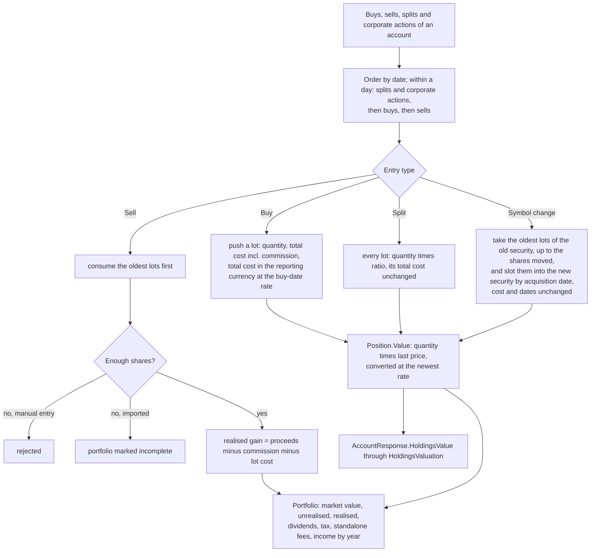
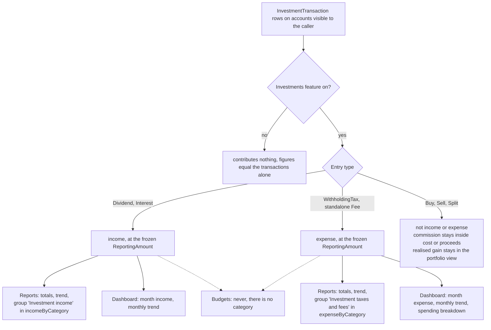
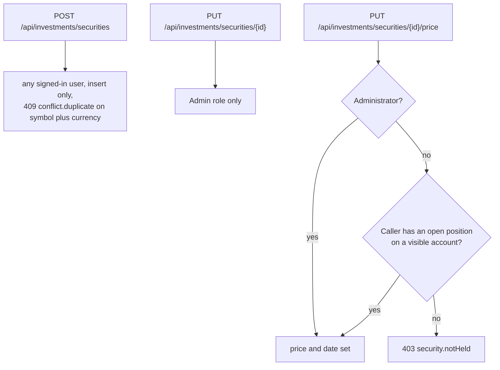
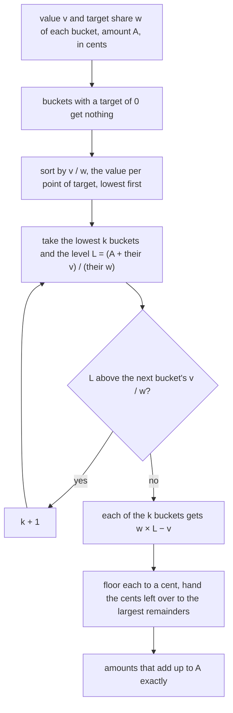
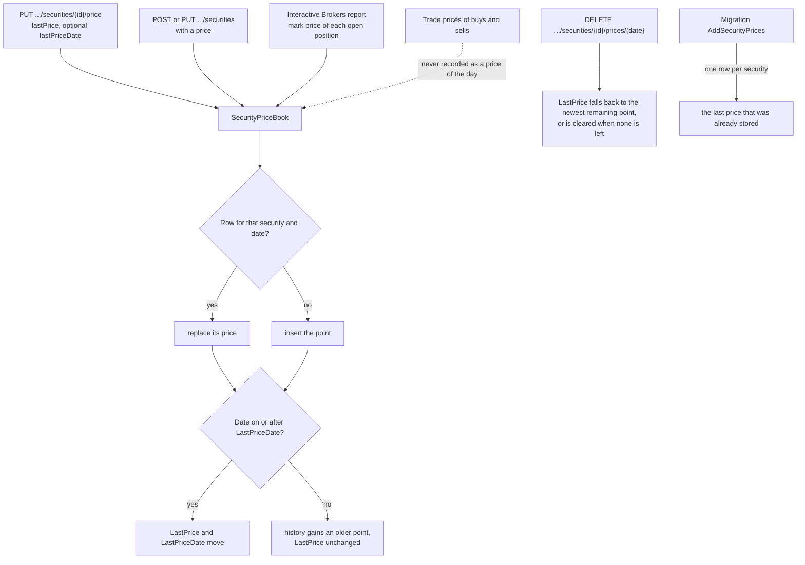
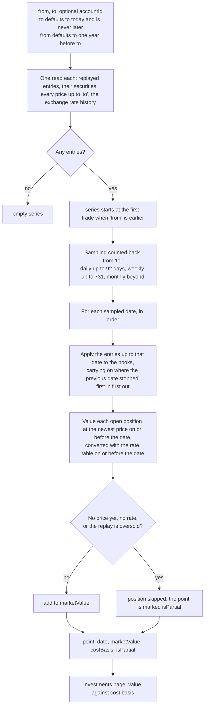
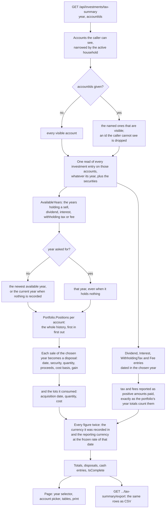
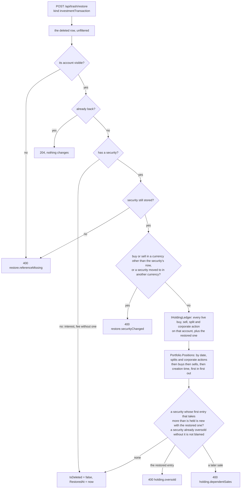
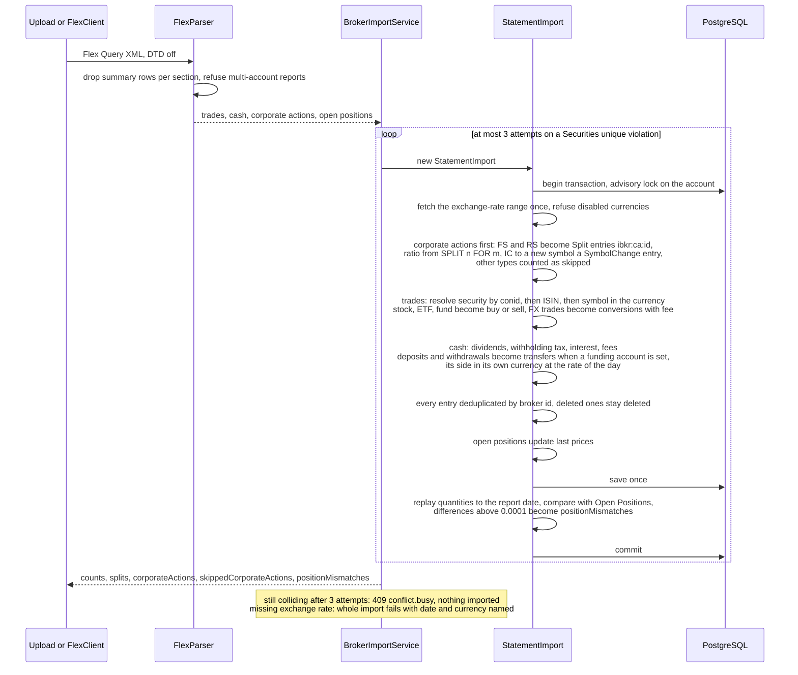
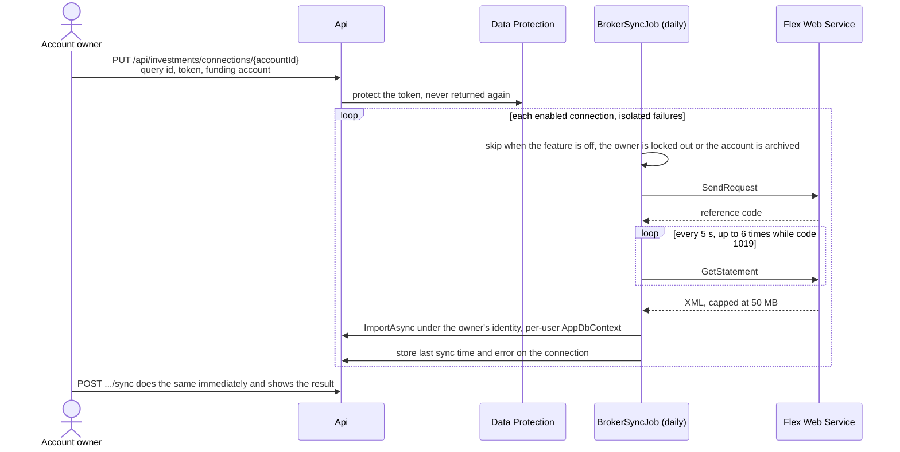

# Investments

Back to the [feature walkthrough](README.md). See also [decisions](../decisions/investments.md), [architecture: Investments](../architecture/investments.md).

Backend `Investments` (`InvestmentService`, `HoldingsValuation`, `BrokerImportService`, `StatementImport`), `Infrastructure/Brokers/InteractiveBrokers` (`FlexParser`, `FlexClient`), page `/investments`.

The page has two views of one route. The portfolio view carries the account filter, the new entry, import and securities dialogs; the tax summary (`view=taxSummary`) has its own header with only the way back. The account filter is the `accountId` search parameter, and the route checks it before the page loads: an id that is not one of the caller's accounts redirects to all accounts, so the page uses the parameter as it is. Choosing another account starts the activity list over, with its type filter cleared and the first page shown. The entry, security and price forms each own their save, close themselves when it succeeds and show its error in place.

## Positions by replay

A lot keeps its total cost, not a cost per share, in the security's currency and in the reporting currency. A sale that takes part of a lot takes cost times the quantity taken divided by the lot's quantity and leaves the lot the exact remainder; a sale that takes the whole lot takes whatever cost is left. Selling a lot in any number of pieces therefore adds up to exactly what it cost, which a per-share cost multiplied back could miss by a fraction of a cent. The portfolio's reporting-currency cost basis is this frozen buy-date cost, the same figure the value chart and the tax summary use, while market value is converted at the newest rate. A holding's dividends are in the security's currency; a dividend recorded in another currency is converted at the rate on its own date, and one with no rate marks the portfolio incomplete.

## Corporate actions

A split changes the quantity of one holding. Since 2026-10-02 a corporate action that moves a holding from one security to another is an entry of its own that names both, the security it leaves in `securityId` and the one it moves to in `relatedSecurityId`, so the replay carries the lots across and every earlier entry stays on the security it was recorded against. Editing the security instead would rewrite the history: the old trades would show the new symbol, and a price history kept under the old symbol would value the new one.

**Symbol change.** An issuer renames a security, or its ISIN changes with a new symbol, and the holding continues. Add entry, type Symbol change, takes the security, "Moves to" (the new security, in the same currency) and "Shares moved". The replay takes that many shares from the oldest lots of the old security, exactly as a sale would, and slots them into the new security in acquisition-date order with their cost in both currencies and their acquisition dates unchanged, so a later sale of the new security reports the date of the original purchase in the tax summary. No cash moves, nothing is realised, and it is not a flow of the annualized return. Shares moved beyond what is held make the entry oversold like a sale: a typed entry is refused with `holding.oversold`, an imported one marks the portfolio incomplete. The activity list shows it as "Symbol change ASML" with "6 to ASMLN" in its details and No cash in place of an amount.

| Rule | Error code |
| --- | --- |
| A symbol change has a security, a security it moves to and a quantity above 0 | `required`, `quantity.positive` |
| The security it moves to is another one | `value.mustDiffer` |
| Both securities trade in the same currency, because the cost moves from one to the other | `holding.currencyDiffers` |

The checks that guard sales guard these entries too. Every create, edit, delete and restore replays the whole account, because lots now pass between securities, and refuses a change that leaves an entry of any security of the account oversold that was not oversold before: deleting a symbol change that a later sale of the new security depends on answers `holding.dependentSales`, as deleting a buy does. A security whose currency is locked by its entries counts an entry that names it as the security moved to.

## What feeds reports and the dashboard

Dividends, withholding tax, interest and fees move cash on the account through `CashAmount`. Since 2026-09-20 they also count in reports and on the dashboard, read by `IInvestmentCashFlowService` (`Common/InvestmentCashFlows`): dividends and interest as income, withholding tax and standalone fees as expense. Buys, sells and splits do not, and the realised gain of a sale is shown only in the portfolio. They never reach budgets, because a budget belongs to a category and these entries have none, and they are not rows of the transaction CSV or PDF export. The details of the response are on the [Reports page](reports.md).

## Who may write a security

Deleting a point of the price history, and importing a price file into it, is allowed under the same rule as setting a price. The price source and price symbol of a security are set by administrators only, see [Live security prices](live-prices.md#mapping-a-security).

The price dialog opens from a position's price and reads the security from the portfolio's holdings. Setting or deleting a price refreshes the portfolio, so the dialog shows the new last price without loading the list of securities.

## Annualized return and allocation

Since 2026-09-30 `GET /api/investments/portfolio` also answers `annualizedReturn`, `byType` and `byCurrency`, for the same accounts as the rest of the response.

**Annualized return** is the money-weighted return, the rate at which every cash flow of the chosen accounts, discounted to the first one, adds up to zero: each entry except splits contributes its `ReportingAmount` on its date, signed as it moved the cash (a buy negative, a sale, dividend or interest positive, withholding tax and fees negative), and today's market value counts as the last flow. `MoneyWeightedReturn.Annualized` in `Domain/Investments` finds it by bisection between −99.99% and 10,000% and answers a fraction rounded to four places, such as `0.0734`. It is null when the flows do not go both ways, when they span fewer than 30 days (a week's gain as a yearly rate says nothing), when no rate in that range fits, and whenever `isComplete` is false, because a missing price would understate the value. The summary shows it as "Annualized return +7.3%", with the gain or loss tone, under the line "Money-weighted, all entries and today's value".

**Allocation.** `byType` and `byCurrency` sum the reporting-currency market value of the open holdings that have one by security type (`stock`, `etf`, …) and by the security's currency (`eur`, `usd`, …), largest first. The allocation section, which already drew the holdings by security, gains a Security, Type and Currency switch over the same bars.

## Target allocation

Since 2026-10-01 a member can set the share each bucket of the portfolio should have, and the allocation section compares the holdings with it and splits a new amount to invest. It is arithmetic on recorded holdings at their last prices, not advice, and the section says so in English and Lithuanian under the rows. Nothing is bought, sold or recorded.

**Targets.** "Set targets" (or "Edit targets") beside the Security, Type and Currency switch opens a dialog. The member picks one dimension, Type, Currency or Security, and types a percentage per bucket: every security type is listed, and for currency and security the buckets held now plus any that already have a target. The dialog shows the running total, and saving needs the filled shares to add up to exactly 100; leaving every share empty removes the targets. A bucket that is held but has no share counts as a target of 0%, so there is no "unassigned" remainder. Targets are kept per member on the server in `AllocationTargets`, so they follow the member across devices and are the same whichever account or household is chosen. `GET /api/investments/allocation-targets` answers `dimension` (null without targets) and `targets` of `{ key, share, symbol }`, largest share first, `symbol` filled for a security; `PUT` replaces every target with the ones sent, all in one dimension.

| Rule | Error code |
| --- | --- |
| A share is from 0 to 100 with at most two decimals | `allocation.shareInvalid` |
| The shares add up to exactly 100, unless the list is empty | `allocation.sharesTotal` |
| A key is a security type (`etf`), a currency (`eur`) or the lower-case id of a stored security, matching the dimension | `allocation.bucketUnknown` |
| A bucket appears once | `allocation.bucketDuplicate` |
| At most 100 targets | `collection.invalidSize` |

**Drift.** When the switch shows the dimension the targets are set by, the section opens on it, and each bucket's row shows its value, its current share of the holdings shown, a mark on the bar at its target, and "Target 60% · 8.4 points below". A bucket with a target that is not held is listed with nothing in it. On another dimension the plain bars stay, with "Your targets are set by Type." The holdings are the ones the portfolio already shows: the accounts the caller can see, narrowed by the active household and by the account filter, valued at their last price and converted at the newest rate; a holding without a price is left out, as it is from `byType` and `byCurrency`. A closed position no longer appears in the Security view, and the section now shows from the first valued holding rather than the second, because a member with one fund may want a target for a second one.

**Splitting a new amount.** Below the rows "New amount to invest" takes an amount in the reporting currency, and every row that would receive part of it shows "Add €922.79, then 8%". The split is computed in the browser by `splitContribution` in `features/investments/allocation-split.ts`, without selling anything:

The amount goes first to the bucket furthest below its target, measured against the target, and lifts the buckets below the level together so that each one it funds ends at the same fraction of its target. A bucket that would still be above its target after the amount is added gets nothing, an amount too small to reach any target goes to the most underweight bucket alone, and an amount large enough brings every bucket exactly to target. Privacy mode masks the values and the amounts to add; the shares, the targets and the drift stay visible.

## Price history

Since 2026-09-20 a price is kept per security and date in `SecurityPrice`, and `Security.LastPrice` remains the newest point. Every write goes through `SecurityPriceBook`, so the ways a price can arrive cannot disagree. Since 2026-09-30 each point also carries its source (typed, broker, file or fetched), a price file can be imported into the history, and the server can fetch closing prices daily; a fetched price never replaces one of another source. The diagram shows the member sources; the file import and the fetch are on [Live security prices](live-prices.md).

## Portfolio value over time

`GET /api/investments/value-history` computes the series on every request; nothing is stored. Net worth snapshots remain the only stored value series, and they cover the whole net worth rather than the portfolio.

Visibility follows the account as everywhere else, so a point only holds what the caller may see. The cost basis of each point is the reporting-currency cost of the lots still open on that date, which is why a sale lowers both lines at once.

The replay used to start from scratch at every sampled date, so a year of daily points over a busy account replayed the whole history 365 times. The entries are sorted once into the order the replay wants — `Portfolio.InOrder`, that is by date, then splits before buys before sells, then by creation — and a pointer walks forward as the sampled dates advance, applying each entry to its account's book exactly once with `Portfolio.Apply`. A position only ever moves forward, so the book at a sampled date is the same object a full replay of that prefix would have built; `PortfolioTests` asserts that against the full replay for each prefix. The cost is now the number of entries plus the number of points instead of their product.

## Yearly tax summary

Since 2026-09-21 the investments page has a second view, `/investments?view=taxSummary`, that shows one calendar year of what was recorded. It is a summary of recorded data and not tax advice: it applies no tax, no rate and no allowance, it computes nothing that could be called an amount owed, and it names no tax form. The page says so in English and Lithuanian above the tables. The Lithuanian annual declaration was the reason for building it, but everything on it is a neutral restatement of entries that already exist.

Where each number comes from:

| On the page | Read from | Frozen at |
| --- | --- | --- |
| Proceeds of a disposal | the sell entry's `CashAmount` (price times quantity less commission) | `ReportingAmount`, the rate of the sell date |
| Cost basis of a disposal | the buy entries the first-in-first-out replay consumed, commission included | each buy's `ReportingAmount`, the rate of its own buy date |
| Gain or loss | proceeds minus cost basis | the same two |
| A consumed lot | one buy entry, or the remainder of one, after every split that followed it | as above |
| Dividends, interest | `CashAmount` of `Dividend` and `Interest` entries | `ReportingAmount` |
| Withholding tax, fees | `CashAmount` of `WithholdingTax` and standalone `Fee` entries, sign flipped to the amount paid | `ReportingAmount` |

Nothing here reads a price. `SecurityPrice` and `Security.LastPrice` decide unrealised value only, so adding, changing or deleting a price cannot move a figure on this page. The price history described above and this summary never meet.

It also does not add anything to what reports already show. Since 2026-09-20 dividends and interest count as income in reports and on the dashboard, and withholding tax and standalone fees as expense; this page lists those same entries one by one for a single year, so a reader sees the detail behind a number they have already seen rather than a second number to add to it. The realised gain of a disposal is the one figure reports never carry, because a sale is not income; before this page it existed only as a portfolio total and a per-year row.

`IsComplete` is false when the replay of a chosen account is oversold, which happens when an imported sale has no recorded purchase behind it. The page then says that a cost basis is incomplete instead of hiding the year.

The chosen year and account selection travel in the URL (`taxYear`, `taxAccounts`), so the back button undoes a change, a reload keeps it and a printed page matches what was on screen. Nothing chosen means every visible account, which is also what the endpoint does when `accountIds` is absent.

### CSV and printing

`GET /api/investments/tax-summary/export` answers the same year as a CSV attachment named `investment-tax-summary-<year>.csv`, written the way the transaction CSV is: a `StreamWriter` over the response body, rows written as they are produced, no `Content-Length`, and a text cell that begins with `= + - @`, a tab or a carriage return gains a leading quote. It differs in one way, and the [decision log](../decisions/investments.md) records it: the rows cannot be streamed straight out of a query, because a first-in-first-out cost basis needs the whole history of a holding before the year can be reported, so the year is computed once in memory and then written out. The set is bounded by one year of one caller's entries. The columns are on the [Exports page](exports.md).

The printable view is the page itself under a print stylesheet, not a second document. MigraDoc, which makes the transaction PDF, lays the whole document out in memory and therefore needs `App:PdfExportMaxRows`; a second MigraDoc document would mean a second layout of the same tables, a second row cap, and English-only text, because the PDF is written in the backend while this page is translated in the browser. Printing the page instead reuses the tables, the locale, the reporting-currency formatting and the frozen amounts that are already on screen, and it is bounded by what the page already holds. The sidebar, the mobile header and navigation, the banner and every control are `print:hidden`; the year and the list of included accounts are printed in their place.

## Deleting and restoring an entry

Since 2026-09-21 deleting any entry — buy, sell, split, corporate action, dividend, withholding tax, interest or fee — writes a trash entry through `IDeletionRecorder` beside the soft delete, so the activity list raises the same undo toast as every other delete screen and the entry stays restorable for 30 days from the trash on the profile ([Trash and undo](trash-and-undo.md)). Deleting a buy or a split is still refused with `holding.dependentSales` when later sales depend on it.

Restoring an entry is not a matter of flipping the flag back. The holding may have moved on while the entry was in the trash: the shares a deleted sale freed may have been sold again, or the purchase it drew on may itself have been deleted or moved later. The restore therefore replays the whole ledger of that account, with the entry back in its original place, before it lets it in; since 2026-10-02 the whole account rather than one security, because a corporate action moves lots from one security to another.

The replay is the one the create, edit and delete paths already ran, moved out of `InvestmentService` into `IHoldingLedger` in `Common/Holdings` so that `TrashService` calls the same code rather than a copy. `Position` now remembers the first sale that found too few lots, and the ledger answers, for every security that became oversold with the change, that entry's id, which is what tells the two refusals apart. The restored row keeps its date and its creation time, so it lands exactly where it was in the order, and the check is over every point in time rather than the final quantity: a sale on 3 June is refused when the only purchase has since been moved to 10 June, although the holding ends with enough shares. As on the other paths, a ledger that is already oversold before the change — an imported sale with no recorded purchase — is not blamed on the entry being restored.

Restoring a buy can never oversell, and neither can a dividend, withholding tax, interest or fee, because none of them removes shares; a split with a ratio above one only adds them. A reverse split is the other entry that removes shares, and it answers `holding.dependentSales` when a later sale now needs them. A symbol change takes shares from one security like a sale and answers `holding.oversold` when they are no longer there, or `holding.dependentSales` when a later entry of either security now finds too few. The remaining questions each have a deliberate answer:

| Could make a restore unsound | Answer |
| --- | --- |
| The account was archived | refused with `restore.referenceMissing`; restore the account first from the accounts page, then the entry |
| The security is gone | refused with `restore.referenceMissing`, also when the security a corporate action moved to is gone. Securities have no delete operation, so this answers a state nothing in the product can reach today, and exists so that a future delete cannot bring an entry back pointing at nothing |
| The security's currency was changed | refused with `restore.securityChanged` for a buy or sell, and for a corporate action whose two securities no longer share a currency. A security's currency is locked only while live entries exist, so deleting the last one unlocks it; a restored trade would then carry cash in a currency the security no longer has. A dividend, tax, interest or fee may be recorded in any currency and is not affected |
| An imported entry was imported again | cannot happen. The unique index on (AccountId, ExternalId) covers deleted rows, and the importer reads the known broker ids with the query filters off, so a re-import counts the deleted entry as a duplicate and skips it. The restored row is the only one with that id |
| Its currency has been disabled since | not refused. Existing rows in a disabled currency stay valid everywhere else — an edit that keeps the currency is allowed — and the entry's `ReportingAmount` was frozen at its own date, so bringing it back converts nothing |
| The Investments feature is off | the row leaves the trash list and a restore answers 404 `feature.disabled`, as every kind of a switched-off feature does |

## Interactive Brokers import

Since 2026-10-02 an issue change (`IC`) is booked as well. Its two rows, the old contract leaving with a negative quantity and the new one arriving, become one `SymbolChange` entry with `ExternalId` `ibkr:ca:<id>` on the report date, from the security of the leaving row to the security of the arriving row, created when the application does not have it yet, with the leaving quantity as the shares moved. When the arriving row resolves to the same security, because only the ISIN or the contract changed and the symbol stayed, that security takes over the new identifiers as after a reverse split and no entry is written. An issue change whose new security trades in another currency, or that lacks one of its two rows, stays counted as skipped. The result counts booked corporate actions other than splits in `corporateActions`, "1 corporate action booked."

The broker report is not bound by the app's own validators, so `StatementImport` fits its text to the columns instead of letting one long value fail the whole import: a new security's symbol is cut to 32 characters (the same cut is used when looking a security up), its name and exchange are shortened with an ellipsis to 200 and 32, and entry and transfer descriptions to 500.

## Trade CSV from any broker

Since 2026-09-30 the import dialog has a third tab, "Other broker (CSV)", and `POST /api/investments/import/trade-csv` takes an `accountId` and a CSV of at most 5 MB with a header row. Columns are matched by name, ignoring case and spaces: `Date` (YYYY-MM-DD, also YYYY.MM.DD or DD.MM.YYYY), `Type` and `Currency` are required; a `buy` or `sell` needs `Symbol`, `Quantity` and `Price`, a `dividend`, `withholdingTax` (or `tax`), `interest` or `fee` needs `Amount`; `Fee`, `Name`, `Isin`, `SecurityType` (`stock`, `etf` or `fund`), `Description` and `Id` are optional. The delimiter is detected, and in a number whichever of a point and a comma comes last is the decimal mark. A row that cannot be read, or has another type, is counted in `skipped`.

`TradeCsvParser` turns the rows into the same `FlexStatement` the Interactive Brokers import reads, a buy as a trade with negative proceeds and the fee as a negative commission, a cash row as a cash transaction whose type names what it is, and `BrokerImportService` runs the same `StatementImport` with `InvestmentSource.TradeCsv`. So matching a security by ISIN or by symbol and currency, creating one, the first-in-first-out check that refuses an oversold holding, the all-or-nothing transaction and the counts in the answer are those of the broker import. Every row is matched by `csv:` and its `Id`, or a hash of the row with a counter for repeated rows, so importing the same file twice adds nothing. The entries show as Imported and, like broker entries, cannot be edited; a wrong row is deleted and the corrected file imported again. There are no transfers, conversions, splits or prices in the CSV.

## Automatic sync

