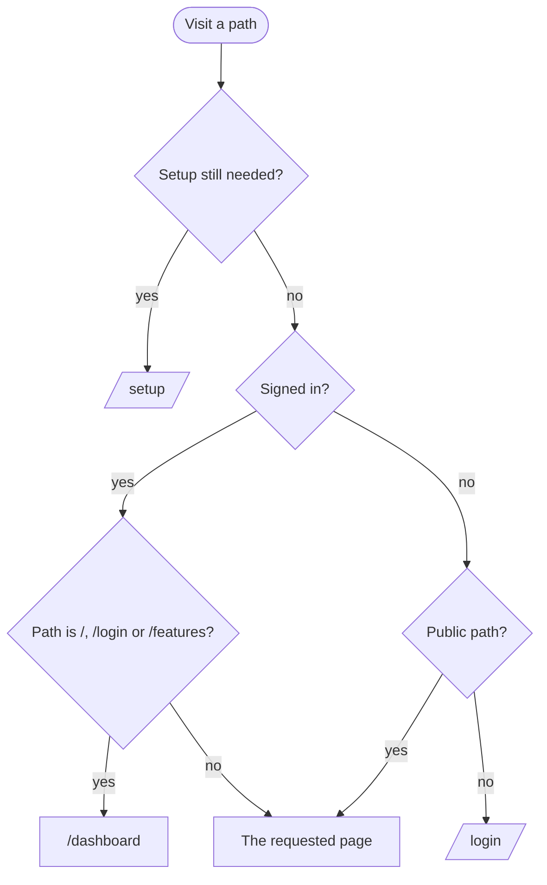

# Landing page

Back to the [feature walkthrough](README.md). See also [Sign-in, sessions and lockout](sign-in-and-sessions.md), [decisions](../decisions/interface.md).

Frontend `landing` (`landing-shell`, `landing-page`, `showcase`, `sample-ledger`, `features-page`), routes `/` and `/features`. Backend: the `supportLinkEnabled` field of `GET /api/settings/public` (`Settings/GetPublicSettings`). No feature switch.

The landing page is what a signed-out visitor sees at `/`. It serves two readers: a stranger who found the project and wants to know what it is, and an invited household member who wants to sign in. The words are kept plain for someone who has never kept books: no file formats, database or protocol names. It is laid out as a statement of account:

- The first screen is a navy band, its lower edge torn like the receipt in the bird's beak, with a large headline (phones see only the sample ledger beside it, so the band stays short), one paragraph on what Jx Finance does, a primary "Sign in" and an outline "See it on GitHub" link to the repository; no helper text, and the ledger's "Sample data" tag marks the sample figures. Beside them stands a stage of sample cards: a net worth card with a six-month line, a budgets card (one budget over its limit, in red with "€12 over") and a statement import card with its "Filled by a rule" and "Looks like a transfer" tags, next to a sample ledger: six rows of September 2026 with a date, a payee, the category and account, and a signed amount, then the totals line and the net on a double rule. The panel carries a "Sample data" tag. The figures are fixed in `sample-ledger.tsx` and are formatted in euros in the reader's language. When the card is narrow, each row puts the payee and amount on one line and the date, category and account on a muted line under them. The totals line reuses the ledger's strings and look. On load the cards rise in one after another, the rows settle in, the meters fill and the double rule draws under the net; under reduced motion nothing animates.
- "In short" lists facts about the product as ledger rows, each with a label, a plain sentence and a figure: bank connections (0), outside companies that see your data (0), currencies (30), languages (2) and price (€0). It ends on an ink rule; the sample net is the only double-ruled total on the page, because a double rule means a total of the rows above it.
- "What you'll find inside" lists every group of the features page with the titles of its features, read from `featureGroups`, and ends on an outline "See all features" link.
- The large stacked lockup, the bird above the name, signs the page off before the closing row.
- The closing row offers the ways on: "Sign in" for members, "Read the setup guide" (the Docker section of the README) for someone who wants their own installation, "Suggest a feature" under "Missing a feature?", an email link to the developer with the subject filled in, and "Support me on Ko-fi" while the installation shows the Ko-fi link.
- The footer repeats the bird, "Private personal finances · Free and open source" and the GitHub link.

`LandingShell` draws the header (the lockup linking to `/`, the bird alone on phones, a "Features" and a "Sign in" link, the language and theme toggles), the closing row and the footer for both public pages. The sign-in page leads back to them with a Home and a Features link under its card.

## Features page

`/features` lists what Jx Finance can do in seven groups (everyday money, sorting and finding, planning, living together, what you own, reports and reminders, your data and your way), thirty-seven features in all. Each group opens with its heading over a sample card (statement import, a trip folded into one row, budgets, settle-up, net worth, a bill reminder, sign-in methods), and each feature is a hairline row with a title, one plain sentence and a line starting "For example:" that shows a household using it, such as a €400 grocery budget with €85 left on the 20th. The lead says that an administrator can switch parts on or off, since several features are behind a feature switch. The groups and their order live in `featureGroups` in `features-page.tsx`; the words are under `landing.featuresPage` in the locale files.

Neither page makes a call that needs a session. Its only API call is the public settings, for the installation name in the lockup and the Ko-fi switch. A call to an endpoint behind sign-in would answer 401, try a refresh, and then end the session, which navigates to `/login`. For the same reason the amounts use `useNumberFormat` with a fixed currency rather than `useMoney`, and the sample copies the look of `TransactionsTotalsLine`, `SignedAmount` and `TransactionAmount` instead of rendering them: all three read the reporting currency from `GET /api/currencies`, which needs a session.

## Routing

`/` is the landing page and the dashboard lives at `/dashboard`, so every path belongs to one side of sign-in. `/` and `/features` are in `LANDING_PATHS`, part of `PUBLIC_PATHS`, so the session check, the app shell warm-up and the keyboard shortcuts skip them as on the other signed-out screens. The root layout renders both pages without the sign-in pages' shorter band, since the page draws its own header with the language and theme toggles. A signed-in user who opens `/`, `/login` or `/features` goes to `/dashboard`, which is also where signing in, finishing the guided setup and a page whose feature is switched off lead.
