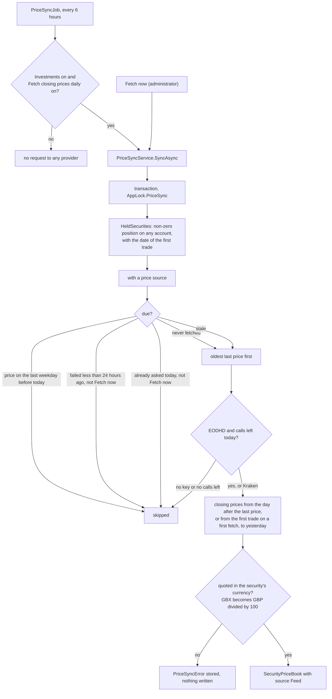

# Live security prices

Back to the [feature walkthrough](README.md). See also [Investments](investments.md), [decisions](../decisions/investments.md), [architecture: Investments](../architecture/investments.md#market-prices).

Backend `Investments` (`PriceSyncService` behind `IPriceSyncService`, `PriceSyncRules`, `SecurityPriceBook`, `securities/{id}/price-symbol/find`, `securities/{id}/prices/import`), `Settings` (`settings/market-prices`, `settings/market-prices/sync`), `Infrastructure/MarketPrices` (`EodhdPriceProvider`, `KrakenPriceProvider`, `PriceCsvParser`) and `Infrastructure/BackgroundJobs/PriceSyncJob`. Frontend: the Market prices section of `/settings` (`features/settings/market-prices-section`), the price source fields of the security form (`features/investments/security-form`, with `price-symbol-finder.tsx`) and the price history (`features/investments/price-history`). Behind the `Investments` switch.

The server fills the price history of held securities once a day from a market data provider, and anyone who may set a price can import a file of prices instead. It is the one feature whose purpose needs an outside service: nobody can compute a closing price inside the house. It follows the rule for outbound connections in `PRODUCT.md`: the server makes the request, an administrator switches it on, and the ledger works without it.

## What the provider learns

The symbols of the securities someone on this installation holds, and nothing else: never a quantity, an amount, an account or who holds it. The request carries the price symbol and the date range; the EODHD request also carries the administrator's API key. The Market prices section says so in a paragraph under the failures.

## Sources

| Source | Covers | Key | Budget |
| --- | --- | --- | --- |
| EODHD | Stocks, ETFs and funds on Xetra, Euronext, the London Stock Exchange, US exchanges and funds by ISIN, symbols like `VWCE.XETRA` | An administrator's API key, stored encrypted | `App:MarketPrices:EodhdDailyLimit` calls a day, 20 by default, the free tier's limit. The free tier gives one year of history |
| Kraken | Crypto whose security currency is EUR, pairs like `XBTEUR` | None; the public OHLC endpoint | Not counted. About two years of daily candles |

A crypto security in another currency uses EODHD or a price file.

## Mapping a security

Administrators see Price source (None, EODHD, and Kraken only while the security is crypto in EUR) and Price symbol in the security form. A member adding a security never sees them; a request from a member that names a source answers 403 `access.forbidden`. A source without a symbol answers `required`, Kraken on anything but EUR crypto answers `range.invalid`, and an EODHD mapping while no key is saved answers `marketPrices.keyRequired`.

When editing a security with a saved ISIN, **Find** asks EODHD's search for that ISIN and lists every listing it knows, with the symbol, the name and the quoted currency, in a popover; choosing one fills the symbol. It saves nothing, needs the key, and costs one of the day's calls. Its errors show under the button.

Changing the source or the symbol clears the last fetch result (`PriceSyncedAt`, `PriceSyncError`), so the next run fetches the history again from the first trade.

## What is fetched, and when

A security is due when it has never been fetched, or when its last price is older than the last weekday before today and it was not already asked today. So a run on a holiday, when the provider has nothing new, costs one call per security that day and none on the next runs. A failure waits 24 hours before it is tried again, except on Fetch now. EODHD calls are counted on the settings row (`PriceCallsDate`, `PriceCallsUsed`), including Find; a fetch that would need more calls than are left is not made, so the day's count never passes the limit. The first fetch of an EODHD symbol costs two calls, because EODHD's end-of-day answer carries no currency and the provider asks its search once for the listing's currency; later fetches of the same symbol cost one until the API restarts.

The run stores `PriceSyncedAt` and `PriceSyncError` on each security it asked and `PriceSyncRunAt` on the settings row, and answers how many securities it checked, how many prices it wrote, how many failed and how many EODHD calls are left. A failure is logged as a warning and listed in the settings section; there is no notification, because the price date shown next to every price already says when it is stale.

## Which price wins

Each point of the price history carries its source: `Manual` (typed in the price dialog or the security form), `Broker` (the mark price of an Interactive Brokers report), `File` (a price file) or `Feed` (fetched). A fetched price never replaces a price of another source on the same date, and a refused write leaves `LastPrice` where it was. Any other price replaces a fetched one, and the three member sources replace each other as before, the last write winning. The price history shows the source as a small tag on each row: Typed, Broker, File or Fetched.

## Price file import

In a security's price history, **Import prices** takes a CSV of at most 5 MB with a header row holding `date` and `price` columns, in any order and with other columns ignored. Dates are `YYYY-MM-DD`, `YYYY.MM.DD` or `DD.MM.YYYY`, the delimiter is detected, and whichever of a point and a comma comes last is the decimal mark, as in the broker trade CSV. Each price is written through the price book with source `File`, under the rule for setting a price: an administrator, or someone who holds the security (403 `security.notHeld` otherwise). The answer counts the prices written, the readable lines that changed nothing (the same price again, or a future date) and the lines that could not be read. A file without the two columns answers `import.missingColumns`, one that is not a CSV `import.invalidFile`. It works with the switch off and makes no outside request.

## Settings › Installation › Market prices

Listed while the investments feature is on. It holds the switch "Fetch closing prices daily" (off by default, seeded on a new installation from `App:MarketPrices:Enabled`), the EODHD API key, Fetch now with a toast of the result, the last run and the EODHD calls left today, the securities whose last fetch failed with the provider's reason, and the paragraph on what the provider learns.

The key is handled like the SMTP password. It is written only through `PUT /api/settings/market-prices`, where `eodhdApiKey` null keeps the saved key, an empty string removes it and anything else replaces it; it is encrypted with `IDataProtectionProvider` under the purpose `JxFinance.MarketPrices.EodhdKey` into `InstanceSettings.EodhdProtectedKey`; no response carries it, only `hasKey`; `UpdateMarketPriceSettingsRequest` prints `***` in its place; and traces of the EODHD requests show `api_token=***`. The section shows "Key saved" with Replace and Remove instead of the field while a key is saved. A backup restored under another data protection key ring keeps `hasKey` true but the key cannot be read: Fetch now and Find answer `marketPrices.keyUnreadable` until an administrator enters it again, and the job leaves EODHD securities alone meanwhile.

The three settings routes are for administrators only and are not behind the feature switch, like the other installation settings.

## Configuration

| Key | Default | Meaning |
| --- | --- | --- |
| `App:MarketPrices:Enabled` | false | Seeds the switch when the settings row is created; after that the administrator's switch decides |
| `App:MarketPrices:EodhdBaseUrl` | `https://eodhd.com/` | EODHD, requests go to `api/eod/{symbol}` and `api/search/{query}` |
| `App:MarketPrices:KrakenBaseUrl` | `https://api.kraken.com/` | Kraken, requests go to `0/public/OHLC` |
| `App:MarketPrices:EodhdDailyLimit` | 20 | EODHD calls a day, Find included |

## Error codes

| Code | When |
| --- | --- |
| `marketPrices.keyRequired` | An EODHD mapping, Find or Fetch now with EODHD securities, and no key saved |
| `marketPrices.keyUnreadable` | The saved key was encrypted under another data protection key ring |
| `marketPrices.unavailable` | The provider could not be reached or answered with a server error |
| `marketPrices.rejected` | The provider refused, with its words in the message, or today's EODHD calls are used up for Find |

## What changes downstream

Nothing reads a fetched price differently from any other. With a price on every weekday, the value chart, account balances, the dashboard total, net worth and its snapshots stop being partial for want of a price, and the member export's journal writes its `price` directive from the newest `LastPrice` as before.
