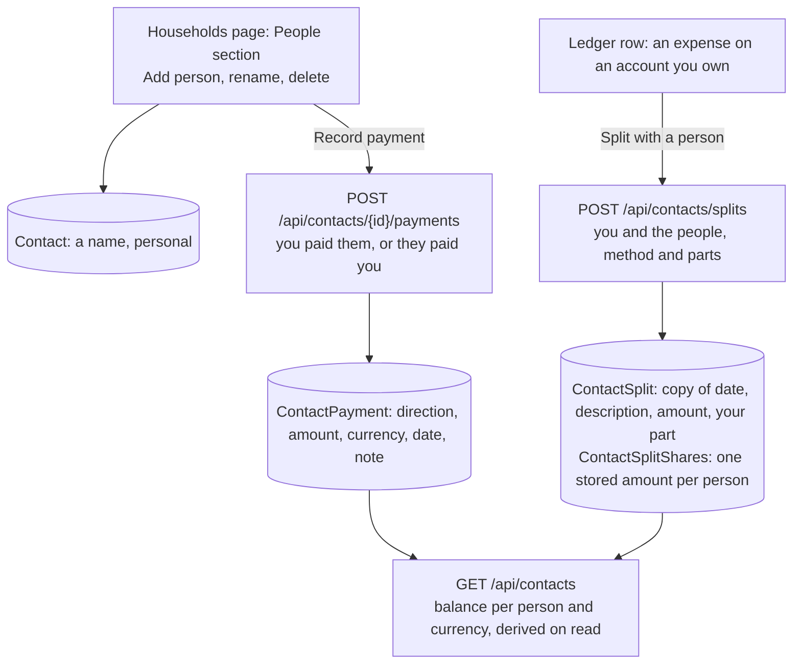

# Money with people outside the household

Back to the [feature walkthrough](README.md). See also [Household settle-up](household-settle-up.md), whose split and balance rules this page reuses, [Households and sharing](households-and-sharing.md), [decisions](../decisions/households-and-sharing.md#people-outside-the-household) and [Trash and undo](trash-and-undo.md).

Backend `Contacts` (`GetContacts`, `CreateContact`, `UpdateContact`, `DeleteContact`, `GetContactEntries`, `CreateContactPayment`, `DeleteContactPayment`, `CreateContactSplit`, `UpdateContactSplit`, `DeleteContactSplit`, `Services/ContactService.cs`, `Services/ContactSplitMarks.cs`), the shared rules in `Common/SettleUp` (`ShareAllocator`, `SettleUpBalances`, `ContactBalances`, `SplitRules`, `SettleUpText`), the entities `Contact`, `ContactSplit`, `ContactSplitShare` and `ContactPayment` in `Domain/Contacts`, the `contactSplit` marker of `Transactions`, and the three kinds in `TrashRestorers` and `Retention`. Frontend `households/people-section`, `households/contact-form`, `households/contact-payment-form`, `households/contact-entries`, `households/contact-split-form` and `transactions/contact-split` (the row action). Gated by `Households`; there is no switch of its own.

Shipped on 2026-10-01. A member keeps track of money with friends and others who have no login: a dinner they paid for and split with two friends, fifty euros lent until payday, a concert ticket a friend bought for them. Each such person is a personal record with a running balance per currency, and "Record payment" writes down money that changed hands. Nobody else sees these people, their balances or their history.

## People

The People section sits on the Households page under Settings › Shared, below the household cards, and shows whether or not the member belongs to a household. "Add person" asks only for a name of at most 100 characters; two people may share one. Each row shows the name and the balance in words, one per currency, never by colour alone: "Owes you €42.50 · You owe $12.00", or "Even". Each row has "Record payment", "Show history" and the row menu with Edit (rename) and Delete.

## Splitting a purchase with people

"Split with a person" is in the row menu of an expense with a positive amount on an account the signed-in member owns, next to "Split with household", while `Households` is on and the member has at least one person. A row that is split with a household does not offer it, and a row split with people does not offer the household split: a transaction is split once, either way. On a split row the action reads "Edit split with people".

The dialog is the household split's: Equally, By shares or Exact amounts, then one checkbox per person with the member first, under their own name, and a preview under each of what they pay, computed by `share-allocation.ts`. The member can leave themselves out, which records the whole amount as owed: that is how money lent through an ordinary bank payment is recorded, from the expense row the bank import brought. Saving with nobody but the member is refused.

Each person's amount is computed once, when the split is saved, by `ShareAllocator` with the member's part listed first, and stored in `ContactSplitShares`; the member's own part is kept on the split as `OwnAmount` (null when they take no part) with `OwnWeight` for the Shares method. Like a household split, the split keeps its copy of the transaction's date, description and amount. Saving it again always copies the transaction's current values first, so editing the split is how it follows a corrected amount; there is no "amount changed" mark.

The server refuses:

| Case | Answer |
| --- | --- |
| The transaction is not visible to the caller | 400 `reference.notFound` |
| It sits on an account the caller does not own | 400 `settleUp.notPayer` |
| It is income, a refund or not an expense | 400 `settleUp.notExpense` |
| It is split already, with people or with a household, including by a request that won the race to the unique index | 409 `settleUp.alreadySplit` |
| A person is not the caller's, or is deleted | 400 `reference.notFound` |
| No person takes part | 400 `contact.noPerson` |
| Exact amounts that do not add up to the expense | 400 `settleUp.sharesMismatch` |

The household split now refuses a transaction split with people with the same `settleUp.alreadySplit`, through the shared `SplitRules.IsSplitAsync`.

## Recording a payment

"Record payment" opens a dialog with the direction as two choices, "You paid Jonas" and "Jonas paid you", the amount, the currency, today's date and an optional note of at most 200 characters. It is prefilled to settle the person's first open balance: what they owe as "Jonas paid you", what the member owes as "You paid Jonas".

- **You paid them** (`toContact`) raises what they owe: a loan in cash or by bank, or paying back what the member owed.
- **They paid you** (`fromContact`) lowers it: being paid back, or the person paying for the member, such as a ticket they bought.

Only the payment is stored. No account changes, and money that left or reached the member's bank stays the ordinary ledger row it is; the member may categorize such a row as they like. A loan that already sits in the ledger as an expense can instead be split with the person with the member left out, as above.

## Balances

Balances are derived on every read, never stored. For each person and currency:

balance = their shares of splits whose transaction is not deleted + the payments the member made to them − the payments they made to the member

A positive balance is owed to the member and a negative one by the member. Currencies are never converted. `ContactBalances` turns the shares and payments into the household's debts between two parties (the member and the person) and sums them with `SettleUpBalances`, the same function the household balances use; with only two parties per person, the fewest payments are the balances themselves, so `SettleUpPlanner` has nothing to add and is not used. `ContactBalancesTests` covers lending, being paid back, being paid for, settling to zero and keeping people and currencies apart.

The balances never enter reports, budgets, the dashboard, net worth or the month-end close, as household balances do not: an open balance is a claim on a person, not an asset the installation can value, and net worth moves when money actually changes hands.

## History

"Show history" on a person opens a paged list of ten, newest first: each split with its copied description and date, "Their share of a split" and the person's amount, and each payment as "You paid Jonas" or "Jonas paid you" with its note. A split whose transaction is deleted says "Not counted while the transaction is deleted", derived on read like the household split, and counts again when the transaction is restored. Splits and payments can be deleted from the list with the undo toast.

## Deleting, trash and retention

Deleting a person, a split or a payment is a soft delete with a trash entry (`TrashKind.Contact`, `ContactSplit`, `ContactPayment`) and the undo toast. A deleted person disappears with their balances and history, and their shares stop counting in balances; restoring them brings everything back. Saving a split again while one of its people is deleted drops that person's share. A payment cannot be restored while its person is deleted (`restore.referenceMissing`); a split cannot while its transaction is deleted (`restore.referenceMissing`) or once the transaction is split again (`settleUp.alreadySplit`).

The retention job purges the three kinds 30 days after the delete. Purging a person takes their payments and shares with them through cascading foreign keys, and a split left with nobody purges with them, see [Background jobs](background-jobs.md). Purging a transaction takes its split, as for a household split.

Moving a split transaction to another account from the ledger's selection keeps it only when the member owns that account; otherwise the row stays with `settleUp.notPayer`, as for a household split.

## Personal, not audited

People, splits with them and payments with them are `OwnableEntity` rows under the ordinary owner filter: only the member who made them sees them, whatever the household switcher shows. They are not shareable and never reach the household's [activity log](audit-log.md), which records only what is shared into a household.

## Backups, export and API tokens

Backups carry `Contacts`, `ContactSplits`, `ContactSplitShares` and `ContactPayments` with no code of their own. The [data export per user](data-export-per-user.md) holds all four, and a member import brings them back with the transactions they split. `GET /api/contacts` and `GET /api/contacts/{id}/entries` are readable with a [personal API token](personal-api-tokens.md); nothing under `/api/contacts` is writable with one.
