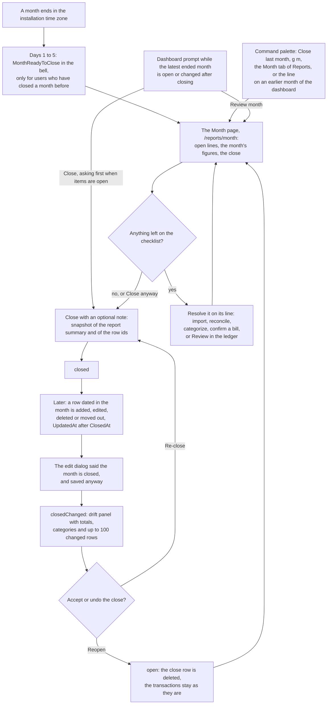
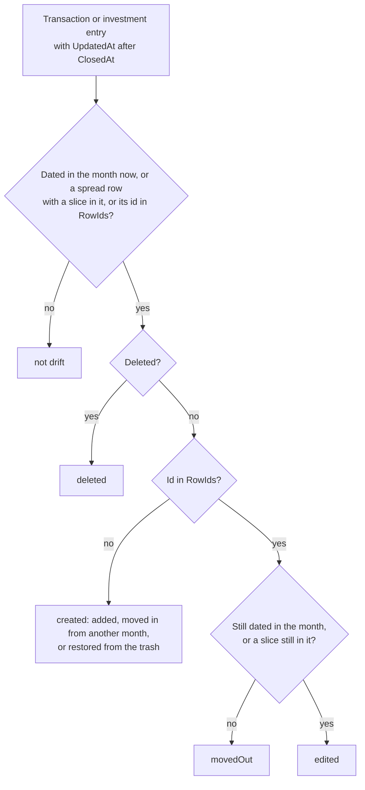

# Month-end close

Back to the [feature walkthrough](README.md). See also [decisions](../decisions/month-end-close.md), [architecture: Background work and notifications](../architecture/background-jobs.md).

Backend `MonthCloses` (`MonthCloseService`, `MonthClosesGroup`, `Shared/MonthCloseResponses`, `Shared/MonthKey`), the entity in `Domain/MonthCloses`, its mapping in `Infrastructure/Data/Configurations/MonthCloseConfiguration`, the reminder in `Infrastructure/BackgroundJobs/MonthCloseReminderJob`, and the pieces it added elsewhere: `ReportComparisonMode.PreviousMonth` in `Reports`, `IBudgetService.GetMonthlyAsync(asOf)` in `Budgets`, the `uncategorized` filter on `TransactionFilterRequest` (and, since 2026-10-01, the `duplicates` one of [possible duplicates](transactions.md#possible-duplicates)), `MonthReadyToClose` in `NotificationTexts` and the account lines read from `IReconciliationService.CoverageAsync` in `Accounts`. Frontend: `features/month-close`, whose `month-page` is the Month tab of the Reports hub at `/reports/month` (`routes/reports_.month.tsx`), with `month-close-prompt` on the current month of the dashboard and `month-close-line` on an earlier one, `closed-month-hint` in the transaction and conversion forms, "Same period last month" on the reports page, "Uncategorized" in the ledger's category filter, "Close last month" in the command palette, `g m` and a kind in the notification bell.

Once a month the bookkeeping session needs an end. The Month page holds that session for one month: the statements still to bring in and every line still open, each with its own control on the line, then the month's figures and budgets, and the close with an optional note. Closing freezes a snapshot of the month's figures and of the rows dated in it. Nothing is locked: every write path stays exactly as it was. If anything dated in that month changes later, the page says so, shows the figures at close against today's, lists the rows behind the difference, and the month can be re-closed to accept the change or reopened.

It is a feature switch, `Feature.MonthClose`, on by default (`HasDefaultValue(true)`, column `Features_MonthClose` from the `AddMonthClose` migration), because it adds a page, a dashboard prompt and a reminder job. It gates everything under `/api/month-close` through `MonthClosesGroup`.

## Whose close, and which months

A close is personal and belongs to the scope it was taken under. `MonthClose` is an `OwnableEntity` keyed by (`UserId`, `Month`, `HouseholdId`), where `HouseholdId` is the active household of the request (the `X-Active-Household` header) or null for "Everything". The figures depend on that filter: the same March reads differently narrowed to one household and across everything, so a close in one scope says nothing about another, and a household partner who looks at the same shared account has no close until they take one. A partner's edit on a shared account is still drift for the owner who closed, because drift is about the rows the closer's scope can see, not about who changed them.

| Status | When |
| --- | --- |
| `notEnded` | The month has not ended: its last day is today or later in the installation time zone. It can be reviewed, not closed |
| `open` | The month has ended and has no close in this scope |
| `closed` | A close exists and nothing has drifted |
| `closedChanged` | A close exists and something drifted, see below |

Only a month that has ended can be closed; `POST` on an unfinished one answers 409 `monthClose.notEnded`. A snapshot of a month still running would drift by design. Months are `YYYY-MM` with a year from 2000 to 2999 (`MonthKey.Parse` in `Common`, which the dashboard shares); anything else, including `2026-8` or a full date, answers 400 `month.invalid`.

## The snapshot

Closing asks `ReportService.GetSummaryAsync` for the month, the same call the reports page makes, and stores what it answered. There is one definition of income and expense, and drift is a plain comparison of two answers of the same function.

| Row | What it holds |
| --- | --- |
| `MonthClose` (`OwnableEntity`, id `MonthCloseId`) | `Month` (the first day), `HouseholdId?`, `ClosedAt`, `Note?` (max 1000) and `Snapshot`. Unique on (`UserId`, `Month`, `HouseholdId`) with nulls not distinct. Never soft-deleted: reopening hard-deletes the row. Not in the trash and not audited, because it is personal |
| `Snapshot` (`MonthCloseSnapshot`, `jsonb`) | `ReportingCurrency`; `TotalIncome`, `TotalExpense`, `Net`; `TransactionCount`, the transactions dated in the month (investment entries are not counted); `Income` and `Expense`, the category and synthetic-group breakdowns as `{categoryId, syntheticGroup, name, amount}`; and `RowIds`, the ids of every transaction and investment entry dated in the month and visible in the scope at the moment of closing |

The snapshot stores the figures and the row ids, nothing per row. The ids are what tell an edited row from a new one and a row moved out of the month from one that was never in it. Re-closing replaces the whole snapshot and `ClosedAt`; a close without a note keeps the stored note, and an empty note clears it.

A transaction [spread over months](transactions.md#spreading-over-months) counts its month's slice in the snapshot's totals and categories, and its id joins `RowIds` for every month its slices land in, while `TransactionCount` keeps counting only the rows dated in the month.

A [refund](transactions.md#refunds) is an expense with a negative amount, so the snapshot's totals and breakdowns are net of refunds, and the monthly digest's movers can show a category that went below zero. A refund is dated when the money came back: one that arrives after the month was closed and is dated in the next month lowers that month only, while one dated in a closed month is drift like any late edit.

## Drift

A row has drifted when its `UpdatedAt` is later than `ClosedAt` and it is either dated in the month now, spread over months with a slice in the month now, or its id is in `RowIds`. The query reads transactions and investment entries through the ordinary visibility filter with soft deletion lifted (`IgnoreQueryFilters(QueryFilters.SoftDeleteOnly)`), so deleted rows are found and rows the scope cannot see are not.

The review answers `drift` for a closed month:

- `totals`: the closed income, expense, net and transaction count, and today's count; today's income, expense and net are the review's own `figures`;
- `categories`: every category or synthetic group, of income and of expense, whose amount differs from the snapshot, with the closed and the current amount, largest difference first;
- `rows`: the changed rows, newest change first, at most 100 (`MaxDriftRows`), each with its kind (`transaction` or `investmentEntry`), its change (`created`, `edited`, `deleted` or `movedOut`), date, description, amount in its own currency and `changedAt`;
- `rowCount`: how many changed rows there are in all, so the page can say "Showing the latest 100 of 240 changed rows".

The month is `closedChanged` when any row changed, any total or category differs, or the currency changed. A row that was edited and later edited back still counts as changed, but leaves the figures as they were; the page then says "The changes left the month's figures as they were." once for the month, above the list, instead of labelling each such row. The snapshot keeps no per-row values, so it cannot tell which of several edited rows moved the figures and which did not.

**Reporting currency.** When the snapshot's `ReportingCurrency` differs from the installation's, the drift is `currencyChanged` with the currency the month was closed in, and nothing else: no totals, no categories, no rows. Every figure moves with a currency change, and a difference between amounts in two currencies would mean nothing. The page says the currency changed and that re-closing takes a new snapshot.

### What drift covers, and what it does not

Drift can only see what stamps `UpdatedAt`, so every writer that rewrites a transaction does:

| Change | Drift? |
| --- | --- |
| Create, edit or delete a transaction or an investment entry dated in the month, through a form, an import, a recurring confirmation or a broker import | Yes |
| Restore one from the trash | Yes, as `created` or `edited` |
| Change a row's date out of the month | Yes, `movedOut` in the old month and `created` in the new one |
| Create, edit or delete a spread row dated before the month, or after it when spread backwards, whose slices reach it | Yes, as `created`, `edited` or `deleted` in every month it counts in, never `movedOut` while a slice still lands there; its own month's transaction count is the only one it changes |
| Bulk recategorize, a categorization rule run, deleting a category, restoring a deleted category | Yes: each stamps `UpdatedAt` on the rows it rewrites |
| Deleting a selection, undoing it, moving a selection to another account | Yes, as `deleted`, `created` or `edited`: each row is changed through the tracker like a single delete, restore or edit. A row moved to an account outside the closed scope is no longer listed, like an archived account's rows, while the totals still show the difference |
| A reporting-currency change | `currencyChanged` only. The revaluation stamps the rows whose `ReportingAmount` it rewrites, but the month is not compared row by row |
| Tags: `bulk-tags`, deleting a tag | No. They only touch `TransactionTags`, and tags are not in the month's figures |
| Attachments | No. They are rows of their own and change no figure |
| The close's own note | No. `PUT /api/month-close/{month}/note` changes neither the snapshot nor `ClosedAt` |
| A description-only edit | Yes, as `edited`, although the figures stay as they were |
| The unusual-amount verdict and "Not unusual" | No. They are written with `ExecuteUpdate` without `UpdatedAt` |
| Transfers | No. A transfer is not income or expense and is not in the report; a conversion's fee is a transaction and is drift |

Two limits follow from reading `UpdatedAt` in the current scope. A row that leaves the scope without being edited, because its account was archived or stopped being shared, is no longer listed, although the totals and categories still show the difference. The year strip (`GET /api/month-close?year=`) catches that case too: besides changed rows and the currency it compares each closed month's snapshot income and expense with the month's current totals, so a month whose figures moved with no row changed, which is the case above or the `Investments` switch being flipped, reads `closedChanged` in the strip as in the review. A move that shifts only the split between categories and leaves both totals as they were shows in the review alone.

## The review

`GET /api/month-close/{month}` answers everything the page shows in one response. `MonthCloseService` calls the other features' services rather than querying their tables, so the numbers are the ones those pages show.

| Part | Source |
| --- | --- |
| `checklist.uncategorized` | `ITransactionService.GetSummaryAsync` with the month's dates and `uncategorized=true`: transactions without a category and splits with a line without one. Always present |
| `checklist.unusual` | The same summary with `unusual=true`: flagged and not dismissed. Null while `UnusualAmounts` is off |
| `checklist.duplicates` | Since 2026-10-01, the same summary with `duplicates=true`: rows dated in the month that have a [possible duplicate](transactions.md#possible-duplicates), whose partner may be dated up to three days outside it. Always present |
| `checklist.unconfirmedRecurring` | Active recurring entries whose `NextDueDate` is on or before the month's last day, entries rather than occurrences. Null while `RecurringBills` is off |
| `checklist.accounts` | One `{ accountId, accountName, state, date, difference, currency, otherCurrencies }` per visible account that has a [reconciliation](reconciliation.md) in any currency or, while `Import` is on, an imported transaction, ordered by name. `state` is `reconciled`, `differs`, `imported` or `behind`, see below. Always present, possibly empty |
| `figures` | `IReportService.GetSummaryAsync` for the month with `ReportComparisonMode.PreviousMonth`, so March is compared with the whole of February. It is not gated by the `Reports` switch |
| `budgets` | `IBudgetService.GetMonthlyAsync(monthEnd)`: monthly budgets only, usage and carry as of the month's last day, against today's limits. Null while `Budgets` is off. See [Budgets](budgets.md) |
| `netWorthStart`, `netWorthEnd` | From `INetWorthService.GetHistoryAsync`: the last snapshot before the month's first day and the last one on or before its last day, each with its date so a gap is named. Null when there is none or while `NetWorth` is off. Net worth snapshots are per user, so these are the user's whole net worth whatever the scope |
| `drift` | As above, null unless closed |

The account lines answer whether each account's statement for the month is in. `IReconciliationService.CoverageAsync(monthEnd)` gives, per account and currency with a reconciliation, the earliest one dated on or after the month's last day with its difference from the ledger in that currency, or the latest one before; the checklist merges it with the latest imported row per account, which is still read only while `Import` is on. `MonthAccountCoverage.StateOf` then decides on the account's main currency: `reconciled` when that reconciliation has no difference, `differs` when it has one, otherwise `imported` when the latest imported row is on or after the month's last day, otherwise `behind`. `date` is the reconciliation's date, the import date, or for `behind` the later of the two, null when there is neither; `difference` is statement minus ledger. Since 2026-10-01 `otherCurrencies` lists the account's other reconciled currencies as `{ currency, state, date, difference }`, judged by `StateOf` without an import date and shown as muted notes that count toward nothing. The lines are hints, not a count: an account that `differs` or is `behind` counts toward "N things need attention" on the page and in the dashboard prompt, but not toward the open items that make closing ask first. See [Reconciliation](reconciliation.md#in-the-month-end-close).

## The reminder

`MonthCloseReminderJob` is a `PeriodicJob` that runs daily at 08:00 in the installation time zone, and once at startup, with `RequiredFeature = MonthClose`, and returns at once unless today, in the installation time zone, is day 1 to 5 of a month (`ClosingMonth.LastDay = 5`, shared with the monthly digest). On those days, in one transaction holding `AppLock.MonthCloseReminders` (`738192442`), one query picks the active users who:

1. have closed at least one month, in any scope: having closed once is the opt-in, so nobody who never used the page is reminded;
2. have not closed the previous month in any scope;
3. have no `MonthReadyToClose` notification for that month yet, read, cleared or deleted.

For each it publishes one `MonthReadyToClose` through `INotificationPublisher`, with the month's name in the installation language as the title ("August 2026", "2026 m. rugpjūtis"), the sentence in the owner's language in `Message` and the month's first day in `Payload.Month`. The deduplication is per user and month: the job looks for a reminder created since the start of the current month, which only last month's reminder can be, so hourly passes over five days remind each user once. The bell says "{month} has ended and is ready to close" and links to `/reports/month?month=yyyy-MM`, the Month page, while the feature is on; Discord receives the same sentence when the user ticked the kind, with the link `NotificationTexts.PageLink` builds, `/?month=yyyy-MM`, whose dashboard line leads to the page. See [Notifications](notifications.md).

## The monthly digest

The [monthly digest](monthly-digest.md) is the review sent out. On the same days 1 to 5, `MonthlyDigestJob` calls `GetMonthAsync` for last month as each member who opted in, in the "Everything" scope and, since 2026-10-01, in each household the member chose, and mails or posts its figures, the three expense categories that moved most against the month before, the checklist's open items (uncategorised, unusual, unconfirmed recurring entries, and accounts that `differs` or are `behind`; possible duplicates are not in the digest) and whether the month is closed, with a link to `/?month=yyyy-MM`. It reads nothing the review does not, so the digest and the dashboard cannot disagree. It is independent of the reminder: both can arrive on the same day.

## Endpoints

| Route | What it does |
| --- | --- |
| `GET /api/month-close?year=` | Twelve `{ month, status, closedAt }` for the month picker, the current year when `year` is left out. A few grouped queries: the year's closes in this scope, the changed rows since the earliest of them, and the year's income and expense per month, transactions summed by date and type and the investment cash flows added as the reports add them |
| `GET /api/month-close/{month}` | The review: `month`, `monthEnd`, `status`, `closedAt`, `note`, `checklist`, `figures`, `budgets`, `netWorthStart`, `netWorthEnd`, `drift` |
| `POST /api/month-close/{month}` | Body `{ note? }`, at most 1000 characters. Closes or re-closes: writes or replaces the snapshot for the current scope and answers the review. 409 `monthClose.notEnded` for a month that has not ended |
| `PUT /api/month-close/{month}/note` | Body `{ note? }`. Changes only the note and answers the review; 404 `resource.notFound` when the month is not closed in this scope |
| `DELETE /api/month-close/{month}` | Reopens: deletes the close of this scope and answers 204, also when there was none |

All five sit in `MonthClosesGroup` under the `MonthClose` tag and answer 404 `feature.disabled` while the switch is off; `FeatureGateTests` lists `/api/month-close` as a gated prefix.

## Screens

Since 2026-10-02 the month has a page of its own, `/reports/month?month=yyyy-MM` (`month-page`, route file `routes/reports_.month.tsx`): the Month tab of the [Reports](reports.md) hub, beside its Overview tab, gated by `requireFeature("monthClose")` and reached with `g m`. Without `month` it opens the latest ended month that is `open` or `closedChanged` in this scope, read from the year statuses of that month's year (`defaultMonth` in `month-page/month-queries.ts`), and otherwise the latest ended month. The header holds the hub title and tabs, and ‹ › step the month the way the dashboard does: the label changes at once, the URL follows 300 ms after the last press (`useDebouncedDraft`), and the page below dims (`StaleRegion`) until the next month has loaded. "Next month" stops at the current month, which reads as still running. The loader warms the review, the accounts, the categories, the month's uncategorized rows and, while `RecurringBills` is on, the recurring entries; `MonthPagePending` mirrors the page, and every section keeps its title while its own rows load or fail (`QueryBoundary` with `errorSubject`).

The page reads top to bottom like a page of an account book: the open lines first, the month's answer second, the close last. There is no wizard and no progress score.

- **Status** (`MonthStatus`): the status icon, the headline from `monthTitleKey` ("August 2026 has ended" while any line is open, "… is ready to close" once none is, "… is still running", "… is closed", "… changed after closing") and one status line from `useStatusLine` in `status-markers.ts`: "N lines still open.", "Everything is in order.", "Review it now; you can close it once it has ended.", "Closed on …" or, in expense red, the changed sentence. `openLineCount` counts the open items of `openItemCount` (each uncategorized, unusual, possibly duplicated and recurring row) plus each account that differs or is behind. While `Import` is on and the month is not closed, an outline "Import statement" opens `ImportDialog`.
- **Statements**: the account lines of `close-checklist` (`kinds={["accounts"]}`). An account that is behind ends in "Import" while `Import` is on, which opens `ImportDialog` with that account chosen, and an account that differs or is behind ends in "Reconcile", which opens `ReconcileDialog`; both stay on the page and the import result's "Month close" link leads back to it. The section is left out when the checklist has no account lines.
- **Uncategorized**, with its count beside the title: the month's first 20 uncategorized rows, oldest first (`GET /api/transactions` with the month's dates, `uncategorized`, `sort=date`, `direction=asc`, `pageSize=20`), each with its date, name, amount and the ledger's own category select (`CategoryCell` with `useInlineCategory`, one `bulk-category` call per row). A split row shows its "Split" tag instead, since its lines are fixed in its dialog. While `LearnedCategories` is on, a row that `GET /api/transactions/uncategorized-suggestions` has a suggestion for, asked for the month, shows the form's "Suggested: Groceries" button (`CategorySuggestion`), and one click files it. With two or more unsplit rows, "Category for all shown" and "Set category for all N" file every shown row of that category's type in one `bulk-category` call with `onlyUncategorized`. Past 20 rows, "Show all N in Transactions" opens the ledger filtered the same way. With none, the line reads "Every transaction has a category".
- **Recurring entries due**, while `RecurringBills` is on: the active entries due on or before the month's last day, soonest first, each with its due date, its amount or "Variable amount", and "Confirm", which opens `RecurringBillConfirmForm` in a dialog. With none, "No recurring entry is waiting".
- **Review**: the unusual line (while `UnusualAmounts` is on) and the possible duplicates line of `close-checklist`, each with "Review" into the ledger with the month's range and its filter.

Each line resolves in place: the mutation behind it refreshes `/api/transactions`, `/api/recurring-bills` and every `/api/month-close` query (see Keeping it fresh below), so the row leaves its list and the count in the status line goes down. `j` and `k` move the focus from one open line to the next (`useLineKeys`, TanStack Hotkeys registered only while the page is mounted, ignored while a dialog is open or the focus is in a text field), and Enter on a focused line opens its control: its first button or link, or the row's category select. A line that is done carries a green check and takes no focus.

- **The month and the close** (`close-form`): one panel. "The month" is `SummaryStats` with the net as the serif lead (`SignedAmount` rules), income with "+", expenses with "−", "Income kept" (or "Income spent" when more went out than came in, and nothing without income) and "Net worth" from the last snapshot before the month to the last one in it, when both exist. Beside it from `lg` (7fr to 5fr, stacked below) sit the month's monthly budgets from the review's `budgets` (`BudgetRows`, shared with the dashboard's budget card), left out when there are none or `Budgets` is off. Under a hairline an open month has the note field and "Close August 2026"; while items are open, closing asks "Close with open items?", says how many rows still need attention and that fixing them later marks the month as changed after closing, and offers "Close anyway". A month that has not ended shows "Review it now; you can close it once it has ended." beside a disabled Close.
- **A closed month** (`closed` or `closedChanged`): the open-line sections collapse into the status line ("Closed on …"), and the figures and budgets, with the stored note under them, sit above a double rule (`border-b-3 border-double border-rule`): the ruled-off page. Under the rule sit "Reopen" (outline destructive, behind a confirmation that says the snapshot and its note are deleted and the transactions stay as they are), "Add note" or "Edit note", and for a changed month "Re-close", which opens `month-note-dialog` with the stored note and "Re-closing takes a new snapshot and accepts the changes." Closing ends on this page: the close refreshes the review, the panel re-keys on the close time, and the toast only says "August 2026 closed". The figures are the review's own `figures`, which equal the snapshot while nothing has drifted.
- **Drift panel** (`drift-panel`), only when `closedChanged`, as an amendment under the ruled-off page: the totals that changed as "At close", "Now" and "Difference" with the `ChangeBadge` of the reports page, the transaction count when it changed, the categories that moved, and the changed rows with an "Added", "Edited", "Deleted" or "Moved to another month" tag and the time of the change. A transaction links to the ledger on its date, a deleted one to the trash in Settings, an investment entry to the investments page.

"N things need attention", which the dashboard prompt shows, counts the checklist kinds that have open items (uncategorized, unusual, possible duplicates, recurring) plus each account whose statement differs or that is behind (`attentionCount`). The close confirmation counts only the uncategorized, unusual, possibly duplicated and recurring rows (`openItemCount`), because an account line is a hint about the statement, not a row to fix. `close-form/use-month-closer.ts` holds the close mutation and its "closed" or "re-closed" toast, and the page and the dashboard prompt both use it; each keeps its own confirmation. The note field takes its limit from the generated `closeMonthBodyNoteMax` and shows the translated "at most N characters" message.

**Dashboard.** The dashboard no longer embeds the review. On an earlier month it shows `month-close-line` above the cards: one ruled line with the status icon, the headline, the status line and "Review month", a link to the page on that month; it renders nothing while `MonthClose` is off or when its load fails. On the current month it shows the prompt below.

**Dashboard prompt.** `month-close-prompt`, rendered by `DashboardPage` above the card grid while the dashboard shows the current month, reminds the user without waiting for the bell. While `MonthClose` is on it loads the review of the latest ended month, which `warmDashboard` warms with the rest of the dashboard, and shows a panel only when that month is `open` or `closedChanged`; a closed month, a failed load or a loading one show nothing. The panel has:

- the status icon, the headline ("August 2026 has ended" while something needs attention, "August 2026 is ready to close" once nothing does, or "August 2026 changed after closing") and a status line ("N things need attention before you close.", the ready sentence, or the changed sentence);
- for an open month with something to do, the checklist with `openOnly`, so only the open items and their action links are listed;
- the month's net and "Income kept", the same term as the dashboard ring's "kept" ("Income spent" when more went out than came in), left out when there was no income;
- "Review month", a link to `/reports/month?month=yyyy-MM`, primary for a changed month and outline otherwise, and for an open month "Close August 2026", which asks first when there are open items. Closing from the prompt takes no note.

An outline "Not now" button, with the tooltip "Hide until next month", hides the prompt for that month in this browser: it stores the month as `monthClosePromptHidden` (`yyyy-MM`) in the `jx-preferences` row (`src/stores/preferences.ts`, helpers in `src/stores/month-close-prompt-store.ts`). The next month is a different key, so the prompt comes back by itself once another month has ended. Signing out forgets the choice, like the other member-specific fields of the row. Neither the prompt nor the line is a dashboard card: they cannot be moved or hidden in the customiser.

**Closed-month hint.** While the feature is on, the create and edit dialogs of a transaction and a currency conversion show "August 2026 is closed. Saving will show as a change after the close." under the date when it falls in a month closed in the current scope. `ClosedMonthHint` reads the statuses from the year query the page caches, or fetches them quietly on demand; a failure shows nothing. It asks only for a date whose month matches `MONTH_KEY_PATTERN` in `lib/calendar.ts`, the same 2000 to 2999 range the server accepts. It never blocks saving. Transfers get no hint, because they are not in the month's figures.

**Keeping it fresh.** The close, note and reopen mutations refresh every `/api/month-close` query. So does every mutation that writes ledger rows (transactions, bulk edits, imports, rule runs, recurring confirmations, transfers, conversions, investment entries and broker imports), a category change and the unusual-amount dismissal, while a trash restore and a settings save refresh everything; that is how the status and the drift follow an edit made on another page without a reload. Account changes, archiving included, refresh them too, and so do recording and deleting a reconciliation. The server messages for `monthClose.invalidMonth` and `monthClose.notEnded` are under `serverErrors.monthClose` in both locales.

## Switching it off

- The reminder job does not run, and the routes answer `feature.disabled`.
- The Month tab and `g m`, the line on an earlier month of the dashboard, the command palette action and the dashboard prompt disappear, and the closed-month hint is not shown. `/reports/month` redirects to the dashboard, and the Reports hub, left with one page, shows as Reports without tabs. The dashboard still steps between months.
- Reminders already raised stay in the bell without a link.
- Every close stays in its table, and edits keep stamping `UpdatedAt`, so switching it back on shows each closed month with the drift that happened meanwhile.

## Backup and restore

`MonthCloses` is an ordinary exported table, and the snapshot travels as its `jsonb` text. The transactions keep their `UpdatedAt`, so a restored installation shows the same statuses and the same drift as the one the backup was taken from. See [Backup and restore](backup-and-restore.md).

## Error codes

| Code | Status | When |
| --- | --- | --- |
| `month.invalid` | 400 | The month is not `YYYY-MM` between 2000 and 2999, or `year` is outside that range |
| `monthClose.notEnded` | 409 | Closing a month that has not ended |
| `resource.notFound` | 404 | Changing the note of a month that is not closed in this scope |

## Tests

`MonthCloseTests` covers closing an ended month storing the report's figures and its previous-month comparison, the current month refused with 409 and a malformed month with 400, adding, editing and deleting rows in the month showing as drift with the right changes, totals and category, rows in another month ignored while a row moved out and a row merely renamed are drift, re-closing clearing the drift and reopening twice answering 204, closes kept apart per user and scope while a household partner's edit on a shared account is drift for the owner, a category delete stamping its rows, a reporting-currency change answering `currencyChanged` in the review and in the year, a revaluation stamping the rows it rewrites, the checklist counts matching the ledger filters they link to (possible duplicates included, with a partner dated in the next month), the four account states with the earliest reconciliation after the month end winning and the lines without `Import`, monthly budgets measured as of the month's last day with their carry, the feature switched off, and the reminder going once, over two passes on 2 October, to the user who closed before and skipped September, not to a user who never closed or one who closed September, and to nobody on 9 November.
`SpreadMonthCloseTests` covers a spread row that alone does not make a month drift or change its transaction count, a January row edited after March was closed marking March changed with the row edited, and a spread row created after the close listed as created.

`MonthKeyTests` and `ComparisonWindowTests` are the unit tests, `BackupEndpointTests` has a round trip that keeps a close, `FeatureGateTests` knows the new prefix and `NotificationTextsTests` fails for a kind without text. On the client, `month-key.test.ts` covers the month arithmetic and the latest ended month, `month-queries.test.ts` the default month and the uncategorized query, and the checklist, drift panel, Month page, dashboard line, dashboard prompt and dashboard page have stories for their states, including open items, possible duplicates, open items only, the open month with its lines and tabs, a line resolved in place counting down, one category for all shown rows, a learned suggestion on a line, `j`, `k` and Enter between the lines, closing with open lines asking first and ending on the ruled-off page, a closed month ruled off, a changed month with its amendment and Re-close, a month not ended, the default month, switched-off features dropping their lines, Lithuanian with long names, a section that fails to load, loading, closing from the prompt, a closed month showing no prompt, a prompt hidden until next month and the dashboard on an ended month linking to the page.
