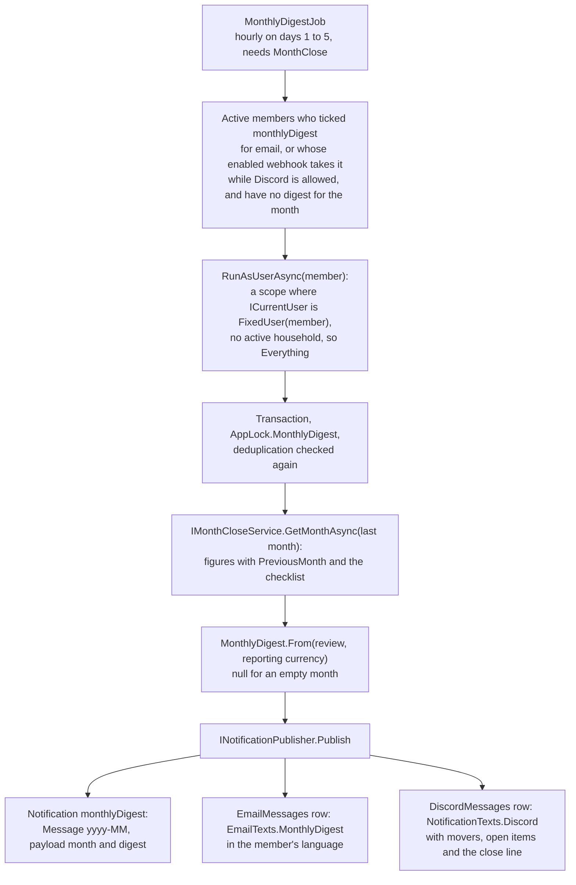

# Monthly digest

Back to the [feature walkthrough](README.md). See also [decisions](../decisions/notifications.md), [Notifications](notifications.md), [Month-end close](month-end-close.md), [Email](email.md) and [Discord notifications](discord-notifications.md).

Backend `Infrastructure/BackgroundJobs/MonthlyDigestJob.cs`, the pure builder `Common/Notifications/MonthlyDigest.cs`, the payload `Domain/Notifications/MonthlyDigestPayload.cs`, the texts in `Common/Notifications/NotificationTexts.cs` and `Common/Email/EmailTexts.cs`, and `Users/UpdateMyLanguage` for the member's language. Frontend `profile/notifications-section` (the row and its note), `components/notification-bell` (the bell row) and `stores/app-store.ts` (the language saved on the server). No switch of its own: the job runs while `MonthClose` is on, and each member opts in.

In the first days of a month, each member who asked for it receives one message about the month that just ended: income, expenses, net and the share of income kept; the three expense categories that moved most against the month before; what is still open before the month can be closed; whether it is closed; and a link to `/?month=yyyy-MM`, where the dashboard shows that month and its close panel. It is written in the member's own language.

## Opting in

Settings › Personal › Notifications has a row "Monthly digest" like every other kind, because the rows come from `NotificationType`. Ticking Email or Discord is the opt-in; a member who ticks neither gets nothing, not even a bell row. Its "In app" cell shows a dash labelled "Only sent by email or Discord" instead of the muted check, and a note under the table says what the digest is and when it arrives. A member who ticked Email while the mail server is off or their address is unconfirmed still gets the bell row, because the job picks members by what they ticked and the publisher decides what can leave.

## When it is sent

`MonthlyDigestJob` is a `PeriodicJob` with `RequiredFeature = MonthClose` that runs every hour and returns at once unless today, in the installation time zone, is day 1 to 5 of a month (`LastDigestDay = 5`), the same catch-up window as the [reminder](month-end-close.md#the-reminder), so a server that was off on the 1st still sends it. The first pass that finds no digest for a member and month sends it. The deduplication is a `MonthlyDigest` notification whose `Message` is the month as `yyyy-MM`, deleted ones included, checked once when the members are picked and again inside the member's transaction under `AppLock.MonthlyDigest` (`738192443`). Each member runs in their own try block, so one failure is logged with the user id and the others still get theirs.

The reminder `MonthReadyToClose` is unchanged, and both can arrive on the same day: the reminder is a to-do for people who close their months, the digest a summary for anyone. A member who wants one message unticks the other's channels.

## Running as the member

The digest says exactly what the dashboard review says, because it is the review: `IMonthCloseService.GetMonthAsync` for last month, called as the member. `PeriodicJob.RunAsUserAsync(userId, work)` opens a scope and sets the scoped `JobUser.User` to `new FixedUser(userId)` before anything else is resolved; `ICurrentUser` resolves to that user inside the scope and to `HttpCurrentUser` everywhere else, so `AppDbContext`, the services and their query filters see what the member sees. `FixedUser` has no active household, so the scope is "Everything": the member's own records and everything shared into any household they belong to, whatever household their browser has picked. See [Background work](../architecture/background-jobs.md#running-a-service-as-a-member).

## What it says

`MonthlyDigest.From(review, currency)` turns the review into a `MonthlyDigestPayload`:

| Field | From |
| --- | --- |
| `currency` | The installation's reporting currency, which the figures are in |
| `income`, `expense`, `net` | `figures.totalIncome`, `totalExpense` and `net` as decimal strings, like the other payload amounts |
| `keptPercent` | Net over income, at least zero, rounded to a whole percent, as the dashboard ring shows it; null without income |
| `movers` | Up to three `{ name, amount, previous }` from `figures.expenseByCategory`: the largest absolute changes between `amount` and `comparisonAmount` (the whole previous month), synthetic groups included; a category spent only last month counts with zero now |
| `uncategorized`, `unusual`, `unconfirmedRecurring` | The checklist's counts, null where the review has null because a switch is off |
| `accountsNeedingAttention` | The checklist's accounts that `differs` or are `behind` |
| `closed` | The review's status is `closed` or `closedChanged` |

The notification's `Payload.Month` is the month's first day and `Message` is `yyyy-MM`. A month with no income, no expense and nothing open gives null and no digest: a message with nothing in it teaches people to ignore the next one.

The texts are built from the payload when the message is queued, in the recipient's language:

- Sentence (`NotificationTexts.Sentence`): "September 2026: income 3200.00 EUR, expenses 2450.00 EUR, net 750.00 EUR, 23% kept", or "2026 m. rugsėjis: pajamos …, išlaidos …, grynai …, sutaupyta 23%".
- Details (`NotificationTexts.DigestDetails`): "Biggest changes: Groceries 420.00 EUR (was 380.00 EUR), …"; "Still to do: uncategorised 3, accounts not reconciled 1." with only the non-zero items, or "Nothing left to do."; and "The month is closed." or "The month is not closed yet."
- Discord: the month in bold, the sentence, the details and the link, each escaped and clipped to 2000 characters like every message.
- Email (`EmailTexts.MonthlyDigest`): subject "your September 2026" ("mėnesio suvestinė, 2026 m. rugsėjis") after the product name, a body of the sentence, the details, the link and how to switch it off. It is stored as `EmailKind.Notification`, so the publisher's daily deduplication keys cover it.
- Bell: the title is the month in the installation language and the line "Income €3,200.00, expenses €2,450.00, net €750.00" is rendered by the client from the payload in the interface language; the row links to `/?month=yyyy-MM` while `MonthClose` is on.

## The member's language

`AspNetUsers.Language` (`en`, `lt` or null) is saved by `PUT /api/users/me/language` whenever the member picks a language while signed in, in the account menu, the Appearance section or the command palette; the call is fire-and-forget and a failure leaves the interface language per browser as before. The root route's loader sends the browser's stored choice once when the profile's `language` is still null, which covers members who chose Lithuanian before the column existed. Every email and Discord message the server writes to a member uses `Language`, falling back to the installation's `DefaultLanguage` while it is null: notification mail and Discord messages through `NotificationPublisher`, the password reset and verification mail, the administrator's SMTP test and the Discord test message. Month titles in those messages are rendered from `Payload.Month` by `NotificationTexts.Title`, not taken from the stored title. See [Email](email.md#language).

## Endpoints

| Route | What it does |
| --- | --- |
| `PUT /api/users/me/language` | Body `{ language }`, `en` or `lt`; answers the profile. 400 `enum.invalid` for anything else. Throttled to 20 changes per client in five minutes, like `email-notifications` |

`GET /api/auth/me` and the other profile answers carry `language`. The digest itself has no endpoint: it is read through `GET /api/notifications` like every kind.

## Tests

- Unit `MonthlyDigestTests`: the order of the movers with a synthetic group and a category spent only last month, the kept share null without income and zero when overspent, an empty month giving null unless something is open, and accounts needing attention counted from `checklist.accounts`.
- Unit `NotificationTextsTests`: the digest sentence in both languages, the Discord lines, the Lithuanian details, and `Title` rendering month titles in the recipient's language.
- Integration `MonthlyDigestTests` (`Integration/Notifications`), with a `TestClock` on 1 October 2026 and the fake mail and Discord transports: one email and one bell row with September's figures equal to `GET /api/month-close/2026-09`, nothing more on a second pass or on 2 October; nothing for a member who ticked nothing and one Discord message for a Discord-only member; the figures of "Everything" for a member of two households and nothing of a stranger's; nothing on 6 October, while `MonthClose` is off or for an empty month; Lithuanian mail for an `lt` member and for a member without a language in an `lt` installation; 400 `enum.invalid` for `de`; and a probe job showing `ICurrentUser` is the member inside `RunAsUserAsync` and `HttpCurrentUser` outside.
- Stories: the notifications section with the digest ticked and with email off, and the bell with a digest row.
