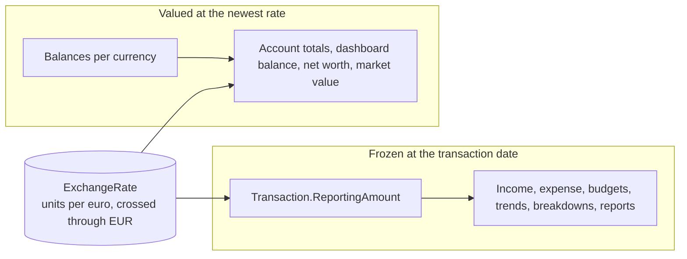
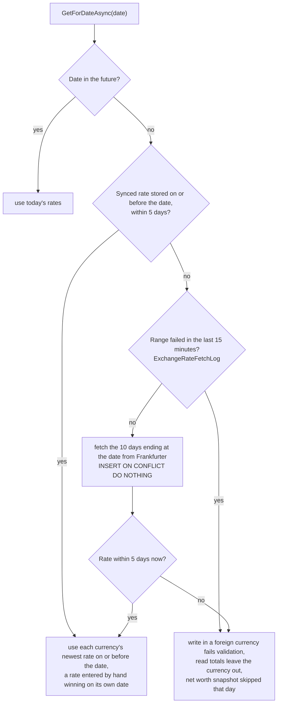
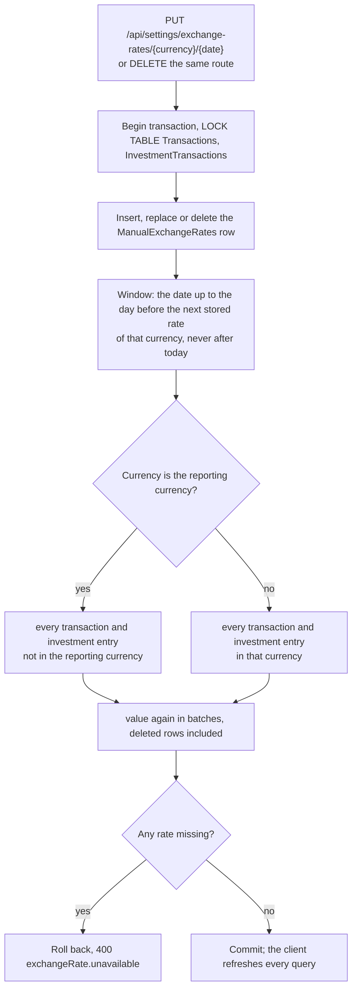
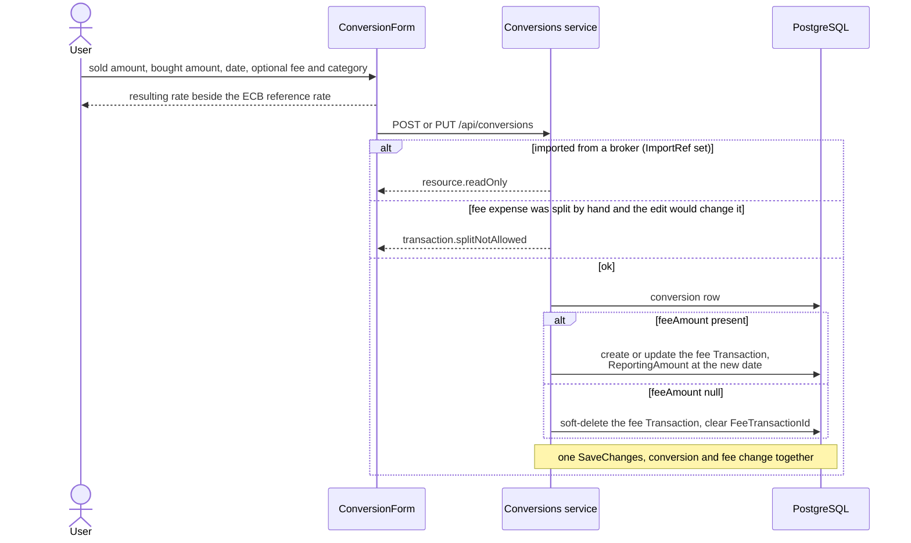
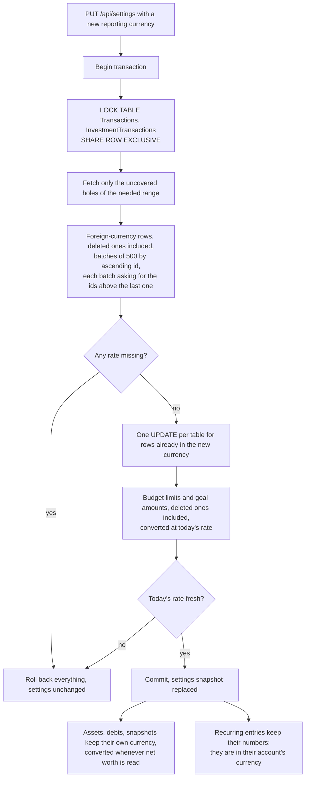

# Multi-currency

Back to the [feature walkthrough](README.md). See also [decisions](../decisions/multi-currency.md), [architecture: Multi-currency](../architecture/multi-currency.md).

Backend `Conversions`, `Currencies`, `Infrastructure/ExchangeRates`. Feature `MultiCurrency` gates `/api/conversions`; with it off only the reporting currency can be entered.

## Two kinds of value

Account balances use the same five-day rule as a single conversion (`IExchangeRateService.IsFresh`): a currency whose newest rate is older than five days before the balance date is left out of the account and reporting totals, and the account answers `isComplete` false, rather than being valued at a rate that may be weeks old.

## Rate lookup

## Rates entered by hand

An administrator can enter a rate by hand under Settings › Installation › Currencies, in the Stored rates section below the sync switch, for example while automatic sync is off, when a day is missing, or to correct a rate. A currency picker (every supported currency except the euro, the first enabled foreign currency selected) lists that currency's rates newest first: every ECB rate of the last 30 days and every rate entered by hand whatever its date, each tagged ECB or Entered by hand and shown as `1 EUR = 1.0842 USD` with four decimals, and a rate entered by hand on a date that also has an ECB rate shows the ECB rate beside it. Enter rate opens a dialog with the rate in units of the currency per euro (up to eight decimals) and the date, today by default. Every row has Edit, which opens the same dialog filled in, so editing an ECB row enters a hand rate for its date; only rows entered by hand have Delete, and deleting one brings back the ECB rate of that date, or the newest stored rate before it.

A rate entered by hand wins over the ECB rate of the same date, and like any rate it applies until the next stored rate of its currency, synced or entered by hand. The sync never touches it, because the ECB rows live in their own table. A future-dated transaction keeps the value it was saved with, as it does when rates sync later. Revalued rows get a new `UpdatedAt`, so a closed month whose totals moved shows as changed after close. The route refuses a rate that is not above zero or has more than eight decimals (`exchangeRate.notPositive`), the euro (`exchangeRate.unsupportedCurrency`) and a date after today (`exchangeRate.futureDate`); deleting a date that has no rate entered by hand answers 404. Members get 403 on all three routes and no token can reach them.

Only the 30 currencies of the `Currency` enum can be used, the euro and 29 of the ECB's reference currencies; a rate entered by hand cannot add another currency.

Backups include `ManualExchangeRates` like every other table. The [member download](data-export-per-user.md) leaves it out as installation-wide market data, the same as `ExchangeRates`.

## Filling a range once

`EnsureRangeAsync(from, to)` is what a broker import and a reporting-currency change call before they value many dates at once. It used to re-download the whole range on every call. It now reads the dates already stored between `from - 10` and `to` in one query and downloads only the holes that would leave a date stale, that is a hole wider than the five days `GetForDateAsync` tolerates. Weekends and bank holidays are therefore never fetched again, while a range that was never fetched, or one whose history stops early, is still downloaded in 90-day chunks. Rates already stored are never overwritten either way, because the insert is `ON CONFLICT DO NOTHING`.

`PreloadAsync(from, to)` is the read-side counterpart. Valuing many rows used to cost one query per distinct date, because `GetForDateAsync` caches per date but loads each one on its own. A caller that knows its date range up front loads the whole history once with `GetHistoryAsync` and every later lookup inside that range is answered from it by binary search. The Swedbank CSV confirm does this for the dates it has to convert. Any fetch that adds rows drops the preloaded history, so a lookup after a fetch reads the database again.

## Conversion with a fee

## Changing the reporting currency

Since 2026-10-03 budget limits and goal targets and saved amounts follow the change. They have no currency column and are always read as amounts in the reporting currency, so before that a limit of 300 set in euros was read as 300 dollars after a switch to dollars, and the budget alerts fired at the wrong spending. Now each one is multiplied by today's rate from the old currency to the new one and rounded half away from zero, in the same transaction, so 300 EUR becomes 330 USD at 1.10. A missing or stale rate for today rolls the whole change back with `exchangeRate.unavailable`, as a missing transaction rate does, but only when there is a budget or goal to convert.
