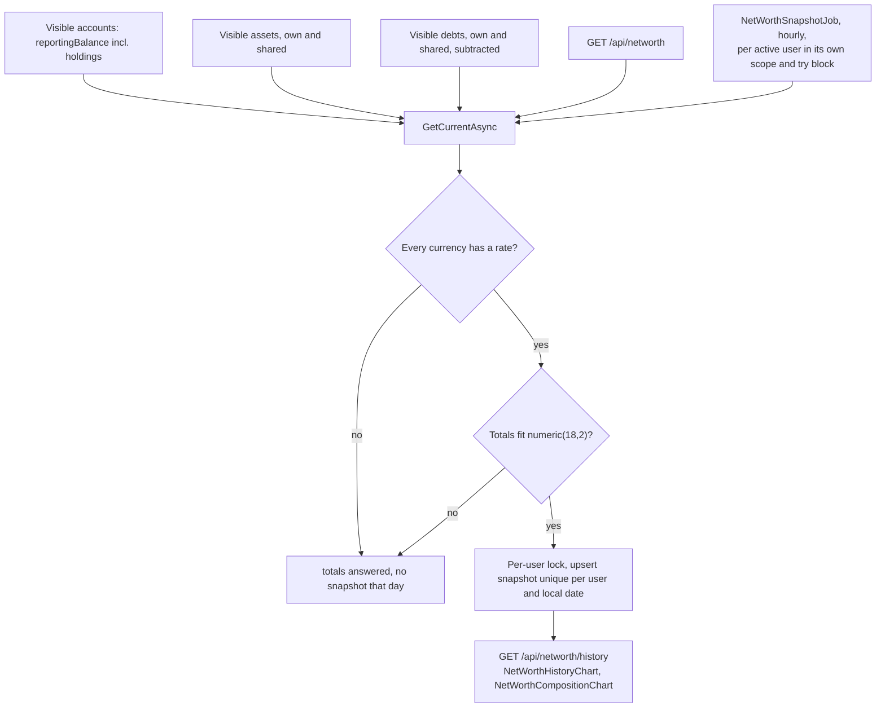
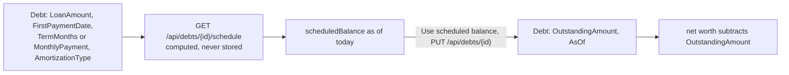
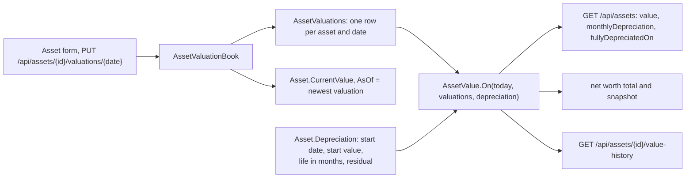
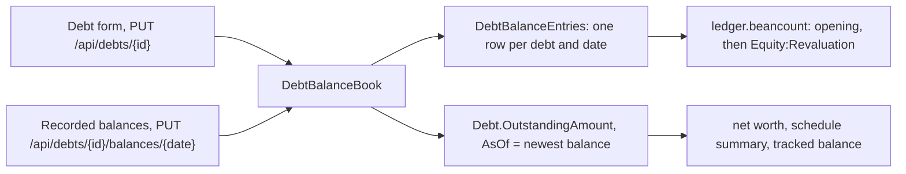

# Net worth

Back to the [feature walkthrough](README.md). See also [decisions](../decisions/net-worth.md).

Backend `NetWorth` (net worth, assets, debts), page `/net-worth`. Assets and debts are personal unless shared with a household, which they can be since 2026-09-30; a shared one counts in full in the net worth of every member who can see it, as a shared account does (see [Shared assets and debts](households-and-sharing.md#shared-assets-and-debts)). Each takes the reporting currency of the day it is created, keeps it through later edits and answers it as `currency`.

Since 2026-09-22 the totals are added up in the reporting currency. Assets and debts are summed per currency and each sum is converted at today's rate, the same way account balances are, so an asset entered before the reporting currency changed still counts at its value. When a currency has no usable rate its assets or debts are left out, `isComplete` is false and no snapshot is written, exactly as for an account balance or a holding without a price. A snapshot stores the currency it was taken in; the history converts a snapshot taken in another currency at the rate of its own date, and leaves out a point for which no rate is known. Changing the reporting currency fetches the rates for those dates along with the ones transactions need.

A debt subtracts its recorded `OutstandingAmount`, as of its `AsOf` date; since 2026-10-01 those two fields are the newest of the debt's [recorded balances](#debt-balance-history). Since 2026-09-21 a debt can also carry its repayment terms — loan amount, first payment date, a term or a fixed monthly payment, annuity or linear — and then has a computed repayment schedule with a payoff date, the interest and principal of every payment and a "what if I pay more" preview, on its own page `/net-worth/debts/$debtId`. The schedule never changes net worth by itself: its scheduled balance for today is shown beside the recorded amount, and "Use scheduled balance" copies it into the debt as an ordinary update.

Since 2026-09-27 a debt with "Track payments" on subtracts its tracked balance instead: the recorded amount on its `AsOf` date minus the principal of the expense transactions linked to it after that date. The tracked balance is converted with the other debts; a linked payment in another currency without a rate for its date makes the total incomplete, so no snapshot is written that day, the same rule as a missing rate anywhere else. `NetWorthSnapshotter` builds the same `NetWorthService`, so the hourly job and the page subtract the same figure.

A snapshot is always the member's whole net worth. Since 2026-09-30, while a household is active, `GET /api/networth` answers the narrowed totals without writing and then asks `INetWorthSnapshotter` to store the whole figure, in a scope of its own after the request's reading is done; with no active household it computes and stores under the per-user lock as before.

See [Debt amortization](debt-amortization.md) for the terms, the formulas, the rounding, tracked payments and the API.

## Pace and milestones

Since 2026-10-01 the Trend chart on the net worth page continues the history with a dashed navy "At this pace" line, and below it states the pace and when chosen milestones would be reached. It is arithmetic on the recorded snapshots and says so: "not a forecast or advice". Everything is computed in the browser from `GET /api/networth/history`, the series the chart already draws, so there is no endpoint, no stored figure and no request leaving the installation. The dashboard's net worth card keeps the plain line.

- **Pace.** The window starts at the newest snapshot on or before the day twelve months before the last snapshot. With less history it starts at the first snapshot, and below 90 days of history there is no pace and the section says so. The pace is the change between the two snapshots divided by the months between them (days ÷ 30.4375), shown as "+€1,234.56 a month on average since Oct 1, 2025" in the gain or loss colour.
- **Line.** The dashed line starts at the last snapshot and runs as far ahead as the window reaches back, at most 365 days, with as many points as the window has snapshots after its start. The chart's date axis spaces points evenly, so matching the count keeps the future at the same scale as the past.
- **Milestones.** Each milestone is an amount in the reporting currency, kept per browser in the `paceMilestones` field of the preferences row (a TanStack DB local-storage collection). Until the list is edited it is the next two round numbers of the 1, 2, 5 series above the last snapshot (79 000 gives 100 000 and 200 000), or 0 and a round number above the debt when net worth is negative. A member adds an amount (any sign, two decimals) and removes one with its × button, up to five, kept sorted and without repeats. Each milestone reads "Already reached" at or below the last snapshot, "Around September 2027" when the pace reaches it within 50 years, "Not within 50 years at this pace" beyond that, and "Not reached at this pace" when the pace is zero or falling.
- **Hidden amounts.** The pace and the milestones go through the money formatter, so privacy mode masks them, as it does the chart's axis and tooltip; the milestone input stays readable like every input.
- **Households.** Snapshots are always the member's whole net worth, so the pace, like the chart, ignores the household switcher.

## Asset value history

Since 2026-09-27 an asset keeps a dated list of valuations instead of one overwritten number. Creating an asset records its value and date as the first valuation. Editing the value or the date records a valuation for that date, and a date that already has one is replaced. `CurrentValue` and `AsOf` stay on the asset as the newest valuation, kept in step by `AssetValuationBook` the way `SecurityPriceBook` keeps a security's last price. The asset page `/net-worth/assets/$assetId` (the chart icon on the list row) shows the value today, the last valuation, a value chart with the valuations marked, and the list of valuations with add, edit and delete. Deleting a valuation is final, with no trash, and the last one cannot be deleted (`asset.lastValuation`). Valuation dates are today or earlier. Any member who can see a shared asset adds and deletes its valuations; deletes on one asset take an advisory lock on the asset's id, so two members' deletes run one after the other.

An asset can also depreciate on a straight line. Its terms are a start date, a start value, a useful life of 1 to 600 months and a residual value below the start value, all four or none (`asset.depreciationIncomplete`). The monthly amount is `(start value − residual) / life`, rounded up to the cent. The value falls by that amount on the start date's day of every month, on the month's last day when the month is shorter, and never below the residual. A valuation on or after the start date restarts the decline from that value at the same monthly amount. A valuation before the start date counts until the start date, when the start value takes over.

Nothing is written for depreciation. `AssetValue.On(date, valuations, terms)` computes the value when it is read: in the list (`value`, `monthlyDepreciation`, `fullyDepreciatedOn`), for net worth, and for `GET /api/assets/{id}/value-history`. An asset counts in net worth only on and after its first valuation. The list shows each value in the asset's own currency, and its header shows one total per currency instead of adding different currencies together.

Worked example: a car bought on 2025-01-31 for 10 000.00, with a life of 96 months and a residual of 1 500.00. The monthly amount is 8 500.00 / 96 = 88.541…, rounded up to 88.55. The value is 9 911.45 on 2025-02-28, 9 822.90 on 2025-03-31, and 1 587.75 after 95 steps on 2032-12-31. The 96th step, on 2033-01-31, stops at 1 500.00. An inspection on 2026-02-15 at 9 500.00 sets the value to 9 500.00 until the next step day, and it is 9 411.45 on 2026-02-28. The car then reaches 1 500.00 on 2033-08-31.

Adding a valuation for a past date does not rewrite the net worth snapshots already taken, because a snapshot records what the total was on its day. Deleting an asset moves it to the trash with its valuations untouched, and the nightly purge removes the valuations with the asset.

## Debt balance history

Since 2026-10-01 a debt keeps a dated list of recorded balances, the way an asset keeps valuations, in the `DebtBalanceEntries` table: one outstanding amount per debt and date, in the debt's currency, with an optional note. Creating a debt records its outstanding amount and as-of date as the first balance. Editing the amount or the date, "Use scheduled balance" included, records a balance for that date, and a date that already has one is replaced. `OutstandingAmount` and `AsOf` stay on the debt as the newest balance, kept in step by `DebtBalanceBook` as `AssetValuationBook` keeps an asset's value, so net worth, the schedule summary and [tracked payments](debt-amortization.md#tracking-payments) read the same two fields as before. A balance for an earlier date only adds history: editing a debt to a date before its newest balance records that balance and leaves the outstanding amount at the newest one.

The debt page `/net-worth/debts/$debtId` is now reached from every debt row (the calendar button, "Balance history and schedule"), not only from debts with terms or tracking. It ends with a Recorded balances section listing the balances newest first with their notes, the newest marked "Outstanding amount", with add, edit and delete. Deleting a balance is final, with no trash, and the last one cannot be deleted (`debt.lastBalance`). Balance dates are today or earlier. Any member who can see a shared debt adds, edits and deletes its balances, and deletes on one debt take an advisory lock on the debt's id. A change appears in the household activity log as the `balances` field of the debt's event, the way valuations appear on an asset's.

Recording a past balance does not rewrite the net worth snapshots already taken. Deleting a debt moves it to the trash with its balances untouched, and the nightly purge removes them with the debt. Backups carry the table like every other, and [Download my data](data-export-per-user.md) carries it with the member's debts and imports it back.

Debts created before the table existed got one balance from their current record. The `AddDebtBalanceEntries` migration only creates the table, and `DebtBalanceBackfill.RunAsync`, run at every start right after the migrations and the payee key backfill, inserts one balance from `OutstandingAmount` and `AsOf` for each debt, deleted ones included, that has none, in a single `INSERT … SELECT … WHERE NOT EXISTS`, and logs the count. It writes past the change tracker, so neither `UpdatedAt` nor the activity log moves. The [double-entry journal](data-export-per-user.md#double-entry-journal) opens each debt at its earliest balance and posts every later one against `Equity:Revaluation`.

| Route | What it does |
| --- | --- |
| `GET /api/debts/{id}/balances` | the recorded balances, newest first: `date`, `amount`, `note` |
| `PUT /api/debts/{id}/balances/{date}` | records `{ amount, note? }` for the date and answers the debt; 409 `conflict.busy` when two members write the same date at once |
| `DELETE /api/debts/{id}/balances/{date}` | removes it for good; 400 `debt.lastBalance` for the only one, 404 for a date without one |

