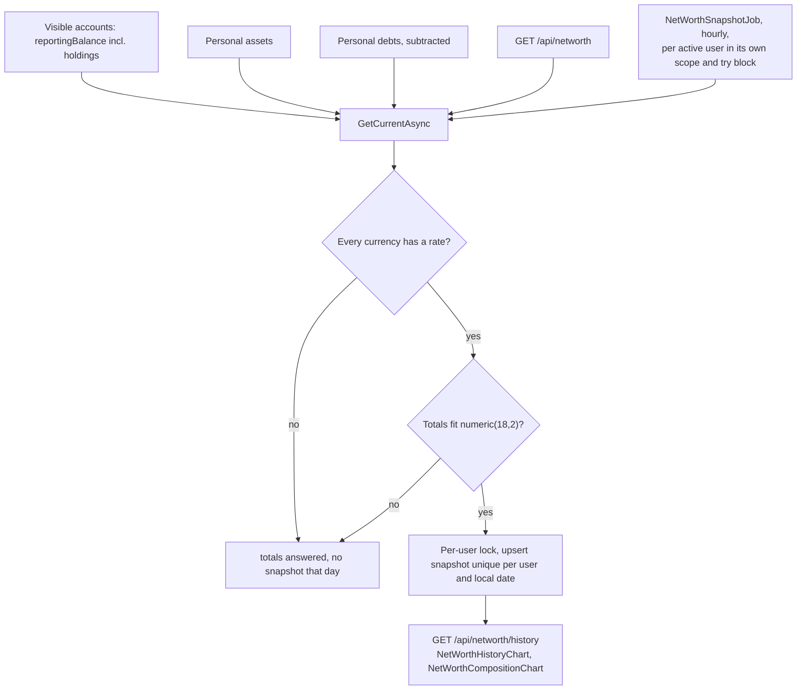
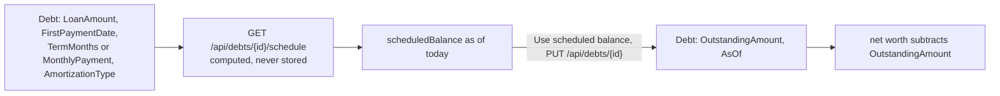
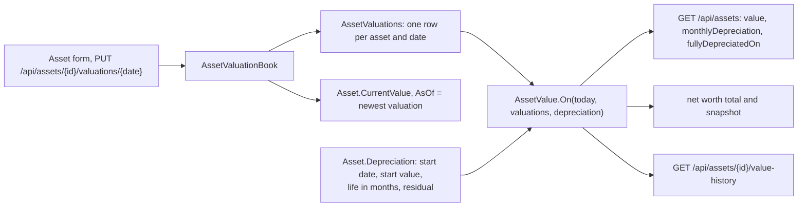

# Net worth

Back to the [feature walkthrough](README.md). See also [decisions](../decisions/net-worth.md).

Backend `NetWorth` (net worth, assets, debts), page `/net-worth`. Assets and debts are personal. Each takes the reporting currency of the day it is created, keeps it through later edits and answers it as `currency`.

Since 2026-09-22 the totals are added up in the reporting currency. Assets and debts are summed per currency and each sum is converted at today's rate, the same way account balances are, so an asset entered before the reporting currency changed still counts at its value. When a currency has no usable rate its assets or debts are left out, `isComplete` is false and no snapshot is written, exactly as for an account balance or a holding without a price. A snapshot stores the currency it was taken in; the history converts a snapshot taken in another currency at the rate of its own date, and leaves out a point for which no rate is known. Changing the reporting currency fetches the rates for those dates along with the ones transactions need.

A debt subtracts its recorded `OutstandingAmount`, as of its `AsOf` date. Since 2026-09-21 a debt can also carry its repayment terms — loan amount, first payment date, a term or a fixed monthly payment, annuity or linear — and then has a computed repayment schedule with a payoff date, the interest and principal of every payment and a "what if I pay more" preview, on its own page `/net-worth/debts/$debtId`. The schedule never changes net worth by itself: its scheduled balance for today is shown beside the recorded amount, and "Use scheduled balance" copies it into the debt as an ordinary update.

Since 2026-09-27 a debt with "Track payments" on subtracts its tracked balance instead: the recorded amount on its `AsOf` date minus the principal of the expense transactions linked to it after that date. The tracked balance is converted with the other debts; a linked payment in another currency without a rate for its date makes the total incomplete, so no snapshot is written that day, the same rule as a missing rate anywhere else. `NetWorthSnapshotter` builds the same `NetWorthService`, so the hourly job and the page subtract the same figure.

See [Debt amortization](debt-amortization.md) for the terms, the formulas, the rounding, tracked payments and the API.

## Asset value history

Since 2026-09-27 an asset keeps a dated list of valuations instead of one overwritten number. Creating an asset records its value and date as the first valuation. Editing the value or the date records a valuation for that date, and a date that already has one is replaced. `CurrentValue` and `AsOf` stay on the asset as the newest valuation, kept in step by `AssetValuationBook` the way `SecurityPriceBook` keeps a security's last price. The asset page `/net-worth/assets/$assetId` (the chart icon on the list row) shows the value today, the last valuation, a value chart with the valuations marked, and the list of valuations with add, edit and delete. Deleting a valuation is final, with no trash, and the last one cannot be deleted (`asset.lastValuation`). Valuation dates are today or earlier.

An asset can also depreciate on a straight line. Its terms are a start date, a start value, a useful life of 1 to 600 months and a residual value below the start value, all four or none (`asset.depreciationIncomplete`). The monthly amount is `(start value − residual) / life`, rounded up to the cent. The value falls by that amount on the start date's day of every month, on the month's last day when the month is shorter, and never below the residual. A valuation on or after the start date restarts the decline from that value at the same monthly amount. A valuation before the start date counts until the start date, when the start value takes over.

Nothing is written for depreciation. `AssetValue.On(date, valuations, terms)` computes the value when it is read: in the list (`value`, `monthlyDepreciation`, `fullyDepreciatedOn`), for net worth, and for `GET /api/assets/{id}/value-history`. An asset counts in net worth only on and after its first valuation. The list shows each value in the asset's own currency, and its header shows one total per currency instead of adding different currencies together.

Worked example: a car bought on 2025-01-31 for 10 000.00, with a life of 96 months and a residual of 1 500.00. The monthly amount is 8 500.00 / 96 = 88.541…, rounded up to 88.55. The value is 9 911.45 on 2025-02-28, 9 822.90 on 2025-03-31, and 1 587.75 after 95 steps on 2032-12-31. The 96th step, on 2033-01-31, stops at 1 500.00. An inspection on 2026-02-15 at 9 500.00 sets the value to 9 500.00 until the next step day, and it is 9 411.45 on 2026-02-28. The car then reaches 1 500.00 on 2033-08-31.

Adding a valuation for a past date does not rewrite the net worth snapshots already taken, because a snapshot records what the total was on its day. Deleting an asset moves it to the trash with its valuations untouched, and the nightly purge removes the valuations with the asset.

