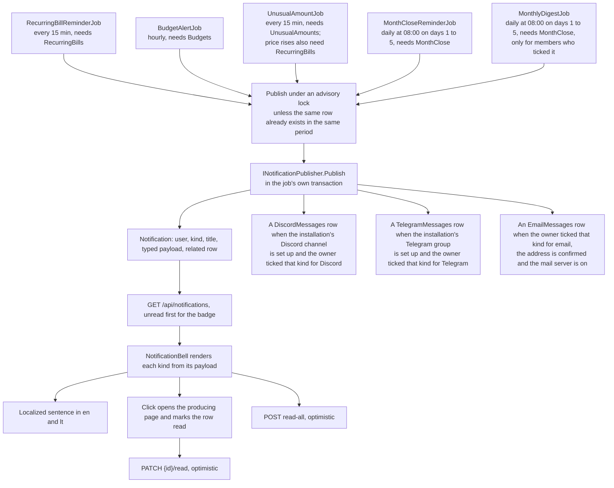

# Notifications

Back to the [feature walkthrough](README.md). See also [decisions](../decisions/notifications.md), [architecture: Background work and notifications](../architecture/background-jobs.md).

Backend `Notifications` and `Common/Notifications`, written by background jobs and shown by `NotificationBell` in the sidebar foot. Notifications are not a feature of their own: they are the shared mechanism a producer uses to tell one user that something happened while nobody was looking. Five producers exist today, `RecurringBillReminderJob`, `BudgetAlertJob`, since 2026-09-26 `UnusualAmountJob`, since 2026-09-27 `MonthCloseReminderJob` and since 2026-09-29 `MonthlyDigestJob`, and each is gated by the feature it belongs to. All five write through `INotificationPublisher`, which is the extension point: it adds the in-app row and, beside it, whatever the user asked to receive elsewhere: email, Discord or Telegram. The notification endpoints themselves are behind no feature switch and are not listed in `FeatureGateMiddleware`, so listing, the unread badge, marking one read and marking all read keep working as long as any producer is enabled — and also when none is.

## The publisher

No producer adds a `Notification` itself. Every one calls `INotificationPublisher.Publish(notification)` (`Common/Notifications`, scoped), after a `PreloadAsync(userIds)` that loads, in one go, what the publisher needs to know about the owners it is about to notify; publishing for a user who was not preloaded throws, so the batch load cannot be forgotten. The publisher adds the in-app row, an email, a Discord message and a Telegram message when the owner asked for that kind on that channel, all to the producer's own `AppDbContext`, so the producer's transaction and lock cover every channel at once. `BudgetAlertJob` works in a user scope and resolves its publisher, and with it the email outbox, from that scope.

That makes the publisher the extension point. A new producer calls it and reaches every channel; a new channel is added in one place and every producer reaches it. The architecture test `NotificationPublisherTests` scans the API sources and fails when anything outside `Common/Notifications/NotificationPublisher.cs` calls `Notifications.Add` or `AddRange`.

## The email beside the bell

`NotificationChannel` still has an `Email` value and no row ever carries it. Since email delivery arrived on 2026-09-20 a reminder that should also leave as mail is two rows, not one row on two channels: the `Notification` the bell shows and an `EmailMessages` row for the outbox. Keeping them apart is what lets the mail fail, wait and be retried for hours without the bell repeating itself or disappearing. Since 2026-09-27 the publisher enqueues the message through `IEmailOutbox` on the producer's `AppDbContext`, so both are written in the same transaction, under the same lock, behind the same "was this already notified" question, and cannot disagree. It does so for any kind the owner ticked in `AspNetUsers.EmailNotificationTypes`, only while the address is confirmed and the mail server is set up, and at most once per kind, related row and day. A bill reminder keeps its own message; every other kind is mailed with its title as the subject and the bell's sentence as the body. See [Email](email.md).

## Discord beside the bell

Discord, since 2026-09-26, is the second channel outside the application, and it follows the same rule: one more row, `DiscordMessages`, written by the publisher next to the notification and drained by its own outbox job. Like the email, it is not chosen by the producer. Since 2026-10-03 there is one Discord channel for the whole installation, set up by an administrator, and the publisher adds the message for any kind the owner ticked in `AspNetUsers.DiscordNotificationTypes` while Discord is switched on and a webhook is saved. The text is built by `NotificationTexts` in the owner's language (`AspNetUsers.Language`, or the installation's while it is null), mirrors the bell's sentences, and starts with the owner's display name, because everyone who reads the channel sees it. A new kind therefore reaches Discord once it has a sentence there, and a unit test fails until it does. See [Discord notifications](discord-notifications.md).

## Telegram beside the bell

Telegram, since 2026-10-03, is the third channel outside the application and works exactly like Discord: one installation group set up by an administrator, a `TelegramMessages` row written by the publisher for any kind the owner ticked in `AspNetUsers.TelegramNotificationTypes` while Telegram is switched on and a bot token and chat id are saved, the text from `NotificationTexts.Telegram` in the owner's language with the owner's name in front, and its own outbox job. A unit test fails for a kind without a Telegram text. See [Telegram notifications](telegram-notifications.md).

## Choosing channels

Each user makes both choices in one place, Settings › Personal › Notifications (`/profile?section=notifications`, `features/profile/notifications-section`): a table of every `NotificationType` against "In app", which is always on except for the monthly digest, and one column per channel that is set up on the installation, saved with one button. A new kind appears in that table by itself, because the rows come from the generated enum.

A channel's column appears only while the public settings say it is set up: "Email" while `emailEnabled` (a working mail server), "Discord" while `discordEnabled` (the switch on and a webhook saved), "Telegram" while `telegramEnabled` (the switch on, a bot token and a chat id saved). While the email column is shown and the member's address is unconfirmed, it is disabled with a note that it waits until the address is confirmed. When no channel is set up the description says that an administrator can set up email, Discord or Telegram, the monthly digest row is hidden because the digest is only ever sent outside the app, the digest note and the "Monthly digest for" household scopes are hidden, and there is no Save button.

## Kinds and the typed payload

`NotificationType` names the kind, and `Notification.Payload` carries the few values the sentence needs. The payload is one `jsonb` column holding a `NotificationPayload` record; every property is optional and a kind fills only its own:

| Kind | Title | Payload | Raised by |
| --- | --- | --- | --- |
| `billDue` | The recurring entry's name | `dueDate`, `shape` | `RecurringBillReminderJob` |
| `budgetWarning` | The category name | `thresholdPercent` (80), `period` | `BudgetAlertJob` |
| `budgetExceeded` | The category name | `thresholdPercent` (100), `period` | `BudgetAlertJob` |
| `unusualAmount` | The transaction's description | `transactionId`, `amount`, `typicalAmount`, `factor`, `currency` | `UnusualAmountJob` |
| `unusualAmounts` | Up to three of the descriptions | `count` | `UnusualAmountJob`, instead of more than three `unusualAmount` rows for one owner in one pass |
| `recurringPriceRise` | The recurring entry's name | `billId`, `transactionId`, `amount` (charged), `typicalAmount` (expected), `currency` | `UnusualAmountJob` |
| `monthReadyToClose` | The month in the installation language, "August 2026" or "2026 m. rugpjūtis" | `month` | `MonthCloseReminderJob` |
| `lowBalance` | The account's name | `dueDate` (the first day the forecast ends below zero), `amount` (the lowest forecast balance), `currency` (the account's) | `LowBalanceJob` |
| `warrantyExpiring` | The transaction's description, or the file name | `dueDate` (the warranty's last day), `transactionId` | `WarrantyReminderJob`, 30 days before; see [Attachments](attachments.md#warranty-dates) |
| `monthlyDigest` | The month in the installation language | `month`, `digest` (a `MonthlyDigestPayload`: `currency`, `income`, `expense`, `net`, `keptPercent`, up to three `movers` of `{ name, amount, previous }`, `uncategorized`, `unusual`, `unconfirmedRecurring`, `accountsNeedingAttention`, `closed`) | `MonthlyDigestJob`, only for members who ticked it for email or Discord |
| `importWaiting` | The statement file's name | none; `relatedType` `ImportInboxFile` and `relatedId` name the waiting file | `ImportInboxJob`, once per file it accepts; see [Bank statement import](bank-statement-import.md#import-inbox) |

The three kinds added on 2026-09-26 carry `currency` beside the amounts, so the bell formats them in the currency they were computed in: the reporting currency for an unusual expense, the account's currency for a price rise. The two unusual kinds link to `/transactions?unusual=true` and belong to `UnusualAmounts`; the price rise links to `/recurring-bills` and belongs to `RecurringBills`. An unusual expense is raised once per transaction and a price rise once per entry and charge, for the account owner and the entry's owner respectively. See [Unusual amounts](unusual-amounts.md).

`monthReadyToClose`, added on 2026-09-27, carries the first day of the month in `month`, and the job deduplicates on a reminder created since the start of the current month: one reminder per user and month, whether it was read, cleared or not. It names no related row. The bell says "{month} has ended and is ready to close" ("{month} baigėsi: peržiūrėkite ir uždarykite mėnesį") and links to `/reports/month?month=yyyy-MM`, the Month page of that month, while `MonthClose` is on; Discord gets the same sentence with the link from `NotificationTexts.PageLink`, `/?month=yyyy-MM`, the dashboard on that month, whose line leads to the page. It goes only to users who have closed a month before and have not closed the previous one, on days 1 to 5 of a month. See [Month-end close](month-end-close.md).

`monthlyDigest`, added on 2026-09-29, deduplicates the same way and links to the same Month page in the bell. It is the one kind that is not always written: the job only runs for members who ticked it for email or Discord, and the publisher adds the bell row beside those messages. The bell reads "Income {income}, expenses {expense}, net {net}" from the payload; email and Discord get the longer text with the movers and the open items. The month in the stored title is in the installation language, while email subjects and Discord messages render it from `month` in the recipient's language through `NotificationTexts.Title`, for `monthReadyToClose` too. See [Monthly digest](monthly-digest.md).

`importWaiting`, added on 2026-10-01, tells the owner of an account that a statement for it arrived in the import inbox and waits for review. The bell reads "A bank statement is waiting for review" under the file name and links to Settings › Personal › Import and export (`/profile?section=import`), which says how many are waiting and opens the import dialog that lists them. It belongs to the `Import` switch. There is nothing to deduplicate: the inbox ignores a file it has received before, so each row is one new file.

Before the payload existed, a bill reminder put the bill name in `Title` and the ISO due date in `Message`, and the client parsed that text. Rows written that way are still in the database, so `NotificationMapper` fills the payload from `Message` when the column is null: a `billDue` row whose message parses as `yyyy-MM-dd` answers with that date in `dueDate`, anything else answers with an empty payload. `Message` is still written and still returned as the plain-text fallback the client shows when a payload it does not recognise arrives, which is what a client one version behind a new kind sees.

The client never builds a sentence from server text. It reads the kind and the payload and calls `t("notifications.…")`, so the same row reads "Monthly limit: 80% used" in English and "Mėnesinis limitas: panaudota 80%" in Lithuanian.

`billDue` needs more than the date, because a recurring entry can be an expense, an income or a transfer and one sentence cannot cover all three — "Mokėjimo data" is wrong for money that is coming in. The payload therefore carries `shape` beside `dueDate`, and the bell picks `notifications.billDue.expense`, `.income` or `.transfer`. A row written before shapes existed has no `shape` and reads as an expense, which is what every such row was.

## Low-balance alerts

`lowBalance`, added on 2026-09-30, is the [cash-flow forecast](cash-flow-forecast.md) sent to the member instead of waiting on the accounts page. `LowBalanceJob` walks every active user every six hours while `RecurringBills` is on and, in that user's scope with no active household, asks `ICashFlowForecastService` for the next 30 days, the same call the page makes. Every account whose solid line ends a day below zero (`belowZeroOn`) raises one alert, unless it starts today already below zero: a member whose account is overdrawn knows, and the alert is about money that is still there. The dashed line of usual spending never raises one, because it is an estimate. The alert reads "Forecast to go below zero on Nov 14, lowest -€200.00" in the account's currency, and links to `/accounts`, where the forecast names the entry that crosses.

Deduplication is one row per account and per crossing date, among every `lowBalance` row the user has, read or not, held under `AppLock.LowBalanceAlerts` like the budget scan. A later pass that finds the same date says nothing; a date that moves, because an entry was confirmed, edited or added, is news and raises a new row. A shared account is forecast for each member who can see it, so each gets the alert. Thirty days is the shortest horizon the forecast offers and far enough ahead to move money; the six hours match the exchange-rate sync, since the forecast changes only when the ledger or an entry does.

## A producer that was switched off

A notification outlives the switch that produced it. When `Budgets`, `RecurringBills`, `UnusualAmounts` or `MonthClose` is turned off, the rows already written stay in the list and stay in the unread count: they are a record of something that was true when it happened, hiding them would make the badge jump when an administrator flips a switch, and the list would have to learn which feature each kind belongs to in order to filter. What does change is the link. `NotificationBell` maps each kind to the page that explains it and to the feature that owns that page, and renders the entry as a link only while that feature is on; otherwise the entry is a plain button that marks the row read, because the page it would open is not in the navigation either.

## Budget alerts

`BudgetAlertJob` walks every active user hourly and, for each of that user's budgets, asks `BudgetUsageCalculator` for the current window — the same call the budgets page makes, so rollover, the carried amount and the effective limit are the numbers the user sees. Spending at or above 80% of the effective limit raises `budgetWarning`, at or above 100% raises `budgetExceeded`, and a budget whose effective limit is not positive after an overspend carried forward counts as fully spent as soon as anything is spent in the window.

Deduplication is one row per budget, per window, per threshold. The job reads the budget notifications already written since the start of the current window and skips a threshold that is among them, so a restart, a second pass or two instances running at once cannot double up; the read and the insert happen in one transaction that holds `AppLock.BudgetAlerts`. Spending that falls back below a threshold inside the same window — an edited or deleted transaction — does not re-arm it: the alert says the threshold was crossed, and crossing it twice in one window is one event, not two. The next window starts the count again, so a budget that is overspent every month is reported every month. A budget that jumps past both thresholds between two passes gets both rows, so the 80% warning is never silently swallowed by the 100% one.

The alert links to `/budgets`, where the meter, the window and the carried breakdown explain the number.

## Reading and clearing

`GET /api/notifications` answers newest first and takes `unread` to filter. The bell asks for unread only, shows the count as a badge and, when the popover is open, one row per notification with its localized sentence. Clicking a row marks it read optimistically (`PATCH /api/notifications/{id}/read`) and, when the row has a link, navigates. "Mark all as read" is one `POST /api/notifications/read-all`. Confirming a recurring entry also invalidates the notification query, which is why a confirmed entry's reminder disappears without a refresh; it invalidates the transfer list too, because a transfer-shaped entry writes one.
