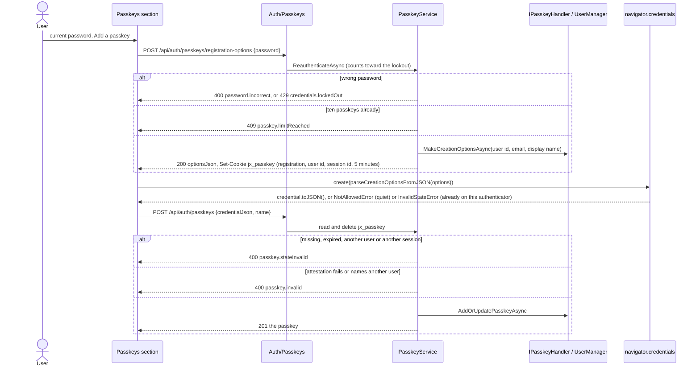
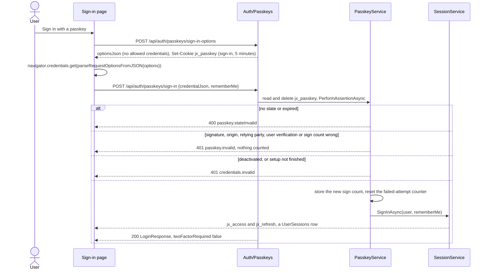
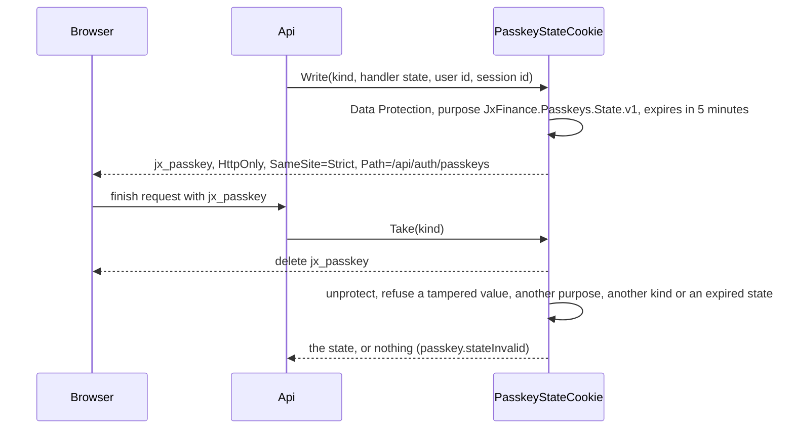

# Passkeys

Back to the [feature walkthrough](README.md). See also [decisions](../decisions/authentication.md), [architecture: Authentication](../architecture/authentication.md), [Sign-in, sessions and lockout](sign-in-and-sessions.md) and [Two-factor authentication](two-factor-authentication.md).

Backend `Auth/Passkeys` (`BeginPasskeyRegistration`, `AddPasskey`, `GetPasskeys`, `RenamePasskey`, `RemovePasskey`, `BeginPasskeySignIn`, `PasskeySignIn`), `Auth/Services/PasskeyService.cs`, `Infrastructure/Auth/PasskeyStateCookie.cs` and `Infrastructure/Auth/PasskeySite.cs`. Frontend `profile/passkeys-section`, `profile/password-prompt`, the passkey button of `auth/login-page` and `src/lib/passkeys.ts`. No feature switch.

A passkey is a WebAuthn credential that lives in a phone, a laptop, a password manager or a security key. The application keeps only its public key. It uses the passkey support that ships in ASP.NET Core Identity 10: the app calls Identity's `IPasskeyHandler<AppUser>` for the two ceremonies and the `UserManager` passkey methods for storage, and signs in through its own `ISessionService`, not through `SignInManager`. The browser side is `navigator.credentials` with the WebAuthn JSON helpers, with no npm package.

## Adding a passkey

Settings › Personal › Security shows the two-factor section and, under it, the Passkeys section: the list, then the current-password field and "Add a passkey". The password is checked first, and a wrong one counts toward the account lockout like every other secret. The browser then asks for the PIN, fingerprint or security key, and the passkey is stored under the browser's own label ("Chrome 140 on Windows", or "Passkey" when the browser is not recognised). It can be renamed later.

The list shows each passkey's name, when it was added, and in words whether it is "Synced across devices" (the backup-eligible flag) or "This device only". Rename opens a small dialog; remove asks first. After a removal the section suggests signing out everywhere else, because a removed passkey signs nobody in any more but the browsers it already signed in stay signed in. A member holds at most ten passkeys, and a name is at most 100 characters.

Adding or removing a passkey does not change the security stamp, so no other browser is signed out. Registration requires a discoverable credential and user verification, and asks for no attestation.

## Signing in

The sign-in page shows an outline "Sign in with a passkey" button under the form, and the authenticator-code step shows "Use a passkey instead". Both run the same ceremony and ask for no email, no password and no code. The "Remember me" choice of the form is sent along. A successful passkey sign-in goes through `loadAppShell` and lands on the dashboard exactly as a password sign-in does.

A user-verified passkey is a whole sign-in: possession of the authenticator plus its PIN or biometric. A member who has the authenticator app switched on is therefore not asked for a code after a passkey; see the [decisions](../decisions/authentication.md). A synced passkey reports a sign count of zero, which is accepted; a non-zero count that does not grow is refused as a possible clone.

## Lockout

A failed assertion never calls `AccessFailedAsync`. Counting it would let anyone who holds a credential id lock its owner out, and a failed assertion is not a guess at a secret. A member whose password is temporarily locked after five wrong attempts can still sign in with a passkey; the completed sign-in resets the failed-attempt counter, as every completed sign-in does, and leaves the rest of the 15 minutes on the password. Both sign-in endpoints are throttled to 10 calls per five minutes per client, and the registration options to 5.

## The ceremony state

Identity's handler returns a state with each set of options, and whoever calls the handler directly has to keep it with integrity, bound to the requesting session, and use it once. The app keeps it in a cookie, not in a table.

For a registration the finish step also compares the user id and the session id in the state with the caller's, so a registration begun in one browser cannot be finished in another, and a state cannot be used to add a key to someone else's account. The record `PasskeyState` prints its state as `***`.

## Relying party and HTTPS

WebAuthn needs a secure context: HTTPS, or `localhost`. The relying party id is fixed by `App:SiteUrl` when it is set (the production overlay sets `https://${SITE_ADDRESS}`): its host becomes `IdentityPasskeyOptions.ServerDomain`, and `ValidateOrigin` accepts exactly that origin and no cross-origin frame. Without `App:SiteUrl`, as in development and the end-to-end stack, the host header gives the relying party (`localhost`) and Identity's own check compares the browser's origin with the request's `Origin` header.

`GET /api/settings/public` reports `passkeysAvailable`, which is false when `App:SiteUrl` is set and uses plain HTTP, an IP address or cannot be parsed. The client also checks `window.isSecureContext` and the JSON helpers (Chrome and Edge 129, Firefox 119, Safari 18.4). When either says no, the sign-in page shows no passkey button and the Passkeys section keeps its list, so a passkey can still be removed, and explains in one sentence why none can be added.

A passkey belongs to its relying party id. Changing `SITE_ADDRESS` orphans every stored passkey: the rows stay, but no authenticator will offer them under the new name. One installation serves one name; reaching it under a second name (a LAN name and a VPN name) is not supported.

## Resets and recovery

Passkeys get no recovery codes of their own. The fallback is the password, with the authenticator code when two-step is on, and after that an administrator's reset. An administrator's password reset with "Also reset two-factor authentication and passkeys" (`resetTwoFactor`) removes every passkey of the member in the same transaction; without it the passkeys stay. `--recover-admin` removes the administrator's passkeys too. The password stays on every account: a passkey-only account is not possible.

## Endpoints

| Route | Access | Does |
| --- | --- | --- |
| `POST /api/auth/passkeys/registration-options` | signed in, 5 per five minutes | confirms the password, returns creation options, sets the state cookie |
| `POST /api/auth/passkeys` | signed in | verifies and stores the credential, 201 |
| `GET /api/auth/passkeys` | signed in | the caller's passkeys, oldest first |
| `PUT /api/auth/passkeys/{id}` | signed in | renames one; 404 unless it is the caller's |
| `DELETE /api/auth/passkeys/{id}` | signed in | removes one; 404 unless it is the caller's |
| `POST /api/auth/passkeys/sign-in-options` | anonymous, 10 per five minutes | returns request options, sets the state cookie |
| `POST /api/auth/passkeys/sign-in` | anonymous, 10 per five minutes | verifies the assertion and signs in |

The id is the base64url credential id. Credential JSON is never logged: the request records print it as `***`.

## Backup and restore

The passkeys live in `AspNetUserPasskeys`, which backups carry like the password hashes and two-factor secrets. A restored passkey works only under the same relying party id.

## Error codes

| Code | Status | When |
| --- | --- | --- |
| `passkey.invalid` | 401 on sign-in, 400 on registration | the credential did not verify |
| `passkey.stateInvalid` | 400 | the state cookie is missing, expired, tampered or not this user's or session's |
| `passkey.limitReached` | 409 | the member already holds ten passkeys |
| `passkey.unavailable` | 400 | `App:SiteUrl` is plain HTTP or an IP address |

## Tests

Integration tests (`PasskeyTests`) run against PostgreSQL with `SoftwareAuthenticator` in `JxFinance.Tests/Support`: an ES256 key made in the test that builds `clientDataJSON`, the authenticator data and the "none" attestation object and signs assertions, so Identity's real handler verifies every ceremony. They cover registration, the password and its lockout, a missing, foreign-session and expired state, the eleventh passkey, both cookies and a session row for a two-factor user, a wrong origin and relying party, a bad signature that leaves the counter alone, a locked-out and a deactivated user, the stored sign count and a replayed one, the administrator reset and the recovery command. `BackupEndpointTests` checks that a restore brings a removed passkey back. Unit tests cover the state cookie, `PasskeySite` and the browser helper; the stories fake `navigator.credentials`; `frontend/e2e/passkeys.spec.ts` adds a passkey with Chromium's virtual authenticator and signs in with it.
