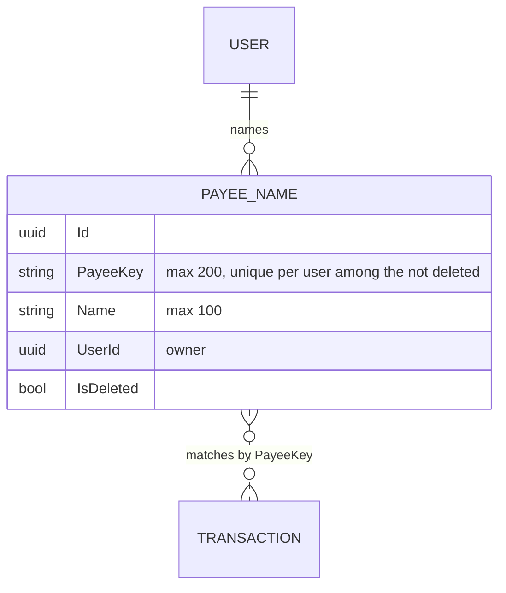

# Payee names

Back to the [feature walkthrough](README.md). See also [decisions](../decisions/reports.md), [Reports: expense by payee](reports.md#expense-by-payee), [Transactions](transactions.md).

Backend `Payees` (`GetPayeeNames`, `SetPayeeName`, `DeletePayeeName`, group `PayeesGroup`), `Common/Payees/PayeeNameLookup.cs`, and the name parts of `Transactions`, `Reports` and `RecurringBills`. Frontend `components/payee-name-form`, `transactions/payee-naming` (the row action), and the "Payee names" section of the Tags page. Added on 2026-09-30; behind its own `PayeeNames` switch, on by default, since 2026-10-03.

A bank writes the same shop many ways: "MAXIMA LT, UAB 20260402", "Maxima LT UAB 20260418". Every transaction already stores the normalized form as `PayeeKey` (`maxima lt uab`), taken from the [statement's payee](bank-statement-import.md#the-statements-payee) when an import stored one and from the description otherwise, which is how the report, unusual amounts and suggested rules group payees. A payee name puts a word the member chose on that key, once, so "Maxima" reads in the ledger, the report and the recurring-entry suggestions instead of the bank's text.

## The model

`PayeeName` is an `OwnableEntity` with its own id type and nothing else: no scope, no household. It joins a transaction through the key, never through a foreign key, so naming a payee changes no transaction, a row imported tomorrow with the same key picks the name up, and removing the name leaves every row as it was. A name is personal even on a shared account: the owner and a partner who both see a Maxima row each see their own name for it, or the bank's text. The owner's query filter does this with no code.

## Naming and renaming

`PUT /api/payees` takes `{ payee, name }` and answers the stored `{ id, payeeKey, name }`. `payee` is normalized with `SubscriptionDescription.Normalize`, the same function that fills `PayeeKey`, so a raw description, as the row action sends, and a key, as the Tags page sends, name the same payee; a payee with nothing left after normalizing, such as "12345", is refused with `text.invalidFormat` on `payee`. The name is trimmed, required and at most 100 characters. A second `PUT` for the same key renames the row instead of adding one, so the endpoint is an upsert. The one conflict left is two first `PUT`s for the same key at the same moment, which both find no row: the unique index takes the first, and the save goes through `SaveOrConflictAsync`, so the other answers 409 `conflict.busy` and a retry renames the stored row. `DELETE /api/payees/{id}` soft-deletes it and answers 204, or 404 for a name that is not the caller's; the retention job purges it after 30 days like the other deleted records, and it is not in the trash, because putting a name back is one dialog. `GET /api/payees` lists the caller's names by name. The list is readable with a personal API token; the two writes are not.

In the ledger every row with a description or a statement payee has **Name payee** in its menu, **Rename payee** once it has a name, which opens a small form with the name field and "Bank text: …" under it. The form sends the statement's payee when the row has one and the description otherwise, the text its key was made from. The Tags page, in the Categories hub, has a "Payee names" section after the tags, followed only by [Places](transaction-locations.md#renaming-and-merging-places) while that switch is on, that lists the names with their key in muted text, edits them in the same form and deletes them with a confirmation. The section sits beside tags rather than on a page of its own, following the rule that a task lives where the member already is.

## Where the name shows

| Place | What changes |
| --- | --- |
| Ledger, desktop | The description cell shows the name, and the bank's text in its tooltip; the note line stays under it. Without a name, a row with a statement payee shows the payee and the description in a muted line under it |
| Ledger, phone, and the dashboard's recent transactions | `transactionName` prefers `payeeName` over the statement's payee and the description, then the category label |
| Ledger search | `search` also matches a transaction whose key has a name containing the text, so "Maxima" finds the renamed rows |
| Reports, expense by payee | Each item carries `name`, and the row reads it before `label`, the newest bank description |
| Recurring entries, suggestions | Each candidate carries `name`; the row and the prefilled entry use it before the capitalised key |

`TransactionResponse.payeeName`, `PayeeBreakdownItem.name` and `SubscriptionCandidateResponse.name` are filled by one query per response, `PayeeNamesForAsync` over the keys on the page, so a ledger page costs one extra indexed read. The CSV and PDF exports keep the bank's description, because an export is the record. Setting or removing a name invalidates the payee list, the ledger, the report and the suggestions.

## The switch

`PayeeNames` gates `/api/payees` through `PayeesGroup`. Off, `TransactionResponses`, `ReportService` and `SubscriptionDetectionService` skip the name lookup, so `payeeName` and the two `name` fields read as null and every place falls back to the bank's text, and the ledger search in `TransactionQueryService` stops matching names. The row menu leaves out Name payee and the Tags page leaves out its section. The names stay in their table and come back when the switch is on. The member's own export still writes them, into the `PayeeNames` table and the journal's payee field, because the export is the member's data rather than a screen.

## Tests

`PayeeNameTests` (integration, PostgreSQL) cover a name given from a raw description showing on every row of the key and in the report, the search by name, renaming by key and removing, names staying personal on a shared account, and the refused key. `TokenReadableTests` lists `GET /api/payees`, `RetentionTests` the purge, `transaction-row.test.ts` the name before the description, and the stories of `PayeeNameForm` and `TagsPage` the form and the section.
