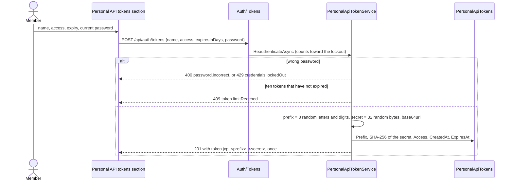

# Personal API tokens

Back to the [feature walkthrough](README.md). See also [decisions](../decisions/authentication.md), [architecture: Authentication](../architecture/authentication.md#personal-api-tokens), [Sign-in, sessions and lockout](sign-in-and-sessions.md) and [API surface](../api.md#authorization-header).

Backend `Auth/Tokens` (`GetPersonalApiTokens`, `CreatePersonalApiToken`, `RevokePersonalApiToken`, group `ApiTokensGroup`), `Auth/Services/PersonalApiTokenService.cs`, `Infrastructure/Auth` (`PersonalApiToken`, `TokenAccess`, `ApiIdempotencyKey`, `PersonalApiTokenFormat`, `PersonalApiTokenAuthenticationHandler`, the policy scheme in `JwtCookieAuthentication`), `Common/Middleware` (`PersonalApiTokenGateMiddleware`, `PersonalApiTokenRateLimit`, `IdempotencyMiddleware`), `Common/TokenReadable.cs` and `Common/TokenWritable.cs`. Frontend `profile/api-tokens-section` and `transactions/source-mark`. The read-only MCP server is `tools/jx-mcp`. Feature switch `ApiTokens`, off by default.

A personal API token lets a script, a spreadsheet, Home Assistant or an iOS Shortcut on the member's own devices read what the member reads in the browser. A token created with read-and-write access can also record, change and delete transactions and transfers, set their category or tags in bulk, confirm recurring entries and move the saved amount of a manual goal. Nothing administrative, personal to the account, structural (categories, rules, budgets) or stored as a file can be reached with any token, even when the token belongs to an administrator.

## Creating a token

While an administrator has switched `ApiTokens` on in Settings › Installation › Features, Settings › Personal › Security shows a Personal API tokens section under the passkeys. "Create a token" opens a dialog with a name (at most 60 characters), the access (Read only, the default, or Read and write), an expiry and the current password. A read-only token lasts 30 days, 90 days (the default) or 1 year; choosing Read and write leaves only 30 and 90 days and moves a chosen year to 90 days, and the server refuses a read-and-write token of more than 90 days with `range.invalid` on `expiresInDays`. The password is checked first and a wrong one counts toward the account lockout like every other secret (`password.incorrect`, then `credentials.lockedOut`). The dialog then shows the token once in a read-only field with a Copy button and the sentence "You will not see this token again"; for a read-and-write token it also repeats in one sentence what the token can change. Closing it forgets the secret. The endpoint is throttled to five calls per five minutes per client.



The list shows each token's name, its prefix (`jxp_4fK2aQ9m…`), its access as a Read only or Read and write badge, when it was created, when it expires and when it was last used, or "Never". An expired token stays in the list, marked Expired, until the retention job deletes it 30 days after it expired, and it no longer counts toward the ten. Revoke asks first and deletes the row, so the next request with that token answers 401.

## Using a token

Send the token in the `Authorization` header and nothing else: there is no query-string form, because a query string ends up in request logs, shell history and spreadsheet cells. `GET /api/ping` answers 200 with a good token and 401 `token.invalid` with a bad one, which makes it the quickest check. Money arrives as decimal strings (`"12.50"`), dates as `YYYY-MM-DD`, and lists that can grow are paged with `page` and `pageSize`, at most 200 rows a page, answering `items`, `page`, `pageSize` and `total`.

The production overlay serves HTTPS with Caddy's internal certificate authority. A script outside the browser has to trust its root certificate, which can be copied out of the frontend container once:

```powershell
docker compose -f docker-compose.yml -f docker-compose.production.yml cp frontend:/data/caddy/pki/authorities/local/root.crt ./jx-root.crt
```

curl:

```sh
export JX_TOKEN='jxp_...'
curl --cacert jx-root.crt -H "Authorization: Bearer $JX_TOKEN" \
  "https://finance.home.lan/api/transactions?dateFrom=2026-09-01&dateTo=2026-09-30&pageSize=200"
```

Windows PowerShell 5.1, with the root certificate imported into the Windows certificate store once:

```powershell
$env:JX_TOKEN = 'jxp_...'
$page = Invoke-RestMethod -Uri 'https://finance.home.lan/api/transactions?pageSize=200' `
  -Headers @{ Authorization = "Bearer $env:JX_TOKEN" }
$page.items | Select-Object date, description, amount
```

Python with `requests`:

```python
import os
import requests

session = requests.Session()
session.headers["Authorization"] = f"Bearer {os.environ['JX_TOKEN']}"
session.verify = "jx-root.crt"

rows, page = [], 1
while True:
    body = session.get("https://finance.home.lan/api/transactions", params={"page": page, "pageSize": 200}).json()
    rows += body["items"]
    if page * body["pageSize"] >= body["total"]:
        break
    page += 1
```

Excel Power Query (Data › Get Data › From Other Sources › Blank Query, then Advanced Editor), on a computer that trusts the root certificate:

```text
let
    token = "jxp_...",
    source = Json.Document(Web.Contents("https://finance.home.lan/api/accounts", [Headers = [Authorization = "Bearer " & token]])),
    accounts = Table.FromRecords(source)
in
    accounts
```

A workbook built this way contains the token in its query. Treat the file like the token: do not mail it or put it on a shared drive, and revoke the token if the file leaves your hands. When Excel asks for credentials for the address, choose Anonymous; the header carries the token.

`X-Active-Household` narrows a token's answers exactly as the household switcher narrows the browser's, and the three downloads (`/api/transactions/export`, `/api/transactions/export/pdf`, `/api/investments/tax-summary/export`) accept `activeHousehold` in the query as well, see [API surface](../api.md). A token is not bound to a household; the member's personal records are visible in every scope anyway.

## What a token can read

A token reaches only `GET` routes of the groups that opt in with `ApiGroup(…, tokenReadable: true)`, which attaches `TokenReadable` metadata, less the two routes that opt out with `TokenReadable.No`. Feature switches still apply on top: a route of a switched-off feature answers 404 `feature.disabled` to a token as to the browser.

| Group | Readable with a token |
| --- | --- |
| Accounts | the list, archived accounts, one account, the cash-flow forecast, reconciliations and the reconciliation preview |
| Transactions | the ledger, one transaction, the summary, the CSV and PDF exports, and since 2026-10-01 the ledger with groups folded, `GET /api/transactions/ledger`, and, while `LearnedCategories` is on, the suggested categories of uncategorized rows, `GET /api/transactions/uncategorized-suggestions` |
| Transaction groups | since 2026-10-01 the list of your [groups](transaction-groups.md) and the members of one |
| Transfers, Conversions, Categories, Tags, Payees | their lists; payee names since 2026-09-30 |
| Reports | the summary, spending by payee included |
| Dashboard | the summary, the monthly trend and the category breakdown; not the dashboard layout, which is a personal setting |
| Budgets, Goals | the lists and the budget suggestions |
| Net worth | net worth and its history, assets with their valuations and value history, debts with their recorded balances, payments, payment candidates and schedule |
| Investments | the portfolio, securities and their prices, investment transactions, the value history, the tax summary with its CSV and, since 2026-10-01, your target allocation; not the broker connections, which describe an outside account |
| Recurring entries | the list, one entry and the subscription suggestions |
| Currencies | the currency list and exchange rates |
| Households | the list, one household and its activity log, and since 2026-09-29 its settle-up balances, split expenses and payments; since 2026-10-01 your people outside the household with their balances and history |
| Diagnostics | `GET /api/ping` |

Everything else answers 403 `token.notAllowed`: every `POST`, `PUT`, `PATCH` and `DELETE` outside the [writable list](#writing-with-a-token), and every write at all for a read-only token; the whole of Auth (the profile, sessions, passkeys, two-factor, the token list itself), Users, Settings, Backups (a backup download holds every table), Notifications, Trash, Imports, Attachments (the stored files), Receipts (which starts work on the server), Month-end close and Categorization rules; anonymous routes such as sign-in; `/health`, the OpenAPI document; and any path that matches no route. `TokenReadableTests` holds the exact list of readable routes, so a new `GET` in a readable group fails that test until someone decides it belongs there.

## Writing with a token

A token created with Read and write access, since 2026-10-01, also reaches the routes that record what a script, Home Assistant or a Shortcut would add. Every token from before then stays read-only. Each of these endpoints carries `TokenWritable.Yes` in its metadata, and `TokenWritableTests` holds the exact list:

| Route | Does |
| --- | --- |
| `POST /api/transactions` | records a transaction; answers 201 with `Location` |
| `PUT /api/transactions/{id}` | changes one; the body is the whole transaction, as for the browser |
| `DELETE /api/transactions/{id}` | moves one to the Trash |
| `POST /api/transactions/bulk-category` | sets or clears the category of many transactions |
| `POST /api/transactions/bulk-tags` | replaces the tags of many transactions with the ones sent |
| `POST /api/transfers`, `PUT /api/transfers/{id}`, `DELETE /api/transfers/{id}` | records, changes and deletes a transfer |
| `POST /api/recurring-bills/{id}/confirm` | confirms the due occurrence of a recurring entry |
| `PATCH /api/goals/{id}/progress` | sets (`currentAmount`) or adds to (`delta`) the saved amount of a manual goal, since 2026-10-01; see [Goals](goals.md#moving-progress-without-the-whole-goal) |

Marking a recurring occurrence done without recording it (`POST /api/recurring-bills/{id}/skip`, since 2026-10-01) is not on the list, because it records no row and would let a token move schedules forward and silence their reminders. Neither are deleting a selection, moving one to another account and undoing a deleted selection (`POST /api/transactions/bulk-delete`, `POST /api/transactions/bulk-account`, `POST /api/trash/restore-transactions`, since 2026-10-01): a token may delete one row at a time, but 200 rows at once or a whole selection moved between accounts is a reshaping of the books that should need a browser session, and the undo belongs to the Trash, which stays browser-only.

Anything else answers 403 `token.notAllowed`, with "API tokens cannot use this route; it needs a browser session." in `reason`; a write with a read-only token answers the same code with "This token can only read; create a read-and-write token to record entries." Imports, attachments, receipts, the Trash, settings, users, households, backups, categories, categorization rules, budgets, goals apart from their progress and, since 2026-10-01, [transaction groups](transaction-groups.md) stay browser-only, so a leaked token can add noise to the ledger but cannot reshape the books or read files. The request bodies, validation, visibility and feature switches are those of the browser: under `X-Active-Household` a write that names an account outside that household answers `reference.notFound`.

Three consequences follow from sharing the browser's code:

- A transaction or transfer a token deletes lands in the Trash like any other and is restored in the browser.
- A confirmation of a recurring entry that pays a tracked debt links the debt payment, exactly as in the browser.
- A partner can split an API-created expense on a shared account in the household settle-up like any other expense.

### Retries and Idempotency-Key

A client may send `Idempotency-Key: <1 to 64 visible ASCII characters>` with a `POST` or, since 2026-10-01, a `PATCH`. The first request with a key runs as usual; sending the same request again with the same key within 24 hours answers the first answer (status, body and `Location`) with `Idempotency-Replayed: true` and records nothing. A Shortcut that retries on a bad connection therefore never books a coffee twice. Use a new key for every new entry, such as a UUID or the Shortcut's current date with seconds.

| Situation | Answer |
| --- | --- |
| The same key, method, path, query, `X-Active-Household` and body | the stored answer, replayed |
| The same key with anything else different | 409 `idempotency.keyReused` |
| The same key while the first request is still running | 409 `conflict.busy`; retry in a moment |
| A first request that ended in a server error (5xx) | nothing is kept, so a retry runs again |
| A key longer than 64 characters | 400 `text.tooLong` |
| An empty key, or one with spaces or characters outside visible ASCII | 400 `text.invalidFormat` |

Keys belong to one token: two tokens may use the same key. A `PATCH` honours it because a goal's `delta` repeated by a retry would add twice. `PUT` and `DELETE` ignore the header because repeating them changes nothing, and the browser never sends it. The 60 requests a minute are shared by reads and writes.

### Marks in the ledger and the activity log

A transaction created through a token has the source `api`, and its edit dialog says "Added through the API" under the title. Nothing shows for a hand-entered or imported row. A later bank import matches an API-created row like a hand-entered one, within three days and the same amount, and links it instead of importing it again; the link turns its source into `imported`, as for a typed row. On a shared account the household activity log names the token after the member, for example "Justas, through Home Assistant, added Maxima, 12.40 EUR", and a bulk categorization through a token names it on its summarising row too. A token moving a shared goal's progress is named the same way on the goal's update.

### Write examples

The address and certificate note under [Using a token](#using-a-token) apply to writes as well: a script outside the browser must trust Caddy's root certificate. Every example records a 12.40 EUR expense at Maxima on the account whose id the script holds; `GET /api/accounts` and `GET /api/categories` give the ids.

curl:

```sh
curl --cacert jx-root.crt -X POST "https://finance.home.lan/api/transactions" \
  -H "Authorization: Bearer $JX_TOKEN" \
  -H "Content-Type: application/json" \
  -H "Idempotency-Key: $(uuidgen)" \
  -d '{"accountId":"<account id>","type":"expense","amount":"12.40","date":"2026-10-01","description":"Maxima"}'
```

Windows PowerShell 5.1, which sends the body as UTF-8 only when it is given as bytes:

```powershell
$body = @{ accountId = '<account id>'; type = 'expense'; amount = '12.40'; date = (Get-Date -Format 'yyyy-MM-dd'); description = 'Maxima' } | ConvertTo-Json
Invoke-RestMethod -Method Post -Uri 'https://finance.home.lan/api/transactions' `
  -Headers @{ Authorization = "Bearer $env:JX_TOKEN"; 'Idempotency-Key' = [guid]::NewGuid().ToString() } `
  -ContentType 'application/json; charset=utf-8' -Body ([Text.Encoding]::UTF8.GetBytes($body))
```

Python with `requests`, retrying with the same key:

```python
import os, uuid, requests

session = requests.Session()
session.headers["Authorization"] = f"Bearer {os.environ['JX_TOKEN']}"
session.verify = "jx-root.crt"

key = str(uuid.uuid4())
entry = {"accountId": "<account id>", "type": "expense", "amount": "12.40", "date": "2026-10-01", "description": "Maxima"}
for attempt in range(3):
    try:
        response = session.post("https://finance.home.lan/api/transactions", json=entry, headers={"Idempotency-Key": key}, timeout=10)
        if response.status_code != 409:
            break
    except requests.ConnectionError:
        continue
response.raise_for_status()
```

An iOS Shortcut: install Caddy's root certificate on the phone once (AirDrop `jx-root.crt`, install the profile, then turn it on under Settings › General › About › Certificate Trust Settings). In the Shortcut, "Ask for Input" (Number) for the amount, then "Get Contents of URL" with the URL `https://finance.home.lan/api/transactions`, Method POST, Headers `Authorization` = `Bearer jxp_...` and `Idempotency-Key` = the "Current Date" formatted as ISO 8601 with seconds, and Request Body JSON with `accountId`, `type` = `expense`, `amount` (the input as text, with a dot as the decimal separator), `date` (the current date formatted `yyyy-MM-dd`) and `description`. The token sits in the Shortcut; do not share the Shortcut.

Home Assistant `rest_command` in `configuration.yaml`, with the token in `secrets.yaml` as `jx_token: "Bearer jxp_..."` and the root certificate trusted by the Home Assistant host, or `verify_ssl: false` on a network you control:

```yaml
rest_command:
  jx_expense:
    url: "https://finance.home.lan/api/transactions"
    method: POST
    headers:
      Authorization: !secret jx_token
      Idempotency-Key: "{{ key }}"
    content_type: "application/json"
    payload: >-
      {"accountId": "<account id>", "type": "expense", "amount": "{{ amount }}",
       "date": "{{ now().strftime('%Y-%m-%d') }}", "description": "{{ description }}"}
```

An automation then calls `rest_command.jx_expense` with `amount`, `description` and a `key` such as `"{{ now().isoformat() }}"`, fixed once per event so that Home Assistant's own retry reuses it.

#### Moving a savings goal

`PATCH /api/goals/{id}/progress` moves a manual goal; `GET /api/goals` gives the ids. Send `delta` to add what was put aside, or `currentAmount` to set the total. A delta is not idempotent by itself, so send an `Idempotency-Key` with it.

curl, adding 50 EUR:

```sh
curl --cacert jx-root.crt -X PATCH "https://finance.home.lan/api/goals/<goal id>/progress"   -H "Authorization: Bearer $JX_TOKEN"   -H "Content-Type: application/json"   -H "Idempotency-Key: $(uuidgen)"   -d '{"delta":"50.00"}'
```

Home Assistant, with the same `secrets.yaml` entry as above:

```yaml
rest_command:
  jx_goal_add:
    url: "https://finance.home.lan/api/goals/<goal id>/progress"
    method: PATCH
    headers:
      Authorization: !secret jx_token
      Idempotency-Key: "{{ key }}"
    content_type: "application/json"
    payload: '{"delta": "{{ amount }}"}'
```

An automation calls `rest_command.jx_goal_add` with `amount` (a dot as the decimal separator, negative to take money out) and a `key` fixed once per event. A goal funded from an account answers 400 `goal.notManual`, and a delta that would take the goal below zero `money.nonNegative`.

## What ends a token

| Event | Effect |
| --- | --- |
| Expiry | 1 to 365 days after creation, at most 90 for a read-and-write token; there is no "never" |
| Revoke in the section | the row is deleted |
| Deactivation by an administrator | every token of the member is deleted in the same transaction; reactivation does not bring them back |
| Password reset, by an administrator or through the emailed link | every token of the member is deleted in the same transaction |
| `--recover-admin` | every token of that administrator is deleted |
| [Backup restore](#backup-and-restore) | every token of every member is gone, since 2026-10-01 |
| `ApiTokens` switched off | every token request answers 404 `feature.disabled`; the rows are kept, and the tokens work again when the switch is back on |
| Own password change, two-factor or passkey changes | nothing: the token is not tied to the security stamp |

A deactivated member's token would be refused anyway, because the handler checks the account on every request, but deletion means it cannot come back.

## Limits and last use

A token may send 60 requests a minute across all routes, counted in a fixed window per token by ASP.NET Core's rate limiter. The 61st answers 429 `token.rateLimited` with `Retry-After` in seconds. Browser requests are not limited this way. `LastUsedAt` is written at most once a minute per token, by one conditional update, so a script loop costs one write a minute; the client address is not stored.

## Endpoints

| Route | Access | Does |
| --- | --- | --- |
| `GET /api/auth/tokens` | signed in, `ApiTokens` on | the caller's tokens, newest first, with their `access` (`read` or `readWrite`), expired ones marked; never the secret |
| `POST /api/auth/tokens` | signed in, `ApiTokens` on, 5 per five minutes | takes `name`, `access`, `expiresInDays` and `password`, confirms the password and answers 201 with the token once |
| `DELETE /api/auth/tokens/{id}` | signed in, `ApiTokens` on | revokes one; 404 unless it is the caller's |

None of the three is reachable with a token. The request record prints its password, and the created response its token, as `***`.

## Backup and restore

Since 2026-10-01 `PersonalApiTokens` is transient like the sessions: backups leave it out and a restore ends every token, the same way it ends every session, so a token revoked because it leaked cannot come back by restoring a backup taken before the revocation. After a restore each member creates their tokens again; a backup taken before then still restores, with its token rows skipped. `ApiIdempotencyKeys`, the retry keys, is transient like the sessions: backups and the member export leave it out, and `RetentionJob` deletes keys older than a day.

## Error codes

| Code | Status | When |
| --- | --- | --- |
| `token.invalid` | 401, with `WWW-Authenticate: Bearer error="invalid_token"` | the token is malformed, unknown, expired, revoked or belongs to a deactivated member |
| `token.notAllowed` | 403 | a route outside the readable list, a write outside the writable list, or any write with a read-only token |
| `idempotency.keyReused` | 409 | an `Idempotency-Key` sent again with a different request |
| `conflict.busy` | 409 | an `Idempotency-Key` whose first request is still running |
| `range.invalid` | 400 | a read-and-write token asked for more than 90 days |
| `token.limitReached` | 409 | the member already holds ten tokens that have not expired |
| `token.rateLimited` | 429, with `Retry-After` | more than 60 requests in a minute with one token |
| `feature.disabled` | 404 | `ApiTokens` is off |

## MCP server for an AI client

`tools/jx-mcp` is a small [Model Context Protocol](https://modelcontextprotocol.io) server that runs on the member's own computer and lets an AI client the member chooses, such as Claude Desktop, read the ledger through a token. It speaks MCP over stdio, reads `JX_URL` and `JX_TOKEN` from its environment and only ever sends `GET` requests, so even a read-and-write token given to it cannot write, the goal progress route included; give it a read-only token anyway. Its seven tools map one to one to readable routes, with descriptions taken from the contract's summaries: `list_accounts` (`GET /api/accounts`), `list_transactions` (`GET /api/transactions` with the ledger filters and paging), `get_report_summary` (`GET /api/reports/summary`), `list_budgets`, `list_goals`, `get_net_worth` (`GET /api/networth`) and `list_recurring_entries` (`GET /api/recurring-bills`). A problem answer from the installation reaches the client as a tool error with its code.

The installation still sends nothing anywhere. Whatever the AI client does with the answers is the member's choice: a client that runs a hosted model sends the ledger data it reads to that model's provider. Revoke the token when you stop using the server.

It is a separate Node package with its own `package.json`, outside the frontend build and lint. Build it once (Node 24 or newer):

```powershell
cd tools/jx-mcp
nub install
nub run build
nub run test
```

Then register `node <path to the checkout>/tools/jx-mcp/dist/index.js` with the client. For Claude Desktop, add it to `claude_desktop_config.json` (Settings › Developer › Edit Config) and restart the app:

```json
{
  "mcpServers": {
    "jx-finance": {
      "command": "node",
      "args": ["C:/path/to/Jx-Finance/tools/jx-mcp/dist/index.js"],
      "env": {
        "JX_URL": "https://finance.home.lan",
        "JX_TOKEN": "jxp_...",
        "NODE_EXTRA_CA_CERTS": "C:/path/to/jx-root.crt"
      }
    }
  }
}
```

`NODE_EXTRA_CA_CERTS` makes Node trust Caddy's root certificate (see [Using a token](#using-a-token)). Other MCP clients take the same three things: the command `node`, the path to `dist/index.js` and the environment; Claude Code, for example, with `claude mcp add jx-finance --env JX_URL=https://finance.home.lan --env JX_TOKEN=jxp_... -- node C:/path/to/Jx-Finance/tools/jx-mcp/dist/index.js`. The config file holds the token in clear; treat it like the token. `nub run test` type-checks the package and runs each tool against a recorded response through the SDK's in-memory transport.

## Tests

`PersonalApiTokenTests` (integration, PostgreSQL) cover the secret shown once and never listed, the password that counts toward the lockout, the name and expiry rules, the eleventh token and an expired one that does not count, revocation and another member's token, the same transactions with and without `X-Active-Household` as the owner's cookie and the CSV with `activeHousehold`, writes and private routes refused for an administrator's token, every documented operation checked against the readable list, expired, unknown, tampered and malformed tokens, deactivation, an administrator reset against an own password change, `--recover-admin`, the switch off and on, the 61st request, `LastUsedAt` at most once a minute, and a token sent beside a cookie. `TokenReadableTests` pins the readable routes and `TokenWritableTests` the writable ones, with no write route under a private prefix, categories, budgets or households; `PersonalApiTokenGateTests` covers the gate's decision by method, access and marks, and `IdempotencyRequestHashTests` the request hash. `PersonalApiTokenFormatTests` pins the parsing, `SecretRedactionTests` the two records, `RetentionTests` the clean-up queries and `BackupEndpointTests` that neither the token table nor the retry keys travel and that a restore of a file still holding tokens leaves none.

`PersonalApiTokenWriteTests` (integration) cover a read token refused a write, a read-and-write token creating, editing, categorizing, tagging and deleting a transaction and a transfer, the refusal of categories, attachment upload, import confirm, budgets and account deletion, a write under `X-Active-Household` naming an account outside it, the token's name on the activity events of a shared account including the bulk row, a bank import linking an API-created row, a recurring confirmation that pays a debt, the 90-day rule and the deletion of write tokens by deactivation, a password reset and `--recover-admin`. `GoalProgressTests` cover a partner's write token moving a shared goal with the token named in the activity log, a read-only token refused, and a retried `PATCH` delta added once. `IdempotencyKeyTests` cover a replayed retry leaving one row, a reused key with another body or household, a running claim answering `conflict.busy` and an abandoned one taken over, a server error that is not remembered, keys per token, malformed keys and a browser request ignoring the header, and the retention of day-old keys. The stories of `ApiTokensSection` show the list with an expired and a read-and-write token, the empty list, loading, a failed load, a created token, a read-and-write token whose expiry shrinks to 90 days, the limit and a revocation; `SourceMark` and the activity log have stories of their own.
