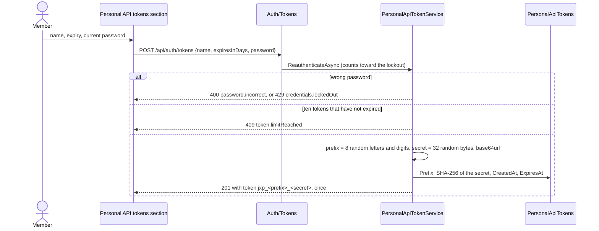

# Personal API tokens

Back to the [feature walkthrough](README.md). See also [decisions](../decisions/authentication.md), [architecture: Authentication](../architecture/authentication.md#personal-api-tokens), [Sign-in, sessions and lockout](sign-in-and-sessions.md) and [API surface](../api.md#authorization-header).

Backend `Auth/Tokens` (`GetPersonalApiTokens`, `CreatePersonalApiToken`, `RevokePersonalApiToken`, group `ApiTokensGroup`), `Auth/Services/PersonalApiTokenService.cs`, `Infrastructure/Auth` (`PersonalApiToken`, `PersonalApiTokenFormat`, `PersonalApiTokenAuthenticationHandler`, the policy scheme in `JwtCookieAuthentication`), `Common/Middleware` (`PersonalApiTokenGateMiddleware`, `PersonalApiTokenRateLimit`) and `Common/TokenReadable.cs`. Frontend `profile/api-tokens-section`. Feature switch `ApiTokens`, off by default.

A personal API token lets a script, or a spreadsheet on the member's own computer, read what the member reads in the browser. It only reads: nothing can be written with it, and nothing administrative, personal to the account or stored as a file can be read with it, even when the token belongs to an administrator.

## Creating a token

While an administrator has switched `ApiTokens` on in Settings › Installation › Features, Settings › Personal › Security shows a Personal API tokens section under the passkeys. "Create a token" opens a dialog with a name (at most 60 characters), an expiry of 30 days, 90 days (the default) or 1 year, and the current password. The password is checked first and a wrong one counts toward the account lockout like every other secret (`password.incorrect`, then `credentials.lockedOut`). The dialog then shows the token once in a read-only field with a Copy button and the sentence "You will not see this token again"; closing it forgets the secret. The endpoint is throttled to five calls per five minutes per client.



The list shows each token's name, its prefix (`jxp_4fK2aQ9m…`), when it was created, when it expires and when it was last used, or "Never". An expired token stays in the list, marked Expired, until the retention job deletes it 30 days after it expired, and it no longer counts toward the ten. Revoke asks first and deletes the row, so the next request with that token answers 401.

## Using a token

Send the token in the `Authorization` header and nothing else: there is no query-string form, because a query string ends up in request logs, shell history and spreadsheet cells. `GET /api/ping` answers 200 with a good token and 401 `token.invalid` with a bad one, which makes it the quickest check. Money arrives as decimal strings (`"12.50"`), dates as `YYYY-MM-DD`, and lists that can grow are paged with `page` and `pageSize`, at most 200 rows a page, answering `items`, `page`, `pageSize` and `total`.

The production overlay serves HTTPS with Caddy's internal certificate authority. A script outside the browser has to trust its root certificate, which can be copied out of the frontend container once:

```powershell
docker compose -f docker-compose.yml -f docker-compose.production.yml cp frontend:/data/caddy/pki/authorities/local/root.crt ./jx-root.crt
```

curl:

```sh
export JX_TOKEN='jxp_...'
curl --cacert jx-root.crt -H "Authorization: Bearer $JX_TOKEN" \
  "https://finance.home.lan/api/transactions?dateFrom=2026-09-01&dateTo=2026-09-30&pageSize=200"
```

Windows PowerShell 5.1, with the root certificate imported into the Windows certificate store once:

```powershell
$env:JX_TOKEN = 'jxp_...'
$page = Invoke-RestMethod -Uri 'https://finance.home.lan/api/transactions?pageSize=200' `
  -Headers @{ Authorization = "Bearer $env:JX_TOKEN" }
$page.items | Select-Object date, description, amount
```

Python with `requests`:

```python
import os
import requests

session = requests.Session()
session.headers["Authorization"] = f"Bearer {os.environ['JX_TOKEN']}"
session.verify = "jx-root.crt"

rows, page = [], 1
while True:
    body = session.get("https://finance.home.lan/api/transactions", params={"page": page, "pageSize": 200}).json()
    rows += body["items"]
    if page * body["pageSize"] >= body["total"]:
        break
    page += 1
```

Excel Power Query (Data › Get Data › From Other Sources › Blank Query, then Advanced Editor), on a computer that trusts the root certificate:

```text
let
    token = "jxp_...",
    source = Json.Document(Web.Contents("https://finance.home.lan/api/accounts", [Headers = [Authorization = "Bearer " & token]])),
    accounts = Table.FromRecords(source)
in
    accounts
```

A workbook built this way contains the token in its query. Treat the file like the token: do not mail it or put it on a shared drive, and revoke the token if the file leaves your hands. When Excel asks for credentials for the address, choose Anonymous; the header carries the token.

`X-Active-Household` narrows a token's answers exactly as the household switcher narrows the browser's, and the three downloads (`/api/transactions/export`, `/api/transactions/export/pdf`, `/api/investments/tax-summary/export`) accept `activeHousehold` in the query as well, see [API surface](../api.md). A token is not bound to a household; the member's personal records are visible in every scope anyway.

## What a token can read

A token reaches only `GET` routes of the groups that opt in with `ApiGroup(…, tokenReadable: true)`, which attaches `TokenReadable` metadata, less the two routes that opt out with `TokenReadable.No`. Feature switches still apply on top: a route of a switched-off feature answers 404 `feature.disabled` to a token as to the browser.

| Group | Readable with a token |
| --- | --- |
| Accounts | the list, archived accounts, one account, the cash-flow forecast, reconciliations and the reconciliation preview |
| Transactions | the ledger, one transaction, the summary, the CSV and PDF exports |
| Transfers, Conversions, Categories, Tags | their lists |
| Reports | the summary, spending by payee included |
| Dashboard | the summary, the monthly trend and the category breakdown; not the dashboard layout, which is a personal setting |
| Budgets, Goals | the lists and the budget suggestions |
| Net worth | net worth and its history, assets with their valuations and value history, debts with their payments, payment candidates and schedule |
| Investments | the portfolio, securities and their prices, investment transactions, the value history and the tax summary with its CSV; not the broker connections, which describe an outside account |
| Recurring entries | the list, one entry and the subscription suggestions |
| Currencies | the currency list and exchange rates |
| Households | the list, one household and its activity log |
| Diagnostics | `GET /api/ping` |

Everything else answers 403 `token.notAllowed`: every `POST`, `PUT`, `PATCH` and `DELETE`; the whole of Auth (the profile, sessions, passkeys, two-factor, the token list itself), Users, Settings, Backups (a backup download holds every table), Notifications, Trash, Imports, Attachments (the stored files), Receipts (which starts work on the server), Month-end close and Categorization rules; anonymous routes such as sign-in; `/health`, the OpenAPI document; and any path that matches no route. `TokenReadableTests` holds the exact list of readable routes, so a new `GET` in a readable group fails that test until someone decides it belongs there.

## What ends a token

| Event | Effect |
| --- | --- |
| Expiry | 1 to 365 days after creation; there is no "never" |
| Revoke in the section | the row is deleted |
| Deactivation by an administrator | every token of the member is deleted in the same transaction; reactivation does not bring them back |
| Password reset by an administrator | every token of the member is deleted in the same transaction |
| `--recover-admin` | every token of that administrator is deleted |
| `ApiTokens` switched off | every token request answers 404 `feature.disabled`; the rows are kept, and the tokens work again when the switch is back on |
| Own password change, two-factor or passkey changes | nothing: the token is not tied to the security stamp |

A deactivated member's token would be refused anyway, because the handler checks the account on every request, but deletion means it cannot come back.

## Limits and last use

A token may send 60 requests a minute across all routes, counted in a fixed window per token by ASP.NET Core's rate limiter. The 61st answers 429 `token.rateLimited` with `Retry-After` in seconds. Browser requests are not limited this way. `LastUsedAt` is written at most once a minute per token, by one conditional update, so a script loop costs one write a minute; the client address is not stored.

## Endpoints

| Route | Access | Does |
| --- | --- | --- |
| `GET /api/auth/tokens` | signed in, `ApiTokens` on | the caller's tokens, newest first, expired ones marked; never the secret |
| `POST /api/auth/tokens` | signed in, `ApiTokens` on, 5 per five minutes | confirms the password and answers 201 with the token once |
| `DELETE /api/auth/tokens/{id}` | signed in, `ApiTokens` on | revokes one; 404 unless it is the caller's |

None of the three is reachable with a token. The request record prints its password, and the created response its token, as `***`.

## Backup and restore

`PersonalApiTokens` is an ordinary exported table, like the password hashes: a restored installation keeps working tokens, because a token is a durable credential its member chose to create. Only the prefix and the SHA-256 hash of the secret are stored, so a backup file cannot be used to recover a token.

## Error codes

| Code | Status | When |
| --- | --- | --- |
| `token.invalid` | 401, with `WWW-Authenticate: Bearer error="invalid_token"` | the token is malformed, unknown, expired, revoked or belongs to a deactivated member |
| `token.notAllowed` | 403 | a write, or a route outside the readable list |
| `token.limitReached` | 409 | the member already holds ten tokens that have not expired |
| `token.rateLimited` | 429, with `Retry-After` | more than 60 requests in a minute with one token |
| `feature.disabled` | 404 | `ApiTokens` is off |

## Tests

`PersonalApiTokenTests` (integration, PostgreSQL) cover the secret shown once and never listed, the password that counts toward the lockout, the name and expiry rules, the eleventh token and an expired one that does not count, revocation and another member's token, the same transactions with and without `X-Active-Household` as the owner's cookie and the CSV with `activeHousehold`, writes and private routes refused for an administrator's token, every documented operation checked against the readable list, expired, unknown, tampered and malformed tokens, deactivation, an administrator reset against an own password change, `--recover-admin`, the switch off and on, the 61st request, `LastUsedAt` at most once a minute, and a token sent beside a cookie. `TokenReadableTests` pins the readable routes, `PersonalApiTokenFormatTests` the parsing, `SecretRedactionTests` the two records, `RetentionTests` the clean-up query and `BackupEndpointTests` that the table travels. The stories of `ApiTokensSection` show the list with an expired token, the empty list, loading, a failed load, a created token, the limit and a revocation.
