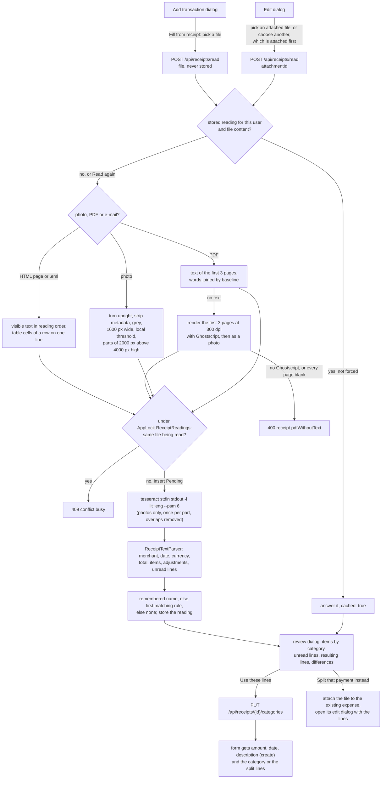

# Receipt reading

Back to the [feature walkthrough](README.md). See also [decisions](../decisions/receipt-reading.md), [attachments](attachments.md), [transactions](transactions.md#create-with-a-split).

Backend `Receipts` (`ReceiptService`, `POST /api/receipts/read`, `PUT /api/receipts/{id}/categories`, and `ReceiptItemCategoryService` behind `GET` and `DELETE /api/receipts/item-categories`), `Common/Receipts` (`IReceiptReader`, `ReceiptInput`, `ReceiptErrors`), `Infrastructure/Receipts` (`TesseractReceiptReader`, `ReceiptImage`, `ReceiptDocument`, `ReceiptTextParser`), `Domain/Receipts` and the last step of `RetentionJob`; frontend `transactions/receipt-reading` (`fill-from-receipt`, `receipt-review`, `receipt-split.ts`) inside the transaction form and `categories/remembered-items` on the Categories page. Feature switch `ReceiptReading`.

A grocery receipt is one payment for several kinds of spending. Splitting it by hand means adding up the food and the toothpaste with a calculator, and the discounts and the bottle deposit make that slow. "Fill from receipt" in the transaction form reads the photo, PDF or receipt e-mail on the server, a photo with [Tesseract](https://github.com/tesseract-ocr/tesseract), turns the text into items, and gives each item the category the person chose for that name before or the one their categorization rules pick. The form then gets split lines that add up exactly to the payment. Nothing is saved until the person presses Save on the form, so every rule of [splits](transactions.md#create-with-a-split) applies unchanged.

## Nothing leaves the installation

The photo, its text and the items are read and kept inside the API container and the database. Reading makes no network call: Tesseract runs as a process next to the API, PDFs, HTML pages and e-mails are read in the API process without fetching anything they link to, a scanned PDF's pages are rendered by Ghostscript, which Magick.NET runs as a process next to the API, and the categories come from the person's own dictionary and rules. There is no key, no provider, no per-read notice and no monthly limit, because there is nothing to pay for and nothing to disclose.

## When the action is offered

`GET /api/settings` answers `receiptReadingReady`, true when the `ReceiptReading` switch is on and the `tesseract` executable is on the API's `PATH`; the form shows "Fill from receipt" only then. The switch starts on, like every other switch. The production image installs Tesseract with its Lithuanian and English language data, so there it is ready; on a development machine without Tesseract the action stays hidden, a photo sent anyway answers `receipt.engineUnavailable` (503), and a PDF with text or a receipt e-mail still reads. The production image also installs Ghostscript, which renders a scanned PDF; where it is missing, as on a development machine without it, a scan answers `receipt.pdfWithoutText` as it did before. While the switch is off, `/api/receipts` answers `feature.disabled`. Nothing is read on upload, by a job or for another person: a person clicks.

## The flow

In the create dialog the picked file is kept in the page's state. When the transaction is saved, including with "Save and add another", the page uploads it as an attachment of the new transaction; a failed upload leaves the transaction saved and shows "Saved, but the receipt was not attached" with the server's reason. In the edit dialog the action lists the transaction's files, newest first and preselected, and "Choose another file" uploads a new one through the ordinary attachment endpoint before reading it.

The read runs inside the request. Tesseract takes about one second for a receipt photo on the development machine; the action says "Reading the receipt, this takes a few seconds" and has a Cancel button that aborts the request, which kills the process and marks the reading failed so the next click is not refused as busy.

## Preparing a photo

`ReceiptImage.Prepare` works in memory on a file of at most 10 MB and reads it only as the format `AttachmentContent.Detect` found, with Magick.NET's width and height limited to 16000 pixels. JPEG, PNG, WebP and HEIC are turned upright from their EXIF orientation, stripped of every metadata profile, refused below 200 pixels on the short side, flattened on white, turned grey, scaled up or down to 1600 pixels wide (at most 16000 high), put through a local adaptive threshold (a 30 pixel window, 5% below the local mean) and written as PNG. An uploaded `file` is first cleaned in memory exactly as an attachment is before it is stored ([`AttachmentImage.WithoutMetadata`](attachments.md#location-and-other-metadata)), after `PhotoLocation` has read its GPS tags for the [photo's position](#the-address-and-the-photos-position), and its SHA-256 is taken over the cleaned bytes, so a file read in the create dialog and the attachment it then becomes have the same hash and share the reading; an image that cannot be decoded answers `receipt.unsupportedFile`.

The threshold is what makes a phone photo readable. Measured on 2026-09-29 with receipts rendered, blurred and lit from one side, Tesseract read 1 of 13 checked values (prices, totals, the date) from the raw photo and all 13 after the local threshold, while a global contrast stretch lost the darker half of the receipt; on a clean scan the threshold changed nothing. Page segmentation mode 6 (one uniform block of text) kept each printed line together where mode 4 split some of them in two. HEIC decoding comes with Magick.NET's native library.

### Very tall screenshots

Since 2026-10-01 a prepared image taller than 4000 pixels, such as a phone screenshot of an e-receipt several screens long, is read in parts. `ReceiptBands.Cut` cuts it, after the threshold, into horizontal parts of 2000 pixels that overlap by 150, about two printed lines at 1600 pixels wide; the last part is what is left. Every photo up to 2.5 times as tall as it is wide stays one part, as before. The height limit is the 16000 pixels Magick.NET allows, so a screenshot 1080 pixels wide and 16000 tall keeps its size instead of being shrunk to fit 12000, which the limit was before.

Each part is read by its own Tesseract process, one after the other, each under the 60 second limit, and a part that fails fails the read. `ReceiptBands.Join` then puts the texts together: blank lines go and the spaces inside a line collapse to one. Where two parts meet it takes the last of the next part's first six lines that equals, ignoring case, one of the previous part's last six lines of at least four characters. The next part's lines up to and including it are dropped, and so are the previous part's lines after its copy, because the edge cut those and the next part has them whole. When no line repeats, as when the overlap fell on blank space, the texts follow each other unchanged. The threshold runs before the cut, so both parts see the same pixels in the overlap and Tesseract mostly reads them the same way. Two identical short lines within six lines of a seam, such as a repeated `2 x 1,19`, can still be taken for the overlap; the review then shows a gap between the items and the printed total.

## Reading a PDF

A PDF is read from its text when it has any. `ReceiptImage` opens it with PdfPig, takes the words of the first three pages, groups them into lines by their baseline and orders each line from left to right, so a name and a price that the PDF placed separately end up on one line. The review says "Only the first 3 of 7 pages were read" for a longer file. An encrypted or broken PDF answers `receipt.unsupportedFile`. E-receipts and shop PDFs carry text, which is exact where OCR guesses, so the text always wins.

### Scanned PDFs

Since 2026-10-01 a PDF whose first three pages carry no text, a scan saved as PDF, is rendered and read like a photo. `ReceiptImage` asks Magick.NET for each of those pages on its own at 300 dots per inch, which runs Ghostscript (`gs`, with `-dSAFER`) as a process inside the API container, and gives every page the photo's preparation: flattened on white, grey, 1600 pixels wide, the local threshold and, above 4000 pixels high, the [parts](#very-tall-screenshots). A page that comes out all white is skipped. The service reads each page's parts with Tesseract, joins a page's parts with the overlaps removed and the pages one after the other, so the review's "Only the first 3 of 7 pages were read" holds for a scan too. The rendered pages live only in memory for the request, under the limits `AttachmentImage` sets: `Prepare` looks up its image formats before anything else, so the limits are in place even when a stored PDF is the first file the API touches after a start. At 300 dots per inch an A4 page is 2480 by 3508 pixels before it is scaled to 1600 wide, and a till roll page 80 millimetres wide is 945 pixels wide and may be up to about 1350 millimetres long before it meets the 16000 pixel limit.

Whether rendering works is found out on each scan rather than at start: when Ghostscript is not installed, cannot read the file or a page exceeds the Magick.NET limits, Magick.NET throws, and the scan answers `receipt.pdfWithoutText` as before, as does a scan whose pages all come out blank. So a development machine without Ghostscript keeps today's answer, and `receiptReadingReady` still depends on Tesseract alone. Where Tesseract is missing, a scan that rendered answers `receipt.engineUnavailable` like a photo.

## Reading an HTML or e-mail receipt

Since 2026-10-01 "Fill from receipt" also takes a receipt that came by e-mail: the page saved from the mail program or the shop's site (`.html`, `.htm`, `text/html`) or the message itself (`.eml`, `message/rfc822`). `ReceiptDocument` knows such a file by its declared type, or by its extension when the browser declares none, and never when its first bytes are an image or a PDF. It is read in the API process with MimeKit, which MailKit already brings: a message gives its HTML part, else its plain text part, and HTML goes through MimeKit's `HtmlTokenizer`, which decodes the entities. Only the visible text is kept: the head, scripts, styles, form controls and elements marked `hidden` or `display: none` (the preview line many e-mails hide) are left out. Each block element (a paragraph, `div`, table, table row, list item, heading or `br`) starts a new line and the cells of a table row are joined by a space, so the row "Pienas 1 l | 1,19 €" becomes the line `Pienas 1 l 1,19 €`, which `ReceiptTextParser` reads like a PDF's text. Spaces inside a line collapse to one and empty lines go. An HTML file is read as UTF-8. Nothing is fetched: images, stylesheets and links stay unopened, and the message's own attachments are ignored, so a receipt sent as a PDF attachment is saved and read as a PDF.

Such a file is read and never stored, because attachments stay JPEG, PNG, WebP, HEIC and PDF. The create dialog keeps no file to attach on save, "Split that payment instead" opens the payment without attaching anything, and in the edit dialog "Choose another file" reads it directly instead of attaching it first. Its reading is cached by the file's SHA-256 like any other and, with no attachment of that hash, goes after a day under [retention](#retention), so its items count neither in the [spending per item](#spending-per-item) report nor in the [item search](#finding-a-purchase-by-item). A message that cannot be parsed answers `receipt.unsupportedFile`, and a file with no visible text `receipt.unreadable`.

## The engine

`TesseractReceiptReader` is a singleton behind `IReceiptReader`. It finds `tesseract` (`tesseract.exe` on Windows) on `PATH` once, writes the prepared PNG to the process's standard input and reads the text from its standard output with `-l lit+eng --psm 6`. One process runs at a time; another read waits for it, and the wait ends when its request is cancelled. A read that takes longer than 60 seconds is killed and answers `receipt.unreadable`. A process that cannot start, exits with an error (for example when the language data is missing) or stops reading its input answers `receipt.engineUnavailable`; the log records the exit code and Tesseract's error text, never the image or the text read.

## From text to items

`ReceiptTextParser.Parse` is a pure function from the text to the reading. It compares words after folding case and diacritics and after reading `0` as `o` and `1`, `l` and `|` as `i`, so `MOKĖTI`, `Mokéti` and `M0KETI` are the same word, and reads `O`, `o`, `I` and `l` inside an amount as digits, so `-O,86` is −0.86 and `0,1O` is 0.10. Amounts take a comma or a dot. It goes through the lines once, in order:

- A line ending in an amount, optionally followed by `EUR` or `€` and a VAT letter `A` to `E` (`1,89 A`, `3,49A`), is priced; everything before the amount is its label.
- The first priced line whose label starts with a total word (`Mokėti`, `Iš viso`, `Viso`, `Suma`, `Mokėtina suma`, `Bendra suma`, `Grąžinti`, `Total`, `Amount due`) is the total, and reading stops there, so payment, change, VAT tables, loyalty points and the footer are never items. `Tarpinė suma`, `Subtotal`, `Suma be PVM` and discount summaries (`Viso nuolaidų`) are not totals.
- Lines starting with `PVM`, `VAT`, `Kasa`, `Kvitas`, `Kasininkas`, `Mokėta`, `Grynais`, `Grąža`, `Card`, `Cash` or a savings or points note are skipped.
- A quantity line (`2 x 1,19`, `1,236 kg x 1,49 EUR/kg`, `2x1,19`) with an amount makes an item of the name on the line above it (the Maxima and Rimi layout); without an amount it becomes the quantity of the item just read (the Lidl layout). A quantity at the end of an item line is split off the name the same way.
- A line holding only an amount makes an item of the name on the line above it.
- A priced line naming a bottle voucher (`Taromato kvitas`) or rounding (`Apvalinimas`) is an adjustment. A discount (`Nuolaida`, `Akcija`, `Discount`) is the discount of the item just read, unless it names the card, the whole receipt or a coupon (`kortelės`, `čekio`, `kvito`, `visam`, `kuponas`), and then it is an adjustment on the whole receipt. A deposit (`Užstatas`) is the deposit of the item just read. The amount is taken without its sign, since OCR often loses the minus.
- Any other priced line with a name is an item; a negative one outside a return receipt is an adjustment of kind `other`.
- A receipt with a line starting `Grąžinimas` or `Return` is a return, and its negative items are taken as positive.

A line that is none of these, such as a name whose price was misread (`Kiausiniai M 10 vnt Z,19 A`), goes into the reading's unread lines once the first item has been read; lines before it are the header. Nothing between the first item and the total is dropped without a trace. The merchant is the first of the first five lines naming a known chain (Maxima, Rimi, Iki, Lidl, Norfa and others), else the first line with three letters; the address is the first of those five lines after the merchant's that has a street number and either an `LT-12345` postcode or a known Lithuanian city, such as "Savanorių pr. 247, LT-02300 Vilnius"; the date is the first `YYYY-MM-DD`, `YYYY.MM.DD` or `DD.MM.YYYY` in the text; the currency is `€` or the first three-letter currency code printed. Text with no item and no total answers `receipt.unreadable`.

Limits: 200 items, 20 adjustments and 50 unread lines; names are cut to 200 characters and quantities to 40.

The stored reading (`ReceiptReading.Result`, `jsonb`) has the merchant, the address (since 2026-10-01; readings stored before have none until they are read again), date, currency, printed total, `isReturn`, the pages read and the page count, the items (name, quantity as printed, amount, discount, deposit, category id, remembered), the adjustments (kind `discount`, `voucher`, `rounding` or `other`, label, signed amount) and the unread lines.

### Accuracy on the fixtures

`backend/JxFinance.Tests/Support/Receipts` holds six OCR texts: Maxima, Rimi, Iki and Lidl layouts, a return, and a noisy Maxima photo with diacritics lost, `O` for `0`, `1` for `l`, a quote for a minus, junk at the line edges, a garbled price and a stray line. `ReceiptTextParserTests` checks every item's name, amount, discount, deposit and quantity, the adjustments, the merchant, date, currency and total of each. On the four clean layouts every item and total is read and the items balance to the printed total to the cent; on the noisy one all seven readable items and the total are read, and the item with the garbled price and the stray line come back as unread lines, so the review shows the 2.19 gap.

## The address and the photo's position

Since 2026-10-01, while the [`Locations`](transaction-locations.md#receipts) switch is on, "Use these lines" also fills the transaction's Place with the merchant and the address, "MAXIMA LT, UAB, Savanorių pr. 247, LT-02300 Vilnius", when Place is empty. A freshly uploaded photo whose EXIF carries a GPS position is answered with `photoLatitude` and `photoLongitude` on the reading response, read by `PhotoLocation` with Magick.NET (the degrees, minutes and seconds of `GPSLatitude` and `GPSLongitude`, negative for a `S` or `W` reference) just before the metadata is stripped. The position is never written to `ReceiptReading.Result`, which backups and the member export carry, and it is only offered, as "Use the photo's location" under the receipt action, because a photo taken later at home carries the home's position. A fresh upload answered from the cache still reads its own tags. A PDF, or an attachment stored earlier, which has no metadata left, carries none, and with `Locations` off the reading answers none.

## Choosing categories

Each item gets, in order:

1. the category the person filed an item of that name under before (`ReceiptItemCategory`, tagged "Remembered" in the review), when that category is still a visible expense category;
2. otherwise the category of the person's first categorization rule, in rule order, that matches the item's name and amount and has no account of its own (`ICategorizationRuleService.SuggestAsync` with no account), while the `CategorizationRules` switch is on; a rule for an income category never matches;
3. otherwise none.

The review lets the person pick any expense category for any item. "Use these lines" sends every item's category to `PUT /api/receipts/{id}/categories`. The service checks each category with `IReferenceGuard` as an expense category the caller can see, stores the choices in the reading and keeps one `ReceiptItemCategory` per item name. `ReceiptItemKey.Normalize` lowercases the name, drops diacritics, digits, units (g, kg, l, ml, vnt and the like) and punctuation, so `PIENAS 2,5% 1L`, `Pienas 2.5 % 1 l`, `Sūris DŽIUGAS` and the OCR's `SURIS DZIUGAS` meet on the same key. An item set back to no category forgets its name. The dictionary keeps at most 5000 names per person and drops the least recently used first. A remembered category that was deleted or is no longer visible is ignored, and comes back when the category is restored.

### Remembered items on the Categories page

Since 2026-10-01 the Categories page ends, while the switch is on, with "Remembered receipt items": the caller's dictionary, one row per remembered name with the category and when it was last used, which is the last time an item of that name was filed through "Use these lines" (`UpdatedAt`, which every choice refreshes). The row shows the key itself, such as `dantu pasta colgate`, because the dictionary stores no printed name. A category that was deleted or is no longer shared reads "Deleted or unshared category". "Find an item" is debounced and searched on the server, normalized like the key, and the list shows the 100 most recently used matches, with "Showing the 100 most recently used of 340. Search to find the others." when there are more. Each row has "Forget", which asks "Forget this item?" and then removes the entry for good, so the next receipt with that name falls back to the rules or none; stored readings and transactions keep what they have.

`GET /api/receipts/item-categories?search` answers `items` (`id`, `key`, `categoryId`, `lastUsed`) and `total`, and `DELETE /api/receipts/item-categories/{id}` answers 204, or 404 for an entry that is not the caller's. Both sit under `/api/receipts`, so they answer `feature.disabled` while the switch is off and a personal API token can use neither. The delete is a hard delete, like forgetting through the review, because the key is unique per person and a new choice of the same name must be able to insert it again. "Use these lines" refreshes the list, and the member export and import already carry the table.

## From items to lines

The arithmetic runs in the browser, in `receipt-split.ts`, because the lines change as the person moves items between categories. The server checks the saved lines as it checks any split.

- An item's weight is its printed amount minus the discount printed under it plus the deposit printed under it, never below zero. The deposit stays with its drink.
- Items are grouped by the category chosen for them; items without one form an uncategorized group.
- The payment is shared across the groups in proportion to their weights, in cents, by largest remainder; a tie on the remainder goes to the larger group, then to the first. A group that rounds to zero is dropped. When one group is left, the form gets that category and no split.
- The amount shared is the form's amount in the edit dialog. In the create dialog the form first takes the receipt's total, currency (when it is usable in this installation), date and merchant as description.
- A line's description is the short names of its items (the words before the first digit or quote), joined with commas and cut to 500 characters.

One rule covers the loyalty-card discount, a coupon on the total, a bottle-return voucher, cash rounding, a receipt in another currency and a misread cent, and the lines always add up exactly to the payment, which the split validator demands.

### Worked example

The receipt, as `backend/JxFinance.Tests/Support/Receipts/maxima-2026-09-26.txt` holds its OCR text: seven items and a loyalty discount of −0.50 on the whole receipt, total 18.21 EUR. The categories here are the ones the person picks, or that their rules give.

| Item | Amount | Discount | Deposit | Weight | Category |
| --- | --- | --- | --- | --- | --- |
| Duona BOČIŲ 800 g | 1.89 | | | 1.89 | Food |
| Pienas 2,5 % 1 l (2 x 1,19) | 2.38 | | | 2.38 | Food |
| Sūris DŽIUGAS 180 g | 4.29 | 0.86 | | 3.43 | Food |
| Bananai (1,236 kg x 1,49 EUR/kg) | 1.84 | | | 1.84 | Food |
| Mineralinis vanduo 1,5 l | 0.79 | | 0.10 | 0.89 | Food |
| Colgate dantų pasta 75 ml | 3.49 | | | 3.49 | Hygiene |
| Head&Shoulders šampūnas 250 ml | 5.99 | 1.20 | | 4.79 | Hygiene |

Food weighs 10.43 and Hygiene 8.28. With the adjustment the items add up to 18.21, the printed total and the payment, so the review shows no difference. The payment of 1821 cents gives Food 1821 × 1043 / 1871 = 1015.13 and Hygiene 805.87 cents; the whole parts leave one cent, which goes to the larger remainder, Hygiene. The lines are **Food 10.15 EUR** ("Duona, Pienas, Sūris, Bananai, Mineralinis vanduo") and **Hygiene 8.06 EUR** ("Colgate dantų pasta, Head&Shoulders šampūnas"). Had the bank charged 18.31 EUR, the same rule gives **Food 10.21** and **Hygiene 8.10**. `receipt-split.test.ts` checks both.

## The review

A dialog titled "Receipt from MAXIMA LT, UAB, 26 Sep 2026" lists the items under their category, each with its quantity, discount and deposit, the category combobox and a "Remembered" tag where the person's earlier choice decided. Below them are the adjustments, then "Lines that could not be read" with every unread line as printed and "Check them on the receipt: an item among them is missing from the lines above.", then the resulting lines ("Food €10.15 · Hygiene €8.06 · €18.21") and the differences, in words and never by colour:

- "The items add up to 18.21 EUR, the receipt says 20.40 EUR." when the items and adjustments differ from the printed total, which points at a misread or unread line.
- "Receipt 18.21 EUR, this payment 18.31 EUR; the lines are scaled to the payment." when the payment differs from the receipt, or its currency does.

A difference never blocks. The actions are "Use these lines", "Read again" and Cancel. A return receipt fills a refund instead, see [Return receipts](#return-receipts).

In the create dialog the reading of a new file that is not a return also answers up to three visible, unsplit expenses with the receipt's total in its currency, dated within three days of the receipt, nearest first. The review shows them as "Already in the ledger? MAXIMA LT, UAB VILNIUS, 27 Sep 2026, €18.21" with "Split that payment instead", which attaches the file to that expense, closes the create dialog and opens the expense's edit dialog with the proposal; the edit form merges that prefill over the saved transaction. The other order needs nothing new: a transaction created from a receipt is an ordinary hand-entered expense, and the next bank import [links it](bank-statement-import.md#entries-you-already-made-by-hand) (same account, amount and currency, within three days), setting its import reference and keeping its lines.

## Return receipts

Since 2026-10-01 a return receipt, one the parser marks `isReturn` because a line starts with `Grąžinimas` or `Return`, fills the form as a [refund](transactions.md#refunds) rather than being refused. Money back cannot be split, so the review still lists the items under their categories but gives one result: "A return receipt: it fills the form as a refund in the category of the largest returned amount.", the purchase it will be linked to, and "Resulting refund" with that category and the total. The category is that of the heaviest group of items by the same weight the split uses, the first group on a tie, and none when the items have none; moving an item to another category in the review can change it. The button reads "Fill as a refund", and pressing it remembers the item categories like "Use these lines", then sets the form's type to Refund, the category, no split and, in the create dialog, the amount, currency, date and merchant as for a purchase. The positive total becomes a negative expense on save, as for any refund.

The reading of a return answers no "Already in the ledger?" candidates and instead `refundOf` (`id`, `date`, `description`), the purchase the return probably belongs to, or null. `ReceiptService` picks the most recent visible expense, not itself a refund, whose stored payee key equals the `SubscriptionDescription.Normalize` key of the receipt's merchant or starts with it followed by a space, so "MAXIMA LT, UAB" finds both a purchase filled from its receipt and the bank's "MAXIMA LT, UAB VILNIUS". It must be at least the returned total, in the receipt's currency when one was read, dated on the receipt's date (today when none was read) or up to 90 days before, the look-back of the [import's refund proposal](bank-statement-import.md#refunds), and must not have this file attached, so a return read in the edit dialog of an expense never links that expense to itself. The latest date wins, then the latest created. The review shows "Refund of MAXIMA LT, UAB VILNIUS, 26 Sep 2026", or "No earlier purchase from this shop was found to link it to.", and the form takes the link, which its "Unlink the purchase" button removes, and in the create dialog the purchase's description, so the refund nets under the same payee as the purchase. A reading cached before this change answers the link too, since it is looked up on every answer.

## Cache and busy

A reading belongs to the person who made it and the file's SHA-256. Reading the same content again answers the stored reading with `cached: true`; "Read again" (`force`) reads it again and, when that succeeds, removes the earlier reading, which is how a person picks up a rule they added since. A household member who can see an attachment can read it and gets a reading of their own, with their own dictionary and rules.

Before the read, in one short transaction under `AppLock.ReceiptReadings`, the service refuses with `conflict.busy` when the same person's same file has a `Pending` reading younger than five minutes, and otherwise inserts the `Pending` reading. A failed read is kept as `Failed` with its error code, and so is a read that throws or is cancelled part-way (without a code, saved without the request token), so the next attempt is not refused as busy; a `Pending` reading older than five minutes, which only a killed process leaves behind, counts as failed. The endpoint is throttled to 30 calls per five minutes per client, and the reader runs one Tesseract process at a time, so a burst of reads queues instead of using every core.

## Spending per item

Since 2026-09-30 `GET /api/receipts/items?dateFrom&dateTo&search` answers what the items on the caller's receipts cost, and the reports page shows it as "Receipt items" while the switch is on. `ReceiptItemReport` takes the attachments of the visible transactions dated in the range, the caller's own `Read` readings of those files by SHA-256, and every item of those readings; it groups them by `ReceiptItemKey.Normalize` of the name, the key remembered categories use, so "Dantų pasta Colgate 75 ml" and "DANTU PASTA colgate" are one item, and by the reading's currency (the transaction's when the reading has none). An item counts what its split line would, its amount less its discount plus its deposit, never below zero, dated by its transaction. The answer holds at most 50 items, largest first, each with the newest name, the number of times bought and the last date, and `receipts`, the number of readings counted. `search` keeps the items whose key contains its normalized form. Readings are personal, so a receipt a partner read counts for the caller once they read it too, and a reading goes with its file under the retention below. The section has a debounced "Find an item" field and a table of item, times bought and amount, with "No receipts read in this range" when nothing was read.

## Finding a purchase by item

Since 2026-10-01 the ledger's search also matches the item names of the caller's own `Read` readings of the files attached to a transaction, while the switch is on, so "dyson" finds the vacuum cleaner bought at a shop whose name nobody remembers. `ReceiptItemSearch` in `Endpoints/Transactions/Services` adds one more alternative to the `search` filter of `TransactionService`: an attachment of the row, not in the trash, whose SHA-256 is among the caller's readings with an item whose `name` in `Result` is `ILIKE` the text, read in SQL with `jsonb_array_elements` over `Result -> 'items'`. It is the same case-insensitive substring match as the description, the note, the payee name and the place, with no folding of diacritics, so "siurblys" finds "DYSON V8 dulkių siurblys" and "dulkiu" does not find "dulkių". Because it sits in the shared filter, the ledger, `GET /api/transactions`, the summary's totals, the group members, both exports and the uncategorized suggestions agree on what matches.

A listed row with a matching item answers `receiptItem` (`name`, `warrantyUntil`): the first matching item of its oldest matching file and that file's [warranty date](attachments.md#warranty-dates). The ledger shows it as a muted line under the description, "Receipt item: DYSON V8 dulkių siurblys · warranty until Sep 12, 2028", on the desktop table and the phone list alike, with no new column and no amount, so hidden amounts have nothing to hide. A row matched by its description alone answers no `receiptItem`; the CSV and the PDF keep their columns. Setting a warranty date refreshes the ledger so the line follows.

The item names live nowhere else: there is no copy on the transaction and no backfill. They stay searchable as long as the file stays attached, which is as long as its reading lives (see [Retention](#retention)); a file moved to the trash stops matching at once and matches again when it is restored. Readings are personal, so a household member finds a shared purchase by its items only after reading that receipt too, the rule the [spending per item](#spending-per-item) report follows. See the [decisions](../decisions/receipt-reading.md).

## Retention

A reading lives while its file does. The last step of `RetentionJob` deletes readings older than 24 hours that failed or are still pending, and those whose SHA-256 is no longer the hash of any attachment row, trashed ones included; 500 at a time, with `Retention.PurgeAsync`. So a reading survives a file moved to the trash and goes when the file is purged, and a reading of an uploaded file that was never attached goes after a day. Readings are hard-deleted and never enter the trash. The dictionary stays until the person changes an entry. Both tables are part of every backup.

## Errors

| Code | Status | When |
| --- | --- | --- |
| `feature.disabled` | 404 | The `ReceiptReading` switch is off |
| `receipt.unsupportedFile` | 400 | Not a readable image, PDF, HTML page or e-mail, a password-protected or broken PDF, a photo under 200 pixels, or an attachment whose file is gone |
| `receipt.pdfWithoutText` | 400 | A PDF whose first three pages carry no text and either render blank or cannot be rendered, because Ghostscript is not installed or a page is over the image limits |
| `receipt.unreadable` | 400 | No item and no total could be read, an HTML page or e-mail has no visible text, or Tesseract took longer than 60 seconds |
| `receipt.engineUnavailable` | 503 | Tesseract, or its Lithuanian and English data, is not installed where the API runs |
| `conflict.busy` | 409 | The same person's same file is being read |
| `attachment.*` | 400 | The uploaded file is empty, over 10 MB, of a refused type or does not match its declared type |

## Tests

`ReceiptTextParserTests` runs the parser over the six OCR fixtures, including the address of each, and a few inline texts (an English receipt, a weight on the item line, a price on its own line, a line without a price between items, text without prices). `ReceiptImageTests` covers orientation 6 coming out upright without EXIF, the 1600 pixel width for a small and a large photo, the black-and-white output, a tiny photo, bytes that are not the declared image, HEIC support, a five-page PDF read line by line from its first three pages, a PDF without text, whose blank page gives the same answer with Ghostscript and without, and an encrypted PDF (built with PDFsharp in `SampleReceiptPdf`). `ReceiptItemKeyTests` covers the key, and `PhotoLocationTests` the GPS position with each reference on a JPEG built with EXIF by `SamplePhoto`; `ReceiptLocationTests` covers the position on an upload, a cached upload, an attachment and with the switch off, and that the stored reading has none. Integration tests replace `IReceiptReader` with `FakeReceiptReader`, which answers a fixture's text, records the PNG it was given, can be made unavailable, hold or fail, so the service, the parser, the dictionary, the rules, the cache (including a file read before it is attached and answered from the cache when the attachment is read), the busy check, the PDF path without the engine and the purge run against PostgreSQL. No test starts Tesseract; the production image is checked by hand, see [deployment](../architecture/deployment.md). `ReceiptItemSearchTests` (unit) checks that the item search is one SQL statement over the caller's readings and that a stored reading keeps its names under `items[].name`, and the integration test of the same name covers the ledger, the list, the summary and the CSV export, the warranty date, a partner's search, the switch turned off and a deleted file.

## Before release

Read 20 real receipts from the household's own shops, Maxima, Rimi, Iki, Lidl and a pharmacy, some crumpled and some photographed at an angle. Record here how many totals matched the printed total, how many items came back as unread lines and how many needed a category change, and turn any layout the parser misses into a fixture.
