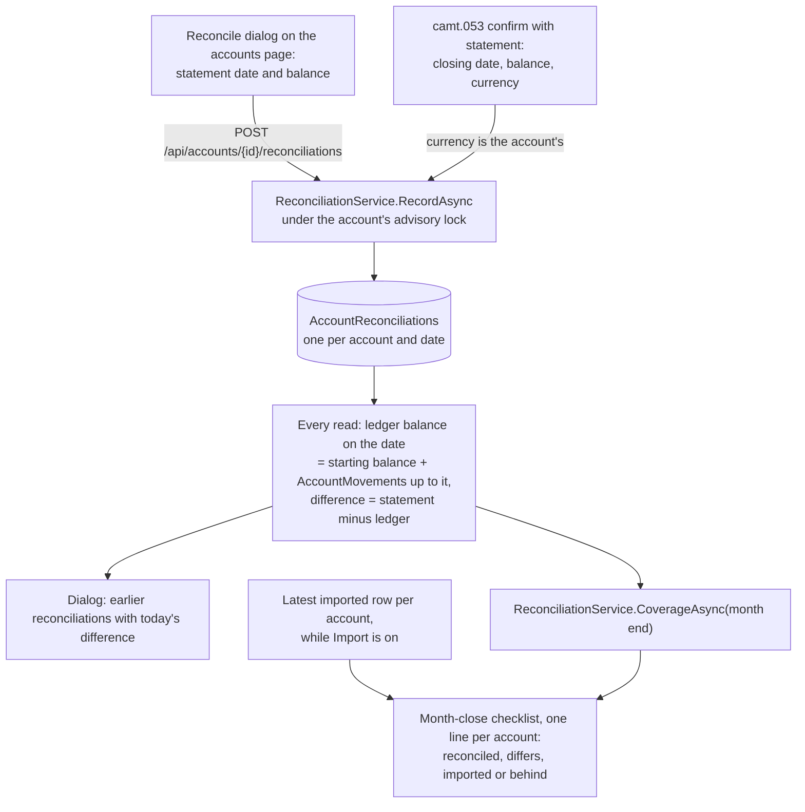

# Reconciliation

Back to the [feature walkthrough](README.md). See also [decisions](../decisions/reconciliation.md), [Accounts](accounts.md), [Bank statement import](bank-statement-import.md) and [Month-end close](month-end-close.md).

Backend `Accounts` (`GetReconciliationPreview`, `GetReconciliations`, `RecordReconciliation`, `DeleteReconciliation`, `Services/ReconciliationService.cs`, `Shared/AccountMovements.cs`), the entity `AccountReconciliation` in `Domain/Accounts`, the camt.053 hook in `Imports/Services/ImportConfirmService.cs` and the account lines of `MonthCloses/Services/MonthCloseService.cs`. Frontend `accounts/reconcile-dialog`, the Reconcile row action of `accounts/accounts-table`, the `statement` echo and result line in `imports/import-section`, and the account lines of `month-close/close-checklist`. No feature switch: recording from an import needs `Import` on anyway, and nothing runs in the background.

Reconciling answers one question: does the ledger agree with what the bank printed? A statement's balance on a date is stored as an `AccountReconciliation`. It comes from one of two places: the user types it in the Reconcile dialog, or a camt.053 import records its closing balance by itself. Only the bank's number is stored. The ledger balance on that date and the difference are computed on every read, so an edit dated on or before the statement date changes the difference that is shown, the way balances are never stored either.

## What is stored

`AccountReconciliation` (`OwnableEntity`, `IAccountScoped`, id `AccountReconciliationId`) holds `AccountId`, `Date`, `Balance` (a `Money` in the account's main currency at save) and `Source` (`manual` = 0, `statement` = 1). It is unique on (`AccountId`, `Date`): saving again on a date replaces the balance and the source, so the latest number for a date is the statement. `UserId` is whoever recorded it first. Rows are hard-deleted and never soft-deleted, so there is no trash entry, and they are not in the household audit log.

Visibility follows the account through the `IAccountScoped` query filter: whoever can see the account can list, add and delete its reconciliations, a household partner included, and the rows of an archived account are hidden with it and come back when it is restored. Everything is in the account's main currency; a statement for another currency the account holds is not recorded.

## The ledger balance on a date

`AccountMovements.LedgerBalanceOnAsync` is the starting balance plus every transaction, transfer, conversion and investment entry in the account's main currency dated on or before the date. The import preview's `ledgerBalanceAtClose` uses the same call, so the preview and the dialog cannot disagree. `AccountMovements.ListAsync` lists the same five sources as signed rows in one currency and a date range, newest first, with a limit; it asks for the count only when the page is full.

## The dialog

Every row of the accounts table has a Reconcile action (in the row's action menu with Edit, Archive and, when their switches are on, "Import bank statement" and "Convert currency"). `/accounts?reconcile=<account id>` opens the same dialog, which is how the month-close checklist links to it, and closing it drops the parameter.

- **Form.** The statement date starts on the last day of the previous month and cannot be after today (the form says so, and the server answers `reconciliation.futureDate`). The balance is a signed amount in the account's currency.
- **Preview.** While the date is valid, `GET /api/accounts/{id}/reconciliations/preview?date=` answers the ledger balance on that date ("Ledger balance on Aug 31, 2026: €2,512.40") and the rows in the main currency dated after the latest reconciliation before the date, or from the beginning when there is none, up to the date: at most 100, newest first, "and 40 more rows" past that, and "Open in the ledger" to the transactions page filtered to the account and the range. The query is keyed on the date only, and the difference is the typed balance minus the ledger balance in cents, so typing fetches nothing. It reads "Matches the statement" in the income colour, or "€12.30 more on the statement" or "€12.30 less on the statement" in the expense colour.
- **Save** records the balance even when it differs, closes the dialog and says "Reconciliation saved".
- **Earlier reconciliations** lists the newest 24 with the balance, the source ("Typed" or "From a camt.053 statement") and today's difference, each with a delete button behind a confirmation.

The accounts table has no reconciled column: the checklist asks the question once a month, and a column would cost a balance query per account on every list.

## From a camt.053 import

The import preview has always compared the camt.053 closing balance with the ledger. The confirm now keeps it: `ImportConfirmRequest.statement` echoes the preview's `closingDate`, `closingBalance` and `closingCurrency`, and when the format is `camt053`, or since 2026-09-29 `genericCsv` through a mapping with a balance column, and the currency is the account's, `ImportConfirmService.ConfirmAsync` records it as a `statement` reconciliation after the rows are written, inside the same transaction and account lock. `ImportConfirmResponse.reconciliation` returns it, and the result line and the toast say "Balance matches the statement on Aug 31, 2026." or "The statement differs by €12.30 on Aug 31, 2026.". A Swedbank CSV, or a mapped CSV without a balance column, has no closing balance and records nothing. A closing balance that does not match is recorded too: that is the case worth keeping. An account with camt.053 statements therefore needs nothing typed.

## In the month-end close

`checklist.accounts` has one line per visible account with a reconciliation or, while `Import` is on, an imported row, ordered by name. The state for a month comes from the pure `MonthAccountCoverage.StateOf`:

| State | When | Line |
| --- | --- | --- |
| `reconciled` | The earliest reconciliation dated on or after the month's last day has no difference | "Swedbank reconciled on Aug 31, 2026" |
| `differs` | That reconciliation has a difference | "Revolut: the statement differs by €12.30 on Aug 31, 2026", with Reconcile |
| `imported` | No such reconciliation, and the latest imported row is on or after the month's last day | "Swedbank imported through Aug 31, 2026" |
| `behind` | Neither | "Swedbank: last statement Aug 20, 2026, before the month ends", with Reconcile, and Import while `Import` is on |

The earliest reconciliation on or after the month end counts because banks end statements on different days, and a balance that agrees after the month end means the month's rows are all in. The date of a `behind` line is the later of the latest import and the latest reconciliation. `differs` and `behind` count toward "N things need attention", not toward the "Close with open items?" confirmation, the rule the import hint followed before. See [Month-end close](month-end-close.md#the-review).

## Endpoints

| Route | What it does |
| --- | --- |
| `GET /api/accounts/{id}/reconciliations/preview?date=` | `{ date, currency, ledgerBalance, previous, rows, rowCount }`. `previous` is the latest reconciliation before the date; each row is `{ kind, id, date, description, amount }` with `kind` one of `transaction`, `transferOut`, `transferIn`, `conversion`, `investmentEntry` and a signed amount |
| `GET /api/accounts/{id}/reconciliations` | The newest 24 as `{ id, date, balance, currency, source, ledgerBalance, difference, createdAt }`, newest date first |
| `POST /api/accounts/{id}/reconciliations` | Body `{ date, balance }`. Records or replaces the balance on that date and answers it |
| `DELETE /api/accounts/{id}/reconciliations/{reconciliationId}` | 204, or 404 when it is not there |

All four answer 404 `resource.notFound` for an account the caller cannot see. The record and delete mutations refresh every `/api/accounts` and `/api/month-close` query, and every ledger mutation already refreshes `/api/accounts`, so the differences follow edits made anywhere.

## Backup and restore

`AccountReconciliations` is an ordinary exported table. See [Backup and restore](backup-and-restore.md).

## Error codes

| Code | Status | When |
| --- | --- | --- |
| `reconciliation.futureDate` | 400 | The preview or record date is after today in the installation time zone |
| `resource.notFound` | 404 | The account is not visible, or the reconciliation to delete is not there |

## Tests

`ReconciliationTests` covers the preview's ledger balance equalling the import preview's `ledgerBalanceAtClose` on the same date, the rows after the previous reconciliation newest first, a later edit dated before the statement date changing the listed difference, each listed reconciliation measured on its own date, saving twice on a date replacing the balance, a future date refused by the preview and the record, a household partner reconciling a shared account that another user cannot see, an archived account hiding its reconciliations until it is restored, delete answering 204 and then 404, and rows in the account's other currencies ignored. `ImportEndpointTests` records a `statement` reconciliation from a camt.053 confirm and none for another currency or a Swedbank CSV; `MonthCloseTests` covers the four states, the earliest reconciliation after the month end winning, and the lines without `Import`; `BackupEndpointTests` restores a reconciliation. The unit tests are `MonthAccountCoverageTests` and the `ListAsync` case of `AccountMovementsTests`. On the client, `reconcile-dialog` has stories for a matching and a differing balance, a first reconciliation, more than 100 rows, the future-date error, a pending save, a failed preview, a failed list and deleting, `close-checklist` for the four states with and without `Import`, `import-result` for both results, `accounts-page` for the dialog opened from the link, and `close-checklist.dom.test.ts` checks the attention count against the open-item count.
