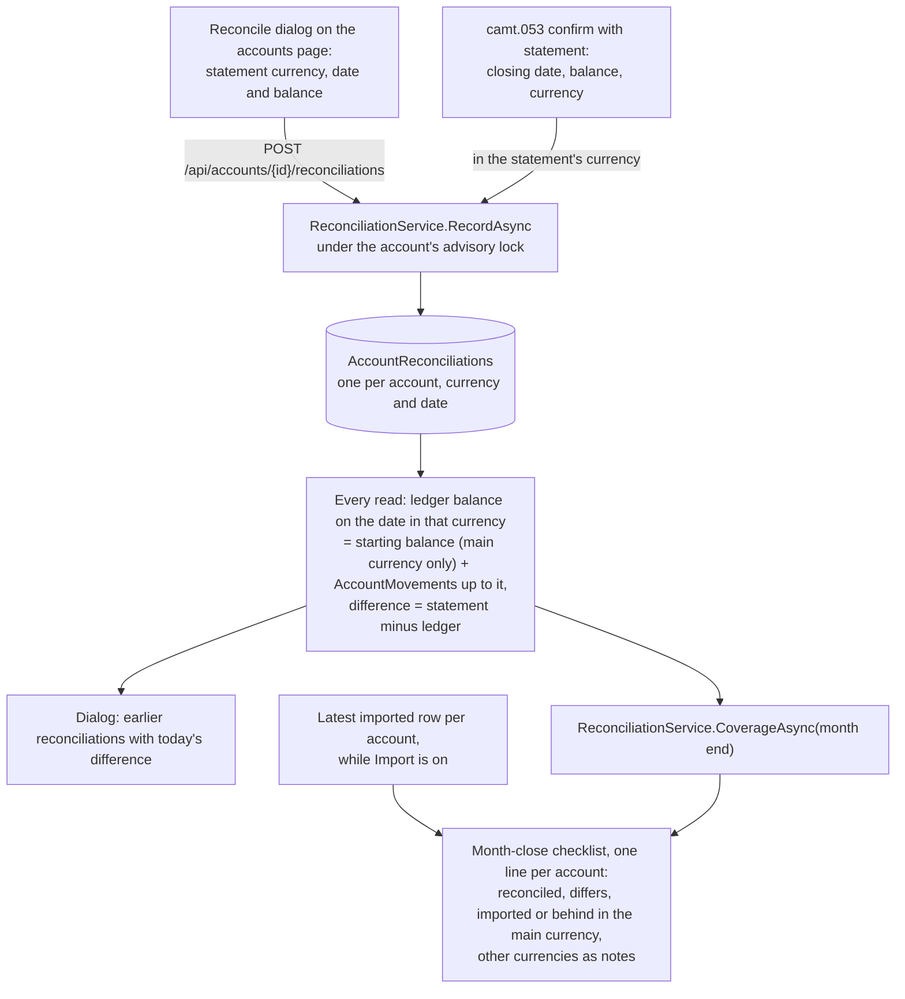

# Reconciliation

Back to the [feature walkthrough](README.md). See also [decisions](../decisions/reconciliation.md), [Accounts](accounts.md), [Bank statement import](bank-statement-import.md) and [Month-end close](month-end-close.md).

Backend `Accounts` (`GetReconciliationPreview`, `GetReconciliations`, `RecordReconciliation`, `DeleteReconciliation`, `Services/ReconciliationService.cs`, `Shared/AccountMovements.cs`), the entity `AccountReconciliation` in `Domain/Accounts`, the camt.053 hook in `Imports/Services/ImportConfirmService.cs` and the account lines of `MonthCloses/Services/MonthCloseService.cs`. Frontend `accounts/reconcile-dialog`, the Reconcile row action of `accounts/accounts-table`, the `statement` echo in `imports/import-section` and its result panel, and the account lines of `month-close/close-checklist`. No feature switch: recording from an import needs `Import` on anyway, and nothing runs in the background.

Reconciling answers one question: does the ledger agree with what the bank printed? A statement's balance on a date, in one currency the account holds, is stored as an `AccountReconciliation`. It comes from one of two places: the user types it in the Reconcile dialog, or a camt.053 import records its closing balance by itself. Only the bank's number is stored. The ledger balance on that date and the difference are computed on every read, so an edit dated on or before the statement date changes the difference that is shown, the way balances are never stored either.

## What is stored

`AccountReconciliation` (`OwnableEntity`, `IAccountScoped`, id `AccountReconciliationId`) holds `AccountId`, `Currency`, `Date`, `Balance` (a decimal in that currency) and `Source` (`manual` = 0, `statement` = 1). It is unique on (`AccountId`, `Currency`, `Date`): saving again on a date in the same currency replaces the balance and the source, so the latest number for a date is the statement, while a statement in another currency on the same date is its own row. The balance and the currency are two plain columns rather than a `Money`, because EF Core cannot put a complex property's column into an index. `UserId` is whoever recorded it first. Rows are hard-deleted and never soft-deleted, so there is no trash entry, and they are not in the household audit log.

Visibility follows the account through the `IAccountScoped` query filter: whoever can see the account can list, add and delete its reconciliations, a household partner included, and the rows of an archived account are hidden with it and come back when it is restored. Since 2026-10-01 any currency the account holds can be reconciled; the main currency is the default everywhere a currency is not given.

## The ledger balance on a date

`AccountMovements.LedgerBalanceOnAsync` takes a currency and answers the starting balance, when that currency is the account's main one (`AccountMovements.StartingIn` gives zero for any other), plus every transaction, transfer, conversion and investment entry in that currency dated on or before the date. The import preview's `ledgerBalanceAtClose` uses the same call, so the preview and the dialog cannot disagree. `AccountMovements.ListAsync` lists the same five sources as signed rows in one currency and a date range, newest first, with a limit; it asks for the count only when the page is full.

## The dialog

Every row of the accounts table has a Reconcile action (in the row's action menu with Edit, Archive and, when their switches are on, "Import bank statement" and "Convert currency"). `/accounts?reconcile=<account id>` opens the same dialog, which is how the month-close checklist links to it, and closing it drops the parameter.

- **Form.** For an account with balances in more than one currency, a "Statement currency" select comes first, listing the currencies of the account's `balances` (the main currency and every other one with a balance that is not zero) and starting on the main currency; an account with one currency shows no select. The statement date starts on the last day of the previous month and cannot be after today (the form says so, and the server answers `reconciliation.futureDate`). The balance is a signed amount in the chosen currency, and its label names it.
- **Preview.** While the date is valid, `GET /api/accounts/{id}/reconciliations/preview?date=&currency=` answers the ledger balance in the chosen currency on that date ("Ledger balance on Aug 31, 2026: €2,512.40") and the rows in that currency dated after the latest reconciliation in that currency before the date, or from the beginning when there is none, up to the date: at most 100, newest first, "and 40 more rows" past that, and "Open in the ledger" to the transactions page filtered to the account and the range. The query is keyed on the date and the currency, and the difference is the typed balance minus the ledger balance in cents, so typing fetches nothing. It reads "Matches the statement" in the income colour, or "€12.30 more on the statement" or "€12.30 less on the statement" in the expense colour.
- **Save** records the balance even when it differs, closes the dialog and says "Reconciliation saved".
- **Earlier reconciliations** lists the newest 24 in every currency, each balance formatted in its own currency and measured against the ledger in that currency, with the balance, the source ("Typed" or "From a camt.053 statement") and today's difference, each with a delete button behind a confirmation.

The accounts table has no reconciled column: the checklist asks the question once a month, and a column would cost a balance query per account on every list.

## From a camt.053 import

The import preview has always compared the camt.053 closing balance with the ledger, since 2026-10-01 in the statement's currency rather than only when it is the account's main one. The confirm now keeps it: `ImportConfirmRequest.statement` echoes the preview's `closingDate`, `closingBalance` and `closingCurrency`, and when the format is `camt053`, or since 2026-09-29 `genericCsv` through a mapping with a balance column, `ImportConfirmService.ConfirmAsync` records it as a `statement` reconciliation in the statement's currency, whichever currency of the account that is, after the rows are written, inside the same transaction and account lock. `ImportConfirmResponse.reconciliation` returns it, and the import's result panel and the toast say "Balance matches the statement on Aug 31, 2026." or "The statement differs by €12.30 on Aug 31, 2026.". A Swedbank CSV, or a mapped CSV without a balance column, has no closing balance and records nothing. A closing balance that does not match is recorded too: that is the case worth keeping. An account with camt.053 statements therefore needs nothing typed.

## In the month-end close

`checklist.accounts` has one line per visible account with a reconciliation in any currency or, while `Import` is on, an imported row, ordered by name. The line's state is the account's main currency: an account counts as reconciled when its main currency is. The state for a month comes from the pure `MonthAccountCoverage.StateOf`:

| State | When | Line |
| --- | --- | --- |
| `reconciled` | The earliest reconciliation dated on or after the month's last day has no difference | "Swedbank reconciled on Aug 31, 2026" |
| `differs` | That reconciliation has a difference | "Revolut: the statement differs by €12.30 on Aug 31, 2026", with Reconcile |
| `imported` | No such reconciliation, and the latest imported row is on or after the month's last day | "Swedbank imported through Aug 31, 2026" |
| `behind` | Neither | "Swedbank: last statement Aug 20, 2026, before the month ends", with Reconcile, and Import while `Import` is on |

On the [Month page](month-end-close.md#screens) Reconcile opens the Reconcile dialog and Import opens the import dialog with the account chosen, both without leaving the page, and the line takes its new state as soon as the reconciliation or the import is recorded; in the dashboard prompt they stay links to `/accounts?reconcile=<account id>` and to the import section of Settings.

The earliest reconciliation on or after the month end counts because banks end statements on different days, and a balance that agrees after the month end means the month's rows are all in. The date of a `behind` line is the later of the latest import and the latest main-currency reconciliation. An account listed only for reconciliations in other currencies, with no import, has no date and reads "Revolut: no statement in EUR yet".

Every other currency with a reconciliation is a note under the account's line, in the muted text: `otherCurrencies` carries `{ currency, state, date, difference }` per currency, ordered by code, judged by the same rule without the import step, so its state is `reconciled`, `differs` or `behind` ("USD reconciled on Aug 31, 2026", "USD: the statement differs by $3.00 on Aug 31, 2026", "USD: last statement Jul 31, 2026"). The notes count toward nothing: neither the attention count, nor the dashboard prompt, nor the monthly digest. `differs` and `behind` count toward "N things need attention", not toward the "Close with open items?" confirmation, the rule the import hint followed before. See [Month-end close](month-end-close.md#the-review).

## Endpoints

| Route | What it does |
| --- | --- |
| `GET /api/accounts/{id}/reconciliations/preview?date=&currency=` | `{ date, currency, ledgerBalance, previous, rows, rowCount }` in `currency`, the account's main currency when left out. `previous` is the latest reconciliation in that currency before the date; each row is `{ kind, id, date, description, amount }` with `kind` one of `transaction`, `transferOut`, `transferIn`, `conversion`, `investmentEntry` and a signed amount |
| `GET /api/accounts/{id}/reconciliations` | The newest 24 in every currency as `{ id, date, balance, currency, source, ledgerBalance, difference, createdAt }`, newest date first |
| `POST /api/accounts/{id}/reconciliations` | Body `{ date, balance, currency }`, `currency` optional and the main currency when left out. Records or replaces the balance on that date in that currency and answers it |
| `DELETE /api/accounts/{id}/reconciliations/{reconciliationId}` | 204, or 404 when it is not there |

All four answer 404 `resource.notFound` for an account the caller cannot see. The record and delete mutations refresh every `/api/accounts` and `/api/month-close` query, and every ledger mutation already refreshes `/api/accounts`, so the differences follow edits made anywhere.

## Backup and restore

`AccountReconciliations` is an ordinary exported table. See [Backup and restore](backup-and-restore.md).

## Error codes

| Code | Status | When |
| --- | --- | --- |
| `reconciliation.futureDate` | 400 | The preview or record date is after today in the installation time zone |
| `enum.invalid` | 400 | The preview or record currency is not a supported currency |
| `resource.notFound` | 404 | The account is not visible, or the reconciliation to delete is not there |

## Tests

`ReconciliationTests` covers the preview's ledger balance equalling the import preview's `ledgerBalanceAtClose` on the same date, the rows after the previous reconciliation newest first, a later edit dated before the statement date changing the listed difference, each listed reconciliation measured on its own date, saving twice on a date replacing the balance, a future date refused by the preview and the record, a household partner reconciling a shared account that another user cannot see, an archived account hiding its reconciliations until it is restored, delete answering 204 and then 404, rows in the account's other currencies ignored by a main-currency preview, another currency previewed and recorded against its own ledger without the starting balance, one row per currency on the same date, and the import preview comparing a statement in another currency with that currency.
`ImportEndpointTests` records a `statement` reconciliation from a camt.053 confirm, also in another currency, and none for a Swedbank CSV; `MonthCloseTests` covers the four states, the earliest reconciliation after the month end winning, the lines without `Import`, and the main currency deciding the line with other currencies as notes, including an account with no statement in its main currency; `BackupEndpointTests` restores a reconciliation.
The unit tests are `MonthAccountCoverageTests` and the `ListAsync` case of `AccountMovementsTests`. On the client, `reconcile-dialog` has stories for a matching and a differing balance, a first reconciliation, more than 100 rows, the future-date error, a pending save, a failed preview, a failed list and deleting, `close-checklist` for the four states with and without `Import`, `import-result` (`ImportResultPanel`) for both results, `accounts-page` for the dialog opened from the link, and `close-checklist.dom.test.ts` checks the attention count against the open-item count. The other currencies of 2026-10-01 also have stories (`reconcile-dialog` OtherCurrency, `close-checklist` AccountStates with a USD note and OtherCurrencyOnly).
