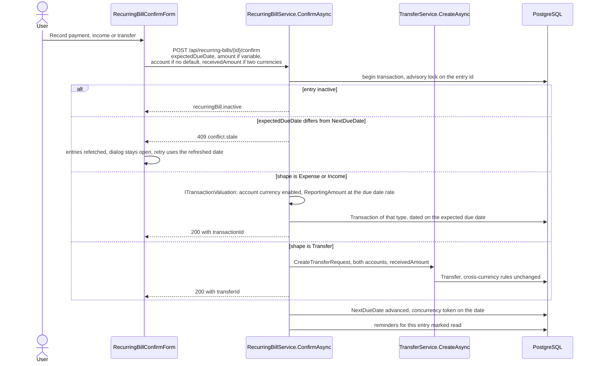
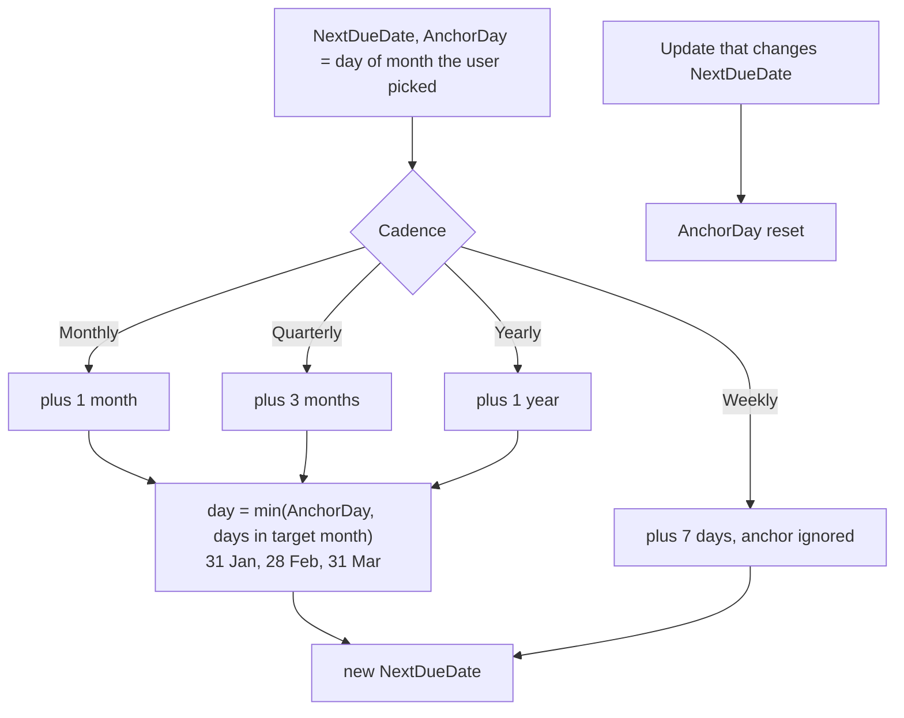
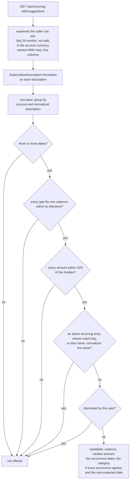
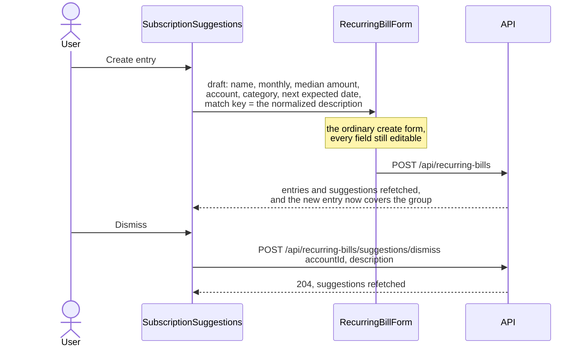

# Recurring entries

Back to the [feature walkthrough](README.md). See also [decisions](../decisions/recurring-bills.md), [architecture: Background work and notifications](../architecture/background-jobs.md).

Backend `RecurringBills`, page `/recurring-bills`. A recurring entry is a schedule, not a posting: nothing reaches the ledger until somebody confirms an occurrence.

The page lists active entries under three headings by next due date against today in the installation time zone: Overdue (before today), Due this week (today and the six days after) and Later. Each heading is shown only when it has entries, and each keeps the API's due-date order. Inactive entries sit in a closed "Inactive (n)" disclosure below. An active entry that is overdue or due within the week adds a relative day after its date, such as "(tomorrow)" or "(3 days ago)", formatted by `Intl.RelativeTimeFormat` in the interface language. The grouping is `groupBills` in `features/recurring-bills/bill-groups.ts`, and the row reads the same `urgencyOf` to decide on the "Overdue" tag and the relative day. The page looks up account and category names in maps built once per render, not per row. `bill-row-layout.tsx` holds the row grid for entries and suggestions and the `BillRowsSkeleton` the pending page draws with the same classes.

Two properties describe an entry. Its **shape** says what a confirmation writes — an expense, an income, or a transfer between two of your own accounts — and its **kind** says whether the amount is always the same (fixed, carried on the entry) or changes each time (variable, typed at confirmation). Every combination is allowed, so a variable transfer is as ordinary as a fixed expense.

The user-facing name is "recurring entries" in both locales, because "bills" stopped covering two of the three shapes. The table, the entity, the service and the route prefix are still `RecurringBill` and `/api/recurring-bills`: a rename would mean a migration plus a backup format that no file taken by an older version could be restored into, since a backup names the tables it carries. The names are documented as a deliberate mismatch rather than paid for.

## What each shape needs

| Shape | Account | Second account | Category |
| --- | --- | --- | --- |
| Expense | Optional default, asked for at confirmation when empty | Rejected | Optional expense category |
| Income | Optional default, asked for at confirmation when empty | Rejected | Optional income category |
| Transfer | Required, the account the money leaves | Required, the account the money arrives in, and different | Rejected |

The same rules run on create and on update, so a shape change that would leave a required field empty is refused with the field at fault and a published code (`required`, `transfer.sameAccount`, `value.mustBeEmpty`). The form follows the choice: picking Transfer swaps the category select for the destination account, picking Expense or Income swaps it back.

## Confirming an occurrence

The transfer branch calls the ordinary transfer create path instead of writing a second one. That path resolves the two account currencies, demands `receivedAmount` when they differ (`transfer.receivedAmountRequired`), refuses a mismatched pair in one currency and checks that both currencies are enabled — behaviour a copy inside this service would have had to repeat and would have drifted from. Because both services share the request-scoped `AppDbContext`, the transfer is written inside the same database transaction and under the same advisory lock as the schedule advance.

An entry has no currency of its own. Its amount, and the amount typed for a variable entry, is in the currency of the account that pays or receives it, which is the entry's account or the one chosen at confirmation. An expense or income occurrence is valued by `ITransactionValuation`, the same path the transaction form, the import and the conversion fee take: a disabled currency answers `currency.disabled`, and `ReportingAmount` is converted at the rate for the due date.

The confirm dialog names what it will create, per shape and per kind, and shows the "amount received" field only when the two accounts hold different currencies.

What lands in the ledger is an ordinary row, so nothing downstream needs to know it came from a schedule, with one exception: an expense entry can name a debt that tracks its payments (`debtId`, refused on the other shapes with `recurringBill.debtShape` for a debt the caller does not own with `reference.notFound` and for a debt that does not track payments with `debt.notTracked`; while Net worth is switched off the link is kept but not checked, and confirming writes no payment), and confirming it links the posted row to that debt as a regular payment inside the same database transaction and lock, which lowers the debt's tracked balance (see [Debt amortization](debt-amortization.md#tracking-payments)). The form offers "Pays debt" on the expense shape, listing the caller's debts that track payments. The `/recurring-bills` loader warms the debts while Net worth is on, and the form clears a linked debt it cannot list only after the debts have loaded, so saving an edit made while they are still loading keeps the link. Purging the debt clears the field, and restoring an entry from the trash whose debt is gone clears it instead of refusing. Otherwise: a confirmed income counts as income in reports, on the dashboard and against no budget; a confirmed expense counts against the budget of its category; a confirmed transfer moves both balances and counts as neither.

## Schedule advance

## Finding a subscription

Since 2026-09-21 the page also offers entries it found by itself. `GET /api/recurring-bills/suggestions` is a read-only analysis of the ledger: it writes nothing, it is behind the same `RecurringBills` switch as the rest of the route prefix, and it reads through `db.Transactions`, so account visibility and the active household narrow it exactly as they narrow the ledger.

### The numbers, and why they are those numbers

Every threshold is a named constant in `Common/Subscriptions/SubscriptionDetection.cs`; none of them is written twice.

| Constant | Value | Why |
| --- | --- | --- |
| `LookBackMonths` | 24 | Two years is the shortest window that can see three yearly occurrences, which is the hardest cadence to confirm. A longer one would only add dead subscriptions. |
| `MinimumOccurrences` | 3 | Two payments are a coincidence: any two dates define a gap, so two of anything would "repeat". Three is the first number that can disagree with itself. |
| `AmountTolerance` | 0.15 | Every amount has to sit within 15% of the median. A price rise, a currency rounding or a plan change of a euro or two stays one subscription; a shop where you happen to spend a different sum each month does not. |
| Cadence gaps | 7 ± 2, 30 ± 5, 91 ± 12, 365 ± 30 days | The tolerance of each cadence is the largest drift a real calendar produces — a 28-day February against a 31-day March, a quarter of 89 against 92 days, a leap year — plus the day or two a bank takes over a weekend. The four ranges do not overlap, so a series belongs to at most one cadence. |
| `MaxScannedTransactions` | 4000 | The bound the brief asks for. Ordered by date descending, so what is read is the most recent part of the window. |
| `MaxCandidates` | 20 | A list nobody would read past. |

The gaps are compared between **consecutive** occurrences, not against an average, so one late payment breaks the series rather than being smoothed away by the others. The typical amount is the **median**, not the mean, for the same reason: one unusual month cannot move it.

### One pass, bounded, and one pure function

The grouping cannot be a `GROUP BY`, because the noise banks put in a description means no two occurrences of the same subscription carry the same text. So the query does what SQL is good at — the window, the flow type, the split filter, the visibility filter, the five columns and the row cap — and the grouping happens once in memory over that bounded projection. Nothing loads the whole ledger and nothing runs a query per group: the two exclusion lists (the caller's active entries, the caller's dismissals) are one query each.

`SubscriptionDescription.Normalize` is the only definition of "the same description". It is a pure function with its own unit tests and it is used in three places that must agree — the grouping, the coverage check against an entry's match key or name, and the dismissal key. Since 2026-09-26 it is also the payee key of the unusual-amount check and the key that links an entry to its bank charges, so all of them mean the same thing by "the same description". It lowercases, treats everything that is not a letter or a digit as a separator, and drops any token that is all digits or carries three or more of them. That removes the four kinds of noise a statement actually contains: trailing reference numbers, a date inside the text, varying case and repeated whitespace. `O2` and `5G` survive, because one digit is part of a name; `P2ACB3F9D3` does not. The result is capped at the 200 characters the dismissal column holds. Since 2026-09-29 it is stored on every transaction as `PayeeKey` for [spending by payee](reports.md#expense-by-payee) and [suggested rules](categorization-rules.md#suggested-rules); subscription detection still computes it itself.

### What suppresses a candidate

An **active recurring entry** whose key equals the group's description hides it, when that entry has no default account or names the same one. The key is `PriceRiseMatcher.KeyOf`: the entry's normalized `MatchKey` when it has one, its normalized name otherwise, so an entry created from a suggestion keeps covering its group after it is renamed. Inactive entries do not: switching an entry off is how you say you no longer track it, and the suggestion coming back is the honest consequence.

A **dismissal** is a row in `SubscriptionDismissals` holding the user, the account and the normalized description — the group, not the transactions behind it. That is the whole point: next month's payment joins the same group, the group is still dismissed, and the suggestion does not reappear. Dismissing twice writes nothing the second time. It is personal, like a categorization rule: two members of one household can disagree about whether a shared account's payment is a subscription, and each answer is right for the person who gave it. There is no screen to undo a dismissal; the row exists, so one can be added later.

### The two actions

Creating goes through `RecurringBillForm` and `POST /api/recurring-bills`, the same path the **Add recurring entry** button uses. The form gained a `draft` prop that seeds its default values and nothing else: `initial` means "edit this one", as it does on the other forms, `draft` means "start from this", and the validation, the shape rules and the error handling are the ones that were already there. A candidate is always offered as a fixed expense, because that is what was detected; the kind, the shape and everything else can be changed before saving.

The suggestions sit in their own section at the **bottom** of the page, under the entries and the forecast. The entries somebody already keeps are what the page is for and stay first; a suggestion is an offer, and an offer that pushed the list down every time the ledger grew a pattern would be the wrong way round. The section always renders, with its own empty state, so the count is a stable place on the page rather than a block that appears and disappears.

Detection reads expenses with a positive amount only: a [refund](transactions.md#refunds) is not a payment of the subscription and would otherwise break the steady amount of its group.

## Matching bank text and price rises

Since 2026-09-26 an entry can say which bank rows pay it. `MatchKey`, "Matches bank text" in the form, is shown for every shape since 2026-09-29, because the [cash-flow forecast](cash-flow-forecast.md) estimates a variable income or transfer from the bank rows it matches; it is filled with the candidate's normalized description when the entry is created from a suggestion, can be typed or cleared by hand, and is normalized again on the server. Empty means the entry's name is used instead, as the coverage check always did.

While the `UnusualAmounts` switch is on, that key links an active expense entry with an account to the bank charges it pays: non-split expenses on the same account, in the account's currency, whose normalized description equals the key or the entry's normalized name, so a confirmed occurrence, which the app writes under the entry's name, counts too (`PriceRiseMatcher.KeysOf`, the same two keys the [cash flow forecast](cash-flow-forecast.md) matches on). `GET /api/recurring-bills` answers the latest such charge of the last 13 months on each entry as `latestMatch`, compared with what the entry expects — its amount when it is fixed, the median of the earlier matching charges when it is variable. More than 3% and more than 0.50 above that is a price rise: the row says "Charged €27.99 on 3 Sep, expected €24.99", and a fixed entry gets "Update expected amount", which saves the entry through the ordinary update with the charged amount. `UnusualAmountJob` makes the same comparison for new charges dated within the last 45 days and raises one `recurringPriceRise` notification per entry and charge for the entry's owner, while `RecurringBills` is on as well.

Detection's 15% `AmountTolerance` is unchanged and still absorbs a rise: a subscription that went from 9.99 to 10.99 stays one group, and one suggestion, as it should. The price-rise check is the separate question that reports it. See [Unusual amounts](unusual-amounts.md).

## Reminders and the forecast

`RecurringBillReminderJob` treats all three shapes alike: it scans every 15 minutes, raises one `billDue` notification per entry and local day, and the confirmation marks the unread ones read. The payload carries the shape beside the due date, so the bell says "Payment due", "Expected" or "Transfer due" in English and the matching sentence in Lithuanian. Reminders written before shapes existed carry no shape and read as an expense.

Since 2026-09-20 the same pass can also queue an email. It does so only for the owner of the entry, only when that person switched "Email me about a due recurring entry" on in their profile, only when their address is confirmed and only while the installation has a mail server. The email row is written in the same transaction and under the same lock as the notification, with the dedupe key `bill:{id}:{local date}`, so the two are raised together or not at all and a second pass on the same day raises neither. The job never talks to SMTP itself: `EmailOutboxJob` drains the rows a minute later, so a dead mail server cannot slow the scan or delay another household's reminder. The sentence follows the shape as well — "due to be paid", "due to arrive", "due to be transferred". See [Email](email.md).

Since 2026-09-29 the page opens with the [cash-flow forecast](cash-flow-forecast.md) section instead of the six-month bar chart of fixed expenses: the balance of each account over the next 30 to 90 days with every shape and kind of entry, a dashed line with the account's usual spending, the dates an account goes below zero, and one line with the scheduled expenses and income, "Scheduled in the next 90 days: €1,240.00 out, €3,100.00 in". The price-rise check still reads only expense entries.
